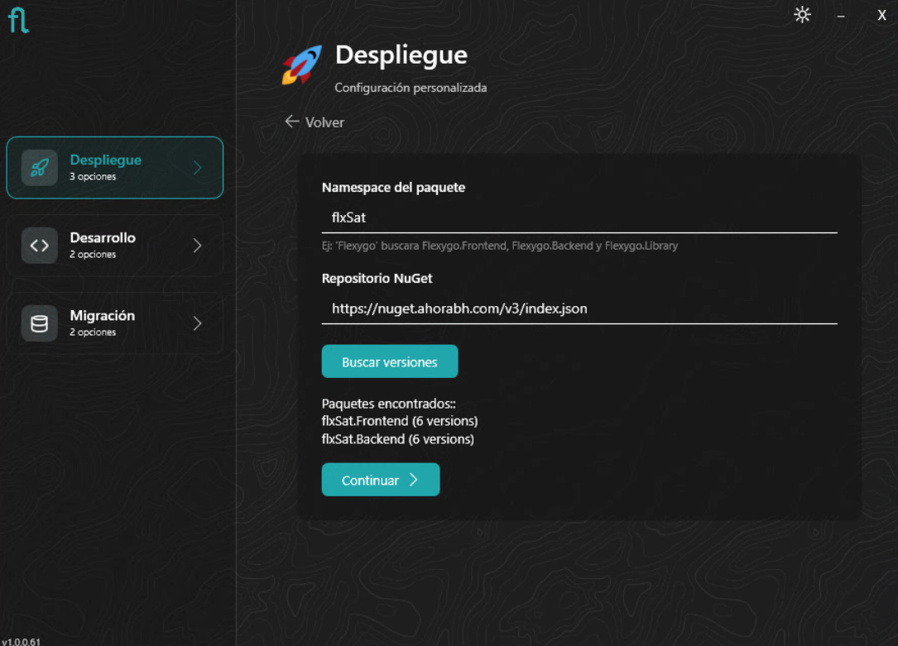
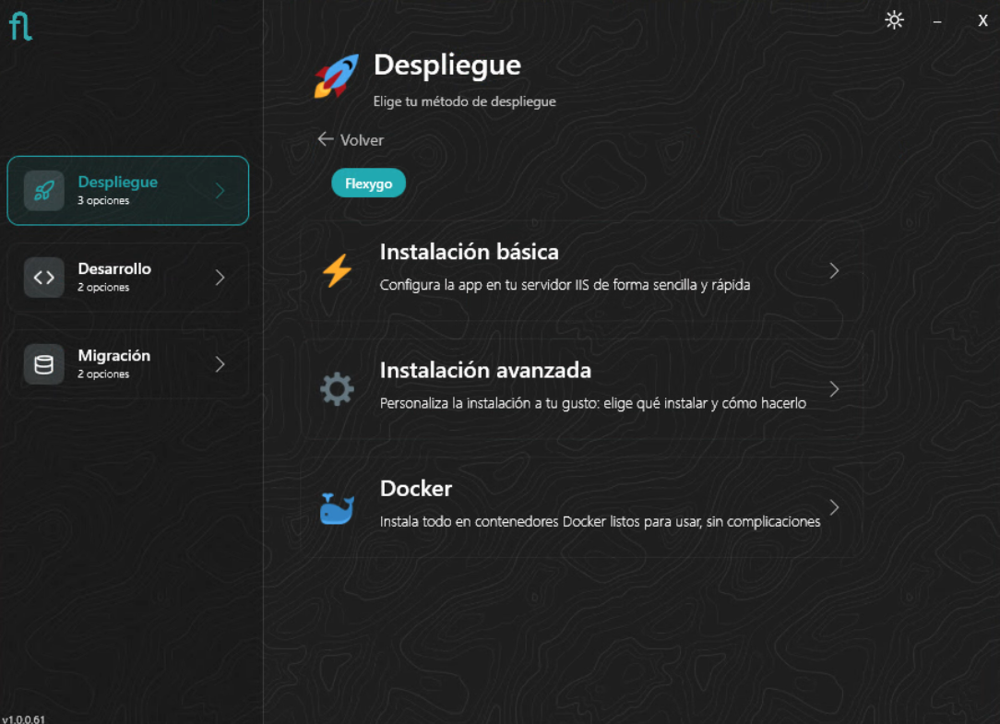
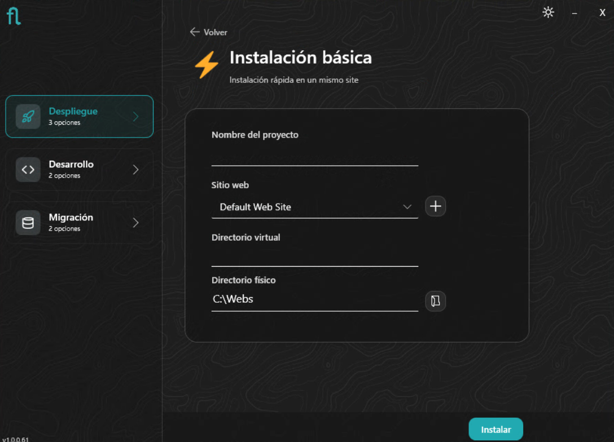
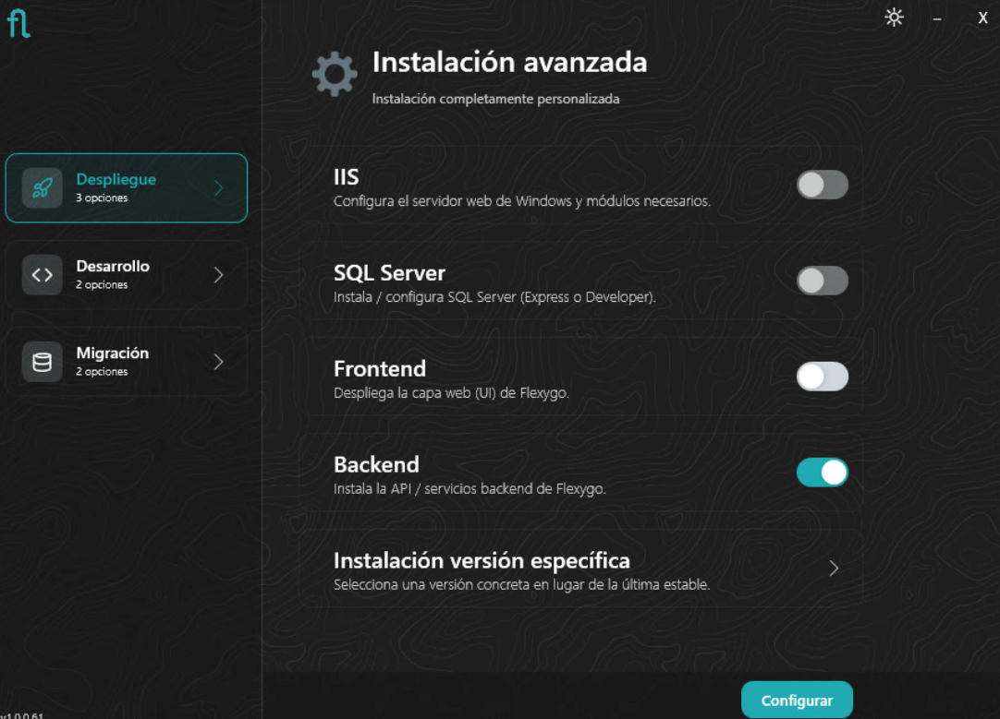
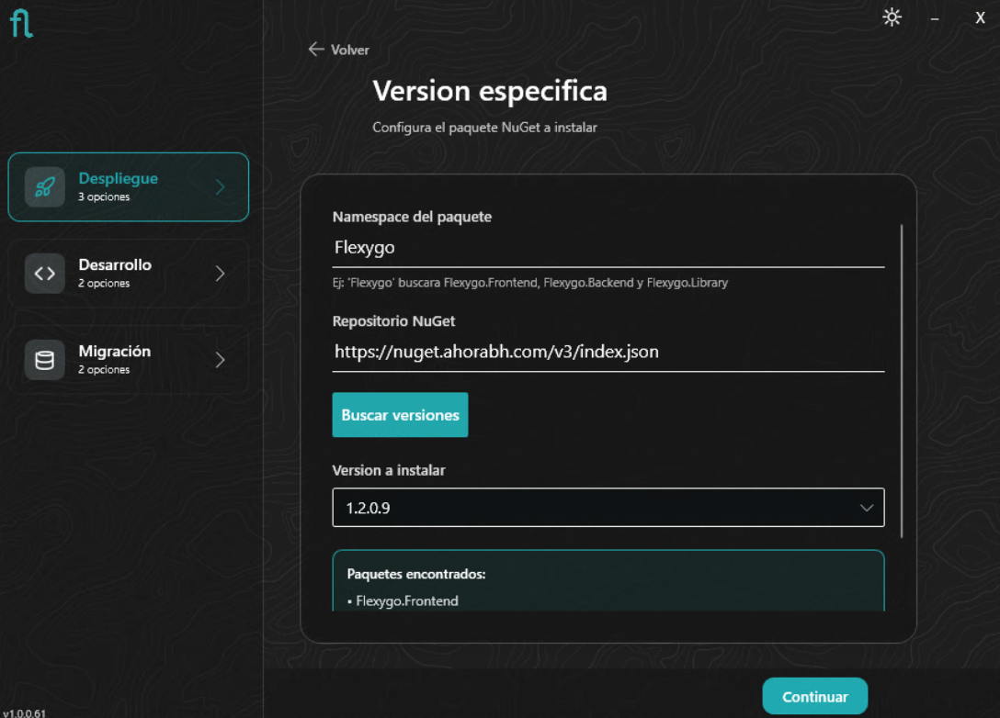
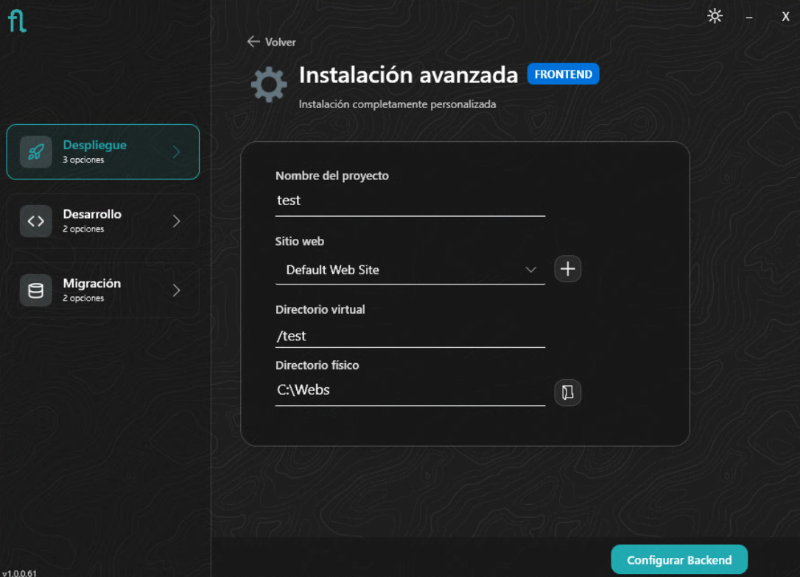
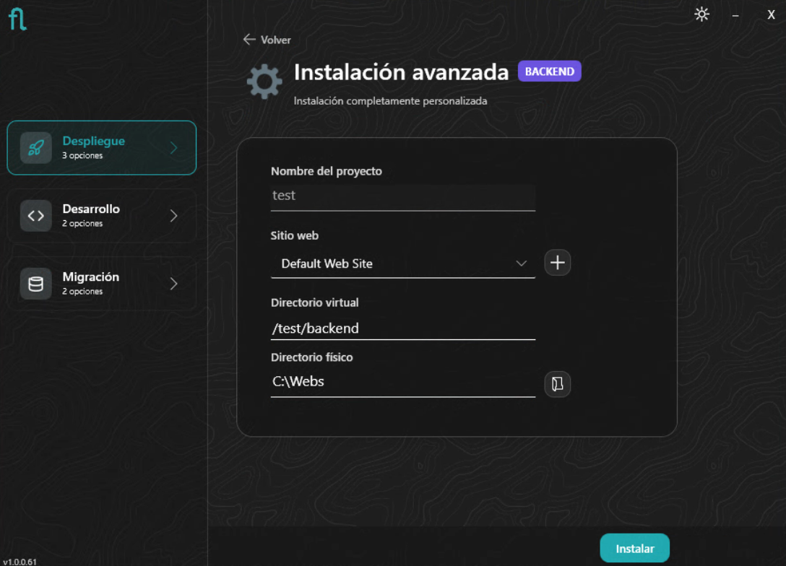
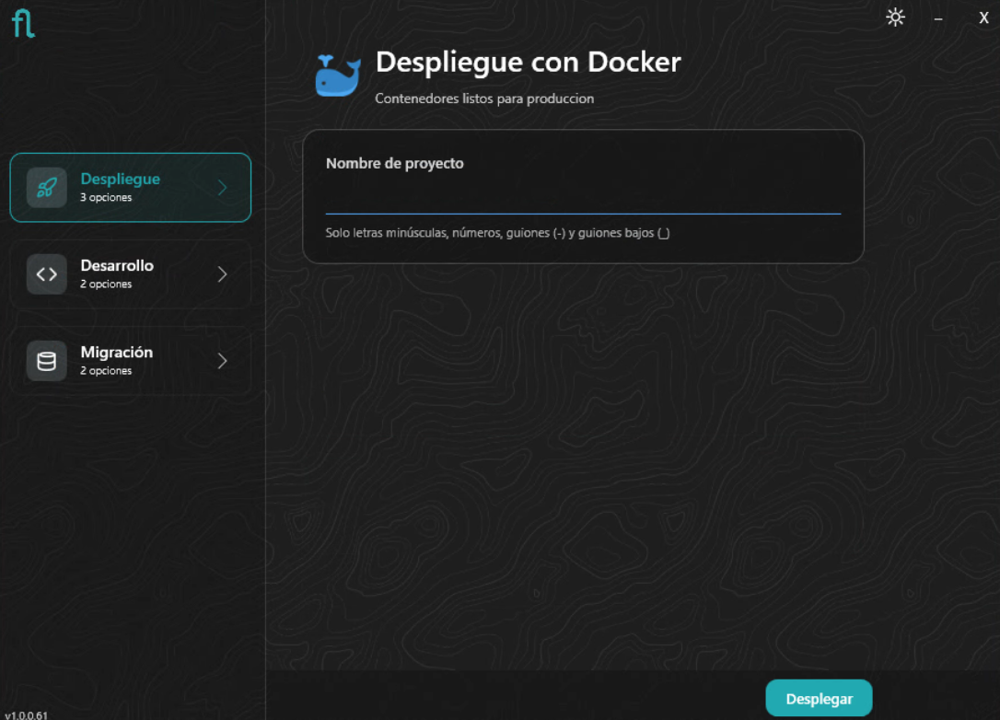
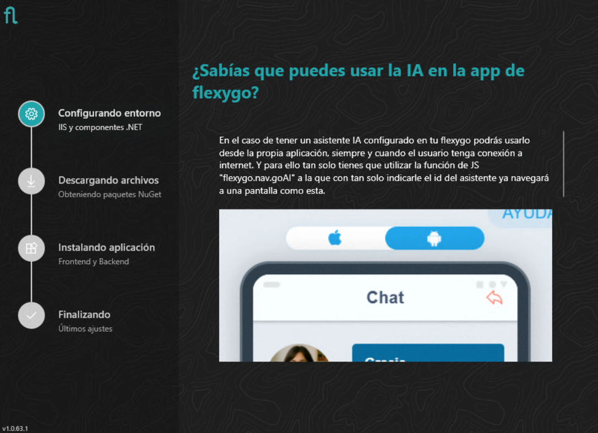
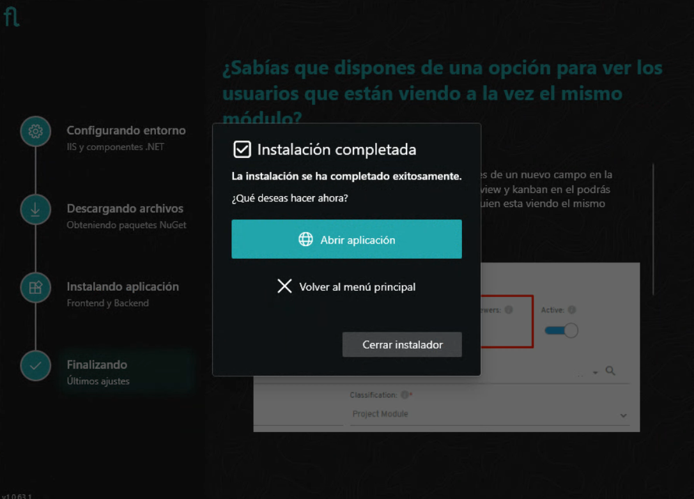

# Installer: Deployment Mode

The **Deployment** mode of the Flexygo installer lets you configure the environment for production or pre-production.

!!! tip "Docker in production"
    For production environments with Docker, we recommend using the [Docker](../4Docker/index.md) guide with a manual `docker-compose`, which offers greater control over the configuration.

---

## 1. Product selection

The first step is choosing which product you want to install. The installer shows the available solutions (Flexygo, SAT, CRM…) and the **Custom** option, which lets you manually specify the NuGet package to install and its source.

If you select **Custom**, you must specify the NuGet package name and where to look for it: a remote feed URL or a local physical path. The package name must follow the [Flexygo naming convention](../../2ProductDevelopment/2Template.md#nuget-naming-convention) so that the installer can detect it correctly.

---

## 2. Installation mode

Once the product is selected, choose the installation mode according to your environment:

=== "Basic IIS"

    ## Basic installation

    Installs Frontend and Backend on the **same server and IIS site**. Ideal for testing, demos, or small environments.

    ### Site configuration
    Choose the project name, select an existing website or create a new one, set the virtual *path* (if desired), and the physical directory where the application will be installed.

    

=== "Advanced IIS"

    ## Advanced installation

    Lets you install **Frontend and Backend on different servers**, or install only one of the two components. Suitable for customized production installations.

    ### Component selection
    Choose whether to install only **Frontend**, only **Backend**, or both. You can also install IIS and/or SQL Server if your environment doesn't have them yet, and choose to install a specific version of the product.

    

    ### Specific version
    If you selected installing a specific version, specify the package name and its source (remote feed URL or physical path). The wizard will search for the available versions so you can choose the one you need.

    

    ### Frontend configuration
    Choose the project name, IIS site, virtual *path*, and physical directory where the Frontend will be installed.

    

    ### Backend configuration
    Choose the project name, IIS site, virtual *path*, and physical directory where the Backend will be installed.

    

=== "Docker (via Installer)"

    ## Docker installation

    Deploys Flexygo directly on **Docker Desktop**. Aimed at demo, testing, or local development environments with containers.

    !!! info "Prerequisite"
        Make sure you have **Docker Desktop** installed and running before continuing.
        You can download it from [docker.com/products/docker-desktop](https://www.docker.com/products/docker-desktop/).

    ### Docker deployment configuration
    Configure the container parameters: ports, volumes, and deployment options for Frontend and Backend.

    

    !!! tip "Result"
        Once the configuration is confirmed, the installer brings up the containers directly in Docker Desktop. You can access the application from Docker Desktop itself or through the configured port.

---

## 3. Progress and completion

*(Basic IIS and Advanced IIS modes only)*

You'll see the installation progress step by step. Once finished, the wizard shows a summary and offers to open the application directly in the browser.

