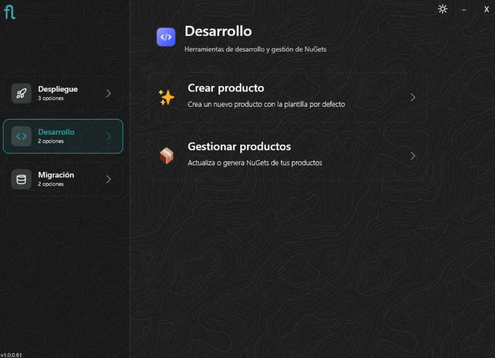
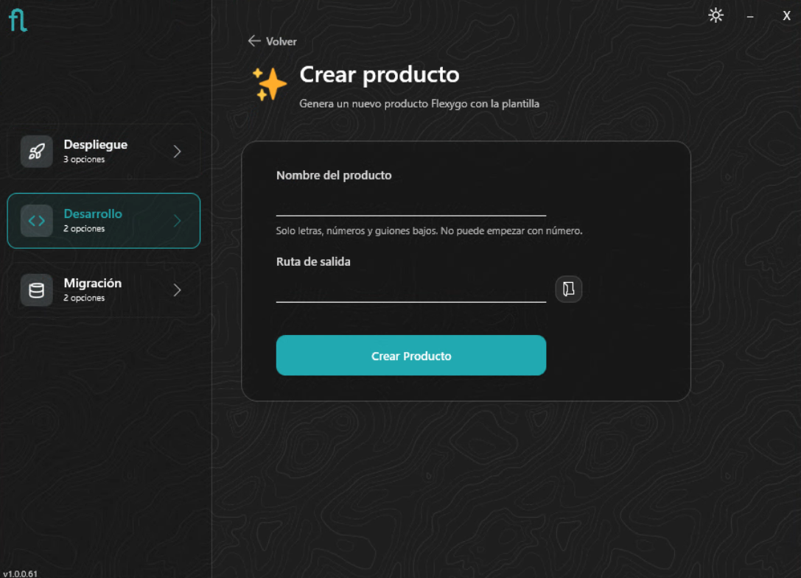
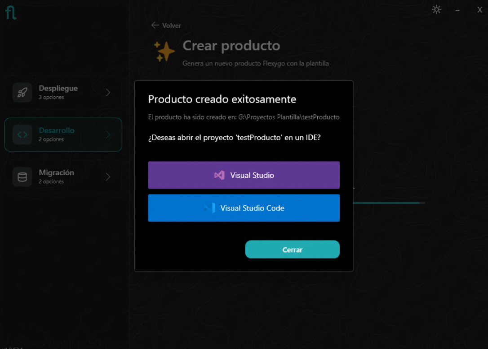
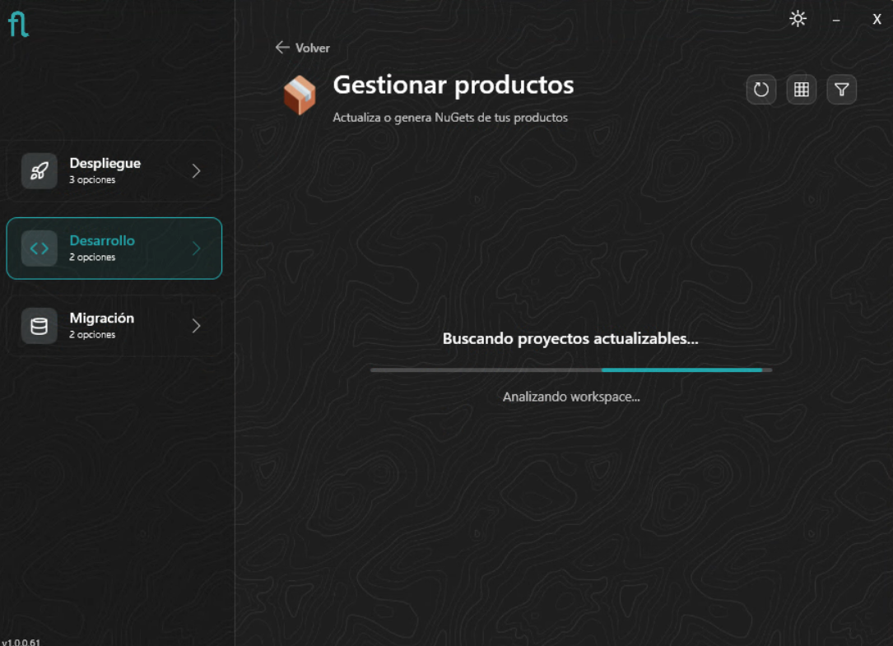
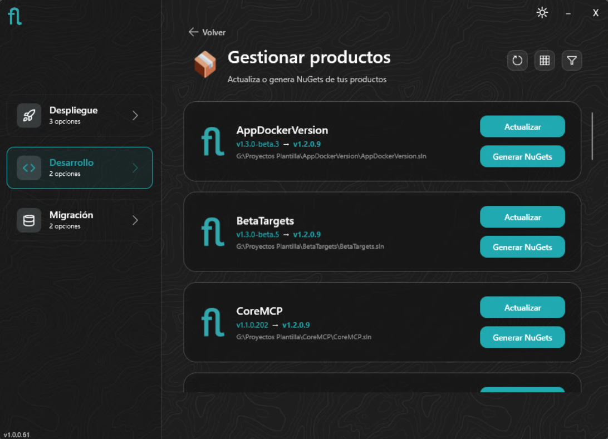
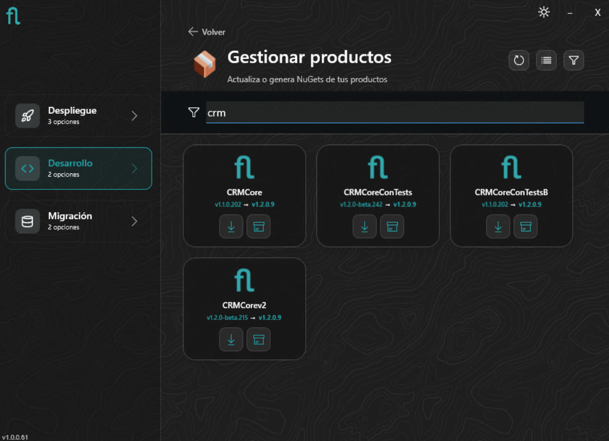
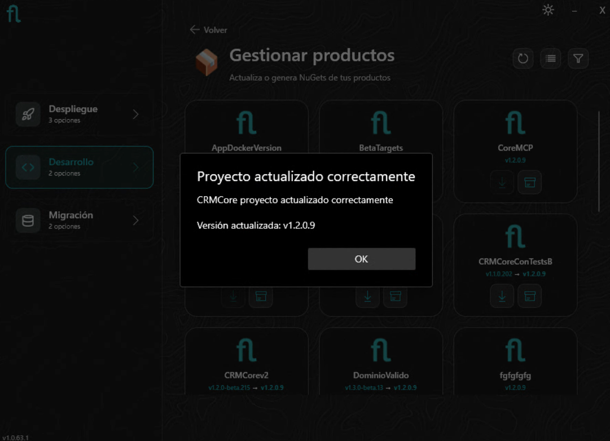
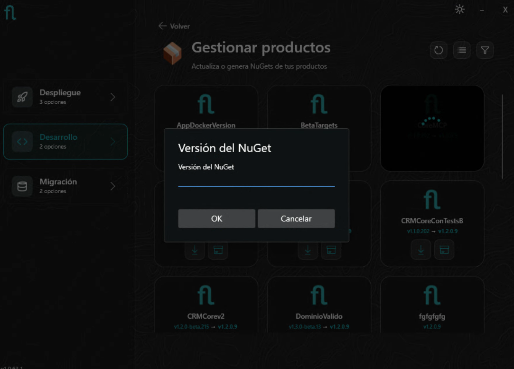

# Installer: Development Mode

The installer's **Development** mode is aimed at developers working with Flexygo projects in Visual Studio or VS Code. It offers two operations: creating a new product from the official template, or managing existing products in the workspace.

!!! warning "Prerequisite for VS Code: Node.js in the global PATH"
    If you're going to work with the project from **VS Code**, you need **Node.js** installed and available in the system's **global PATH**. If it isn't in the PATH, the Frontend build will fail. See the [development requirements](../../2ProductDevelopment/1Requirements.md).

<figure markdown="span">
  
  <figcaption>Main screen: Development mode offers 2 options</figcaption>
</figure>

---

=== "Create product"

    ## Create a new product

    This option generates the complete structure of a Flexygo product from the official template: Frontend, Backend, and database projects, ready to open in Visual Studio or VS Code.

    <figure markdown="span">
      
      <figcaption>Form for creating a new product</figcaption>
    </figure>

    Enter the product name and the path where the project will be generated. The installer installs the template (or updates it if already installed) and also installs or updates the development tools:

    - **Flexygo Product Tools** — lets you generate NuGets and update the project from the command line or from the Visual Studio and VS Code extensions
    - **Flexygo MCP** — MCP server for integration with Copilot and other AI clients

    Once completed, it creates the solution from the template.

    <figure markdown="span">
      
      <figcaption>Product generated — ready to open in Visual Studio or VS Code</figcaption>
    </figure>

    !!! tip "Command-line alternative"
        You can also create a product using the template directly with `dotnet new`. See the [Product Template](../../2ProductDevelopment/2Template.md) guide.

=== "Manage products"

    ## Manage existing products

    This option scans the workspace for Flexygo projects and lets you **update** the Core version or **generate the NuGets** for the product.

    ### Loading the workspace

    On entry, the installer analyzes the workspace looking for Flexygo solutions.

    <figure markdown="span">
      
      <figcaption>The installer scans the workspace for Flexygo projects</figcaption>
    </figure>

    ### Product list

    Once loaded, the products are shown with the currently installed version and the latest stable Flexygo version available. You can switch between list and grid view, and filter by name.

    <figure markdown="span">
      
      <figcaption>List view: current version → latest stable version available, with per-product actions</figcaption>
    </figure>

    <figure markdown="span">
      
      <figcaption>Grid view with an active filter</figcaption>
    </figure>

    ### Updating the Core version

    Click **Update** on the desired product to update the Core NuGet packages to the available version. The installer performs the process and confirms the result.

    <figure markdown="span">
      
      <figcaption>Confirmation of the product update to the new Core version</figcaption>
    </figure>

    !!! warning "Don't update the NuGet packages manually"
        The updater performs additional steps (resource synchronization, merging `appsettings`…) that do not happen with a manual NuGet update from Visual Studio or VS Code.

    ### Generating the product's NuGets

    Click **Generate NuGets** to package the product. The installer asks for the version to tag the generated packages with.

    <figure markdown="span">
      
      <figcaption>Enter the version with which the product's NuGet packages will be generated</figcaption>
    </figure>

    When it completes, the file explorer automatically opens with the folder where the packages were generated. The resulting packages (Frontend, Backend, Conf.Database, Data.Database) are then available to publish to a NuGet feed or distribute to the installer.
