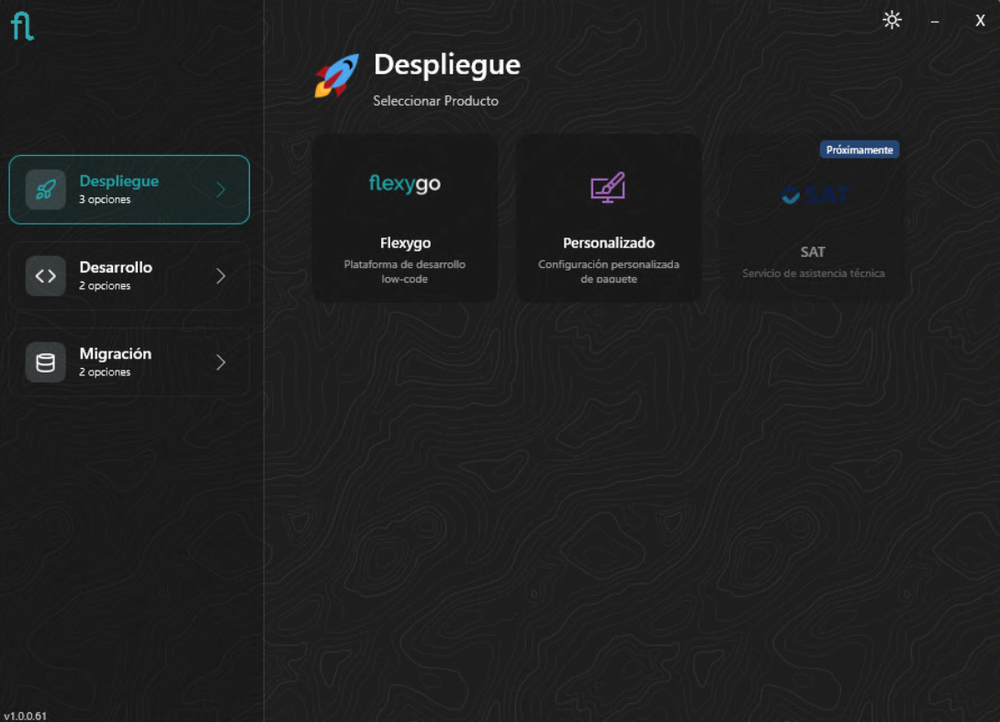
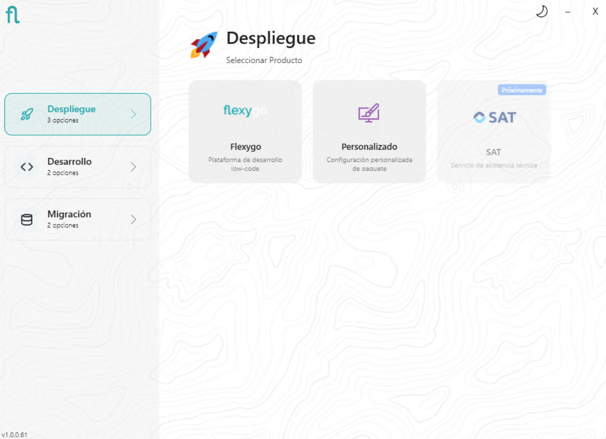

# Flexygo Installer

The Flexygo installer is the main tool for managing the complete lifecycle of an installation: from the initial deployment to migration from previous versions or uninstallation.

<figure markdown="span">
  
  <figcaption>Installer home screen (dark mode)</figcaption>
</figure>

<figure markdown="span">
  
  <figcaption>Installer home screen (light mode)</figcaption>
</figure>

## Available modes

The installer covers the following scenarios:

- **[Deployment](Deployment.md)** — Installation for a production or pre-production environment. Available in three variants: basic IIS (single shared site), advanced IIS (independent sites per component), and Docker via the installer.

- **[Development](Development.md)** — Installation aimed at local development environments, with specific options for working with the source code.

- **[Migration](Migration.md)** — Migration of existing projects or applications from .NET Framework to Flexygo (modern .NET).

- **[Uninstall](Uninstall.md)** — Clean removal of an existing installation, including its IIS sites and associated databases.
