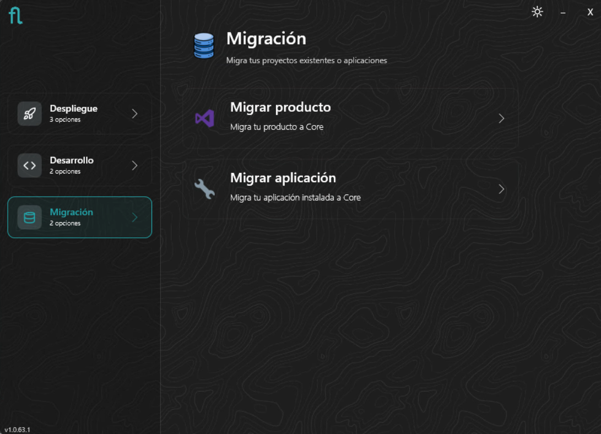
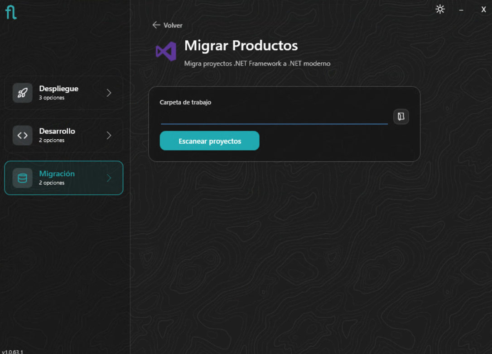
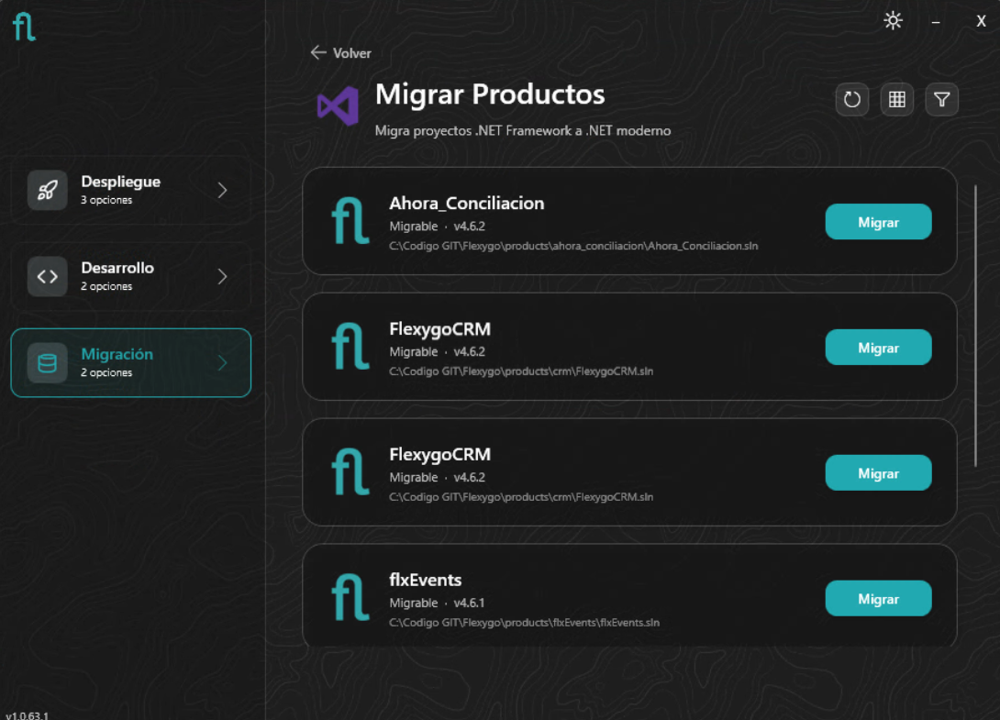
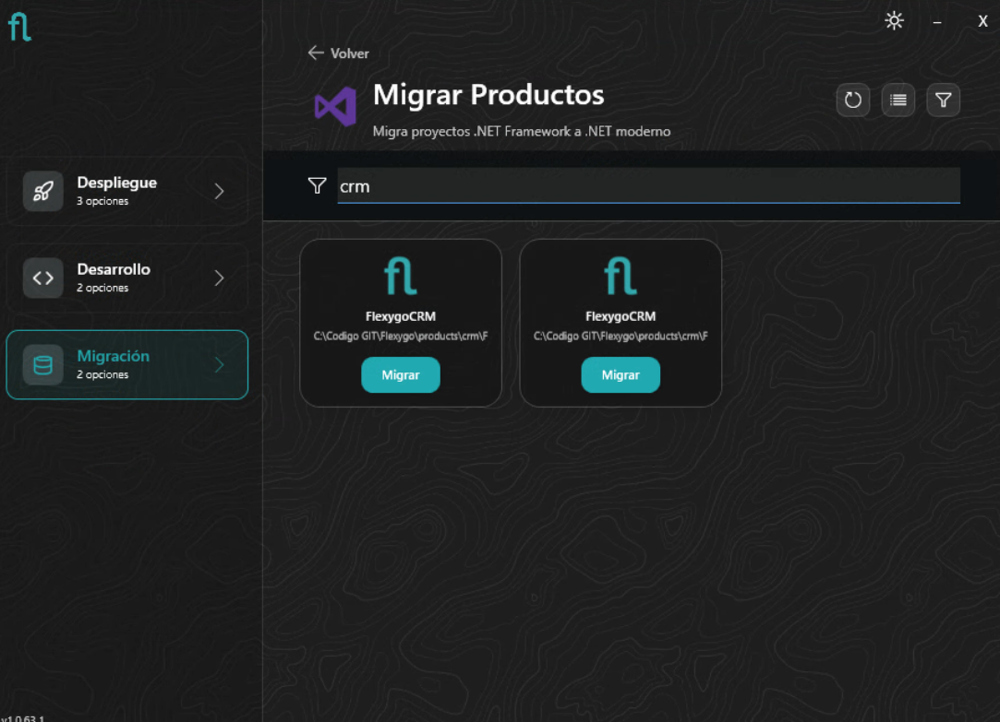
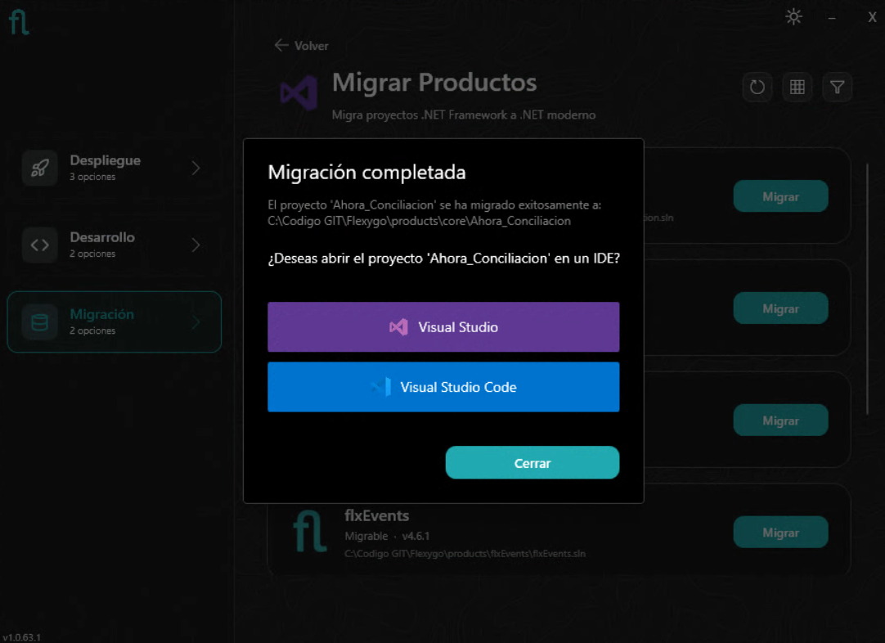
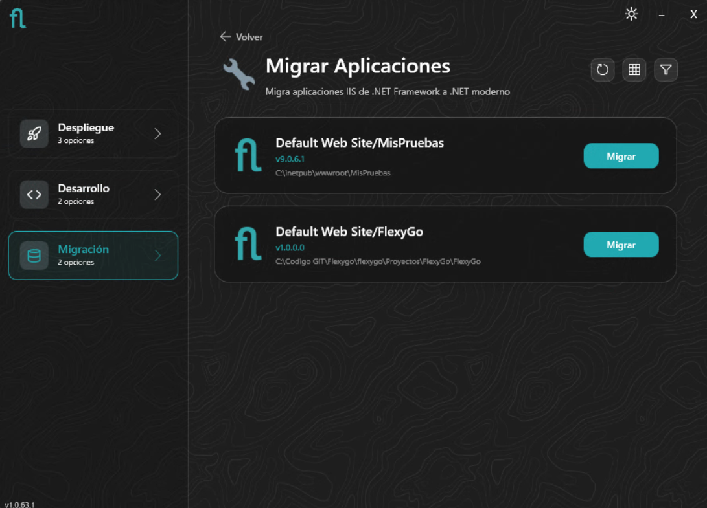
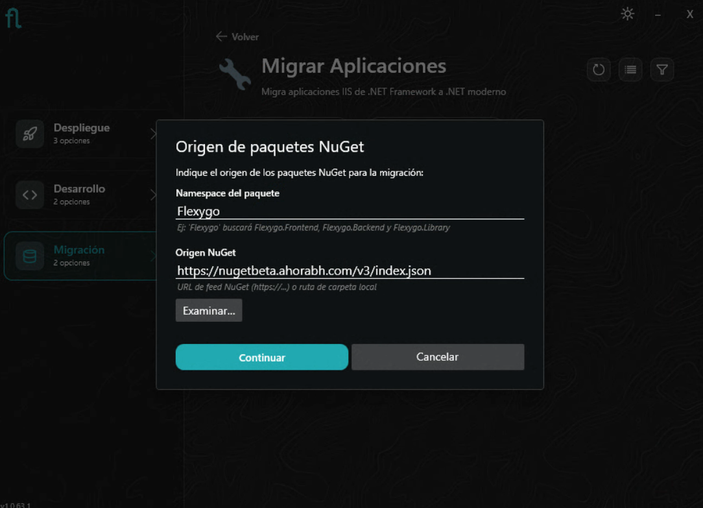
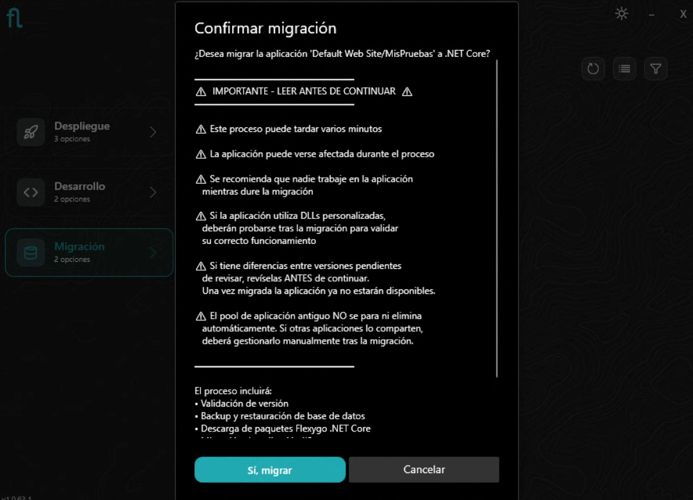
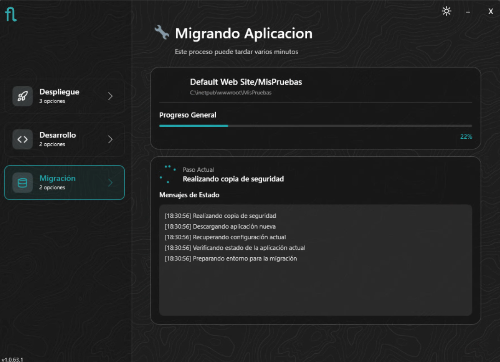
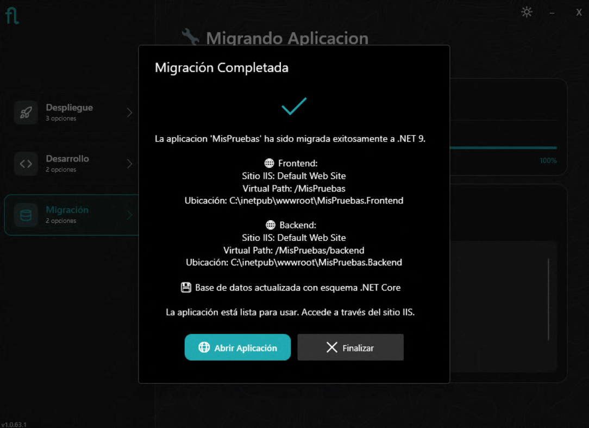

# Installer: Migration Mode

The installer's **Migration** mode lets you move projects and applications from .NET Framework to .NET Core (Flexygo). It offers two variants depending on the starting point.

<figure markdown="span">
  
  <figcaption>Migration mode offers 2 options</figcaption>
</figure>

---

=== "Migrate Products"

    ## Migrate projects

    This option scans the workspace for Flexygo .NET Framework solutions and lets you migrate them to the Flexygo (modern .NET) structure.

    ### Loading the workspace

    Specify the **working folder** where the projects are located and click **Scan projects**. The installer will analyze the workspace looking for Flexygo .NET Framework solutions.

    <figure markdown="span">
      
      <figcaption>Specify the working folder and click Scan projects</figcaption>
    </figure>

    ### Product list

    The projects found are shown with their current version. You can switch between list and grid view, and filter by name.

    <figure markdown="span">
      
      <figcaption>List view with the projects available for migration</figcaption>
    </figure>

    <figure markdown="span">
      
      <figcaption>Grid view with an active filter</figcaption>
    </figure>

    ### Migrate

    Click **Migrate** on the desired project. The installer generates the new Flexygo structure from the existing project.

    ### Migration completed

    When finished, the installer offers to open the migrated project directly in Visual Studio or VS Code.

    <figure markdown="span">
      
      <figcaption>The migrated project can be opened directly in Visual Studio or VS Code</figcaption>
    </figure>

    !!! warning "Checks required after migrating the project"
        Before building and testing the migrated project, review the following points:

        **Conf.Database**

        - Open the `Conf.Database` project and review the configuration file and the integrity of the migrated **postdeploy** script.
        - Also review the **staticdata** scripts to make sure they were migrated correctly and don't contain obsolete references.
        - Also check the **config.sql** file and verify its integrity. The migrator automatically replaces `AutoUpdatePackageId` with `AutoUpdatePackageNamespace` in this file, but if you have this value configured in any other script you'll need to replace it manually.

        **Old artifact folders**

        Manually delete the `Properties`, `obj`, and `debug` folders that may remain from the previous solution in the **Frontend**, **Backend**, and **Processes** (if it exists) projects. These folders can contain .NET Framework assemblies that are incompatible with the new solution. They will be regenerated correctly when building.

        **Obsolete namespaces in Processes**

        If the Processes are written in C#, they may use namespaces that no longer exist in modern .NET. The most common cases are:

        | .NET Framework Namespace | .NET Equivalent |
        |--------------------------|---------------------|
        | `System.Web` | `Microsoft.AspNetCore.Http` |
        | `System.Web.HttpContext` | `Microsoft.AspNetCore.Http.HttpContext` |
        | `System.Web.HttpRequest` | `Microsoft.AspNetCore.Http.HttpRequest` |
        | `System.Web.HttpResponse` | `Microsoft.AspNetCore.Http.HttpResponse` |
        | `System.Web.HttpServerUtility` | `Microsoft.AspNetCore.Hosting.IWebHostEnvironment` |
        | `System.Web.SessionState` | `Microsoft.AspNetCore.Http.ISession` |

        Review the `using` statements of each Process and replace the obsolete ones with their equivalents. If there are cases not covered in the table, see the [official ASP.NET to ASP.NET Core migration guide](https://learn.microsoft.com/en-us/aspnet/core/migration/proper-to-2x/).

=== "Migrate Applications"

    ## Migrate IIS applications

    This option detects Flexygo .NET Framework applications deployed in IIS and migrates them to .NET Core in place.

    ### Applications found

    The installer lists the Flexygo Framework IIS applications detected on the system.

    <figure markdown="span">
      
      <figcaption>Flexygo Framework applications found in IIS</figcaption>
    </figure>

    ### NuGet package source

    Before starting, the installer asks for the product's namespace and the URL of the NuGet feed from which it will download the packages corresponding to the application being migrated.

    <figure markdown="span">
      
      <figcaption>Specify the product namespace and the source NuGet feed</figcaption>
    </figure>

    ### Confirmation — Read before continuing

    The installer shows a confirmation dialog with important warnings:

    <figure markdown="span">
      
      <figcaption>Important warnings before starting the migration</figcaption>
    </figure>

    !!! warning "Before confirming, keep in mind:"
        - The process **can take several minutes**
        - The application **may be affected** during the process — it's recommended that no one works on it while the migration is in progress
        - If the application uses **custom DLLs**, they must be tested after migration to validate they work correctly
        - If you have **pending differences between versions** to review, do so **before** continuing — once the application is migrated, they will no longer be available
        - The **old Application Pool is NOT stopped or deleted** automatically — if other applications share it, you'll need to manage it manually after the migration

    The process includes: version validation, database backup and restore, downloading Flexygo .NET Core packages, and updating the IIS application.

    ### Progress

    <figure markdown="span">
      
      <figcaption>The installer shows step-by-step progress, including the backup</figcaption>
    </figure>

    !!! info "Automatic rollback on error"
        If an error occurs at any point in the process, the installer performs an **automatic rollback** and leaves the system in exactly its original state. Nothing existing is ever deleted or modified:

        - The **application folders** are renamed as `OLD_<timestamp>` — the originals remain intact.
        - The **configuration database** is likewise renamed as `OLD_<timestamp>`.
        - If a **data database** exists, it is also renamed.

        It is always possible to return to the previous state manually by restoring the renamed folders and databases.

    ### Migration completed

    When finished, the installer shows a summary with the IIS sites created (Frontend and Backend) and their physical paths, confirms that the database has been updated to the .NET Core schema, and offers to open the application directly.

    <figure markdown="span">
      
      <figcaption>Migration summary: IIS sites created, database updated, direct access to the application</figcaption>
    </figure>

    !!! warning "Actions required after migration"
        - **License regenerated** — the license is automatically regenerated to keep the same existing license under the new technology. No additional action is needed.
        - **All users must log in again** — the migration invalidates active sessions.
        - **Browser cache reload recommended** — since the same site and IIS are kept, the browser may serve previous static files. Reload with `Ctrl + Shift + R` or clear the cache before using the application.

    !!! tip "Next steps"
        The deployment and update cycle is identical to that of any Flexygo installation. See the [Deployment](Deployment.md) and [Update](../3Updater/UpdateFlow.md) guides for the next steps.

<!-- MIG-01, MIG-02, MIG-03 -->
