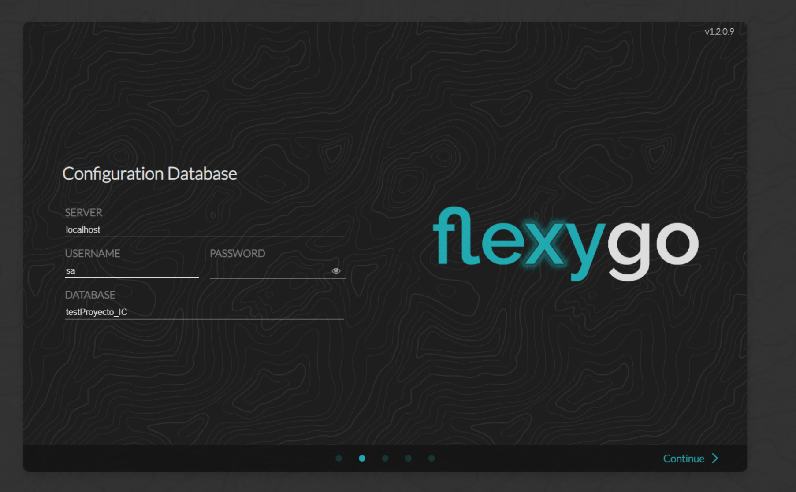
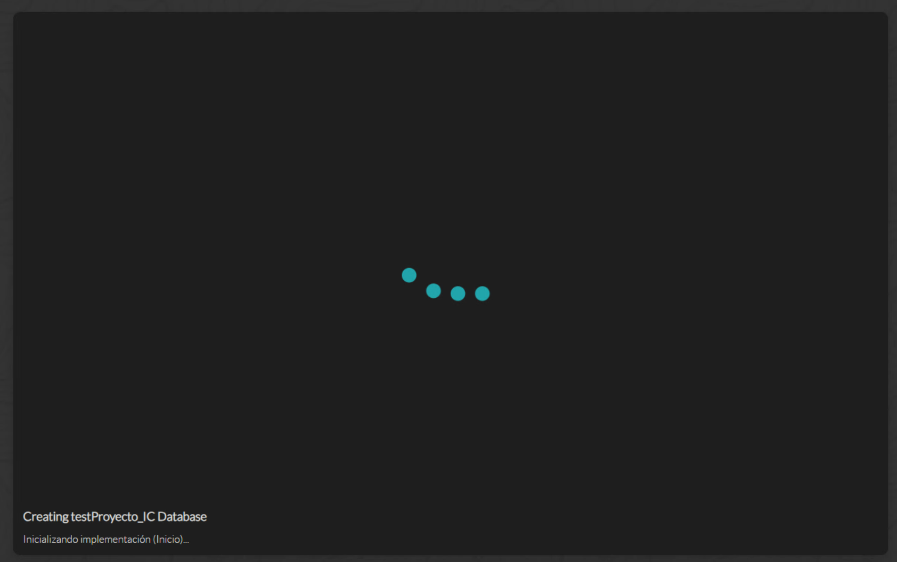
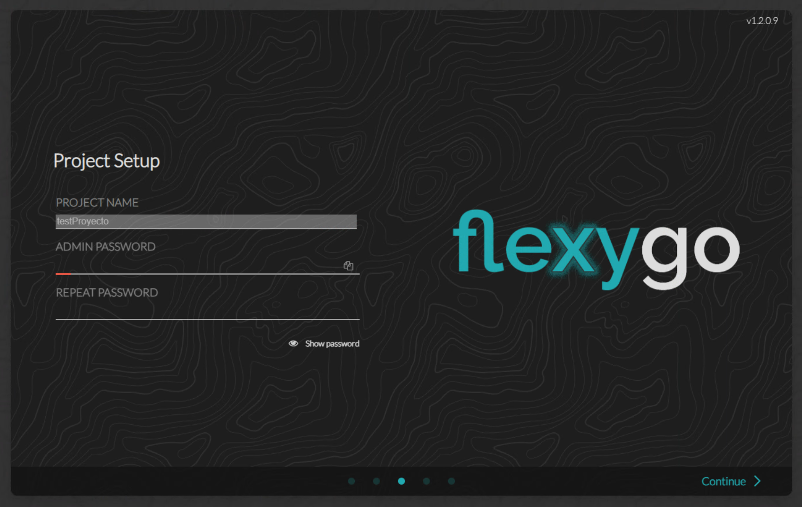
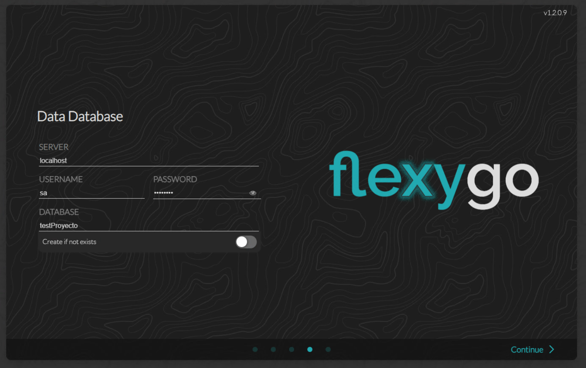
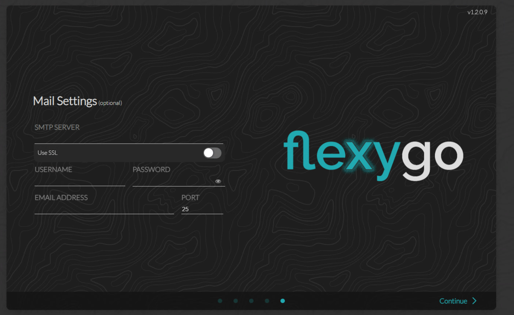
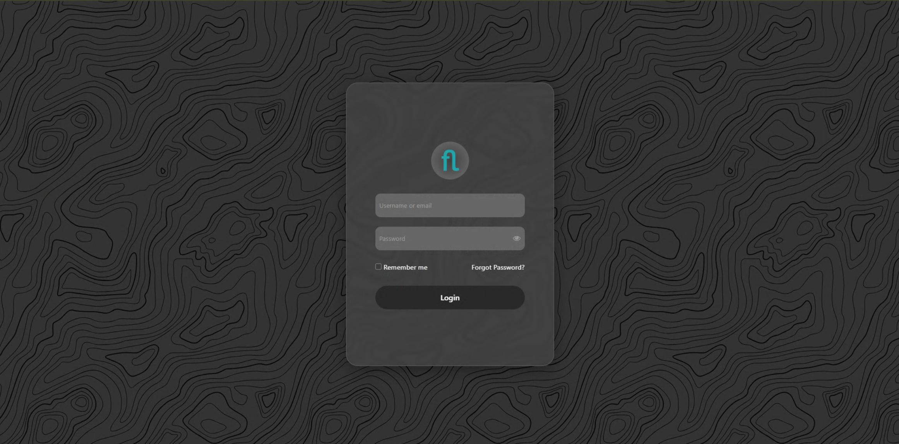

# Configuration

The Configuration Wizard guides the initial process after installation: it configures the databases, sets the administrator password, and adjusts the mail settings. All of this automatically updates `appsettings.json`, with no need to edit any file manually.

!!! info "From web.config to appsettings.json"
    Unlike .NET Framework applications where the configuration lived in `web.config`, in Flexygo (based on .NET 9) all configuration is managed through `appsettings.json`. The wizard takes care of writing and updating this file automatically.

---

## Configuration Wizard

The wizard launches automatically the first time you access the application.

!!! info "Application version"
    The top-right corner of the wizard shows the current version of the installed application.

<figure markdown="span">
  
  <figcaption>Wizard start screen</figcaption>
</figure>

---

### 1. Configuration database setup

The first step sets the connection to the **configuration database**: SQL instance, user, password, and database name.

<figure markdown="span">
  
  <figcaption>Step 1 — Connection details for the configuration database</figcaption>
</figure>

---

### 2. Publish the configuration database

Once the connection is entered, the wizard evaluates the state of the database and acts accordingly:

| Situation | Behavior |
|-----------|----------|
| The DB already exists and is up to date | Uses it directly without modifying anything |
| The DB exists but is from an earlier version | The option to **update** the schema appears |
| The DB does not exist | Creates it and applies the full schema |

<figure markdown="span">
  
  <figcaption>Step 2 — Progress of publishing the configuration database</figcaption>
</figure>

---

### 3. Administrator password

Sets the password for the application's administrator user. This user has full access to system administration.

<figure markdown="span">
  
  <figcaption>Step 3 — Administrator password</figcaption>
</figure>

---

### 4. Data database configuration

The next step sets the connection to the **data database** (the product's records and content).

<figure markdown="span">
  
  <figcaption>Step 4 — Connection details for the data database</figcaption>
</figure>

When publishing, the wizard acts based on the situation:

| Situation | Behavior |
|-----------|----------|
| A data DACPAC exists and the DB already exists | Uses the existing DB |
| A data DACPAC exists and the DB does not exist | Creates the DB and applies the DACPAC |
| No data DACPAC exists and the DB does not exist | Creates an empty DB |
| No data DACPAC exists and the DB already exists | Uses the existing DB without modifying it |

---

### 5. Mail configuration

Enter the SMTP server parameters so the application can send notifications.

<figure markdown="span">
  
  <figcaption>Step 5 — SMTP mail server configuration</figcaption>
</figure>

| Parameter    | Description                                      |
|--------------|---------------------------------------------------|
| SMTP Host    | Mail server (e.g. `smtp.office365.com`)           |
| Port         | Usually 587 (STARTTLS) or 465 (SSL)               |
| User         | SMTP authentication account                       |
| Password     | Password for the SMTP account                     |
| From Address | Address shown as the sender                       |

---

### Configuration complete

Once all steps are finished, the wizard shows the configuration-completed screen.

<figure markdown="span">
  
  <figcaption>Configuration finished</figcaption>
</figure>

You can now access the application with the administrator credentials configured in step 3.

<figure markdown="span">
  
  <figcaption>Application login screen</figcaption>
</figure>

---

!!! note "Frontend ↔ Backend communication URLs"
    The installer automatically configures the communication URLs between Frontend and Backend. In standard installations, there is no need to modify anything manually.

!!! info "appsettings.json reference"
    For a complete reference of the keys available in `appsettings.json` and their meaning, see [Reference: appsettings.json](AppSettingsReference.md).
