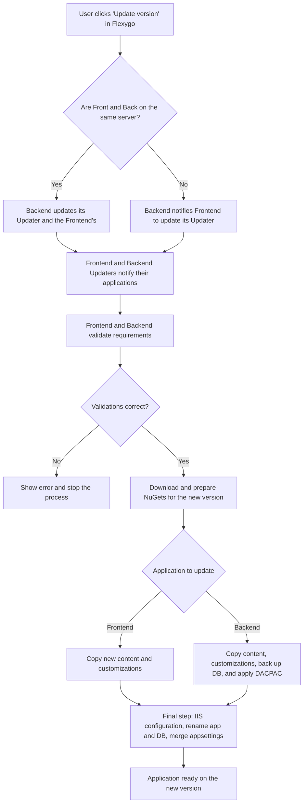

# Flexygo Updater

The Flexygo updater lets you update the version of the deployed application without having to reinstall from scratch. The process coordinates the Frontend and Backend to validate, download, and apply the new version, automatically performing the necessary backups and configuration changes.

## Update flow

Below is the complete flow of the Flexygo update process:

!!! tip "Summary"
    As shown in the diagram above, the Flexygo update process coordinates Frontend and Backend to validate, download, and prepare the new version, perform the necessary backups, and finish by updating files, the database, and the configuration — ensuring a fast and secure update.

!!! warning "Application Pool permissions"
    If the updater cannot overwrite files during the update process, make sure the IIS **Application Pool** user has write permissions on the destination folder. Without these permissions, the update process will fail when trying to replace the application's files.

!!! warning "Permissions to stop processes"
    In addition to write permissions, the **Application Pool** user needs permissions to **stop processes** (*kill process*) during the update. Without these permissions, the updater will not be able to stop the running application before replacing the binary files.

---

To update dockerized applications, see [Update in Docker Containers](DockerUpdate.md).
