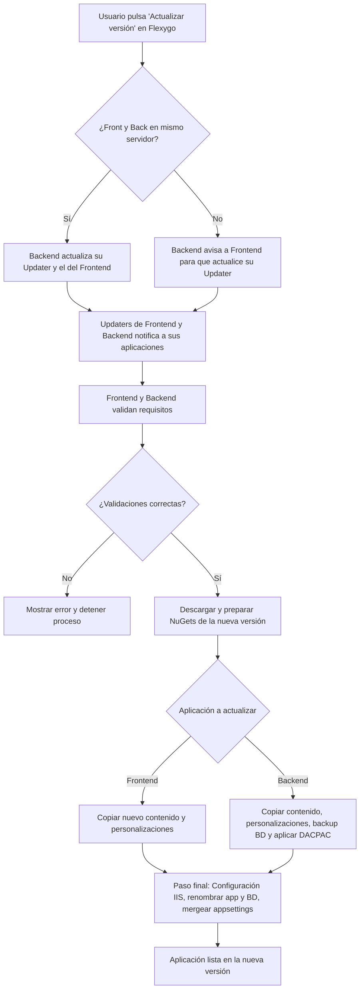

# Actualizador de Flexygo

El actualizador de Flexygo permite actualizar la versión de la aplicación desplegada sin necesidad de reinstalar desde cero. El proceso coordina Frontend y Backend para validar, descargar y aplicar la nueva versión, realizando los backups y cambios de configuración necesarios de forma automática.

## Flujo de actualización

A continuación se muestra el flujo completo del proceso de actualización de Flexygo:

!!! tip "Resumen"
    Como vemos en el diagrama anterior, el proceso de actualización de Flexygo coordina Frontend y Backend para validar, descargar y preparar la nueva versión, realizar los backups necesarios y finalizar con la actualización de archivos, base de datos y configuración, asegurando así una actualización rápida y segura.

!!! warning "Permisos del Application Pool"
    Si el actualizador no puede sobrescribir archivos durante el proceso de actualización, asegúrate de que el usuario del **Application Pool** de IIS tiene permisos de escritura sobre la carpeta de destino. Sin estos permisos, el proceso de actualización fallará al intentar reemplazar los archivos de la aplicación.

!!! warning "Permisos para detener procesos"
    Además de los permisos de escritura, el usuario del **Application Pool** necesita permisos para **detener procesos** (*kill process*) durante la actualización. Sin estos permisos, el actualizador no podrá detener la aplicación en ejecución antes de reemplazar los archivos binarios.

---

Para actualizar aplicaciones dockerizadas, consulta [Actualización en contenedores Docker](DockerUpdate.md).
