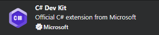
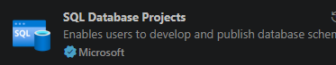
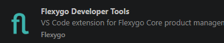
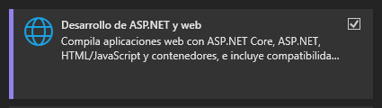
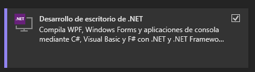
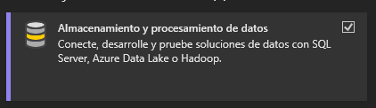
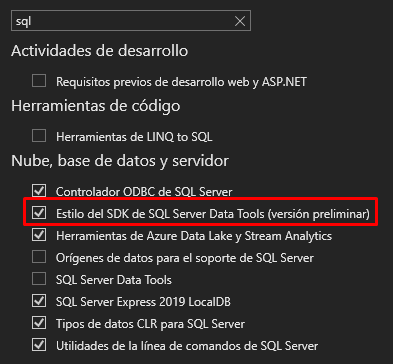

# Requirements

## Development prerequisites

Before you start working with a product generated by the **Flexygo** template, make sure you have the following installed:

---

!!! note ".NET versions"
    Flexygo projects require **.NET 9 SDK**. If you're also going to use the MCP server (`flexygo-mcp`), it requires **.NET 10 SDK** — see the [MCP › Prerequisites](./MCP/1Prerequisites.md) section for more detail.

    Download it from [dotnet.microsoft.com](https://dotnet.microsoft.com/download).

### **SQL Server 2016 or higher**

You need a local or accessible instance of **SQL Server 2016 or higher** to deploy and work with the database projects. The free **SQL Server Express** edition is enough for development environments.

---

## Development IDE

=== "VS Code *(recommended)*"

    The recommended option for working with Flexygo projects.

    ### Required extensions

    Install the following extensions from the VS Code Marketplace:

    - **C# Dev Kit** — full C# support, IntelliSense, and debugging

      
      <em class="caption">C# Dev Kit extension</em>

    - **SQL Database Projects** — database project management and deployment

      
      <em class="caption">SQL Database Projects extension</em>

    - **Flexygo Developer Tools** — tools specific to Flexygo projects

      
      <em class="caption">Flexygo Developer Tools extension</em>

    ### Node.js (required to build the Frontend)

    You need to have **Node.js** installed on your system.

    !!! danger "Global PATH option is mandatory"
        During the Node.js installation, **you must check the option to add Node to the system's global PATH**. If this option isn't enabled, the Frontend compiler won't find the Node binaries and the build will fail.

        You can verify this by running in a terminal:
        ```bash
        node --version
        npm --version
        ```
        If both commands return a version number, the installation is correct.

    Download the LTS version from [nodejs.org](https://nodejs.org/).

=== "Visual Studio 2022"

    A valid alternative for those who prefer Microsoft's full IDE.

    ### Workloads

    During the installation or modification of Visual Studio, select the following **workloads**:

    
    
    

    ### Individual components

    Under **Individual components**, check **SDK-style SQL Projects** and **disable SQL Server Data Tools**, since the two are not compatible:

    

    ### Flexygo Developer Tools extension

    Install the **Flexygo Developer Tools** extension from the Visual Studio Marketplace. It provides the same product management tools available in VS Code.

    !!! warning "Visual Studio 2026"
        Visual Studio 2026 **does not include the _SDK-style SQL Projects_ feature**, so it cannot be used to create or modify Flexygo database projects.
