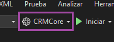
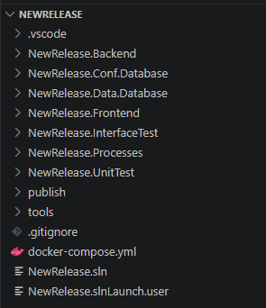
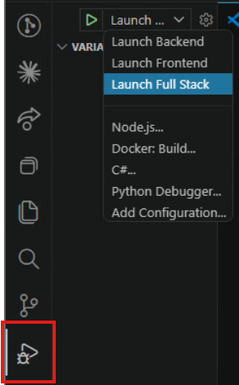

# Template

## Creating a product with Flexygo

The Flexygo template generates a solution that's ready to start development immediately, with all the necessary projects and configurations already integrated.

!!! tip "Recommended way"
    The simplest way to create a new product is through the **[Flexygo Installer](../1Deployment/1Installer/Introduction.md)**, which guides the process with a graphical interface and configures everything automatically. Sections 1 and 2 of this page describe the command-line alternative for those who prefer that workflow.

---

## 1. Managing the template (CLI)

### Installation and update

To install or update to the latest available version of the template:

```bash
dotnet new install Flexygo.Product.Template --nuget-source https://nuget.ahorabh.com/v3/index.json --force
```

### Removing the template

To uninstall it:

```bash
dotnet new uninstall Flexygo.Product.Template
```

---

## 2. Creating a new product (CLI)

```bash
dotnet new flexygoproduct --name CRMCore --output "G:\Proyectos Plantilla\CRMCore" --allow-scripts yes
```

> Replace `CRMCore` with your product's name and the path with where you want the project generated.

When the product is created, a **launch profile** is automatically generated in Visual Studio with the same project name you specified. Remember to select that profile at the top of Visual Studio to run the project correctly.


<em class="caption">Launch profile selector in Visual Studio</em>

---

## 3. Structure of the generated solution

Creating a new product generates a solution organized with the following projects:


<em class="caption">Structure of the solution generated by the template</em>

| Project | Description |
|----------|-------------|
| **`{Name}.Frontend`** | Client files (JS, CSS, HTML…) served in the browser |
| **`{Name}.Backend`** | Custom DLLs and the product's business logic |
| **`{Name}.Processes`** | Custom C# processes for the product |
| **`{Name}.Conf.Database`** | Configuration database — application metadata |
| **`{Name}.Data.Database`** | Data database — business tables and objects |
| **`{Name}.UnitTest`** | Unit tests over the backend logic |
| **`{Name}.InterfaceTest`** | Automated interface and user-flow tests |

The **Frontend**, **Backend**, **Processes** and **database** projects include a preconfigured `.nuspec` file to generate the corresponding NuGet packages. Review them and adapt them if you need to add extra dependencies or metadata.

### NuGet naming convention

For the installer to correctly detect your product's packages, they must follow the same naming convention as the solution's projects:

| NuGet package | Source project |
|---------------|-----------------|
| `{Name}.Frontend` | `{Name}.Frontend` |
| `{Name}.Backend` | `{Name}.Backend` |
| `{Name}.Library` | `{Name}.Processes` |
| `{Name}.Conf.Database` | `{Name}.Conf.Database` |
| `{Name}.Data.Database` | `{Name}.Data.Database` |

With this convention, the installer detects them automatically. If several versions are available, it will show a dropdown list to choose which version to install.

---

## 4. Steps to start developing

=== "VS Code *(recommended)*"

    1. Open VS Code and use **File > Open Folder** to open the project's **root folder** (the one containing the `.gitignore` and the `docker-compose.yml`).

    2. Open the **Run and Debug** tab (<kbd>Ctrl+Shift+D</kbd>) and select the **Full Stack** profile.

       
       <em class="caption">Selecting the Full Stack profile in VS Code</em>

    3. Choose how to configure the project before launching it:

        - **With the [Configuration Wizard](../1Deployment/2ConfigWizard/Configuration.md)** *(recommended)*: press the start button. If no configuration is detected, Flexygo will automatically open the Configuration Wizard, which will publish the databases and adjust the `appsettings.json` for you.
        - **Manually**: publish the `{ProjectName}.Conf.Database` and `{ProjectName}.Data.Database` projects, fill in the connection strings in the Backend's `appsettings.json`, and set `configured: true` in the `MailSettings` section. Pressing start will take you straight to the login screen without going through the wizard.

=== "Visual Studio 2022"

    1. Open the generated solution (`{ProjectName}.sln`) with Visual Studio 2022.

    2. Build the whole solution (**Build > Build Solution**) to restore packages and verify there are no errors.

    3. Select the generated launch profile in the selector on the top bar.

       
       <em class="caption">Launch profile selector in Visual Studio</em>

    4. Choose how to configure the project before launching it:

        - **With the [Configuration Wizard](../1Deployment/2ConfigWizard/Configuration.md)** *(recommended)*: run the project. If no configuration is detected, Flexygo will automatically open the Configuration Wizard, which will publish the databases and adjust the `appsettings.json` for you.
        - **Manually**: publish the `{ProjectName}.Conf.Database` and `{ProjectName}.Data.Database` projects, fill in the connection strings in the Backend's `appsettings.json`, and set `configured: true` in the `MailSettings` section. Running the project will take you straight to the login screen without going through the wizard.

!!! tip "Next steps"
    See [Product Management](./3ProductManagement.md) to understand the NuGet structure, versioning, and the product's lifecycle.
