# IDE Extensions

The **Flexygo Developer Tools** extension is available for Visual Studio 2022 and VS Code. It lets you generate your product's NuGet packages and update the solution to new Flexygo versions, all from the IDE's interface without needing to use the command line.

=== "VS Code *(recommended)*"

    ## Installation

    1. Open VS Code.
    2. Go to the **Extensions** view (<kbd>Ctrl+Shift+X</kbd>).
    3. Search for `Flexygo Developer Tools` and click **Install**.

       
       <em class="caption">Flexygo Developer Tools extension in the VS Code marketplace</em>

    Once installed, the commands are available from **two places**:

    - The **toolbar icons** (top-right of the window).

      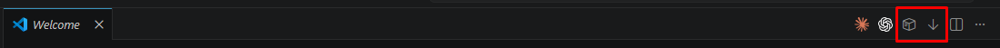
      <em class="caption">Generate NuGets icon (box) and update icon (arrow)</em>

    - The **context menu** when right-clicking the project's root folder in the explorer.

      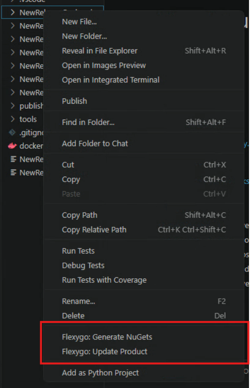
      <em class="caption">Flexygo options in the explorer's context menu</em>

    ## Updating the product

    1. Use the update icon in the toolbar or **Flexygo: Update Product** in the context menu.
    2. Select the version you want to update to; the latest available is shown by default.

       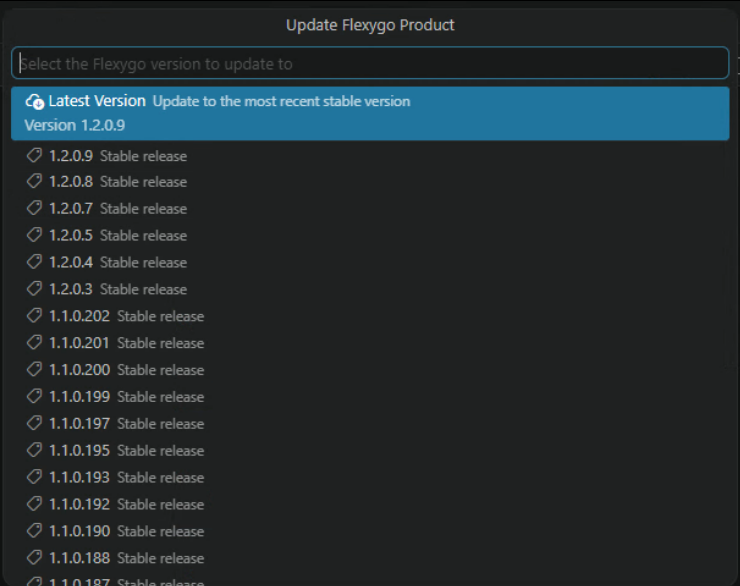
       <em class="caption">Version selector — Latest Version selects the most recent one</em>

    ## Generating NuGets

    1. Use the NuGet icon in the toolbar or **Flexygo: Generate NuGets** in the context menu.
    2. Enter the version of the NuGet package you want to generate and press <kbd>Enter</kbd>.

       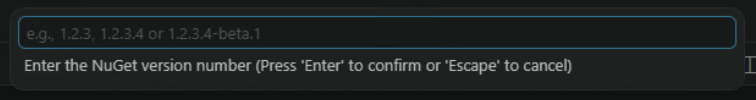
       <em class="caption">Enter the version number (e.g.: 1.2.3 or 1.2.3-beta.1)</em>

    3. When finished, the folder with the generated packages will open.

=== "Visual Studio 2022"

    ## Installation

    1. Open Visual Studio.
    2. Go to the **Extensions** menu and select **Manage Extensions**.
    3. In the search box, type `Flexygo Developer Tools`.
    4. When the extension appears in the results, click **Download**.
    5. Restart Visual Studio to complete the installation.

    Once installed, you'll find the toolbar under **View** → **Toolbars** → **Flexygo Tools Product**.

    
    <em class="caption">Toolbar with the update and generate NuGets buttons</em>

    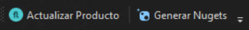
    <em class="caption">Update button (left) and generate NuGets button (right)</em>

    ## Updating the product

    1. Click the update button on the toolbar.
    2. Select the version you want to update to; the latest available is shown by default.

       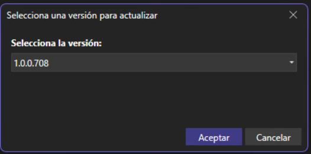

    3. Confirm the update in the confirmation window.

       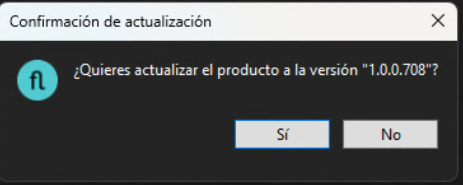

    4. Follow the progress in the output tab.

       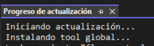

    ## Generating NuGets

    1. Click the generate NuGets button on the toolbar.
    2. Enter the version of the NuGet package you want to generate.

       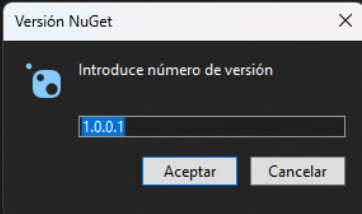

    3. Confirm the generation in the confirmation window.

       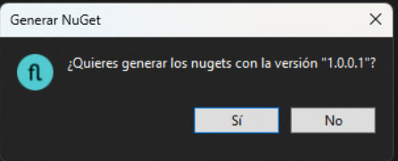

    4. Follow the progress in the output tab. When finished, the folder with the generated packages will open.

       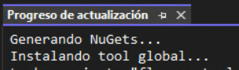
