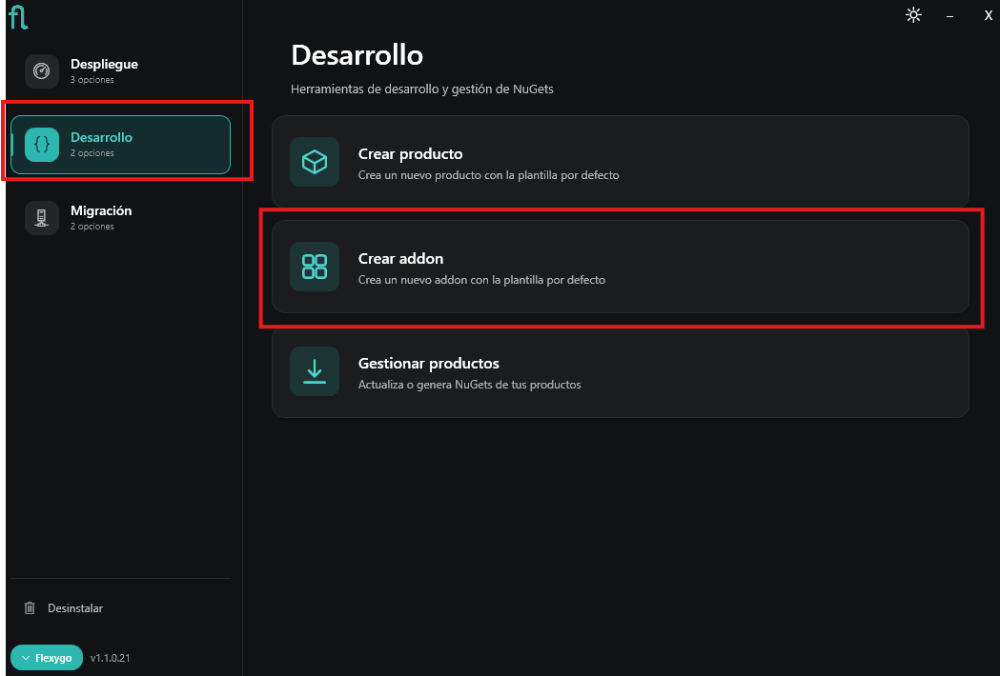
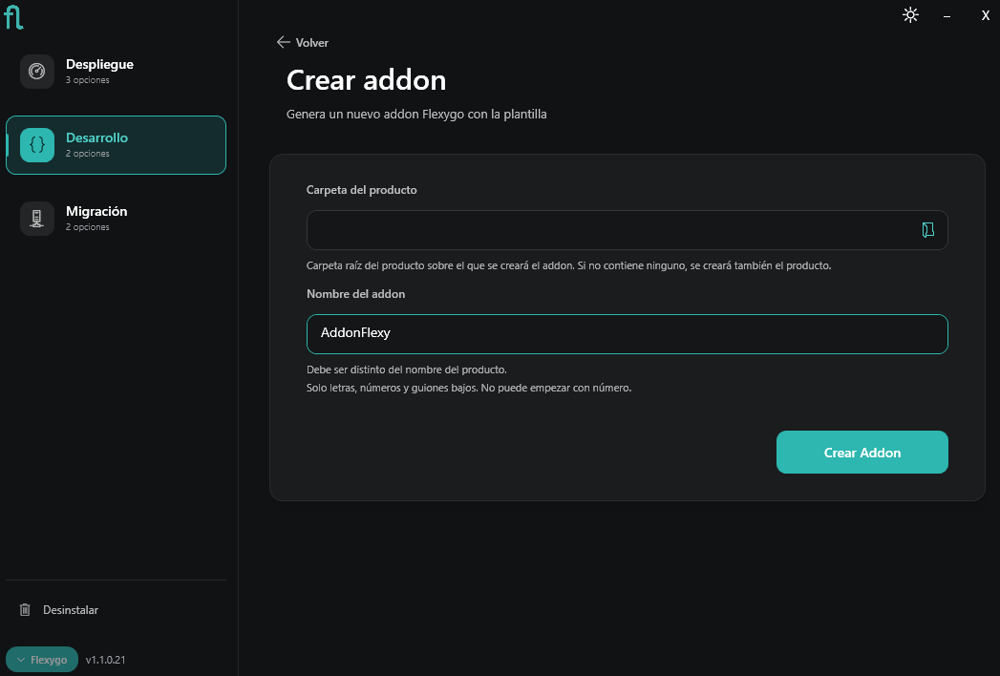
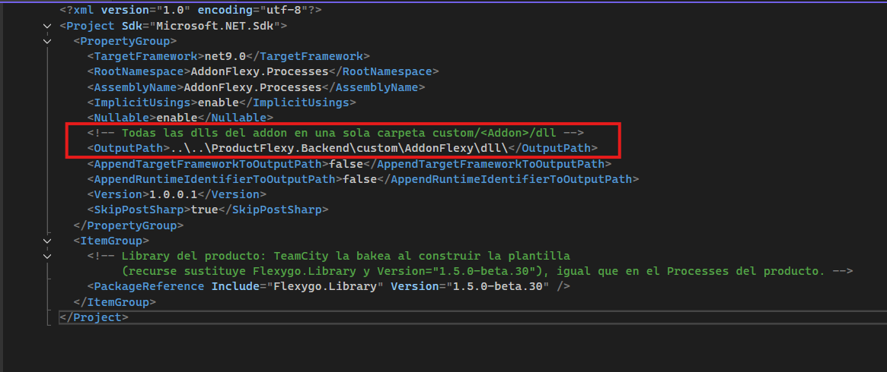
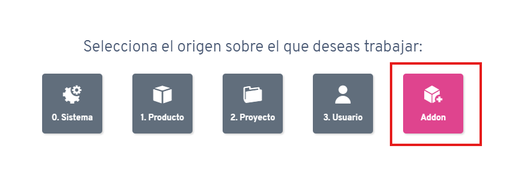
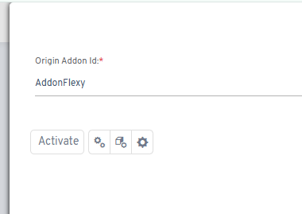
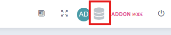
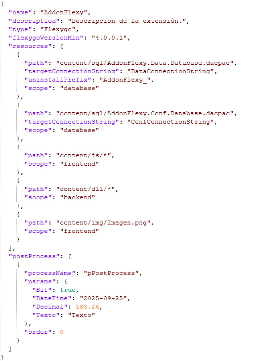
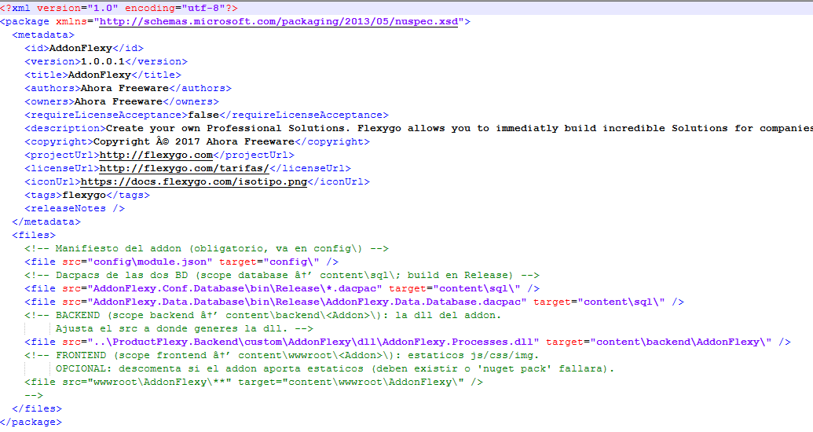

# Crear un addon

Un **addon** es una extensión que se instala sobre un producto Flexygo ya desplegado, con su propio ciclo de versiones independiente del producto (ver [Empaquetar addons](./3ProductManagement.md#c-empaquetar-addons)). Puedes crear un addon nuevo directamente desde el **Instalador de Flexygo**, sin necesidad de recurrir a la plantilla por línea de comandos (`dotnet new flexygoaddon`).

## 1. Crear el addon desde el Instalador

En el Instalador, ve a la sección **Desarrollo** y selecciona **Crear addon**.



En la pantalla **Crear addon** completa:

- **Carpeta del producto**: la carpeta raíz del producto sobre el que se creará el addon.
    - Si la carpeta **ya contiene un producto**, el instalador añade el addon a ese producto existente.
    - Si la carpeta **está vacía**, el instalador crea primero el producto y después el addon, todo en una sola pasada.
- **Nombre del addon**: el identificador del addon (por ejemplo, `AddonFlexy`). Debe ser distinto del nombre del producto, usar solo letras, números y guiones bajos, y no puede empezar por un número. Este identificador es el que se usa siempre para referirse al addon — por ejemplo, en la ruta `custom/NombreAddon` del Backend, o al activarlo durante el desarrollo (ver más abajo).



Pulsa **Crear Addon**. El instalador genera automáticamente todos los proyectos necesarios (configuración de base de datos, modelo de datos, procesos), ya vinculados entre sí y con la plantilla del producto — no hace falta crearlos ni configurarlos a mano.

## 2. Comprobar la ruta de salida del proyecto Processes

El proyecto `{NombreAddon}.Processes` generado ya incluye por defecto una ruta de salida (`OutputPath`) que apunta a la carpeta `custom/{NombreAddon}` del Backend del producto, para que todas las DLLs del addon queden juntas en esa carpeta:

```xml
<!-- Todas las dlls del addon en una sola carpeta custom/<Addon>/dll -->
<OutputPath>..\..\{Producto}.Backend\custom\{NombreAddon}\dll\</OutputPath>
```



Comprueba que esta ruta apunta realmente a `custom/{NombreAddon}` dentro del proyecto **Backend** de tu producto, especialmente si el nombre del producto o del addon no coinciden con los que generó la plantilla por defecto, o si mueves el addon a otra carpeta.

## 3. Desarrollar el addon

El resto de la configuración (proyectos de base de datos, referencias entre proyectos) la gestiona el instalador automáticamente. Lo único que queda a tu cargo es el desarrollo del addon en sí.

### Activar el modo Addon

Para desarrollar el addon, primero selecciona el origen sobre el que vas a trabajar y elige la opción **Addon**.



A continuación, indica el **Origin Addon Id** (el identificador de tu addon, por ejemplo `AddonFlexy`) y pulsa **Activate**.



Con el modo Addon activo, ya puedes desarrollar con normalidad: todo lo que crees o modifiques quedará registrado con el origen de tu addon.

### Generar los scripts del addon

Una vez completado el desarrollo, genera los scripts de base de datos del addon pulsando el icono de base de datos de la barra superior, visible mientras el modo Addon está activo (indicador **ADDON MODE**).



Con los scripts generados, continúa con [Empaquetar el addon como NuGet](#4-empaquetar-el-addon-como-nuget) para preparar el manifiesto y el `.nuspec` del addon.

## 4. Empaquetar el addon como NuGet

### Fichero module.json

Dentro de la carpeta `config` de tu addon encontrarás el fichero `module.json`, donde se definen las acciones que se deben realizar al instalar el addon.



Su definición es la misma de siempre, con una única novedad: el `scope` de un recurso ahora también puede ser `backend`, que es donde van las DLLs del addon.

**General**

| Atributo | Ejemplo | Descripción |
|---|---|---|
| `name` | `"AddonFlexy"` | Identificador de nuestro addon. |
| `description` | `"Descripción."` | Breve descripción del propósito o funcionalidad del addon. |
| `type` | `"Flexygo"` | Actualmente siempre será Flexygo. |
| `flexygoVersionMin` | `"4.0.0.6"` | Versión mínima de Flexygo requerida para poder instalar el addon. |
| `flexygoVersionMax` | `"8.4.0.6"` | Versión máxima de Flexygo requerida para poder instalar el addon. |
| `productVersionMin` | `"4.0.0.6"` | Versión mínima del producto requerida para poder instalar el addon. |
| `productVersionMax` | `"8.4.0.6"` | Versión máxima del producto requerida para poder instalar el addon. |
| `resources` | `[ ... ]` | Lista de recursos incluidos en el addon y cómo deben gestionarse. |
| `postProcess` | `[ ... ]` | Lista de procesos que se ejecutarán después de instalar el addon. |

**resources**

| Atributo | Ejemplo | Descripción |
|---|---|---|
| `path` | `"content/sql/AddonFlexy.Data.Database.dacpac"` | Ruta del recurso dentro del paquete NuGet. |
| `targetConnectionString` | `"DataConnectionString"` | Nombre de la cadena de conexión sobre la que se aplicará el recurso (solo si el scope es `database`). |
| `uninstallPrefix` | `"AddonFlexy_"` | Prefijo usado para identificar y eliminar objetos (tablas, vistas, storeds, funciones) al desinstalar el addon. |
| `scope` | `"database"` / `"backend"` / `"frontend"` | Define el ámbito de instalación del recurso:<br>• **database:** aplica un archivo `.dacpac` a la base de datos.<br>• **backend:** copia la DLL del addon a la carpeta `custom/{NombreAddon}` del Backend.<br>• **frontend:** copia los archivos al entorno de cliente (JS, CSS, imágenes, etc.). |

**postProcess**

| Atributo | Ejemplo | Descripción |
|---|---|---|
| `processName` | `"pPostNuget"` | Nombre del proceso (definido en Flexygo) que se ejecutará al finalizar la instalación del addon. |
| `params` | `{ "Param1": true, "Param2": "2025-09-25", ... }` | Parámetros del proceso definidos en Flexygo. |
| `order` | `0` | Orden de ejecución de los procesos. |

### Fichero .nuspec

El proyecto de tu addon ya incluye, generado automáticamente, un fichero `.nuspec` con los ficheros y rutas necesarios para el empaquetado: el manifiesto `module.json`, los `.dacpac` de las bases de datos, la DLL del Backend y, si tu addon aporta estáticos, la sección de Frontend (comentada por defecto).



Revisa especialmente la entrada del Backend: la ruta `src` debe apuntar a la misma carpeta que configuraste como `OutputPath` en el paso 2. Si tu addon incluye estáticos (JS, CSS, imágenes), descomenta la entrada de Frontend — de lo contrario, `nuget pack` fallará si esos ficheros no existen.

Con el `module.json` y el `.nuspec` listos, genera el paquete NuGet del addon siguiendo el proceso descrito en [Empaquetar addons](./3ProductManagement.md#c-empaquetar-addons).
