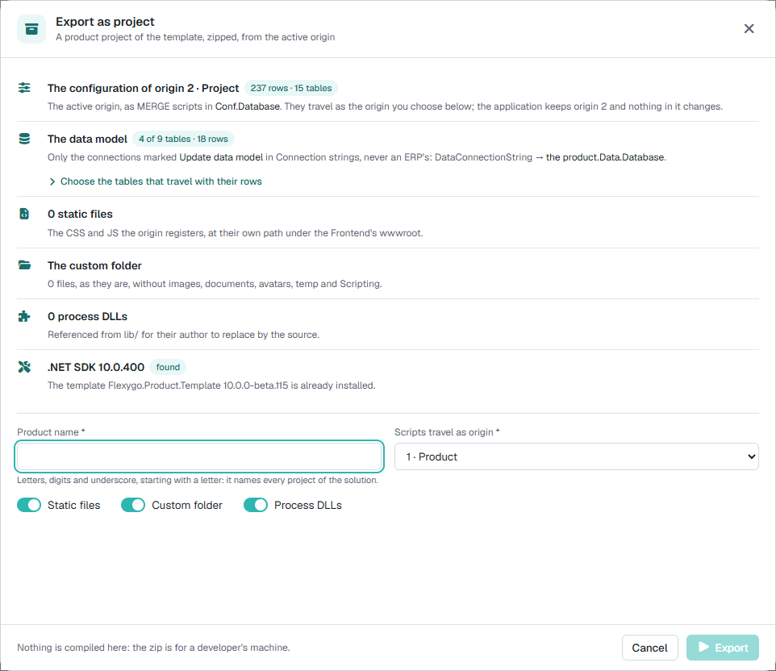
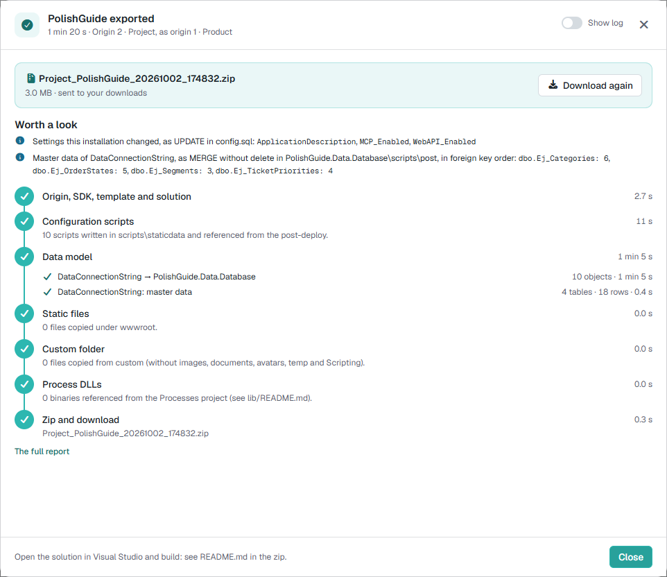

# Pruébalo: de aplicación instalada a proyecto que compila y arranca <span class="fh-version-tag" title="Disponible desde la versión 10">10.0+</span>

Una aplicación construida a mano sobre el core se convierte aquí en un **proyecto .NET de la plantilla de producto**: lo exportas desde el panel de control, lo compilas en tu equipo, publicas sus dos bases de datos y lo arrancas. Al final tienes la misma aplicación —menús, páginas, objetos, procesos y los datos maestros que elijas— corriendo desde un proyecto que ya se puede subir a un repositorio y llevar a integración continua.

Qué viaja y qué no, cada opción de la ventana y cada paso del servidor están en la referencia: [Exportar la aplicación como proyecto](2Reference.md).

---

## Lo que necesitas

| | |
|---|---|
| **Una aplicación de la versión 10 con el origen de tu proyecto activo** | Lo que viaja es lo del **origen activo** (por ejemplo, el 2 · Project). Lo creado con el origen 0 activo es indistinguible del core y no viaja. |
| **Un usuario administrador** | La ventana solo la usan administradores. |
| **En el servidor**: acceso al feed NuGet del actualizador | La exportación instala la plantilla `Flexygo.Product.Template` de la **misma versión** que la aplicación. Si no hay SDK de .NET, lo descarga la primera vez. |
| **En tu equipo**: .NET SDK, SQL Server y `sqlpackage` | Para compilar, publicar las bases y arrancar. Y acceso a los mismos feeds NuGet (`nuget.config` del proyecto). |

---

## 1. Abre la ventana y lee la vista previa

Panel de control → lista de acciones → **Export as project**. La ventana lee la instalación y dice qué se va a llevar.



**Comprueba**:

- *The configuration of origin N*: el origen es el de tu proyecto, no el 0 (con el 0 la ventana lo dice y no deja exportar).
- *The data model*: la conexión de tus tablas (las marcadas con **Update data model** en *Connection strings*). Si dice *none marked*, el proyecto llevará el proyecto de datos vacío.
- *.NET SDK found* y la plantilla de la versión de tu aplicación (*already installed*, o que se descargará).

## 2. Elige los datos maestros

Despliega **Choose the tables that travel with their rows**. Salen marcados los **catálogos** (tablas pequeñas a las que apuntan otras: estados, tipos, categorías): sin sus filas no se podría dar de alta nada en el proyecto. Marca además lo que necesites para probar. Si marcas una tabla grande, o una que apunta a otra que no viaja, la ventana avisa en amarillo; no impide exportar.

{ width="640" }

## 3. Exporta

Escribe el **Product name** (letras, dígitos y guion bajo; nombra la solución y cada proyecto: `SalesExamples.Backend`, `SalesExamples.Conf.Database`…), deja **Scripts travel as origin** en *1 · Product* y pulsa **Export**.

La ventana enseña los pasos con su tiempo y, al terminar, descarga el zip.



**Comprueba**: *exported*, todos los pasos en verde (o en amarillo con su motivo en *Worth a look*) y un zip de unos pocos MB. En una aplicación pequeña tarda uno o dos minutos; la primera vez algo más, porque instala la plantilla.

## 4. Compílalo en tu equipo

Descomprime el zip y, en su carpeta:

```bash
dotnet build SalesExamples.sln
```

**Comprueba**: *Compilación correcta*, 0 errores. La primera vez tarda varios minutos, porque descarga los paquetes de la plantilla.

## 5. Publica las dos bases de cero

El `README.md` de la raíz del zip trae los dos comandos ya escritos con el nombre de tu producto:

```bash
sqlpackage /a:Publish /sf:SalesExamples.Conf.Database\bin\Debug\SalesExamples.Conf.Database.dacpac /tsn:<servidor> /tdn:SalesExamples_Conf /tu:<usuario> /tp:<contraseña> /ttsc:True /p:IncludeCompositeObjects=True /v:ProjectName=SalesExamples /v:OriginDatabaseName=NULL /v:CurrentDacVersion=1.0.0.0
sqlpackage /a:Publish /sf:SalesExamples.Data.Database\bin\Debug\SalesExamples.Data.Database.dacpac /tsn:<servidor> /tdn:SalesExamples_Data /tu:<usuario> /tp:<contraseña> /ttsc:True
```

**Comprueba**: *Successfully published database* en los dos. La base de configuración trae el core más tu configuración (como origen 1), y la de datos, tus tablas con las filas de los datos maestros.

## 6. Arráncalo

En `SalesExamples.Backend\conf\appsettings.Development.json`:

- `ConfConnectionString` y `DataConnectionString`, a las dos bases que acabas de publicar;
- `MailSettings.Configured` a `true` (una instalación nueva espera a que el correo esté configurado en su primer arranque);
- y, si vas a tener la aplicación original abierta a la vez, otros puertos (también en el `appsettings.Development.json` del Frontend).

Arranca Backend y Frontend juntos (el perfil `SalesExamples.slnLaunch.user` en Visual Studio) y entra con tu usuario.

**Comprueba**: el mismo menú, las mismas páginas y listas, los mismos objetos y los mismos ajustes que cambiaste (el asistente de IA o la web API encendidos, la descripción de la aplicación) que en la aplicación de origen. Y **da de alta un registro** de una tabla que dependa de un catálogo: si guarda, los datos maestros han viajado bien.

## 7. Republícalo

Vuelve a publicar las bases encima, sin borrarlas (sube `CurrentDacVersion` en la de configuración). Los guiones `MERGE` insertan y actualizan, y **nunca borran**: el registro que diste de alta sigue ahí. Es lo que pasará en cada actualización del producto.

---

## Si algo no sale

| Lo que ves | Por qué | Qué hacer |
|---|---|---|
| La ventana no deja exportar y habla del origen 0 | El origen activo es el del core | Activa el origen del proyecto y vuelve a abrir la ventana |
| El paso de la plantilla sale en amarillo, o con otra versión | El feed no tiene la de tu aplicación (pasa con versiones de desarrollo del core) | La configuración puede no publicar en el paso 5: usa una aplicación de una versión publicada |
| La base de configuración no publica y nombra una columna | La plantilla instalada es de otra versión que la aplicación | Lo mismo: versión de la aplicación y del paquete tienen que casar |
| El alta falla con «It would generate duplicates» | Falta una fila a la que apunta una clave ajena (un catálogo o un registro, como el empleado del administrador) | Marca esa tabla en el paso 2 y exporta de nuevo |
| El proyecto de datos sale vacío | Ninguna conexión marcada con *Update data model* | Márcala en *Connection strings*, o deja el proyecto sin tablas |
| Falta un ajuste que habías cambiado en la aplicación | Viajan como `UPDATE` al final de `config.sql` los ajustes cambiados, **salvo los del entorno**: los del actualizador, la telemetría, las rutas, las contraseñas y los de integraciones con credenciales (Azure, Google, Office, pagos…) | Ponlo en el `config.sql` del proyecto, o en cada instalación si es del entorno |
