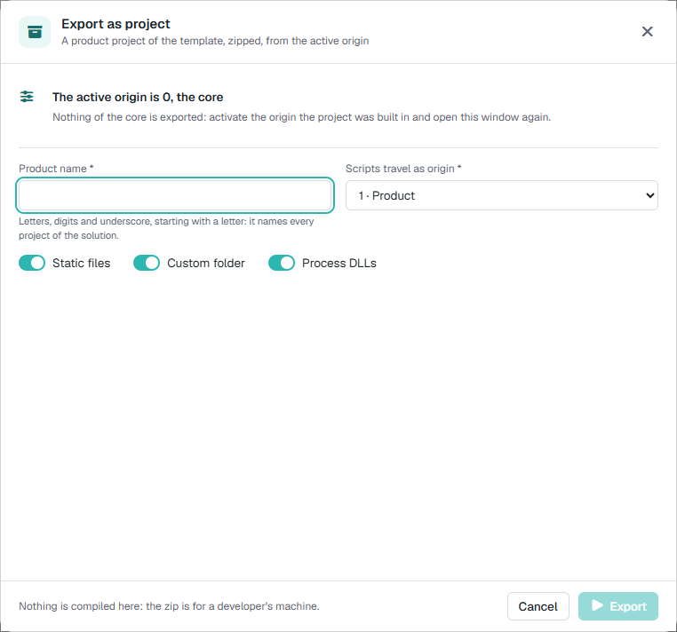
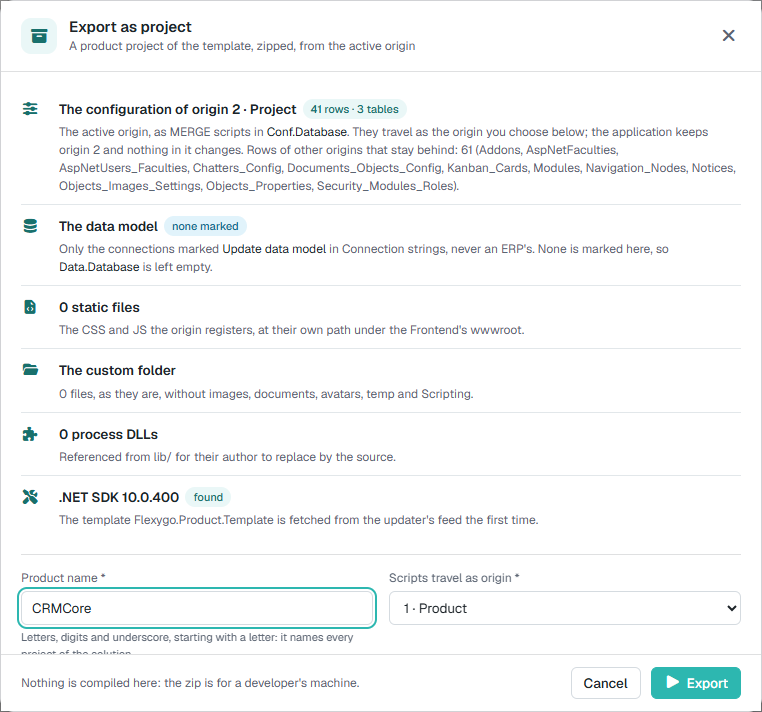
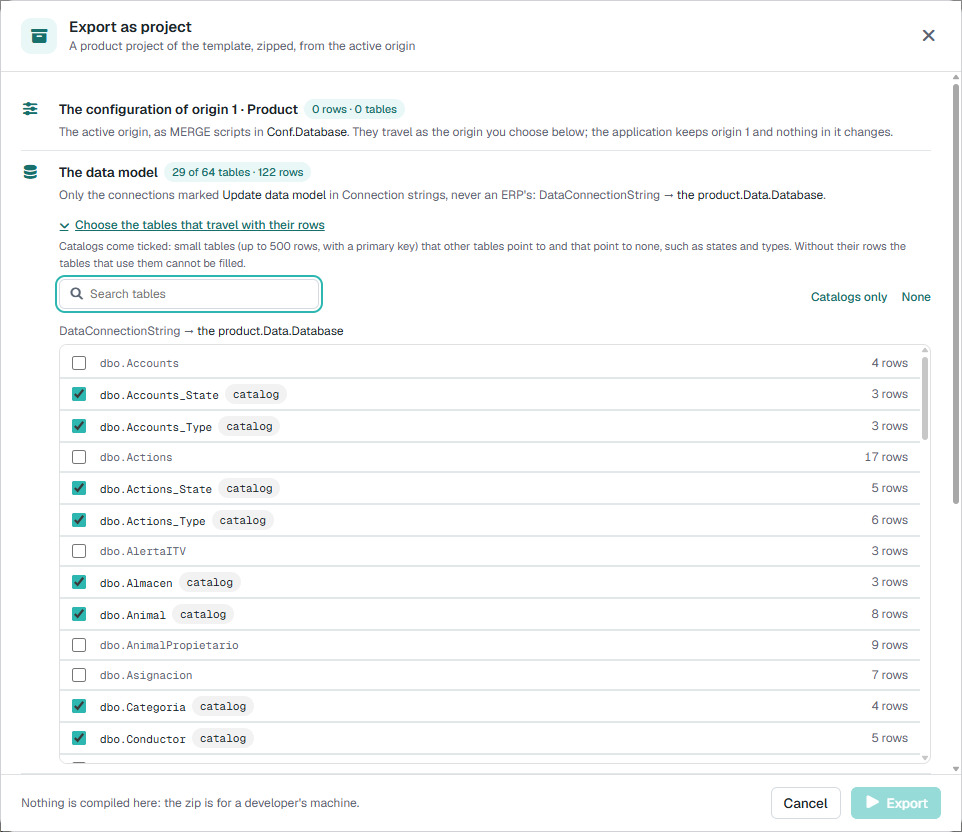

# Export the application as a project 10.0+

A Flexygo application can start out configured by hand on top of the core —objects, pages, processes, style sheets— without any project behind it. When that application grows and it needs to be **developed and maintained with continuous integration**, **Export as project** turns it into a project of the [product template](../2Template.md): the same solution that `dotnet new flexygoproduct` generates, with the installation's configuration, data model, static files and DLLs already inside, in a zip ready to open with Visual Studio and push to a repository.

Want to do it end to end with an application of your own? [Try it: from installed application to a project that builds and runs](1TryIt.md).

!!! info "What it is and what it isn't"
    The export **generates** the project; it does not build or publish anything on the server. Building, publishing the databases and running the product is the developer's job, on their machine, as described in [Create a product with Flexygo](../2Template.md). The application it is exported from **does not change**: neither its data, nor its origins, nor its files.

---

## 1. Before exporting: an origin of your own

Everything that belongs to the project has to be in an **origin** other than 0, which is the core. The configuration rows of the **active origin** are exported (the one shown in the control panel, **Active origin**, and in which the team has built the application); what was created with the active origin at 0 cannot be told apart from the core and **does not travel**.

With the active origin at 0 the window says so and does not allow exporting:

<figure markdown="span">
  
  <figcaption>With origin 0 active: "Nothing of the core is exported". Activate the project's origin and reopen the window</figcaption>
</figure>

!!! tip "The target origin: 1 for a product, 2 for the child of a product"
    In the project scripts the rows travel with the **target origin** chosen in the window, not with the active one. A product born from the core goes as **1 (Product)**: the template post-deploy leaves each installation working in 2 (Project), so a product whose `MERGE` scripts were origin 2 would delete the customer's customizations on every update. A product that is the **child of another product** (its parent already takes 1) goes as **2**, and so on. The conversion is done **only in the scripts**: the application keeps its active origin. 0 is not offered as a target.

---

## 2. Where it is

In the **control panel**, in the action list: **Export as project** (the folder-with-arrow icon). It opens its own window that carries the export from start to finish: what is going to be done, the steps while it runs and the result.

- Only **administrators** use it.
- **One export at a time** per installation. If one is running, the window says who launched it and at what time, and offers **Follow it** to follow it.

---

## 3. What it shows before starting

As soon as it opens, the window reads the installation and says what it is going to take. The lines change with what is chosen below (the target origin and the three switches); whatever is turned off is dimmed.

<figure markdown="span">
  
  <figcaption>The preview with origin 2 active and the CRMCore product: the configuration that travels, the data model, the static files, the custom folder, the DLLs, the SDK and the template</figcaption>
</figure>

| Line | What it says |
|---|---|
| **The configuration of origin N** | How many rows from how many tables travel as `MERGE` scripts of the `Conf.Database` project: those of the active origin plus those already in the target one. And, if any, how many rows from **other origins are left out** and from which tables |
| **The data model** | Which connections take their schema to the project and which project each one goes to (4), or **none marked** if there are none |
| **Static files** | How many CSS and JS files the origin registers, and how many of them **are not on disk** |
| **The custom folder** | How many files in the Frontend's `custom` folder travel, or that there is no folder |
| **Process DLLs** | How many process DLLs of the origin are not from the core, how many **are not in `bin`** and how many belong to an addon (only listed) |
| **.NET SDK** | Whether the server has an SDK (**found**, with the version) or not (**not on this server**: the first export downloads it into a private Backend folder, without administrator permissions; it needs internet and takes a few more minutes). And the **template**: whether it is already installed and in which version, or that it will be downloaded from the updater's feed the first time |

Below, what is requested:

| Field | What it is |
|---|---|
| **Product name** | .NET identifier (letters, digits and underscore, starting with a letter). It names the solution and each project: `CRMCore.Backend`, `CRMCore.Conf.Database`… |
| **Scripts travel as origin** | The target origin (1). 1 · Product by default |
| **Static files** | The files the origin registers in `Skins_Css`, `Plugins` and `Interfaces_Types_JS`, copied under the project Frontend's `wwwroot` at the **same path** (`~/crm/css/crm.css` → `wwwroot/crm/css/crm.css`), so the rows remain valid as they are |
| **Custom folder** | The Frontend's `wwwroot/custom` folder **in full** —its JS, CSS and images, whether a row registers them or not—, without the subfolders the installation writes at run time (`images`, `documents`, `avatars`, `temp`, `Scripting`) |
| **Process DLLs** | The DLLs that the origin's processes run and that are not from the core, as a binary reference of the `Processes` project (7) |

**Export** is enabled when the name is valid, the active origin is not 0 and no other export is running. At the bottom, a reminder: nothing is built here; the zip is for a developer's machine.

---

## 4. The data model is decided by the connections

There is no longer an "include the data model" option in the window. The schema (tables, views, procedures, functions, types and triggers) of the active connections marked to **update their data model** travels: the same mark the updater uses to know which databases it has to update. The configuration connection never counts, and an ERP database is not marked, so it does not travel.

Where each one goes is given by its package name (`PackageDbName`):

| Marked connection | Project |
|---|---|
| With `PackageDbName` = `Data` | `{Product}.Data.Database`, the template's data project |
| With another name, for example `Crm` | `{Product}.Crm.Database`: a copy of the data project added to the solution, under the `Database` folder. The report warns that the template's pipelines and Docker files only build `Data.Database`: the others have to be added by hand |
| **None marked** | `{Product}.Data.Database` is left **empty** and the report says so (an application on top of an ERP, or with its tables created by script). If the product has no tables of its own, it is removed as explained in the template's `DOCKER.md` |

A marked connection is skipped, and the report says so, if its `PackageDbName` is not valid as a project name, if the installation does not have its connection string, if it points to the configuration database itself or if another marked one already takes the same project.

### 4.1 Master data: the tables that travel with their rows

The schema alone is not enough for the project to **work**: tables usually have required foreign keys to catalogs (statuses, types, categories), and without their rows nothing can be created. That is why, under **The data model**, **Choose the tables that travel with their rows** expands the tables of each marked connection with their rows, a search box and two shortcuts, **Catalogs only** and **None**. The section line says how many tables and rows travel, and how many warnings there are.

<figure markdown="span">
  { width="640" }
  <figcaption>The catalogs come checked; the rest are checked by hand</figcaption>
</figure>

- **The catalogs come checked**: small tables (up to 500 rows, with a primary key) that others point to and that point to none. The window explains this under the title, and the *catalog* tag repeats it on hover. Every time the window opens, the proposal is made again with that rule: the choice is not saved.
- Each chosen table travels as a **`MERGE` without delete** in `scripts\post\<table>.sql` of the data project, in the order of its foreign keys, from the template post-deploy. Publishing the project **adds and updates** those rows; it does not delete the ones the target database already has.
- **Warnings**, which do not stop the export and turn the *Data model* step yellow: a table that points to another that does not travel (publishing will reject it unless the database already has those rows), a table without a key, one with more than 500 rows, or a database user that cannot create procedures (then the project travels without rows). An empty table is left out.
- The `README.md` at the root of the zip lists the master data tables, and the action log stores them with their rows.

---

## 5. While it runs

When you click **Export** the window switches to the steps: at the top "Step N of 10" with a bar and the time, and each step with its time and a line of what it has done. The **Show log** switch shows the output of `dotnet` and of each operation.

| Step | What it does |
|---|---|
| 1. **Origin** | Checks the name and the origins, and counts the rows per table |
| 2. **.NET SDK** | Looks for the SDK on the server and, if there is none, installs it once in a private Backend folder |
| 3. **Product template** | Installs the `Flexygo.Product.Template` template from the same feed and with the same credentials as the updater, in the **application's version**; if the feed does not have it, the highest one below it (the step says which one it used), and otherwise the latest. It does not download it again while it is the same. If the feed does not respond and one was installed before, it uses that one and the step comes out **yellow** |
| 4. **Solution** | Generates the solution with `dotnet new flexygoproduct`, the same template a developer or TeamCity uses |
| 5. **Configuration scripts** | One `MERGE` per table, like those of *Generate scripts*, in `scripts\staticdata` of `Conf.Database`, referenced from the post-deploy. And the **settings** the installation changed with respect to the core, as `UPDATE` at the end of `scripts\config.sql` (see 9) |
| 6. **Data model** | The schema of each marked connection (4), one line per connection with the objects it carries |
| 7. **Static files** | Copies the registered static files (if the switch is on) |
| 8. **Custom folder** | Copies the `custom` folder (same) |
| 9. **Process DLLs** | Copies the non-core DLLs to `Processes\lib` and references them from the `.csproj` (same) |
| 10. **Zip and download** | Packs the project (without `bin`, `obj` or `.vs`) and downloads it |

A step turned off by its switch comes out as **skipped**. There is no cancel button: closing the window while it runs **asks first**, because the export continues on the server and the zip can only be collected by reopening the window before it finishes (and clicking **Follow it**).

---

## 6. When it finishes

**If it succeeds**, the zip downloads by itself and the window keeps what deserves attention:

- the name and size of the zip, and **Download again**;
- **Worth a look**: first what has to be fixed (registered files that were not on disk, DLLs that were not in `bin`, marked connections that were not exported…) and then what is worth knowing (the empty data model, the DLLs that travel without source code…);
- the steps, with the first four summarised in one line when everything went well;
- **The full report**, collapsible, with everything that was done and everything that was left out, table by table.

The export and its zip are kept for **one hour** on the server; after that they are deleted automatically and **Download again** no longer works: export again.

**If it fails**, the window says "… could not be exported" and "Stopped at step N of 10 · nothing was downloaded, nothing changed": the failed step comes out in **red** with the error, the log opens by itself, **Copy details** copies the error and the log to pass them on to whoever is responsible, and **Try again** goes back to the preview.

---

## 7. DLLs without source code

A process can run a separately compiled DLL (`Processes.File` outside `~/bin/flx*.dll`). The exported project carries it in `Processes\lib\` and references it as a binary, so that it **builds and works like the installation**; `lib\README.md` lists each one. They are a debt of the project: the team should **replace each reference with its source code** as soon as it has it. A DLL with the same name as the project's own `Processes` assembly is not referenced (it would clash with it): it is copied and noted.

The DLLs of an **addon** (`~/custom/<addon>/`) do not belong to the project: they are listed and not copied; the addon is installed in the target application.

---

## 8. What to do with the zip

1. Unzip it and open the solution with Visual Studio (or `dotnet build`).
2. Publish the databases from their `.sqlproj` projects ([development installation](../../1Deployment/1Installer/Development.md)).
3. Configure the Backend's `appsettings.json`: the template leaves it with empty connection strings and the product's `PackageId`.
4. Push it to a repository and continue with [product management](../3ProductManagement.md) and [continuous integration](../../3CICD/1Overview.md).

!!! warning "The template version and the core version must match"
    The project references the `Flexygo.*` packages of the version of the template that was installed (the application's). If the application is ahead of any published package —which only happens in a core development environment—, the exported configuration database will not publish until the package for that version exists.

---

## 9. What does not travel

- Rows created with the active origin at **0** (indistinguishable from the core) and those of **other origins** different from the active and the target ones: the preview and the report count them per table.
- The **data** in the databases, except the tables chosen as master data (4.1): for the rest, only the schema, and only that of the marked connections (4).
- **Environment settings**: the settings the installation changed travel as `UPDATE` in `config.sql` (the MCP or the web API turned on, `ApplicationDescription`…), but not those that belong to each installation: password-type settings, those of the updater (`flx-version`), telemetry, paths and integrations with credentials (`flx-azure`, `flx-google`, `flx-office`, `flx-payments`, `flx-passbook`, `flx-clave`, `flx-sendinblue`, `flx-abh`), nor `BundleGUID`. The window lists in *Worth a look* those that travel.
- The `images`, `documents`, `avatars`, `temp` and `Scripting` folders of `custom`: they are run-time data.
- A file that a row registers and **is not on disk**: the row travels and the report warns about it.
- A DLL that a process names and **is not in `bin`**: the process travels and the report warns about it.

!!! note "Frontend and Backend on different servers"
    The export runs in the Backend. The DLLs are there; the Frontend files (the registered ones and the `custom` folder) are requested from the Frontend through its internal file API. There is no need to share folders or copy anything by hand. In that case the preview cannot check one by one which static files are missing: the report says so when it finishes.
