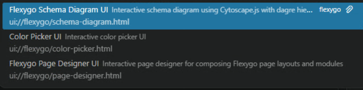
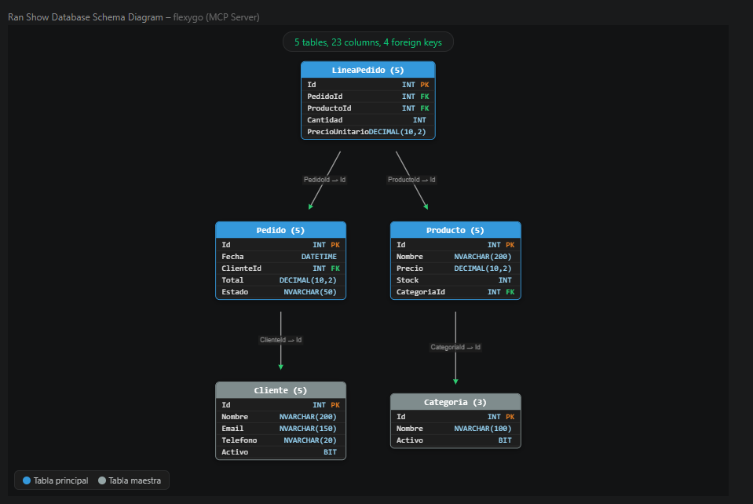
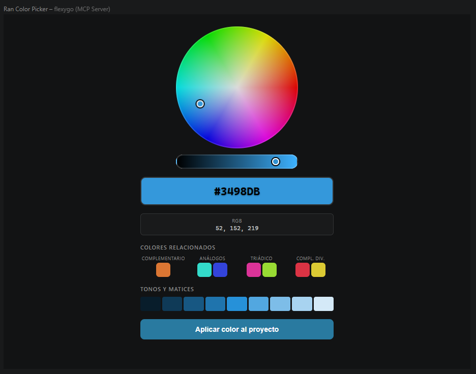
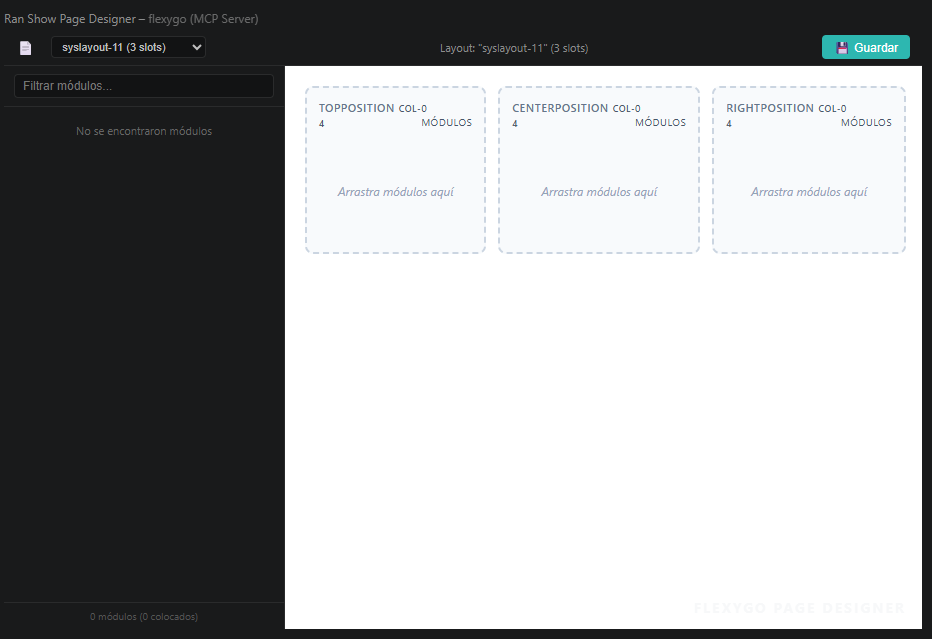

# MCP tools and resources

The `flexygo-mcp` server exposes tools and resources that the Copilot agent can invoke to interact with the Flexygo project. You don't need to know all of them — the agent discovers and uses them automatically based on the prompt's context.

---

## Exploring the available tools

Once the server is active, the `.vscode/mcp.json` file shows the total number of available tools and prompts. Click **More...** to see the full list directly in VS Code.

<figure markdown="span">
  
  <figcaption>Click More... to explore all the available tools</figcaption>
</figure>

---

## MCP Apps

Besides the data tools, the server includes three **MCP Apps**: interactive visual interfaces that the agent can open in response to specific prompts.

<figure markdown="span">
  
  <figcaption>The 3 MCP Apps appear as resources in the agent's panel</figcaption>
</figure>

### Flexygo Schema Diagram UI

An interactive diagram of the project's database model, with hierarchy and relationships between entities. Useful for visualizing the current schema before making changes or for understanding the structure of an existing project.

**How to use it:**
```text
Show me the project's current database model
```

<figure markdown="span">
  
  <figcaption>The diagram shows the project's tables, columns, types, and foreign keys</figcaption>
</figure>

### Color Picker UI

An interactive color picker. Once a color is confirmed, the agent automatically modifies the application's two main variables: the header color and the navigation color.

**How to use it:**
```text
Change the application's main color to a dark corporate blue using the color picker
```

<figure markdown="span">
  
  <figcaption>Pick the color and press "Apply color to project" for the agent to apply the change</figcaption>
</figure>

### Flexygo Page Designer UI

A preview of the page designer: shows the available positions (slots) on each page and the modules configured in each one. Useful for reviewing the layout before making modifications.

**How to use it:**
```text
Open the page designer to see which modules are on each page
```

<figure markdown="span">
  
  <figcaption>The designer shows the selected page's layout with its positions and assigned modules</figcaption>
</figure>
