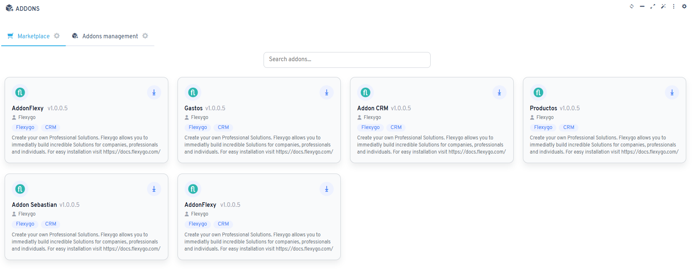

# Información

Un addon es una función adicional de la herramienta que se puede instalar por separado y utilizar en diferentes aplicaciones.

## Marketplace

Desde el marketplace ubicado dentro de flexygo, en el panel de administración, en **Otras herramientas** -> **Addons**, puede instalar los addons disponibles.

!!! warning "Tal vez requiera licencia"
    Es posible que necesite adquirir el módulo de licencia correspondiente en AHORA Business Hub para poder utilizarlo.

## ¿Cómo se desarrolla un addon?

Para desarrollar un addon, puede encontrar la información necesaria [aquí](Creation.es.md).

## Videotutorial

Si prefiere entender cómo trabajar con addons mediante un video, eche un vistazo a este:

  
    <iframe src="https://www.youtube.com/embed/VfvNyEPyx8E?si=N04WbJwhnxfWC6YG" title="YouTube video player" frameborder="0" allow="accelerometer; clipboard-write; encrypted-media; gyroscope; picture-in-picture" allowfullscreen=""></iframe>

