# Create an addon

To develop an addon, you need to have a Visual Studio [product](../Installation/CreatingProduct.en.md).

## 1. Install flexygos template

Install the flexygo template for Visual Studio 2022 through [here](https://marketplace.visualstudio.com/items?itemName=Flexygo.FlexygoTemplate).

Or go to **Tools -> Extensions and Updates -> Online** and search for **Flexygo**.

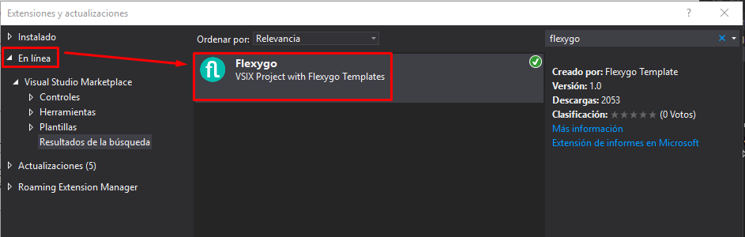

## 2. Define the addon name

Enter the addon name here so that the names are automatically updated and you only have to copy and paste them:

<fh-namepropagator selector="propagated-addonname" placeholder="AddonFlexy"></fh-namepropagator>

!!! warning "Addon Identifier Is Permanent"
	This name will be the addon identifier that we will always use.

Keep in mind that, when an addon is installed, it is located in the path **custom/**.

Therefore, any file that is part of the addon (js, css, dll, etc.) must be placed inside that same folder.

In our case, the path will be **ProductFlexy/custom/**, where we will leave our files and which should be referenced by the paths used in the project.

## 3. Create root folder

In the root folder of our product, create a folder with the identifier of our addon (<fh-copy></fh-copy>). We will add our addon projects there.

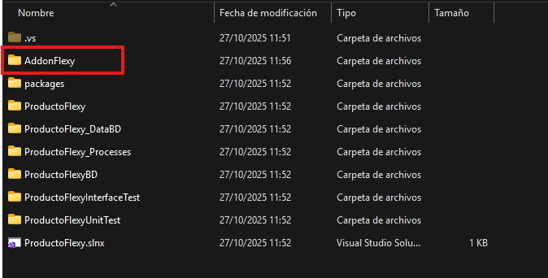

## 4. Add a Config Model project

Add a new project of type <fh-copy>Flexygo Addon Config Model BBDD</fh-copy> to the product solution, with the name <fh-copy>BD</fh-copy>. Save it inside the folder created in step 3.

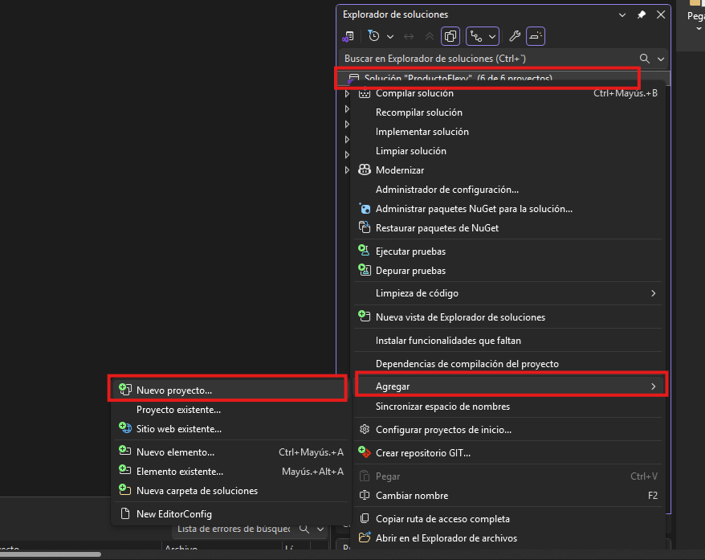

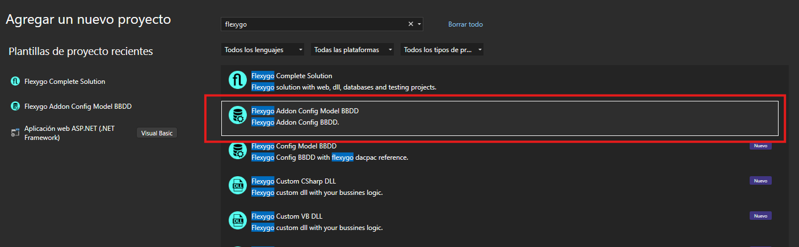

## 5. Add a Data Model project

Add a new project of type <fh-copy>Flexygo Data Model BBDD</fh-copy> to the product solution, with the name **_DataBD**. Save it inside the folder created in step 3.

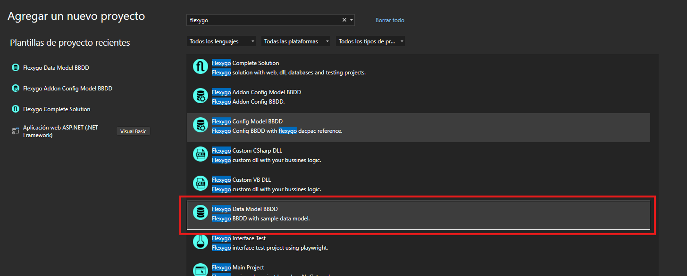

## 6. Add a Custom CSharp DLL project

Add a new project of type <fh-copy>Flexygo Addon Custom CSharp DLL</fh-copy> to the product solution, with the name <fh-copy>_Processes</fh-copy>. Save it inside the folder created in step 3.

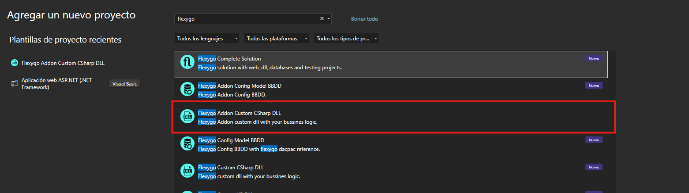

## 7. Modify the build path

In the properties of **_Processes**, modify the build output path to the project **custom** folder. Inside **custom**, there must be a folder with your addon identifier, in our case **** Inside this folder, you can organize your structure as needed; we will keep it in a folder named **dll**.

Replace **ProductFlexy** with your project name and **AddonFlexy** with your addon identifier <fh-copy></fh-copy>.

!!! warning "Use Shared DLL Output"
	If you have several related DLL projects, their output path must be the same folder.

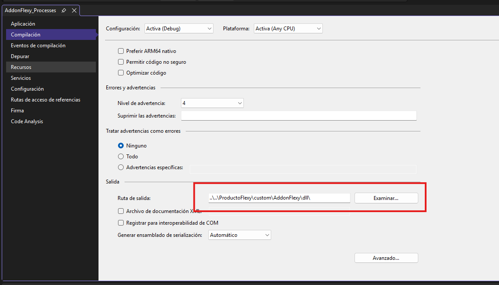

## 8. Fix failed dependencies

Fix failed project dependencies using the ones included in the **packages\Flexygo.x.x.xx.xx\lib\net46** folder of your solution.

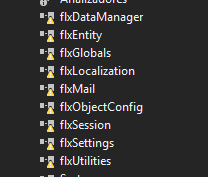

## 9. Define assembly name and namespace

In each project properties, set the correct assembly name and namespace, using the same value as the addon name.

- Replace **flxDB_data** with <fh-copy>_DataBD</fh-copy>.
- Replace **flxDB_processes** with <fh-copy>_Processes</fh-copy>.
- Replace **flxDB** with <fh-copy>BD</fh-copy>.

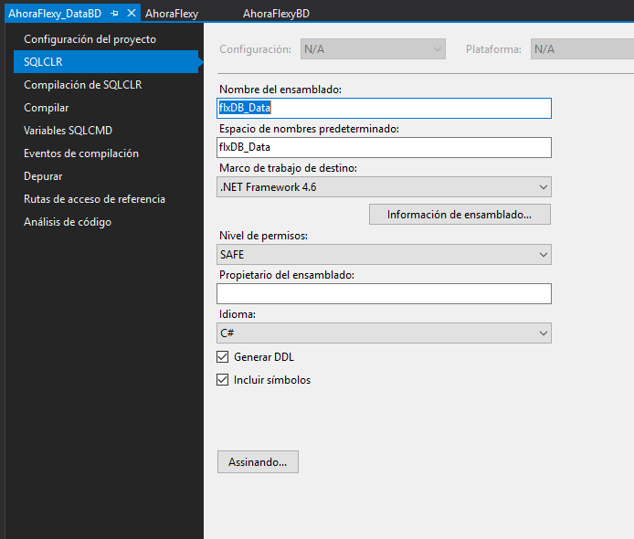

## 10. Develop the addon

With the project started, select **addon** as origin mode and set the addon identifier name <fh-copy></fh-copy> to activate it.

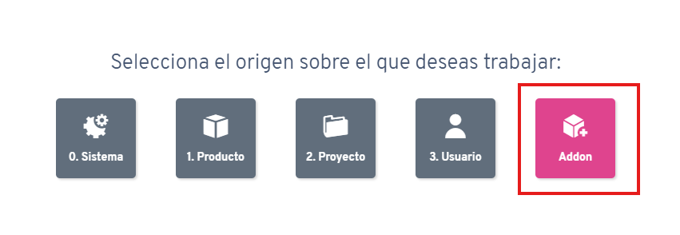

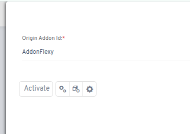

## 11. Generate scripts

Once development is complete, generate the scripts inside your **BD** project.

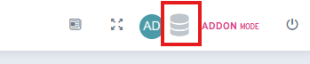
