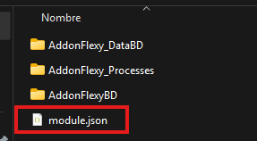
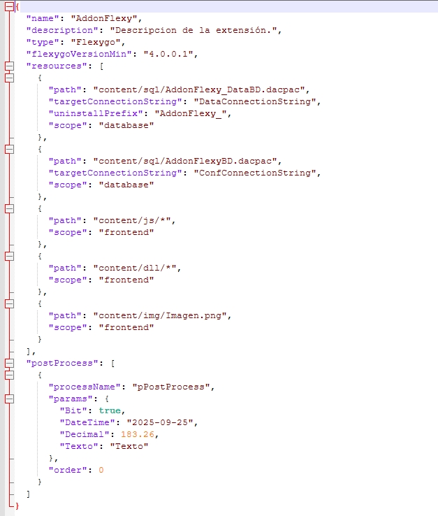
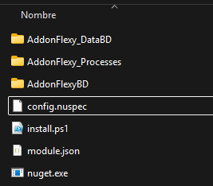
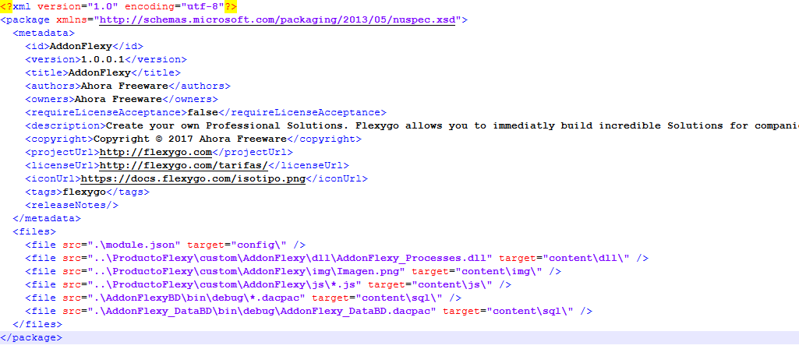
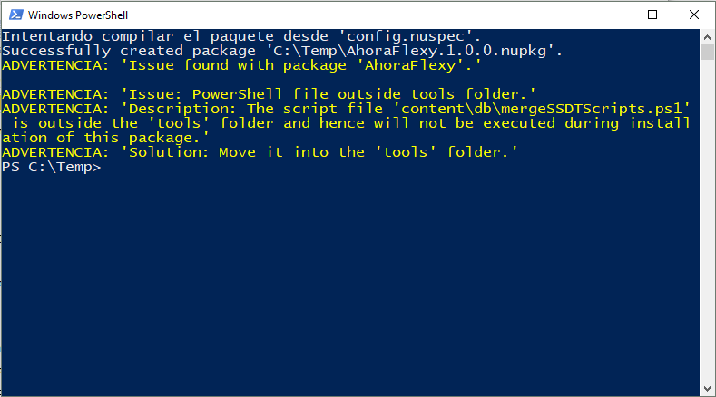
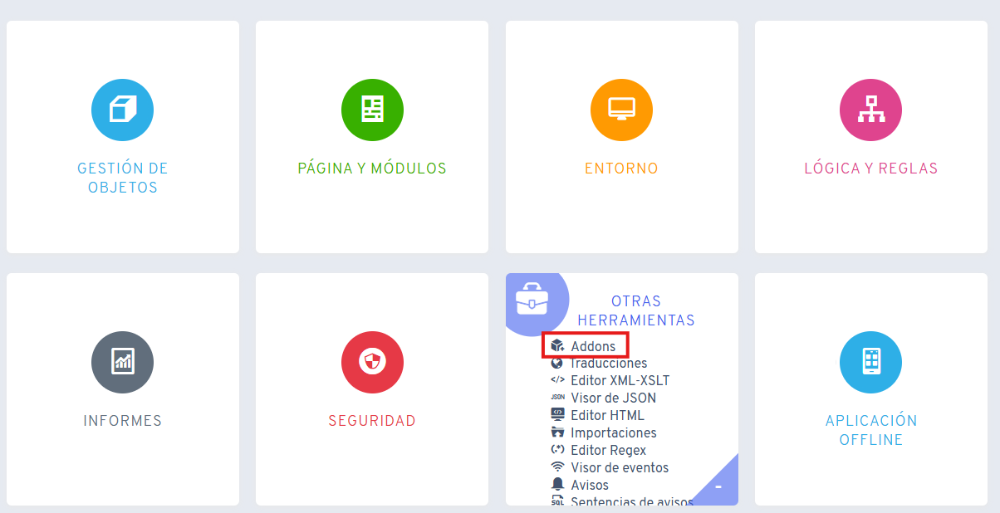
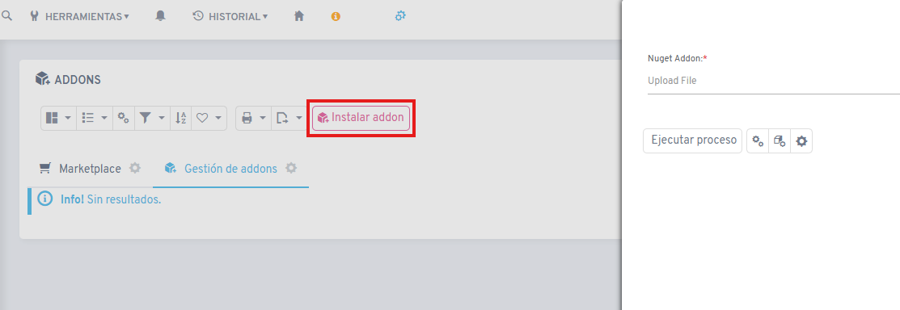
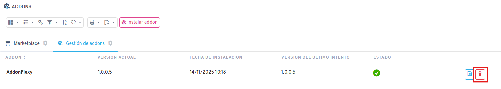

# Create Addon NuGet Package

## 1. Define your addon name

Enter the addon name here so that the names are automatically updated and you only have to copy and paste them:

<fh-namepropagator selector="propagated-addonname" placeholder="AddonFlexy"></fh-namepropagator>

## 2. Add Module.json File

To create the nuget package, we first need to define a file called [**module.json**](./readme/utils/module_json.zip) inside our addon folder. In this file, we will define the actions that must be performed during installation.





## 3. Module.json Definition

### General

| Attribute | Example | Description |
|-----------|---------|-------------|
| `name` | "<span class="propagated-addonname"></span>" | Identifier of our addon. |
| `description` | "Description." | Brief description of the addon's purpose or functionality. |
| `type` | "Flexygo" | Currently will always be Flexygo. |
| `flexygoVersionMin` | "4.0.0.6" | Minimum Flexygo version required to install the addon. |
| `flexygoVersionMax` | "8.4.0.6" | Maximum Flexygo version required to install the addon. |
| `productVersionMin` | "4.0.0.6" | Minimum product version required to install the addon. |
| `productVersionMax` | "8.4.0.6" | Maximum product version required to install the addon. |
| `resources` | [ ... ] | List of resources included in the addon and how they should be managed. |
| `postProcess` | [ ... ] | List of processes that will be executed after installing the addon. |

### Resources

| Attribute | Example | Description |
|-----------|---------|-------------|
| `path` | "content/sql/<span class="propagated-addonname"></span>_DataBD.dacpac" | Path of the resource within the NuGet package. |
| `targetConnectionString` | "DataConnectionString" | Name of the connection string on which the resource will be applied (only if scope is `database`). |
| `uninstallPrefix` | "<span class="propagated-addonname"></span>_" | Prefix used to identify and delete objects (tables, views, stored procedures, functions) when uninstalling the addon. |
| `scope` | "database" / "frontend" | Defines the scope of resource installation: <br>• **database:** applies a `.dacpac` file to the database. <br>• **frontend:** copies files to the client environment (JS, DLLs, images, etc...). |

### PostProcess

| Attribute | Example | Description |
|-----------|---------|-------------|
| `processName` | "pPostNuget" | Name of the process (defined in flexygo) that will be executed when the addon installation completes. |
| `params` | { "Param1": true, "Param2": "2025-09-25", ... } | Parameters of the process defined in flexygo. |
| `order` | 0 | Execution order of the processes. |

## 4. NuGet Utilities

Download the [nuget.zip](../docs_assets/dowloads/nuget.zip) file and extract it at the same level as your addon folder.



## 5. Config.nuspec File

Edit the config.nuspec file to adapt the values to your project.

The nuget id must be our addon identifier <fh-copy><span class="propagated-addonname"></span></fh-copy>.

Inside the **config** target we must keep the **module.json** file and the rest of the files inside **content**. **Important: all dlls must be in the same folder.**



## 6. Generate NuGet Package

Open a command window and execute the following command:

```bash
nuget pack config.nuspec
```



## 7. Install/Update Addon

Once we have our nuget package generated, we can install our addon from Flexygo in **Other Tools -> Addons**.





## 8. Uninstall Addon

From Flexygo in **Other Tools -> Addons** we can see the list of addons we have installed and proceed to uninstall them.


