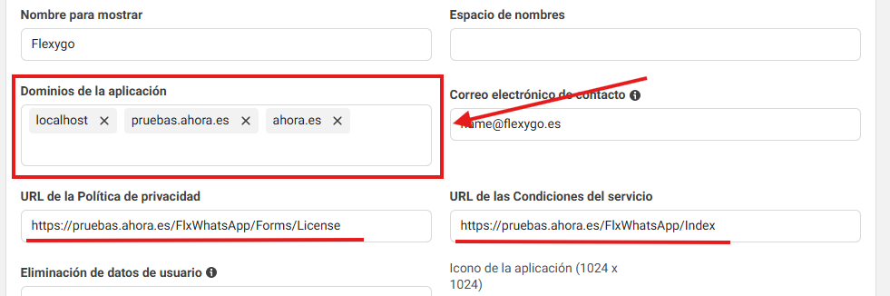
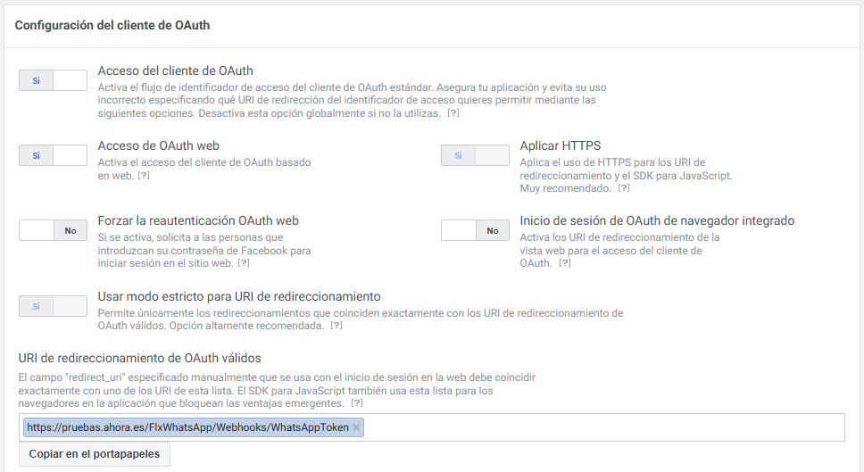
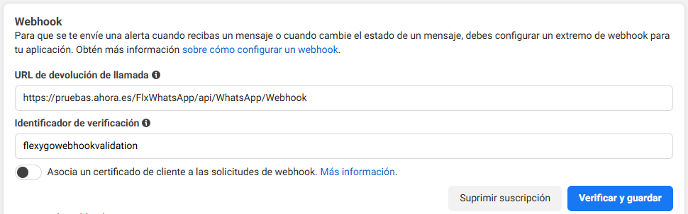
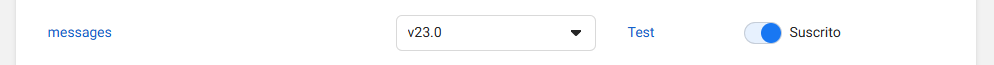
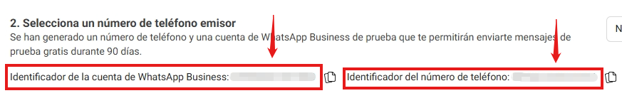
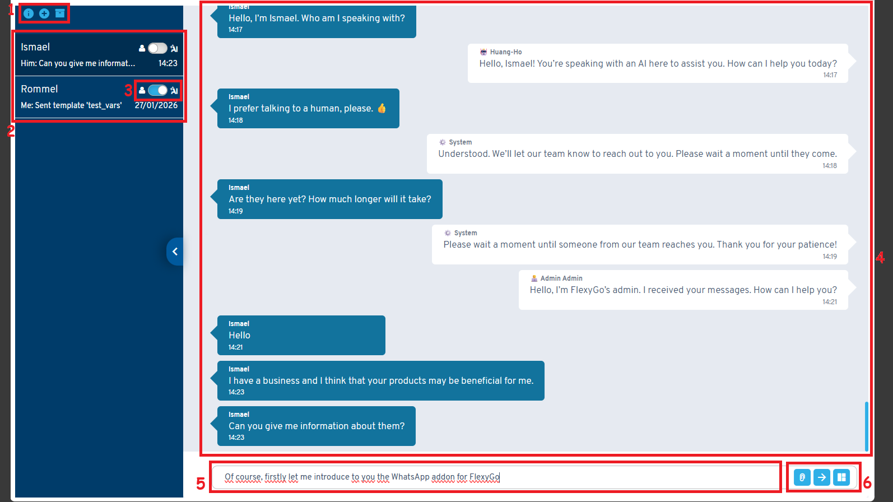
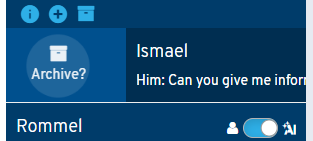
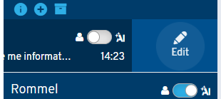
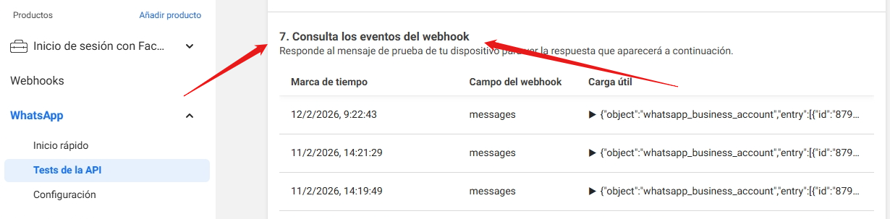

# WhatsApp Addon

{ .fh-image-of-title }

[WhatsApp Business](https://business.whatsapp.com/products/business-app){:target="_blank"} (Cloud API) es una herramienta oficial de Meta que permite integrar la mensajería de WhatsApp en tus soluciones empresariales.

Siguiendo estos pasos, podrás integrarla con **Flexygo**, añadir contactos, enviar y recibir mensajes e incluso **automatizar las conversaciones con agentes de IA**.

---

## Requisitos previos

Localiza e **instala el Addon de WhatsApp** desde el marketplace ubicado dentro de Flexygo.

Antes de poder usarlo necesitarás crear:

* Una **cuenta de desarrollador de Facebook**.
* Una **aplicación de WhatsApp Business**.
* Un **Portafolio Empresarial** de tu empresa.

En el apartado de requisitos previos y en el primer paso de la [ayuda oficial](https://developers.facebook.com/documentation/business-messaging/whatsapp/get-started#prerequisites){:target="_blank"} explican como se realiza este proceso en detalle.

> Miestras se configura y desarrolla **recomendamos** tener la aplicación en modo desarrolo (modo en el que no se pueden enviar mensajes) y usar el número de prueba que nos brinda WhatsApp.

> Una vez completemos las configuraciones, podemos cambiar a **modo producción**, verificar nuestro negocio, añadir nuestro teléfono y comenzar a usar WhatsApp Business desde FlexyGo.

---

## Configuraciones de la aplicación

Una vez tengas los requisitos previos, continúa con estos pasos:

### 1. Añadir dominios

Primero, añade tus **dominios** en la configuración de la aplicación.

Escríbelos en el apartado de Información Básica dentro de la **Configuración de la aplicación** de [tu aplicación de WhatsApp Business](https://developers.facebook.com/apps){:target="_blank"}:



> Debes proporcionar una URL para las **Políticas de privacidad** y para
> los **Términos de servicio**.

---

### 2. Facebook Login for Business

Añade el producto **Facebook Login for Business** a tu aplicación.

Verifica que estas opciones estén activadas y que tengas una **URI de redirección**:



> El URI de redirección debe ser:
> **Tu dominio** + `/Webhooks/WhatsAppToken`

---

### 3. Endpoint de Webhooks

Añade el producto **Webhooks** a tu aplicación.

Rellena los campos:

* URL de callback: **Tu dominio** + `/api/WhatsApp/Webhook`
* ID de verificación: Introduce una contraseña que usaremos más adelante. (Lo vemos en el siguiente punto)



Verifica que estás suscrito a los campos de **mensajes**.



> Antes de darle a Verificar y Guardar, **completa la Configuración de Flexygo** y cuando lo tengas le podrás dar.

---

## Configuración en Flexygo 

Abre las <flx-navbutton class="link" type="openpagename" pagetypeid="list" pagename="syspage-edit-settings" objectname="sysSettings" objectwhere="GroupName='flx-whatsapp'" defaults="" targetid="popup1400x600" excludehist="true">configuraciones de WhatsApp Business</flx-navbutton> en Flexygo y rellena los campos:

### Usuario por defecto 

(Identificado como `WhatsApp_DefaultAnswerUser`)

Rellenar este campo determinará que **usuario se le asignará por defecto** con los contactos que sean creados de ahora en adelante.
Dejarlo vacío supondrá:

1. Se buscará el primer **usuario que tenga el mismo número** que el contacto.
2. Si se encuentra, se le asignará ese.
3. Si no se encuentra, se le asignará el usuario guest.

### Asistente de IA por defecto

(Identificado como `WhatsApp_DefaultAssistantAI`)

Rellenar este campo determinará que **asistente de IA se le asignará por defecto** a los contactos que sean creados de ahora en adelante.
Dejarlo vacío supondrá:

1. Se buscará el **asistente por defecto del rol** del usuario que tenga asignado.
2. Si se encuentra, se le asignará ese.
3. Si no se encuentra, la IA no podrá responder a este contacto.

### Token de Acceso

(Identificado como `WhatsAppAccessToken`)

Token necesario para enviar mensajes.

* Token generado por OAuth → dura 1 hora.
* Recomendado → Generar un **Identificador de Acceso del Sistema** desde [Meta Business Suite](https://business.facebook.com/latest/settings){:target="_blank"}, lo puedes hacer en el apartado Usuarios del sistema.


---

### ID de la Aplicación

(Identificado como `WhatsAppAccountId`)

Necesario para refrescar el token mediante OAuth. 

---

### Secreto del Cliente

(Identificado como `WhatsAppClientSecret`)

Necesario para verificar la firma de los webhooks. Este y el anterior, puedes encontrarlos en el apartado de Información Básica dentro de la **Configuración de la aplicación** de [tu aplicación de WhatsApp Business](https://developers.facebook.com/apps){:target="_blank"}:


---

### ID de la Cuenta e ID del Teléfono

(Identificado como `WhatsAppApplicationId` y `WhatsAppPhoneId`)

Necesarios para enviar mensajes. En tu aplicación, dentro de **Productos** > **WhatsApp** > **Tests de la API**.  



---

### ID de Verificación

(Identificado como `WhatsAppVerificationId`)

Necesario para verificar ante WhatsApp tu endpoint de Webhooks. Debe ser **el mismo que indicaste en el [Apartado de Webhooks](./#3-endpoint-de-webhooks)**.

---

### Verificación de la firma

(Identificado como `WhatsAppVerifySignature`)

Tener esta opción activada **rechaza todas las peticiones** que se hagan al endpoint de Webhooks y **solo acepta las que vengan de los servidores de Meta**.

Por defecto está activada, y solo conviene desactivarla para poder enviar peticiones de prueba a nuestro endpoint.

---

## Uso básico

Una vez configurado, puedes enviar y recibir mensajes desde <flx-navbutton class="link" type="openpagename" pagetypeid="list" pagename="7df84455-fa8e-4e90-a99c-ccce9dede1e7" objectname="" objectwhere="" defaults="" targetid="popup1500x2000" excludehist="false"> <a>la página de WhatsApp de Flexygo</a> </flx-navbutton>.



1. **Opciones de la barra de navegación**. Puedes abrir la ayuda, crear un nuevo contacto y alternar entre conversaciones activas y archivadas.
2. **Listado de para poder cambiar entre conversaciones**.
3. **Botón de alternancia** entre modo manual (apagado) y automático (encendido).
4. **Mensajes** de la conversación seleccionada.
5. **Caja de texto para escribir mensajes**.
6. **Opciones de envío**. Contiene los botones para adjuntar archivos, enviar mensajes de texto y otros tipos de mensajes.

---

### Modo automático y manual

Una conversación puede estar en 2 modos: **automático** o **manual**. Se puede cambiar una conversación de un modo a otro en cualquier momento desde el **botón de alternancia** que disponen en el listado de conversaciones. 

* En el modo manual: Solo se podrán enviar mensajes desde la interfaz.

* En el modo automático:
    1. Si tiene un asistente de IA **asignado** y **activado**, responderá la IA a cada mensaje que nos llegue de ese contacto.
    2. Si no lo tiene, recibirá mensajes predefinidos pidiendole que espere hasta que le responda alguien. (Se usará el idioma del usuario asignado).

---

### Contactos / Conversaciones

Hay 2 formas de que crear un nuevo contacto.

1. **Recibir un mensaje de un número nuevo**, en cuyo caso automáticamente se creará un contacto con ese número.
2. **Manualmente**, en cuyo caso deberás indicar un número, un nombre y una plantilla de mensaje (Esto se debe a que WhatsApp Business solo permite iniciar una conversación enviando un plantilla aprobada).

Una vez creado, puedes archivar la conversación **deslizando hacia la derecha**:



Y editar el contacto **deslizando hacia la izquierda**:



---

### Envío de mensajes

WhatsApp soporta una gran variedad de tipos de mensajes:

-   Plantillas
-   Texto
-   Imágenes
-   Documentos
-   Audios
-   Videos
-   URLs de llamada a la acción
-   Listas
-   Ubicaciones
-   Botones de respuesta
-   Contactos

Podemos dividirlos en 4 tipos:

#### Archivos

Se envían desde el botón de adjuntar archivos, se permiten estas extensiones:

| Tipo     | Extensiones                          |
|----------|--------------------------------------|
| Imágenes | .jpeg, .png                         |
| Documentos | .txt, .xls, .xlsx, .doc, .docx, .ppt, .pptx, .pdf |
| Audio    | .aac, .amr, .mp3, .mp4, .ogg        |
| Video    | .3gp, .mp4                          |

#### Mensajes sin cuerpo

Son aquellos que no contienen un array de elementos, simplemente rellenas sus campos necesarios y los puedes enviar.
También tienes la opción de **crear el mensaje como objeto** para así poder reutilizarlo fácilmente en otras ocasiones.
(Texto, URLs, Ubicación, Solicitud de Ubicación y Contacto).

#### Mensajes con cuerpo

Son aquellos que **SÍ** contienen un array de elementos, además de rellenar sus campos necesarios necesitas añadir uno o más elementos a su cuerpo.
Para este tipo de mensajes, es **obligatorio crear el mensaje como objeto siempre** antes de enviarlo.
(Listados y Botones de respuesta)

#### Plantillas

Son mensajes predefinidos que deben ser creados desde [Meta Business Suite](https://business.facebook.com/latest/settings){:target="_blank"} y aprobados por Meta.

Algunos aceptan variables, así que se deberan rellenar siempre antes de enviarlas.


---

### Flujo Básico

**Recibir mensajes**:

```plaintext { .no-language }
WhastsApp -> Endpoint Webhook -> Flexygo
```

**Enviar mensajes**:

```plaintext { .no-language }
Flexygo -> WhatsApp Cloud API -> WhatsApp
```

---

### Reglas y Limitaciones

* Cuando se manda un mensaje manualmente, la conversación se **cambia siempre** a modo manual.
* Los asistentes de IA dentro del ámbito de WhatsApp:
    - Reciben automáticamente la capacidad de **generar los tipos de mensajes soportados**.
    - Pueden detectar cuando el usuario prefiere hablar con un humano y **auto-desactivarse**.
* Al archivar una conversación, la conversación se **cambia siempre** a modo automático y se activa su asistente de IA (si tiene).
* Para iniciar una conversación manualmente, **solo se pueden enviar plantillas**.
* Si han pasado más de 24 horas desde el último mensaje del usuario, **solo se pueden enviar plantillas** hasta que nos conteste.
* El envío y recibo de mensajes está sujeto a los [precios de Meta para WhatsApp Business](https://developers.facebook.com/documentation/business-messaging/whatsapp/pricing){:target="_blank"}.

---

## Efectos de la Integración

Una vez rellenes las <flx-navbutton class="link" type="openpagename" pagetypeid="list" pagename="syspage-edit-settings" objectname="sysSettings" objectwhere="GroupName='flx-whatsapp'" defaults="" targetid="popup1400x600" excludehist="true">configuraciones de WhatsApp Business</flx-navbutton> en Flexygo, **refresques cache** y recarges la página, se activará la integración entre WhatsApp Business y Flexygo. Esto activará lo siguente:

* Aparecerá un **botón con el icono de WhatsApp** en la barra de navegación superior. Al clicarle te llevará directamente a <flx-navbutton class="link" type="openpagename" pagetypeid="list" pagename="7df84455-fa8e-4e90-a99c-ccce9dede1e7" objectname="" objectwhere="" defaults="" targetid="popup1500x2000" excludehist="false"> <a>la página de WhatsApp de Flexygo</a> </flx-navbutton>.

* Se activará la tarea de Cron `CheckNewWhatsAppMessages`, que como su nombre indica, cada minuto **comprobará si hay nuevos mensajes** y en caso de haberlos saltará una notificación.

* Se activará la tarea de Cron `WhatsAppActivateInactiveConversations` que cada día buscará aquellas conversaciones cuyo **último mensaje tiene más de 24 horas**, tienen un **asistente de IA asignado** y se encuentran en modo manual. Esta tarea las pasará a modo automático.

* Se recomienda activar la tarea de Cron `RefreshWhatsAppAccessToken`, para no tener que preocuparse de generar nuevos tokens. Revisa la duración de tu [Token de Acceso](./#token-de-acceso), y modifica cada cuanto se ejecutará para satisfacer tu caso concreto. Por ejemplo, si el token dura 60 días, ejecútalo cada 59 días ya que si llega a expirar, la actualización no funcionará.

---

## Consideraciones de Seguridad

* Nunca compartas ni dejes visible ningún token, ID o secreto.
* Recuerda tener activada la **Verificación de firma** en la <flx-navbutton class="link" type="openpagename" pagetypeid="list" pagename="syspage-edit-settings" objectname="sysSettings" objectwhere="GroupName='flx-whatsapp'" defaults="" targetid="popup1400x600" excludehist="true">configuración de Flexygo</flx-navbutton> cuando no estés haciendo pruebas.
* Revisa concienzudamente a que información sensible y a que procesos tienen acceso los asistentes de IA antes de asignarlos a una conversación.

---

## Solución de problemas

Si en algún momento dejas de poder recibir/enviar mensajes comprueba lo siguiente:

* Haz una petición GET a esta URL para comprobar el estado de tu cuenta. Si se indica algún fallo, deberás solucionarlo.

```plaintext { .no-language }
https://graph.facebook.com/v24.0/{{ID de la cuenta}}?fields=health_status
``` 
> Reemplaza **[ID de la cuenta](./#id-de-la-cuenta-e-id-del-telefono)** con el valor correspondiente.

* Comprueba en [tu aplicación de WhatsApp Business](https://developers.facebook.com/apps){:target="_blank"} dentro de **Productos** > **WhatsApp** > **Tests de la API** > **7. Consulta los eventos del webhook** que webhooks le están llegando a la plataforma en lo que respecta a nuestra actividad.



Los errores más comunes son los siguientes:

* Token expirado
* Webhook no verificado
* ID incorrecto
* Firma inválida
* Número no aprobado
* Negocio no verificado
* La cuenta ha sido bloqueada

Recuerda que siempre puedes contactar con el [soporte oficial de WhatsApp Business](https://developers.facebook.com/documentation/business-messaging/whatsapp/support){:target="_blank"}.

Para más información técnica, consulta la [documentación oficial de WhatsApp Business](https://developers.facebook.com/documentation/business-messaging/whatsapp/overview){:target="_blank"}.