# WhatsApp {.fh-title-with-image}

{ .fh-image-of-title }

[WhatsApp Business](https://business.whatsapp.com/products/business-app){:target="_blank"} (Cloud API) es una herramienta oficial de Meta que permite integrar la mensajería de WhatsApp en tus soluciones empresariales.

Siguiendo estos pasos, podrás integrarla con **Flexygo**, añadir contactos, enviar y recibir mensajes e incluso **automatizar las conversaciones con agentes de IA**.

## Requisitos previos

Localiza e **instala el addon de WhatsApp** desde el <flx-navbutton class="link" type="openpage" pagetypeid="list" objectname="sysAddons" objectwhere="" defaults="" targetid="popup1400x600" excludehist="true">marketplace</flx-navbutton> dentro de Flexygo.

Antes de poder usarlo necesitarás crear:

* Adquirir el módulo de licencia **FlxWhatsapp** a través del portal ABH.
* Un **dominio HTTPS seguro**.
* Una **cuenta de desarrollador en Meta**.
* Una **aplicación en Meta con el producto WhatsApp Business añadido**.
* Un **Portafolio empresarial** de tu empresa en Meta.

En la sección de requisitos previos y en el primer paso de la [documentación oficial](https://developers.facebook.com/documentation/business-messaging/whatsapp/get-started#prerequisites){:target="_blank"} se explica este proceso en detalle.

!!! info "En desarrollo"
    Durante la configuración y el desarrollo, **recomendamos** mantener la aplicación en modo desarrollo (modo en el que no se pueden enviar mensajes) y usar el número de prueba que proporciona WhatsApp.

    Una vez completada la configuración, puedes pasar a **modo producción**, verificar tu negocio, añadir tu número de teléfono y empezar a usar WhatsApp Business desde FlexyGo.

## Configuración de la aplicación

Una vez cumplidos los requisitos previos, continúa con los siguientes pasos:

### 1. Añadir dominios

Primero, añade tus **dominios** en la configuración de la aplicación.

Escríbelos en el apartado de Información Básica dentro de la **Configuración de la aplicación** de [tu aplicación de WhatsApp Business](https://developers.facebook.com/apps){:target="_blank"}:

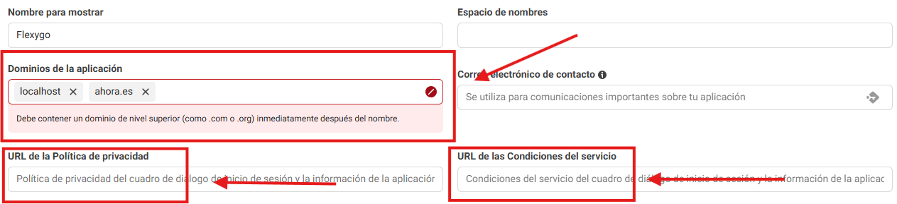

!!! warning "Política de privacidad"
    Debes proporcionar una URL para la **Política de privacidad** y los **Términos del servicio**.

### 2. Endpoint de Webhooks

Añade el producto **Webhooks** a tu aplicación y configura el endpoint para **Whatsapp Business Account**.

Completa los siguientes campos:

* URL de callback: **Tu dominio** + `/webhook/guest/FlxWhatsapp`
* ID de verificación: Introduce una contraseña que usaremos más adelante. (Lo vemos en el siguiente punto)

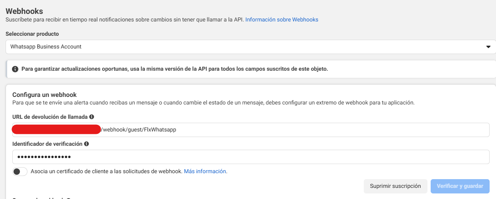

Asegúrate de estar suscrito al campo **messages**.

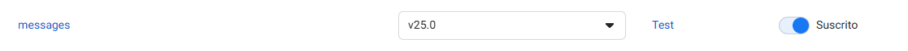

!!! info "Configuración en Flexygo"
    Antes de hacer clic en Verificar y guardar, **completa primero la configuración en Flexygo** y, cuando esté lista, vuelve para verificar.

## Configuración en Flexygo

Abre las <flx-navbutton class="link" type="openpagename" pagetypeid="list" pagename="syspage-edit-settings" objectname="sysSettings" objectwhere="GroupName='flx-whatsapp'" defaults="" targetid="popup1400x600" excludehist="true">configuraciones de WhatsApp Business</flx-navbutton> en Flexygo y rellena los campos:

### Usuario por defecto

(Identificado como `WhatsApp_DefaultAnswerUser`)

Completar este campo determina qué **usuario se asignará por defecto** a los contactos que se creen a partir de ahora. Se usa para determinar el idioma de los mensajes del sistema y la ejecución de la IA.

Si lo dejas vacío:

1. Se buscará el primer **usuario que tenga el mismo número** que el contacto.
2. Si se encuentra, se le asignará ese.
3. Si no se encuentra, se le asignará el usuario guest.

### Asistente de IA por defecto

(Identificado como `WhatsApp_DefaultAssistantAI`)

Rellenar este campo determinará que **asistente de IA se le asignará por defecto** a los contactos que sean creados de ahora en adelante.
Dejarlo vacío supondrá:

1. Se buscará el **asistente por defecto del rol** del usuario que tenga asignado.
2. Si se encuentra, se le asignará ese.
3. Si no se encuentra, la IA no podrá responder a este contacto.

### Token de Acceso

(Identificado como `WhatsAppAccessToken`)

Token necesario para enviar mensajes.

* Generar un **Identificador de Acceso del Sistema** desde [Meta Business Suite](https://business.facebook.com/latest/settings){:target="_blank"}, lo puedes hacer en el apartado Usuarios del sistema.

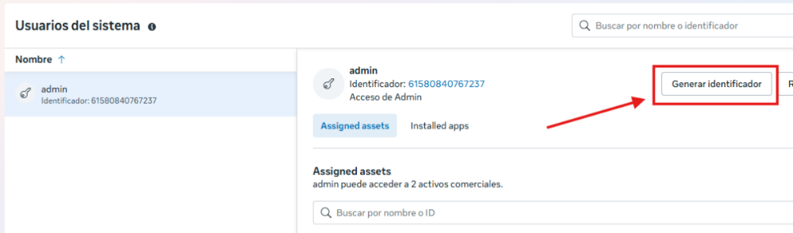

### ID de la Aplicación

(Identificado como `WhatsAppAccountId`)

Necesario para refrescar el token mediante OAuth.

### Client Secret

(Identificado como `WhatsAppClientSecret`)

Necesario para verificar la firma de los webhooks. Este y el anterior, puedes encontrarlos en el apartado de Información Básica dentro de la **Configuración de la aplicación** de [tu aplicación de WhatsApp Business](https://developers.facebook.com/apps){:target="_blank"}:

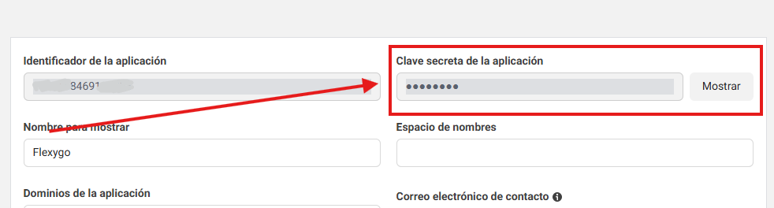

### ID de la Cuenta e ID del Teléfono

(Identificados como `WhatsAppApplicationId` y `WhatsAppPhoneId`)

Necesarios para enviar mensajes. En tu aplicación, ve a **Products** > **WhatsApp** > **API Setup**.

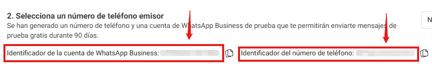

### ID de Verificación

(Identificado como `WhatsAppVerificationId`)

Necesario para verificar ante WhatsApp tu endpoint de Webhooks. Debe ser **el mismo que indicaste en el [Apartado de Webhooks](./#2-endpoint-de-webhooks)**.

### Verificación de la firma

(Identificado como `WhatsAppVerifySignature`)

Tener esta opción activada **rechaza todas las peticiones** que se hagan al endpoint de Webhooks y **solo acepta las que vengan de los servidores de Meta**.

Por defecto está activada, y solo conviene desactivarla para poder enviar peticiones de prueba a nuestro endpoint.

## Efectos de la Integración

Una vez rellenes las <flx-navbutton class="link" type="openpagename" pagetypeid="list" pagename="syspage-edit-settings" objectname="sysSettings" objectwhere="GroupName='flx-whatsapp'" defaults="" targetid="popup1400x600" excludehist="true">configuraciones de WhatsApp Business</flx-navbutton> en Flexygo, **refresques cache** y recarges la página, se activará la integración entre WhatsApp Business y Flexygo. Esto activará lo siguiente:

* Aparecerá un **botón con el icono de WhatsApp** en la barra de navegación superior. Al clicarle te llevará directamente a <flx-navbutton class="link" type="openpagename" pagetypeid="list" pagename="7df84455-fa8e-4e90-a99c-ccce9dede1e7" objectname="" objectwhere="" defaults="" targetid="popup1500x2000" excludehist="false"> <a>la página de WhatsApp de Flexygo</a> </flx-navbutton>.

* Se activará la tarea de Cron `WhatsAppActivateInactiveConversations` que cada día buscará aquellas conversaciones cuyo **último mensaje tiene más de 24 horas**, tienen un **asistente de IA asignado** y se encuentran en modo manual. Esta tarea las pasará a modo automático.

* Se recomienda activar la tarea de Cron `RefreshWhatsAppAccessToken`, para no tener que preocuparse de generar nuevos tokens. Revisa la duración de tu [Token de Acceso](./#token-de-acceso), y modifica cada cuanto se ejecutará para satisfacer tu caso concreto. Por ejemplo, si el token dura 60 días, ejecútalo cada 59 días ya que si llega a expirar, la actualización no funcionará.

* Se activará la tarea de Cron `WhatsApp_ClearLogs`, encargada de eliminar los registros antiguos de la tabla con el objetivo de liberar memoria. El período de retención predeterminado es de 60 días, aunque puede modificarse mediante la configuración `ClearWhatsAppLogDays`.

* Se activará la tarea de Cron `WhatsApp_ClearMessages`, encargada de eliminar los mensajes antiguos de la tabla con el objetivo de liberar memoria. El período de retención predeterminado es de 60 días, aunque puede modificarse mediante la configuración `ClearWhatsAppMessageDays`.

## Uso básico

Una vez configurado, puedes enviar y recibir mensajes desde <flx-navbutton class="link" type="openpagename" pagetypeid="list" pagename="7df84455-fa8e-4e90-a99c-ccce9dede1e7" objectname="" objectwhere="" defaults="" targetid="popup1500x2000" excludehist="false"> <a>la página de WhatsApp de Flexygo</a> </flx-navbutton>.

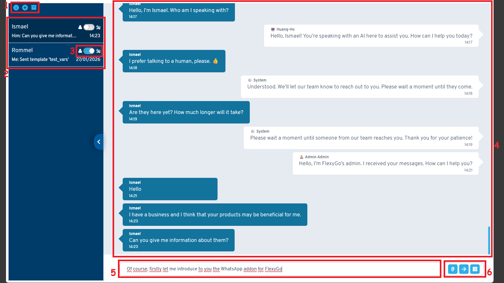

1. **Opciones de la barra de navegación**. Puedes abrir la ayuda, crear un nuevo contacto y alternar entre conversaciones activas y archivadas.
2. **Listado de para poder cambiar entre conversaciones**.
3. **Botón de alternancia** entre modo manual (apagado) y automático (encendido).
4. **Mensajes** de la conversación seleccionada.
5. **Caja de texto para escribir mensajes**.
6. **Opciones de envío**. Contiene los botones para adjuntar archivos, enviar mensajes de texto y otros tipos de mensajes.

## Modo automático y manual

Una conversación puede estar en 2 modos: **automático** o **manual**. Se puede cambiar una conversación de un modo a otro en cualquier momento desde el **botón de alternancia** que disponen en el listado de conversaciones. 

* En el modo manual: Solo se podrán enviar mensajes desde la interfaz.

* En el modo automático:
    1. Si tiene un asistente de IA **asignado** y **activado**, responderá la IA a cada mensaje que nos llegue de ese contacto.
    2. Si no lo tiene, recibirá mensajes predefinidos pidiendole que espere hasta que le responda alguien. (Se usará el idioma del usuario asignado).

## Contactos / Conversaciones

Hay 2 formas de que crear un nuevo contacto.

1. **Recibir un mensaje de un número nuevo**, en cuyo caso automáticamente se creará un contacto con ese número.
2. **Manualmente**, en cuyo caso deberás indicar un número, un nombre y una plantilla de mensaje (Esto se debe a que WhatsApp Business solo permite iniciar una conversación enviando un plantilla aprobada).

Una vez creado, puedes archivar la conversación o editar el contacto: 

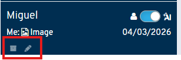

## Tipos de mensajes

WhatsApp admite varios tipos de mensajes, agrupados por patrón de uso. Podemos dividirlos en 4 tipos:

### Archivos

Se envían desde el botón de adjuntar archivos, se permiten estas extensiones:

| Tipo     | Extensiones                          |
|----------|--------------------------------------|
| Imágenes | .jpeg, .png                         |
| Documentos | .txt, .xls, .xlsx, .doc, .docx, .ppt, .pptx, .pdf |
| Audio    | .aac, .amr, .mp3, .mp4, .ogg        |
| Video    | .3gp, .mp4                          |

### Mensajes sin cuerpo

Son aquellos que no contienen un array de elementos, simplemente rellenas sus campos necesarios y los puedes enviar. 
También tienes la opción de **crear el mensaje como objeto** para así poder reutilizarlo fácilmente en otras ocasiones. 
(Texto, URLs, Ubicación, Solicitud de Ubicación y Contacto).

### Mensajes con cuerpo

Son aquellos que **SÍ** contienen un array de elementos, además de rellenar sus campos necesarios necesitas añadir uno o más elementos a su cuerpo.
Para este tipo de mensajes, es **obligatorio crear el mensaje como objeto siempre** antes de enviarlo.
(Listados y Botones de respuesta)

### Plantillas

Son mensajes predefinidos que deben ser creados desde [Meta Business Suite](https://business.facebook.com/latest/settings){:target="_blank"} y aprobados por Meta.

Algunos aceptan variables, así que se deberan rellenar siempre antes de enviarlas.

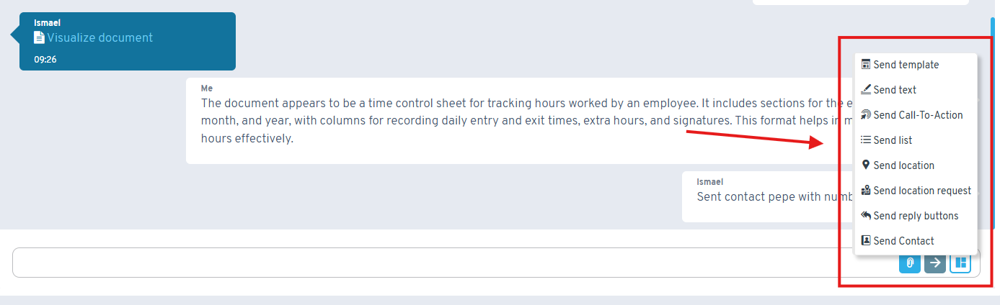

## Flujo básico

**Recibir mensajes**:

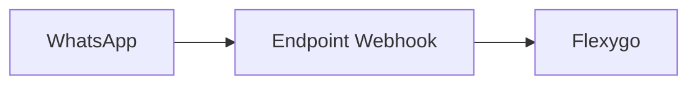
```mermaid
flowchart LR
    A[WhatsApp] --> B[Endpoint Webhook]
    B --> C[Flexygo]
```

**Enviar mensajes**:

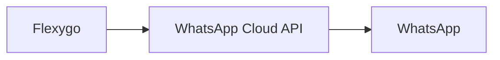
```mermaid
flowchart LR
    A[Flexygo] --> B[WhatsApp Cloud API]
    B --> C[WhatsApp]
```

## Reglas y Limitaciones

* Cuando se manda un mensaje manualmente, la conversación se **cambia siempre** a modo manual.
* Los asistentes de IA dentro del ámbito de WhatsApp:
    - Reciben automáticamente la capacidad de **generar los tipos de mensajes soportados**.
    - Pueden detectar cuando el usuario prefiere hablar con un humano y **auto-desactivarse**. Se envía una notificación avisando cuando el usuario prefiere hablar con un humano.
    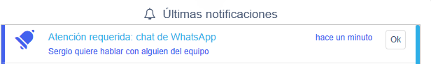
* Al archivar una conversación, la conversación se **cambia siempre** a modo automático y se activa su asistente de IA (si tiene).
* Para iniciar una conversación manualmente, **solo se pueden enviar plantillas**.
* Si han pasado más de 24 horas desde el último mensaje del usuario, **solo se pueden enviar plantillas** hasta que nos conteste.
* El envío y recibo de mensajes está sujeto a los [precios de Meta para WhatsApp Business](https://developers.facebook.com/documentation/business-messaging/whatsapp/pricing){:target="_blank"}.

## Consideraciones de Seguridad

* Nunca compartas ni dejes visible ningún token, ID o secreto.
* Recuerda tener activada la **Verificación de firma** en la <flx-navbutton class="link" type="openpagename" pagetypeid="list" pagename="syspage-edit-settings" objectname="sysSettings" objectwhere="GroupName='flx-whatsapp'" defaults="" targetid="popup1400x600" excludehist="true">configuración de Flexygo</flx-navbutton> cuando no estés haciendo pruebas.
* Revisa concienzudamente a que información sensible y a que procesos tienen acceso los asistentes de IA antes de asignarlos a una conversación.

## Solución de problemas

Si en algún momento dejas de poder recibir/enviar mensajes comprueba lo siguiente:

* Haz una petición GET a esta URL para comprobar el estado de tu cuenta. Si se indica algún fallo, deberás solucionarlo.

<fh-copy>https://graph.facebook.com/v25.0/{{ID de la cuenta}}?fields=health_status</fh-copy>

!!! warning "Tu ID de cuenta"
    Reemplaza **[ID de la cuenta](#configuracion-en-flexygo)** por el valor correspondiente.

* Comprueba en [tu aplicación de WhatsApp Business](https://developers.facebook.com/apps){:target="_blank"} dentro de **Productos** > **WhatsApp** > **Tests de la API** > **7. Consulta los eventos del webhook** que webhooks le están llegando a la plataforma en lo que respecta a nuestra actividad.

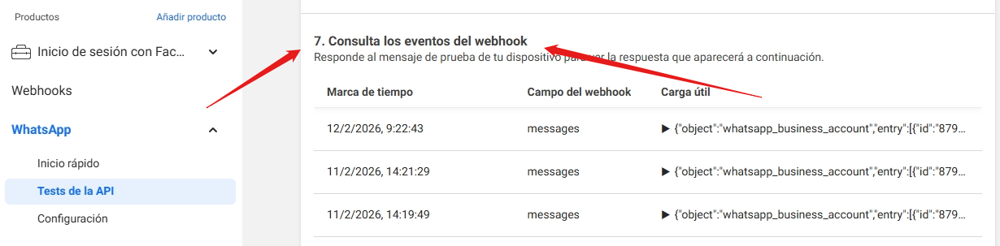

Causas comunes de fallos en envío/recepción:

| Error | Comprobación rápida |
|---|---|
| Token expirado | Regenera el token o ejecuta la tarea de Cron de refresco de token. |
| Webhook no verificado | Verifica que la callback URL y el token de verificación coinciden con tu configuración. |
| ID incorrecto | Confirma los valores de Account ID y Phone ID en la configuración. |
| Firma inválida | Revisa el Client Secret y mantén activada la verificación de firma. |
| Número no aprobado | Asegúrate de que el número emisor está aprobado en Meta. |
| Negocio no verificado | Completa la verificación de negocio en Meta Business Suite. |
| Cuenta bloqueada | Revisa el estado de salud de la cuenta y posibles restricciones en Meta. |

Recuerda que siempre puedes contactar con el [soporte oficial de WhatsApp Business](https://developers.facebook.com/documentation/business-messaging/whatsapp/support){:target="_blank"}.

Para más información técnica, consulta la [documentación oficial de WhatsApp Business](https://developers.facebook.com/documentation/business-messaging/whatsapp/overview){:target="_blank"}.