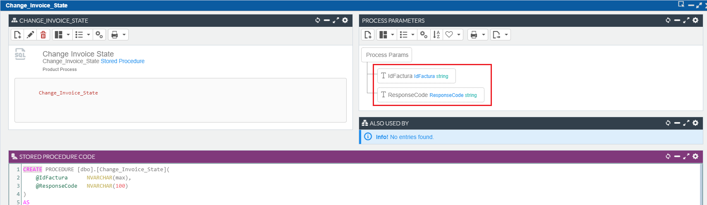
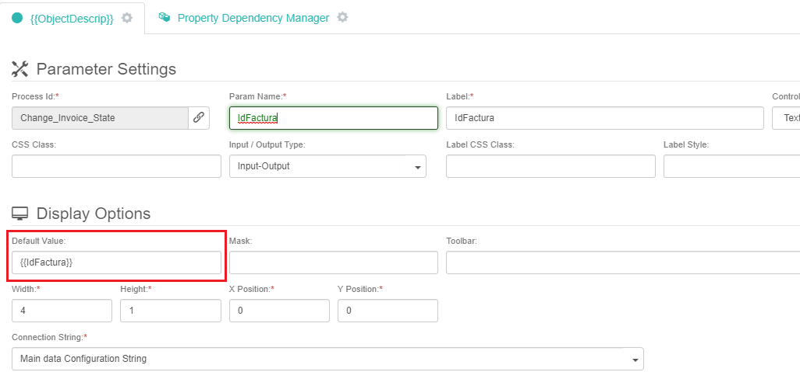
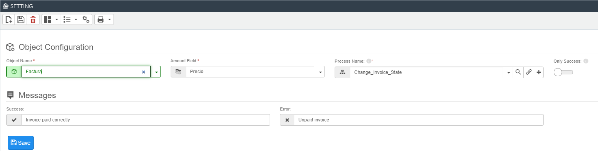
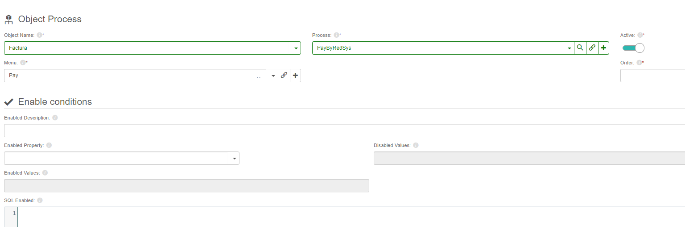

# RedSys { .fh-title-with-image }

{ .fh-image-of-title }

**Redsys** is a secure virtual payment platform that you can apply to e-commerce to offer your customers/clients credit and debit card payments from different banks. **Flexygo** has the ability to make payments through this platform.

## Flexygo Settings

In the following steps we'll explain how to realize integration with the **RedSys** platform.

Configure the following <flx-navbutton class="link" type="execprocess" processname="sysEditSettings" objectname="sysSettings" objectwhere="(Settings.[GroupName]='flx-payments')"  showprogress="false">flexygo settings</flx-navbutton>:

| Setting | Description |
| --- | --- |
| `Payments_Redsys_Currency` | The currency you use in your transactions ISO-4271 code, like for example euros would be <fh-copy>978</fh-copy>. You can find every currency code [here](https://es.iban.com/currency-codes) |
| `Payments_Redsys_MerchantCode` | It is the **FUC code** assigned to your business and which your bank should have provided to you by mail when you registered your Virtual POS |
| `Payments_Redsys_MerchantKey` | The **redsys signature key** you'll find at the merchant configuration section with the see key button |
| `Payments_Redsys_SignatureVersion` | It is a constant that indicates the signature version being used, normally <fh-copy>HMAC_SHA512_V2</fh-copy> |
| `Payments_Redsys_Terminal` | This is the **terminal number** of the merchant you will be using. It should be next to the merchant number sent to you by your bank and, in most cases, it is <fh-copy>001</fh-copy> |
| `Payments_Redsys_Transaction` | This is the type of operation that will be performed, normally 0. You can get more info [here](https://pagosonline.redsys.es/desarrolladores-inicio/integrate-con-nosotros/parametros-de-entrada-y-salida/) in the transaction type section |
| `Payments_Redsys_URL` | The URL which the user will be redirected when buying, it should be <fh-copy>https://sis.redsys.es/sis/realizarPago</fh-copy> or <fh-copy>https://sis-t.redsys.es:25443/sis/realizarPago</fh-copy> for testing as stated [here](https://pagosonline.redsys.es/desarrolladores-inicio/documentacion-operativa/operacion-autenticacion/) |

## Process Configuration

To handle the result of the payment transaction returned after a payment, you must configure a **process** in which you can do whatever with the values it returns. It can be a **Stored** or **DLL process**.

The process can receive as parameter the fields of the parsed object or response param. To receive the response, you must include a parameter in your process with the name of `ResponseCode`.

## Redsys Settings

You'll also need to configure the <flx-navbutton class="link" type="openpage" pagetypeid="list" objectname="RedSys_Settings">RedSys settings</flx-navbutton>.
    

| Setting         | Description |
|-----------------|-------------|
| **Object Name** | Name of the object that contains the price and is related to Redsys |
| **Process Name** | The process that will be executed after making the payment through Redsys, mentioned in the [section above](#process-configuration) |
| **Amount Field** | Object field that specifies the price |
| **Success Message** | Message if process runs successfully |
| **Error Message** | Message if process runs incorrectly |
| **Only Success** | Check it if you want to run the process only if the payment is successful, if not it will run on success and on error |

## Linking Redsys Process

To finish the configuration you'll need to link the standard <fh-copy>PayByRedsys</fh-copy> payment process, not the same as the one set in the section above, to an object. You can do that <flx-navbutton class="link" type="openpage" pagetypeid="list" objectname="sysObjectProcesses" objectwhere="Objects_Processes.ObjectName in (Select ObjectName from Objects where offline=0)">here</flx-navbutton>.

Also, you could generate your own DLL process and call the standard payment process <fh-copy>FLEXYGO.PaymentsProcess.PayRequest</fh-copy>. The process receives the object as a parameter and optionally a quantity field. If the quantity field is not specified, the price will be obtained from the field informed in the relationship of the object with RedSys.

## Logs

All transactions carried out with **RedSys** are registered in <flx-navbutton class="link" type="openpage" pagetypeid="list" objectname="RedSys_Logs" showprogress="false">RedSys Logs</flx-navbutton> where the status and the response received are stored.

!!! info "Response codes"
    To know the meaning of the response codes, visit the following [link](https://pagosonline.redsys.es/desarrolladores-inicio/integrate-con-nosotros/parametros-de-entrada-y-salida/).

## Tests

**RedSys** has a test environment where the correct functioning of the system can be verified before making the implementation in the real environment. For more information visit the following [link](https://pagosonline.redsys.es/desarrolladores-inicio/integrate-con-nosotros/tarjetas-y-entornos-de-prueba/).