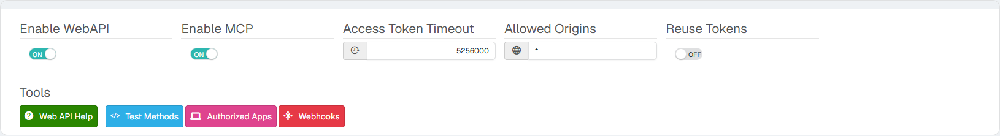
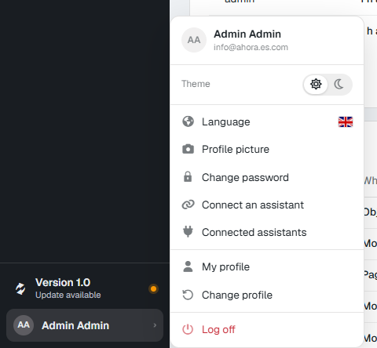
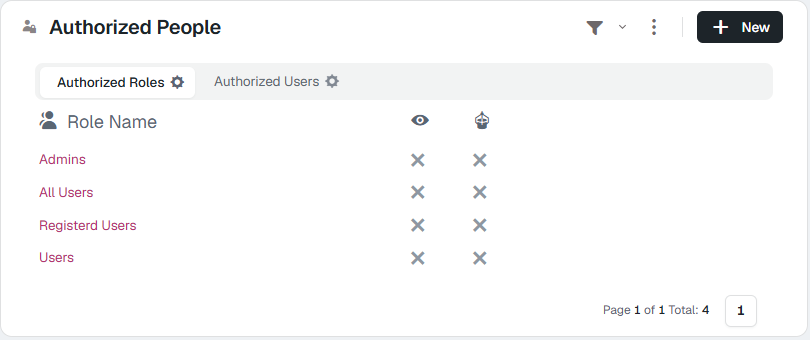
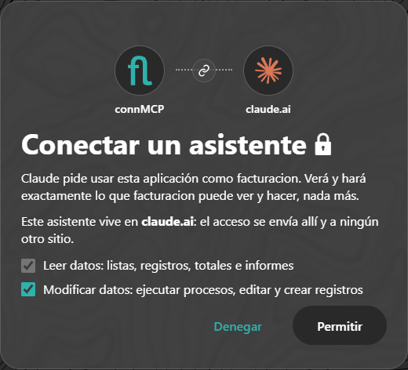
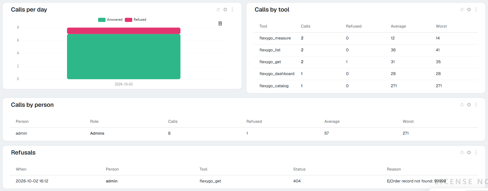
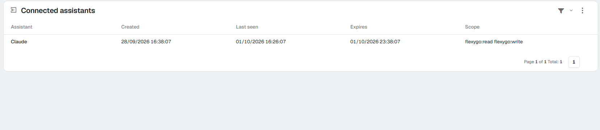

# Pruébalo: un asistente de IA trabajando con tu aplicación (MCP) <span class="fh-version-tag" title="Disponible desde la versión 10">10.0+</span>

En unos quince minutos tendrás a Claude (o a otro asistente) conectado a una aplicación Flexygo **con tu usuario**: le preguntarás por tus datos en lenguaje normal —«¿cuántos pedidos hay por estado?», «enséñame el cliente 1», «hazme un tablero de ventas»— y te contestará leyendo la aplicación con tus permisos, ni uno más. Al final verás cada pregunta registrada en la propia aplicación y sabrás cortar la conexión.

Esta página es el **camino corto para probarlo**. Qué hace cada pieza, todos los ajustes y la seguridad están en la referencia: [Asistentes de IA (MCP)](2Reference.md).

---

## Lo que necesitas

| | |
|---|---|
| **Una aplicación Flexygo de la versión 10** | Vale una instalación local de desarrollo. Entra con un usuario **administrador**. |
| **Un objeto con datos** | Cualquiera que ya tengas (pedidos, clientes, incidencias…). En los ejemplos de esta página es un objeto *Order* con su estado y su total. |
| **Un asistente que hable MCP** | Lo más rápido para probar en local es **Claude Code**. Claude (web o escritorio) y ChatGPT también sirven, pero necesitan llegar a la aplicación por internet con HTTPS (paso 5). |

---

## 1. Enciende la web API y el MCP

En el panel de control, área **Security → WebAPI**, enciende **Enable WebAPI** y **Enable MCP**. Vienen apagados de serie.



**Comprueba**: en tu menú de perfil aparecen **Connect an assistant** y **Connected assistants**. Si no salen, sal y vuelve a entrar.

{ width="320" }

## 2. Date permiso para conectar un asistente

En la misma pantalla, panel **Authorized People**, pestaña **Authorized Roles**: marca la **columna del robot** en tu rol (por ejemplo *Admins*). Es un permiso aparte del de la web API (el ojo): para esta prueba no hace falta el ojo.



**Comprueba**: **Connect an assistant** abre una página con la dirección de tu aplicación para copiar. Si dice que no tienes permiso, falta el robot en tu rol (o en tu usuario, pestaña *Authorized Users*).

## 3. Enseña al asistente lo que puede usar

En el panel **Authorized Data**, pestaña **Authorized Objects**, marca en tu objeto el **ojo** (ver un registro) y la **lista** (ver la colección). Si quieres que también pueda modificar, marca crear o editar; para una primera prueba basta con leer.

**Lo que no marques no existe para el asistente.** Es la forma de decidir qué parte de la aplicación queda al alcance de la IA.

## 4. Explícale qué es tu aplicación

El asistente acierta tanto como buenas sean las descripciones. Para la prueba, dos minutos:

- **Ajustes → `ApplicationDescription`**: qué es la aplicación y el vocabulario de tu negocio. Por ejemplo: *«Gestión de ventas: pedidos (estados Borrador, Confirmado, Enviado, Facturado, Anulado) y clientes. "Facturación" es la suma del Total de los pedidos no anulados.»*
- **La descripción de IA del objeto** (*AI description*, en la ficha del objeto) y, en los campos codificados, su **Description in API** (*«Estado del pedido: DRAFT, CONFIRMED, SHIPPED, INVOICED o CANCELLED»*).

Sin esto funciona igual, pero el asistente adivina qué significan tus columnas. La lista completa de lo que lee, con su tabla y su columna, y un prompt para que una IA te lo proponga a partir de tu base de configuración, en [Lo que hay que rellenar](2Reference.md#1-bis-lo-que-hay-que-rellenar-para-que-el-asistente-acierte).

## 5. Conecta el asistente

Abre **Connect an assistant** y copia la dirección (la de tu aplicación terminada en `/mcp`).

=== "Claude Code (local)"

    ```bash
    claude mcp add --transport http miapp http://localhost:7111/mcp
    ```

    Cambia la dirección por la que has copiado. Dentro de Claude Code, escribe `/mcp`, elige `miapp` y pulsa **Authenticate**: se abre el navegador.

=== "Claude web o escritorio"

    *Ajustes → Conectores → Añadir conector personalizado*, con un nombre y la dirección. Necesita que la aplicación se vea desde internet con HTTPS (quien se conecta son los servidores de Anthropic): en una prueba local, un túnel (ngrok o similar) hacia el Frontend. Ver [Proxy inverso](../../1Deployment/6ReverseProxy/index.md).

=== "Otros (ChatGPT, Gemini…)"

    En sus conectores, la misma dirección. Cualquier cliente MCP con *streamable HTTP* y OAuth sirve: se registra solo al conectar.

En el navegador **entras con tu usuario de siempre** y ves la página de consentimiento: quién pide, con qué usuario y qué se concede. Pulsa **Permitir** (puedes desmarcar *Modificar datos* para que solo lea).



**Comprueba**: el asistente dice que está conectado (en Claude Code, `/mcp` lo muestra como *connected*).

## 6. Pregúntale

Algunas preguntas para ver cada cosa, con tus nombres en lugar de los del ejemplo:

| Pregunta | Qué debería pasar |
|---|---|
| «¿Qué hay en esta aplicación?» | Lee el catálogo y te resume tus objetos **con tus descripciones**. Si solo ve el objeto que marcaste en el paso 3, la seguridad funciona. |
| «¿Cuántos pedidos hay por estado?» | Te da un recuento por estado. Compáralo con la lista en la aplicación: tiene que coincidir. |
| «¿Cuánto hemos facturado?» | Suma el Total de los no anulados, si lo explicaste en el paso 4. |
| «Enséñame el pedido 1» | La ficha con sus campos y un enlace para abrirla en la aplicación. |
| «Hazme un tablero de ventas» | Cifras, desgloses y una tabla. En Claude web o escritorio sale como un tablero interactivo; en los demás, como texto y tablas. |
| «Cambia el estado del pedido 1 a Confirmado» | Si no marcaste editar en el paso 3, o desmarcaste *Modificar datos* al conectar, se niega y te dice por qué. |

## 7. Mira lo que ha pasado

En el panel de control, área **Environment**:

- **MCP usage**: llamadas por día (respondidas y rechazadas), por herramienta y por persona, y el motivo de cada rechazo.
- **MCP sessions**: tu conexión viva, con quién, desde cuándo y qué puede hacer.



## 8. Corta la conexión

Menú de perfil → **Connected assistants** → **Revoke** en la fila. La siguiente pregunta del asistente recibe una negativa. Para volver, se conecta otra vez (paso 5).



Y si apagas **Enable MCP** (paso 1), `/mcp` deja de existir para todos al momento.

---

## Si algo no sale

| Lo que ves | Por qué | Qué hacer |
|---|---|---|
| El asistente no conecta y la dirección da *404* | **Enable MCP** (o **Enable WebAPI**) apagado | Paso 1 |
| La página de conectar o el consentimiento dicen que no tienes permiso | Falta el robot en tu rol o en tu usuario | Paso 2 |
| El asistente dice que el objeto no existe | No está marcado en *Authorized Data* | Paso 3 |
| Contesta, pero confunde campos o estados | Faltan descripciones | Paso 4 |
| Claude web o escritorio no llega a la aplicación | No es accesible desde internet con HTTPS | Paso 5: túnel o proxy inverso |
| Las escrituras se rechazan | Sin editar/crear en *Authorized Data*, o *Modificar datos* desmarcado al conectar | Es lo esperado: márcalo y vuelve a conectar si quieres probarlas |
| El asistente no aparece en *MCP assistants* como aprobado | `MCP_RequireApprovedClients` está encendido | Apruébalo en **MCP assistants** |

Para todo lo demás —topes de llamadas, prompts, auditoría, buenas prácticas— la referencia: [Asistentes de IA (MCP)](2Reference.md).
