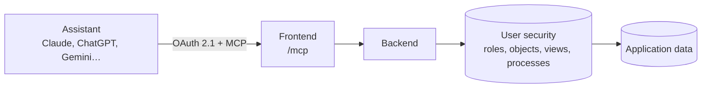

# AI assistants connected to the application (MCP) <span class="fh-version-tag" title="Available since version 10">10.0+</span>

Since version 10, **every Flexygo application is also an MCP server**: an AI assistant (Claude, ChatGPT, Gemini, Claude Code or any other client that speaks the *Model Context Protocol*) connects to the application with the usual user and **sees and does exactly what that user can see and do, nothing more**. Nothing has to be programmed in the application: the assistant reads the objects, views, processes and reports that already exist, with their descriptions, and works with them in the user's language.

Want to try it in fifteen minutes? [Try it: an AI assistant working with your application](1TryIt.md).

!!! note "This is not the builder's MCP server"
    The [MCP](../../2ProductDevelopment/MCP/2Usage.md) section of this documentation describes the server that **builds** applications from VS Code. This page describes the opposite: the already built application, exposed to its **users'** assistants.



---

## 1. What an assistant can do

Everything goes through the security of the user who connected: their roles, the objects and views they can see, the processes they can run and what the application exposes in its web API. An object the role cannot see does not exist for the assistant; a write the role cannot perform is rejected with a sentence in the user's language.

| What the person asks | What the assistant does | With what |
|---|---|---|
| "What is in this application?" | Reads the catalog: objects, views and processes **with the descriptions the team wrote**, and the business vocabulary (what "overdue", "not invoiced"… mean). | `flexygo_catalog`, `flexygo_schema` |
| "Search for García" / "What do we have on Acme?" | Searches the text across all objects with the application's **global search** (the fields and lookups the team configured in each generic search), grouped by object and with the link to each record. It is the first thing it does when the person names someone or something rather than the object. | `flexygo_search` |
| "Give me García's overdue invoices" | List with field filters, paging and sorting; lookup fields come with their text (`_flxtext`), not just the id. | `flexygo_list` |
| "Show me order 1020" | The full record with its children (lines, deliveries…) and the link to open it in the application. | `flexygo_get` |
| "How much have we invoiced this month by payment method?" | Totals, counts, averages and breakdowns by a field, or by period (day, week, month). If there is a view that already calculates it, it uses it first. | `flexygo_measure` |
| "Build me a sales dashboard" | A dashboard with figures, breakdowns, series and tables; in clients that render **MCP Apps** (claude.ai, Claude Desktop) it appears as an interactive widget with click-through to the list, CSV export and "Open in Flexygo". | `flexygo_dashboard` |
| "Download the invoice as a PDF" | The object's report (DevExpress or Crystal) as PDF or Excel, and the link to the application's viewer. | `flexygo_report` |
| "Mark invoice 3 as paid" | Runs the object's process with its parameters; if any is missing, it asks for it. | `flexygo_exec` |
| "Change customer 5's phone number" / "Create a delivery for order 10" | Modifies or creates records, only in the objects the web API exposes for editing or creating. | `flexygo_update`, `flexygo_create` |

In addition, the assistant receives:

- **Resources**: the application description (`flexygo://application`), each object's schema (`flexygo://{objeto}/schema`) and any record (`flexygo://{objeto}/{id}`).
- **Prompts**: the typical tasks the team writes in the **MCP prompts** screen ("customer summary", "pipeline of the month"…), which the client offers as shortcuts.
- **Autocompletion** of object, view and process names.

!!! tip "The assistant is as good as the descriptions"
    What governs the model is the **metadata**: each object's AI description (*AI description*), each property's description for the API (*Description in API*, and *Show values in API* so coded values travel with their text), the descriptions of views and processes, and the **`ApplicationDescription`** setting (what this application is, and for whom). An object without a description is used badly or not at all.

---

## 1 bis. What to fill in so the assistant gets it right

The assistant does not see the screens: it sees the configuration **metadata**. These are the ones it reads, from most to least important. The ones at the top are, in practice, mandatory.

| | What | Table · column | Where it is filled in | What the assistant uses it for |
|---|---|---|---|---|
| **Essential** | What the application is, for whom, and its vocabulary | `Settings` · `SettingValue` of **`ApplicationDescription`** | *Settings*, *WebAPI* group | It is the first thing it reads when connecting (`initialize` instructions, `flexygo://application` resource and `flexygo_catalog` header). This is where the business definitions go: what "revenue", "overdue", "active customer" mean |
| **Essential** | Which objects it sees and what it can do with them | `WebAPI_Objects` (`CanView`, `CanViewCollection`, `CanInsert`, `CanEdit`, `CanDelete`, `CanPrint`), `WebAPI_Views` and `WebAPI_Processes` · `CanView` | **WebAPI** tool, *Authorized Data* | What is not exposed does not exist for the assistant |
| **Essential** | What each object is | `Objects` · **`AIDescrip`** (if empty, it uses `Descrip`) | Object form, *AI description* | Choosing the right object for each question. One sentence with what it stores, what statuses it has and how it relates |
| **Highly recommended** | What each coded field means | `Objects_Properties` · **`DescriptionInApi`** | Property form, *Description in API* | Filtering and explaining fields such as `StateId` or `Type`: the possible values and what they mean |
| **Highly recommended** | That codes travel with their text | `Objects_Properties` · **`ShowValuesInApi`** | Property form, *Show values in API* | For combos, the assistant receives the allowed values with their text and answers "Invoiced" instead of "INV" |
| **Highly recommended** | What each view is for | `Objects_Views` · **`Descrip`** | View form | Using a view that already calculates what was asked (totals, pending items) rather than adding it up itself |
| **Highly recommended** | What each process does and its parameters | `Processes` · **`ProcessDescrip`**; `Processes_Params` · **`Label`** and **`DescriptionInApi`** | Process form and its parameters | Knowing when to run it and what to ask the person |
| Recommended | What each report is | `Reports` · **`ReportDescrip`** | Report form | Choosing the report when asked for a PDF or an Excel file |
| Recommended | How each object is searched by text | `Objects_Search` (`Generic` = 1) and `Objects_Search_Properties` | The object's generic searches | `flexygo_search` ("search for García") only finds results in objects with a generic search |
| Recommended | Fields that must not be shown | `Objects_Properties` · **`WebApiHidden`** | Property form | What is hidden is neither listed nor described to the assistant |
| Optional | Typical tasks, as shortcuts | `MCP_Prompts` (`PromptName`, `Title`, `Descrip`, `Template`) | *MCP prompts* | The client offers them as buttons: "monthly summary", "customer at risk" |
| Optional | Readable labels | `Objects` · `Descrip`; `Objects_Properties` · `Label` | Object and property forms | What it sees in the results instead of the technical names |

All of this is product configuration: it is written with the **project origin** active so that it travels in its scripts. `ApplicationDescription` is a core setting, and it travels as an `UPDATE` in the exported project's `config.sql` ([Export as project](../../2ProductDevelopment/8ExportProject/2Reference.md)).

### A prompt for an AI to fill it in

Filling in these fields by hand in an application with dozens of objects takes time. An assistant with **read** access to the configuration database (for example, the [builder's MCP](../../2ProductDevelopment/MCP/2Usage.md) in VS Code, or a SQL query) can propose them. This prompt tells it what to look at, where it is and how to work out what the application is for; what it returns is a script for you to review, not changes already made.

```text
You are an analyst preparing a Flexygo application to be used by AI assistants through MCP.
Work ONLY by reading the configuration database (ConfConnectionString) and the data database (DataConnectionString),
and give me a SQL script for me to review. Do not execute any write.

1. Find out what the application is for:
   - Objects (ObjectName, Descrip, TableName, ConnStringID) with OriginId = the project origin
     (SELECT dbo.funNet_GetOrigin()): the product's own objects.
   - Navigation_Nodes (Title, ObjectName, PageName): how the menu is organized.
   - Objects_Properties (ObjectName, PropertyName, Label, TypeId, SQLSentence): the fields and their combos.
   - Objects_Objects (the relationships between objects), Processes (ProcessName, ProcessDescrip) and Reports.
   - In the data database, the tables of those objects: TOP 20 rows of each and the distinct values of
     the status or type columns, to understand the real vocabulary.
2. Write Settings.ApplicationDescription (SettingName = 'ApplicationDescription'): 4-8 sentences with what it is,
   for whom, the main objects and the business definitions you can deduce (what counts as
   invoiced, open, overdue…). Mark with [review] anything you cannot confirm with the data.
3. For each object exposed in WebAPI_Objects: Objects.AIDescrip, one sentence with what it stores, its statuses
   and what it relates to.
4. For each coded property (combo, status, type, foreign key) of those objects:
   Objects_Properties.DescriptionInApi with the values and their meaning, and ShowValuesInApi = 1.
5. Objects_Views.Descrip of each view in WebAPI_Views; Processes.ProcessDescrip and
   Processes_Params.DescriptionInApi of each process in WebAPI_Processes; Reports.ReportDescrip of the
   reports of the objects with CanPrint.
6. Propose 3 MCP_Prompts rows with the tasks that make the most sense for these users.

Script rules:
- Only UPDATE (and INSERT in MCP_Prompts), one per row, with N'...' and quotes doubled.
- Never touch rows with OriginId = 0 except the ApplicationDescription setting.
- Do not change a value that is already filled in: propose it in a comment next to it.
- In English if the application is in English; otherwise in the language of its labels.
- At the end, a list of what you could not deduce and need me to confirm.
```

---

## 2. Setting it up (administrator)

1. **Enable the web API and the MCP endpoint** in the **WebAPI** tool (*Security* area of the [control panel](../Administration/ControlPanel.md)): the **Enable WebAPI** and **Enable MCP** switches, which are the `WebAPI_Enabled` and `MCP_Enabled` settings (also in *Settings*, *WebAPI* group). Both are off by default: exposing the application to assistants is a team decision. Without `MCP_Enabled`, the `/mcp` route and its discovery documents return 404, as if they did not exist; the change takes effect immediately, without restarting. They are separate on purpose: the web API serves integrations (an ERP, an app, another system with its token) and MCP serves people's assistants, which is a different audience; you can have the first without the second, not the other way round.

    <figure markdown="span">
      
      <figcaption>Enable MCP, next to Enable WebAPI</figcaption>
    </figure>
2. **Grant the MCP permission** to the roles or users who may connect an assistant: in the **WebAPI** tool (*Security* area of the [control panel](../Administration/ControlPanel.md)), *Authorized People* panel, the **robot column**. It is a permission **separate** from the web API one (the eye column): a role can have assistants without the REST API, or the API for its integrations without assistants. As always, the user overrides their role. Removing the permission **instantly cuts** that person's live connections; a user without permission sees the refusal when trying to connect.

    <figure markdown="span">
      
      <figcaption>Per role (or per user, in the other tab): the web API and the assistants, each with its own switch</figcaption>
    </figure>
3. **Expose the objects** in the web API (*WebAPI objects*): which objects, views and processes the assistant sees, and whether it can **edit**, **create** or **print** each object. What is not exposed does not exist for it.
4. **Write the descriptions** (see the note above) and, if desired, the prompts in the **MCP prompts** screen.
5. **Review the generic searches** of the objects (those of the application's global search): they are the ones the assistant uses to search for text; an object without a generic search does not appear in `flexygo_search`.
6. Optional: adjust the limits (§5).

The application must be reachable by the assistant: for claude.ai or ChatGPT this means **the Frontend exposed on the internet with HTTPS** (with a reverse proxy in front, as described in [Reverse proxy](../../1Deployment/6ReverseProxy/index.md)); for Claude Desktop or Claude Code it is enough for the user's computer to reach the application.

---

## 3. Connecting an assistant (user)

With `MCP_Enabled` on, each person's **profile menu** has two new entries: **Connect an assistant** and **Connected assistants**.

<figure markdown="span">
  
  <figcaption>The two entries only appear if the installation has the MCP endpoint turned on</figcaption>
</figure>

**Connect an assistant** opens the `/mcp/setup` page: the application's address ready to copy, who the assistant will log in as and what it will be able to do, and where to paste it in each assistant (Claude, Claude Code with the command line already written, ChatGPT, Gemini and any other). If the person does not have the MCP permission, the page says so and does not show the address.

<figure markdown="span">
  { width="420" }
  <figcaption>The page speaks the browser's language</figcaption>
</figure>

<figure markdown="span">
  { width="420" }
  <figcaption>Without the MCP permission: the refusal and whom to ask</figcaption>
</figure>

The URL given to any assistant is the application's plus `/mcp`:

```
https://<tu-aplicacion>/mcp
```

| Client | Where the URL is pasted |
|---|---|
| **claude.ai** (web and mobile) | *Settings → Connectors → Add custom connector*: name and the URL. |
| **Claude Desktop** | *Settings → Connectors*, same as on the web. |
| **Claude Code** | `claude mcp add --transport http <nombre> https://<tu-aplicacion>/mcp` |
| **ChatGPT** | *Settings → Connectors*. The server also serves the two tools ChatGPT requires of a connector (`search` and `fetch`, in the shape OpenAI asks for) to accept it outside **developer mode** and in deep research; they are aliases of the search and the record, and the other assistants keep using the `flexygo_*` ones. |
| Any other MCP client | *Streamable HTTP* transport with OAuth 2.1; the client registers itself (dynamic registration) and discovers the rest. |

When connecting, the assistant opens the browser on the application. The person **logs in with their usual user** (with whatever SSO and two-step verification they have configured) and sees the consent page:

<figure markdown="span">
  
  <figcaption>The consent page: who is asking, as whom, where the access goes and what is granted</figcaption>
</figure>

What the page says, and why:

- **Who is asking and as whom**: the assistant's name and the user it is going to work as.
- **Where the access goes**: the domain to which the assistant receives the authorization (`claude.ai`, `chatgpt.com`, `localhost` for a client on the computer itself). It is the only thing a client **cannot make up**: it gives itself its own name when registering; the access only travels to the domain it registered. The assistant's branding is chosen by that domain, never by the name.
- **What is granted**: *Read data* always; *Modify data* (run processes, edit and create records) only if the assistant asked for it, and the person can **untick the box**. A read-only connection rejects any write with a clear sentence and keeps working for everything else.

<figure markdown="span">
  
  <figcaption>If the name passes itself off as a known assistant and the access would go elsewhere, the page says so and Deny becomes the main button</figcaption>
</figure>

After *Allow*, the assistant is connected: the access lasts **8 hours and renews itself** while it is used; a connection unused for **30 days** expires and you have to connect again.

To disconnect, the person has **Connected assistants** in their profile menu: their connections (only theirs), with the assistant, when it connected, the last time it was used, when it expires and what it can do; **Revoke**, in the row menu, cuts it. The connector can also be removed in the assistant itself, and an administrator can revoke any session (§6).

<figure markdown="span">
  
  <figcaption>Each person sees and cuts their own connections</figcaption>
</figure>

!!! warning "Confirmation of writes"
    Before running a process or changing a record, the application can ask the person for a confirmation **inside the assistant**, with the exact process, record and parameters. It is **off by default**: Claude Desktop declares that it handles that dialog and does not, and the call is left waiting. With the dialog off, the guarantee is the chat itself: the assistant says what it is going to do and does it when the person confirms. It is turned on, if the client handles it, with the environment variable `FLEXYGO_CONNECT_DIALOG=1` on the Backend.

---

## 4. Security

| Measure | What it does |
|---|---|
| **OAuth 2.1 with the application as authorization server** | Its own login (SSO and 2FA included), explicit consent, mandatory PKCE, 8-hour tokens with rotating refresh. The tables store only the hash of the tokens: a copy of the database does not open any session. |
| **Its own permission** | Connecting an assistant requires the MCP permission of the user or their role, separate from the web API one (§2). Removing it, or blocking the assistant in *MCP assistants*, instantly cuts live connections. |
| **The user's security, always** | Every call runs as the user who consented: roles, objects, views, processes, security filters. MCP adds no permissions. |
| **Bounded filters** | An SQL filter from the assistant can only name tables of objects the role can see; anything else is rejected in words. |
| **Read and write scopes** | `flexygo:read` and `flexygo:write`; the person decides on the consent page. |
| **Per-session limits** | Calls per minute and per day (§5); when exceeded, a refusal with the seconds to wait. |
| **Per-query limit** | Seconds each query may take (§5); when it runs out, "narrow the filter, the period or the fields", never a server error. |
| **IP lockout** | Client registrations, failed token exchanges and calls without a session feed the application's greylist; too many in one minute from one address blocks it on the MCP routes (*MCP* scope in *IP lockout*), without affecting the rest of the application. |
| **Checked origin** | A browser request with an `Origin` that is neither the application's nor one of those allowed by `WebApiOrigins` (the web API's CORS policy, in the Frontend's `appsettings.json`) is rejected: protection against *DNS rebinding*. With `WebApiOrigins` set to `*`, any browser origin gets in, as in the web API. |
| **Logging** | Every call is recorded in the web API log (§6). |
| **Consent that cannot be spoofed** | The access domain, the branding chosen by that domain and the security alert (§3). |

---

## 5. Settings

All in *Settings*, *WebAPI* group:

| Setting | Default | What it does |
|---|---|---|
| `MCP_Enabled` | `false` | Opens the `/mcp` endpoint to assistants. Also requires `WebAPI_Enabled`. It is the **Enable MCP** switch of the WebAPI tool. |
| `MCP_RequireApprovedClients` | `false` | With `true`, each assistant that registers starts **unapproved** and nobody can connect it until an administrator ticks *Approved* in **MCP assistants** (§6). With `false`, an assistant is approved when it registers and can be blocked afterwards. |
| `MCP_CallsPerMinute` | `60` | Tool calls a session can make per minute; `0` = no limit. |
| `MCP_CallsPerDay` | `0` | The same per calendar day; `0` = no limit. |
| `MCP_QueryTimeoutSeconds` | `30` | Seconds a tool query may take; `0` = SQL Server's. |
| `MCP_ClientPurgeDays` | `30` | Days without use after which the `ClearMcpClients` job (at 1:00) deletes a registered client and its sessions. |
| `ApplicationDescription` | empty | What this application is and for whom, in the team's words: it is the first thing the assistant reads. |
| `WebAPILog_Enabled`, `ClearWebApiLogDays` | the web API's | Call logging and its purge (§6). |

---

## 6. Logging, sessions and auditing

- **Log**: every tool call and every resource read is recorded in `WebAPI_Logs` with `PetitionType = MCP`: user, tool (`FunctionName`), object, arguments (`Body`), status (200; 403 refusal by role or scope; 404 record that does not exist; 400 argument, filter or query timed out; 429 call limit; 500 failure) and duration. It is purged with `ClearWebApiLogDays`, like the rest of the log.
The administration screens are in the **Environment** area of the [control panel](../Administration/ControlPanel.md) (in flexy2022, *Admin Work Area › Environment*): **MCP assistants**, **MCP sessions**, **MCP prompts** and **MCP usage**.

**MCP assistants**: the assistants that have registered in the application (they register themselves the first time they connect; `MCP_Clients` table), with their redirect domains, registration date, live sessions and the **Approved** switch. Removing *Approved* **blocks the assistant instantly**: its sessions stop working on the next call and nobody can connect it again until it is approved again. Deleting an assistant takes its sessions with it. With `MCP_RequireApprovedClients` on (§5), each new assistant appears here unapproved and is approved manually before anyone uses it.

<figure markdown="span">
  
  <figcaption>An approved assistant with one live session and another one blocked</figcaption>
</figure>

**MCP sessions**: all live connections (`MCP_Sessions` table): who, with which assistant, when they connected, the last time it was used, when it expires and what it can do. **Revoke**, in the row menu, cuts it: the assistant gets a refusal and the person has to connect again. Sessions are not created or edited manually.

<figure markdown="span">
  
  <figcaption>Revoke cuts the connection without touching anything else</figcaption>
</figure>

**MCP usage**: what is done with the assistants, read from the log: calls per day (answered and rejected), per tool and per person, with the average and worst duration, and the latest refusals with their reason.

<figure markdown="span">
  
  <figcaption>A slow or frequently rejected tool means a missing view or description</figcaption>
</figure>

**MCP prompts** (`sysMcpPrompt` object, `MCP_Prompts` table): name, description, arguments and the text of each prompt the assistant offers as a shortcut.

---

## 7. Best practices

- **Describe before exposing.** An AI description on each exposed object, the business properties with their description and values, and `ApplicationDescription` with the team's vocabulary. This is what makes the assistant choose the right tool and not make things up.
- **Expose just what is needed.** Only the objects an assistant needs; editing and creating only where it makes sense; the rest, read-only.
- **Let people untick *Modify data*.** For most uses (asking, summarizing, dashboards) reading is enough.
- **Watch the usage.** The **MCP usage** screen (or `WebAPI_Logs` with `PetitionType = MCP`) tells you what people ask, what is rejected and how long it takes; a query that hits the limit is a missing view.
- **In Claude Desktop, no confirmation dialog** until the client handles it; and bear in mind that Desktop **keeps the tool list** each chat was born with and **caches the widget**: after a change on the server, you have to remove and re-add the connector.
