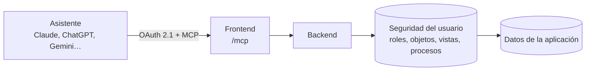
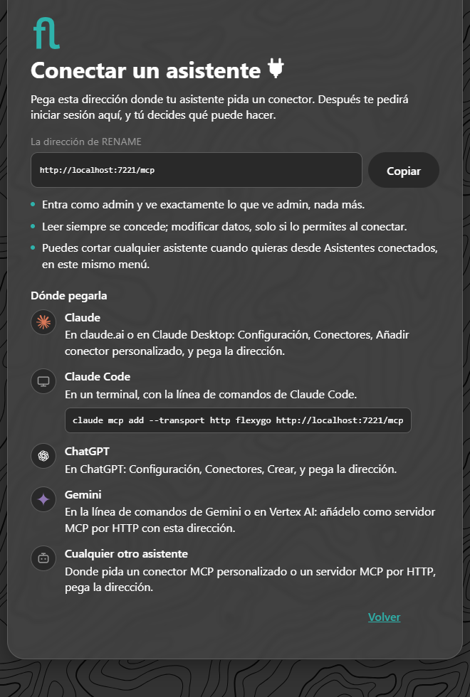
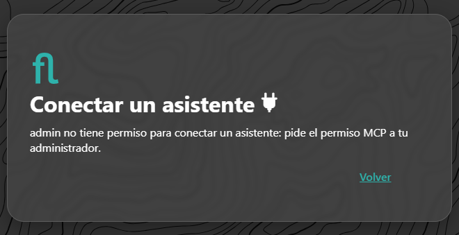
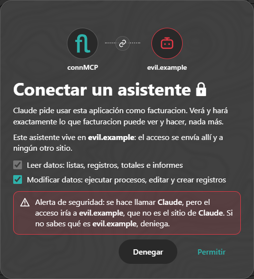
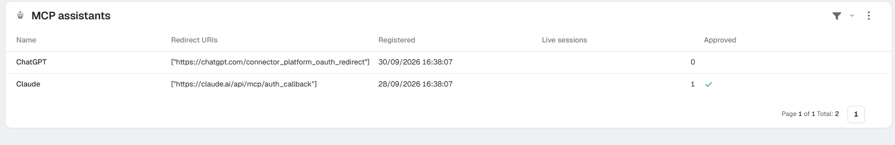
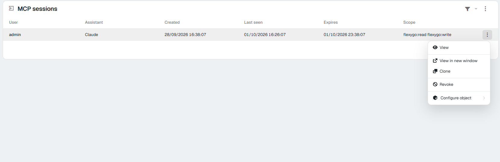

# Asistentes de IA conectados a la aplicación (MCP) <span class="fh-version-tag" title="Disponible desde la versión 10">10.0+</span>

Desde la versión 10, **cada aplicación Flexygo es también un servidor MCP**: un asistente de IA (Claude, ChatGPT, Gemini, Claude Code o cualquier otro cliente que hable el *Model Context Protocol*) se conecta a la aplicación con el usuario de siempre y **ve y hace exactamente lo que ese usuario puede ver y hacer, nada más**. No hay que programar nada en la aplicación: el asistente lee los objetos, las vistas, los procesos y los informes que ya existen, con sus descripciones, y trabaja con ellos en el idioma del usuario.

¿Quieres probarlo en quince minutos? [Pruébalo: un asistente de IA trabajando con tu aplicación](1TryIt.md).

!!! note "No es el servidor MCP del constructor"
    La sección [MCP](../../2ProductDevelopment/MCP/2Usage.md) de esta documentación describe el servidor que **construye** aplicaciones desde VS Code. Esta página describe lo contrario: la aplicación ya construida, expuesta a los asistentes de sus **usuarios**.



---

## 1. Qué puede hacer un asistente

Todo pasa por la seguridad del usuario que se conectó: sus roles, los objetos y vistas que puede ver, los procesos que puede ejecutar y lo que la aplicación expone en su web API. Un objeto que el rol no ve, no existe para el asistente; una escritura que el rol no puede hacer, se rechaza con una frase en el idioma del usuario.

| Lo que pide la persona | Lo que hace el asistente | Con qué |
|---|---|---|
| «¿Qué hay en esta aplicación?» | Lee el catálogo: objetos, vistas y procesos **con las descripciones que escribió el equipo**, y el vocabulario del negocio (qué significa «vencida», «sin facturar»…). | `flexygo_catalog`, `flexygo_schema` |
| «Busca García» / «¿Qué tenemos de Acme?» | Busca el texto en todos los objetos con el **buscador global** de la aplicación (los campos y lookups que el equipo configuró en cada búsqueda genérica), agrupado por objeto y con el enlace a cada ficha. Es lo primero que hace cuando la persona nombra a alguien o algo y no el objeto. | `flexygo_search` |
| «Dame las facturas vencidas de García» | Lista con filtros por campo, paginación y orden; los campos de búsqueda vienen con su texto (`_flxtext`), no solo con el id. | `flexygo_list` |
| «Enséñame el pedido 1020» | La ficha completa con sus hijos (líneas, entregas…) y el enlace para abrirla en la aplicación. | `flexygo_get` |
| «¿Cuánto hemos facturado este mes por forma de pago?» | Totales, recuentos, medias y desgloses por un campo, o por periodo (día, semana, mes). Si existe una vista que ya lo calcula, la usa primero. | `flexygo_measure` |
| «Hazme un tablero de ventas» | Un tablero con cifras, desgloses, series y tablas; en los clientes que dibujan **MCP Apps** (claude.ai, Claude Desktop) aparece como un widget interactivo con clic a la lista, exportación a CSV y «Abrir en Flexygo». | `flexygo_dashboard` |
| «Descárgame la factura en PDF» | El informe del objeto (DevExpress o Crystal) en PDF o Excel, y el enlace al visor de la aplicación. | `flexygo_report` |
| «Marca la factura 3 como pagada» | Ejecuta el proceso del objeto con sus parámetros; si falta alguno, lo pide. | `flexygo_exec` |
| «Cambia el teléfono del cliente 5» / «Crea una entrega para el pedido 10» | Modifica o crea registros, solo en los objetos que la web API expone para editar o crear. | `flexygo_update`, `flexygo_create` |

Además, el asistente recibe:

- **Recursos**: la descripción de la aplicación (`flexygo://application`), el esquema de cada objeto (`flexygo://{objeto}/schema`) y cualquier registro (`flexygo://{objeto}/{id}`).
- **Prompts**: las tareas típicas que el equipo escribe en la pantalla **MCP prompts** («resumen de un cliente», «pipeline del mes»…), que el cliente ofrece como atajos.
- **Autocompletado** de nombres de objetos, vistas y procesos.

!!! tip "El asistente es tan bueno como las descripciones"
    Lo que gobierna al modelo son los **metadatos**: la descripción de IA de cada objeto (*AI description*), la descripción de cada propiedad para la API (*Description in API*, y *Show values in API* para que los codificados viajen con su texto), las descripciones de vistas y procesos, y el ajuste **`ApplicationDescription`** (qué es esta aplicación, para quién). Un objeto sin descripción se usa mal o no se usa.

---

## 1 bis. Lo que hay que rellenar para que el asistente acierte

El asistente no ve las pantallas: ve **los metadatos** de la configuración. Estos son los que lee, de más a menos importante. Los de la parte de arriba son, en la práctica, obligatorios.

| | Qué | Tabla · columna | Dónde se rellena | Para qué lo usa el asistente |
|---|---|---|---|---|
| **Imprescindible** | Qué es la aplicación, para quién y su vocabulario | `Settings` · `SettingValue` de **`ApplicationDescription`** | *Ajustes*, grupo *WebAPI* | Es lo primero que lee al conectar (instrucciones de `initialize`, recurso `flexygo://application` y cabecera de `flexygo_catalog`). Aquí van las definiciones del negocio: qué es «facturación», «vencido», «cliente activo» |
| **Imprescindible** | Qué objetos ve y qué puede hacer con ellos | `WebAPI_Objects` (`CanView`, `CanViewCollection`, `CanInsert`, `CanEdit`, `CanDelete`, `CanPrint`), `WebAPI_Views` y `WebAPI_Processes` · `CanView` | Herramienta **WebAPI**, *Authorized Data* | Lo no expuesto no existe para el asistente |
| **Imprescindible** | Qué es cada objeto | `Objects` · **`AIDescrip`** (si está vacío, usa `Descrip`) | Ficha del objeto, *AI description* | Elegir el objeto correcto para cada pregunta. Una frase con qué guarda, qué estados tiene y cómo se relaciona |
| **Muy recomendable** | Qué significa cada campo con códigos | `Objects_Properties` · **`DescriptionInApi`** | Ficha de la propiedad, *Description in API* | Filtrar y explicar campos como `StateId` o `Type`: los valores posibles y lo que significan |
| **Muy recomendable** | Que los códigos viajen con su texto | `Objects_Properties` · **`ShowValuesInApi`** | Ficha de la propiedad, *Show values in API* | En los combos, el asistente recibe los valores permitidos con su texto y contesta «Facturado» en vez de «INV» |
| **Muy recomendable** | Para qué sirve cada vista | `Objects_Views` · **`Descrip`** | Ficha de la vista | Usar una vista que ya calcula lo pedido (totales, pendientes) antes que sumar él |
| **Muy recomendable** | Qué hace cada proceso y sus parámetros | `Processes` · **`ProcessDescrip`**; `Processes_Params` · **`Label`** y **`DescriptionInApi`** | Ficha del proceso y de sus parámetros | Saber cuándo ejecutarlo y qué pedir a la persona |
| Recomendable | Qué es cada informe | `Reports` · **`ReportDescrip`** | Ficha del informe | Elegir el informe al pedir un PDF o un Excel |
| Recomendable | Cómo se busca cada objeto por texto | `Objects_Search` (`Generic` = 1) y `Objects_Search_Properties` | Búsquedas genéricas del objeto | `flexygo_search` («busca García») solo encuentra en los objetos con búsqueda genérica |
| Recomendable | Campos que no deben salir | `Objects_Properties` · **`WebApiHidden`** | Ficha de la propiedad | Lo oculto no se lista ni se describe al asistente |
| Opcional | Tareas típicas, como atajos | `MCP_Prompts` (`PromptName`, `Title`, `Descrip`, `Template`) | *MCP prompts* | El cliente los ofrece como botones: «resumen del mes», «cliente en riesgo» |
| Opcional | Etiquetas legibles | `Objects` · `Descrip`; `Objects_Properties` · `Label` | Fichas del objeto y de la propiedad | Lo que ve en los resultados en lugar de los nombres técnicos |

Todo esto es configuración del producto: se escribe con el **origen del proyecto** activo para que viaje en sus guiones. `ApplicationDescription` es un ajuste del core, y viaja como `UPDATE` en el `config.sql` del proyecto exportado ([Exportar como proyecto](../../2ProductDevelopment/8ExportProject/2Reference.md)).

### Un prompt para que una IA lo rellene

Rellenar estos campos a mano en una aplicación con decenas de objetos lleva tiempo. Un asistente con acceso **de lectura** a la base de configuración (por ejemplo, el [MCP del constructor](../../2ProductDevelopment/MCP/2Usage.md) en VS Code, o una consulta SQL) puede proponerlos. Este prompt le dice qué mirar, dónde está y cómo deducir para qué sirve la aplicación; lo que devuelve es un guion para revisarlo, no cambios hechos.

```text
Eres un analista que prepara una aplicación Flexygo para que la usen asistentes de IA por MCP.
Trabaja SOLO leyendo la base de configuración (ConfConnectionString) y la de datos (DataConnectionString),
y entrégame un guion SQL para que yo lo revise. No ejecutes ninguna escritura.

1. Averigua para qué sirve la aplicación:
   - Objects (ObjectName, Descrip, TableName, ConnStringID) con OriginId = el origen del proyecto
     (SELECT dbo.funNet_GetOrigin()): los objetos propios del producto.
   - Navigation_Nodes (Title, ObjectName, PageName): cómo está organizado el menú.
   - Objects_Properties (ObjectName, PropertyName, Label, TypeId, SQLSentence): los campos y sus combos.
   - Objects_Objects (las relaciones entre objetos), Processes (ProcessName, ProcessDescrip) y Reports.
   - En la base de datos, las tablas de esos objetos: TOP 20 filas de cada una y los valores distintos de
     las columnas de estado o tipo, para entender el vocabulario real.
2. Escribe Settings.ApplicationDescription (SettingName = 'ApplicationDescription'): 4-8 frases con qué es,
   para quién, los objetos principales y las definiciones de negocio que deduzcas (qué cuenta como
   facturado, abierto, vencido…). Marca con [revisar] lo que no puedas confirmar con los datos.
3. Para cada objeto expuesto en WebAPI_Objects: Objects.AIDescrip, una frase con qué guarda, sus estados
   y con qué se relaciona.
4. Para cada propiedad codificada (combo, estado, tipo, clave ajena) de esos objetos:
   Objects_Properties.DescriptionInApi con los valores y su significado, y ShowValuesInApi = 1.
5. Objects_Views.Descrip de cada vista en WebAPI_Views; Processes.ProcessDescrip y
   Processes_Params.DescriptionInApi de cada proceso en WebAPI_Processes; Reports.ReportDescrip de los
   informes de los objetos con CanPrint.
6. Propón 3 filas de MCP_Prompts con las tareas que más sentido tengan para estos usuarios.

Reglas del guion:
- Solo UPDATE (e INSERT en MCP_Prompts), uno por fila, con N'...' y las comillas dobladas.
- Nunca toques filas con OriginId = 0 salvo el ajuste ApplicationDescription.
- No cambies un valor que ya esté relleno: proponlo en un comentario al lado.
- En inglés si la aplicación está en inglés; en el idioma de sus etiquetas si no.
- Al final, una lista de lo que no has podido deducir y necesitas que te confirme.
```

---

## 2. Ponerlo en marcha (administrador)

1. **Activar la web API y el punto MCP** en la herramienta **WebAPI** (área *Security* del [panel de control](../Administration/ControlPanel.md)): interruptores **Enable WebAPI** y **Enable MCP**, que son los ajustes `WebAPI_Enabled` y `MCP_Enabled` (también en *Ajustes*, grupo *WebAPI*). Los dos vienen apagados: exponer la aplicación a asistentes es una decisión del equipo. Sin `MCP_Enabled`, la ruta `/mcp` y sus documentos de descubrimiento responden 404, como si no existieran; el cambio vale al momento, sin reiniciar. Van separados a propósito: la web API sirve a integraciones (un ERP, una app, otro sistema con su token) y el MCP a los asistentes de las personas, que es otro público; se puede tener la primera sin el segundo, no al revés.

    <figure markdown="span">
      
      <figcaption>Enable MCP, junto a Enable WebAPI</figcaption>
    </figure>
2. **Dar el permiso MCP** a los roles o a los usuarios que puedan conectar un asistente: en la herramienta **WebAPI** (área *Security* del [panel de control](../Administration/ControlPanel.md)), panel *Authorized People*, la **columna del robot**. Es un permiso **aparte** del de la web API (la columna del ojo): un rol puede tener asistentes sin la API REST, o la API para sus integraciones sin asistentes. Como siempre, el usuario manda sobre su rol. Quitar el permiso **corta al instante** las conexiones vivas de esa persona; un usuario sin permiso ve la negativa al intentar conectar.

    <figure markdown="span">
      
      <figcaption>Por rol (o por usuario, en la otra pestaña): la web API y los asistentes, cada uno con su interruptor</figcaption>
    </figure>
3. **Exponer los objetos** en la web API (*WebAPI objects*): qué objetos, vistas y procesos ve el asistente, y si puede **editar**, **crear** o **imprimir** cada objeto. Lo no expuesto no existe para él.
4. **Escribir las descripciones** (ver la nota de arriba) y, si se quiere, los prompts en la pantalla **MCP prompts**.
5. **Revisar las búsquedas genéricas** de los objetos (las del buscador global de la aplicación): son las que usa el asistente para buscar un texto; un objeto sin búsqueda genérica no aparece en `flexygo_search`.
6. Opcional: ajustar los topes (§5).

La aplicación tiene que ser alcanzable por el asistente: para claude.ai o ChatGPT eso significa **el Frontend expuesto en internet con HTTPS** (con un proxy inverso delante, como describe [Proxy inverso](../../1Deployment/6ReverseProxy/index.md)); para Claude Desktop o Claude Code basta con que el equipo del usuario llegue a la aplicación.

---

## 3. Conectar un asistente (usuario)

Con `MCP_Enabled` encendido, el **menú de perfil** de cada persona tiene dos entradas nuevas: **Connect an assistant** y **Connected assistants**.

<figure markdown="span">
  
  <figcaption>Las dos entradas solo aparecen si la instalación tiene el punto MCP encendido</figcaption>
</figure>

**Connect an assistant** abre la página `/mcp/setup`: la dirección de la aplicación lista para copiar, con quién entrará el asistente y qué podrá hacer, y dónde se pega en cada asistente (Claude, Claude Code con la línea de comandos ya escrita, ChatGPT, Gemini y cualquier otro). Si la persona no tiene el permiso MCP, la página se lo dice y no enseña la dirección.

<figure markdown="span">
  { width="420" }
  <figcaption>La página habla en el idioma del navegador</figcaption>
</figure>

<figure markdown="span">
  { width="420" }
  <figcaption>Sin el permiso MCP: la negativa y a quién pedirlo</figcaption>
</figure>

La URL que se le da a cualquier asistente es la de la aplicación más `/mcp`:

```
https://<tu-aplicacion>/mcp
```

| Cliente | Dónde se pega la URL |
|---|---|
| **claude.ai** (web y móvil) | *Ajustes → Conectores → Añadir conector personalizado*: nombre y la URL. |
| **Claude Desktop** | *Ajustes → Conectores*, igual que en la web. |
| **Claude Code** | `claude mcp add --transport http <nombre> https://<tu-aplicacion>/mcp` |
| **ChatGPT** | *Ajustes → Conectores*. El servidor sirve además las dos herramientas que ChatGPT exige a un conector (`search` y `fetch`, con la forma que pide OpenAI) para admitirlo fuera del **modo desarrollador** y en la investigación en profundidad; son alias del buscador y de la ficha, y los demás asistentes siguen usando las `flexygo_*`. |
| Cualquier otro cliente MCP | Transporte *streamable HTTP* con OAuth 2.1; el cliente se registra solo (registro dinámico) y descubre el resto. |

Al conectar, el asistente abre el navegador en la aplicación. La persona **entra con su usuario de siempre** (con el SSO y la verificación en dos pasos que tenga configurados) y ve la página de consentimiento:

<figure markdown="span">
  
  <figcaption>La página de consentimiento: quién pide, como quién, a dónde va el acceso y qué se concede</figcaption>
</figure>

Lo que dice la página, y por qué:

- **Quién pide y como quién**: el nombre del asistente y el usuario con el que va a trabajar.
- **A dónde va el acceso**: el dominio al que el asistente recibe la autorización (`claude.ai`, `chatgpt.com`, `localhost` para un cliente en el propio equipo). Es lo único que un cliente **no puede inventarse**: el nombre se lo pone él mismo al registrarse; el acceso solo viaja al dominio que registró. La marca del asistente se elige por ese dominio, nunca por el nombre.
- **Qué se concede**: *Leer datos* siempre; *Modificar datos* (ejecutar procesos, editar y crear registros) solo si el asistente lo pidió, y la persona puede **quitar la casilla**. Una conexión de solo lectura rechaza cualquier escritura con una frase clara y sigue funcionando para todo lo demás.

<figure markdown="span">
  
  <figcaption>Si el nombre pasa por un asistente conocido y el acceso iría a otro sitio, la página lo dice y Denegar pasa a ser el botón principal</figcaption>
</figure>

Después del *Permitir*, el asistente queda conectado: el acceso dura **8 horas y se renueva solo** mientras se use; una conexión sin uso durante **30 días** caduca y hay que volver a conectar.

Para desconectar, la persona tiene **Connected assistants** en su menú de perfil: sus conexiones (solo las suyas), con el asistente, cuándo se conectó, la última vez que lo usó, cuándo caduca y qué puede hacer; **Revoke**, en el menú de la fila, la corta. También se puede eliminar el conector en el propio asistente, y un administrador puede revocar cualquier sesión (§6).

<figure markdown="span">
  
  <figcaption>Cada persona ve y corta sus propias conexiones</figcaption>
</figure>

!!! warning "La confirmación de las escrituras"
    Antes de ejecutar un proceso o cambiar un registro, la aplicación puede pedir a la persona una confirmación **dentro del asistente**, con el proceso, el registro y los parámetros exactos. Está **apagada por defecto**: Claude Desktop declara que atiende ese diálogo y no lo hace, y la llamada se queda esperando. Con el diálogo apagado, la garantía es el propio chat: el asistente dice lo que va a hacer y lo hace cuando la persona confirma. Se enciende, si el cliente lo atiende, con la variable de entorno `FLEXYGO_CONNECT_DIALOG=1` en el Backend.

---

## 4. Seguridad

| Medida | Qué hace |
|---|---|
| **OAuth 2.1 con la aplicación como servidor de autorización** | Login propio (SSO y 2FA incluidos), consentimiento explícito, PKCE obligatorio, tokens de 8 horas con renovación rotatoria. Las tablas guardan solo el hash de los tokens: una copia de la base no abre ninguna sesión. |
| **Permiso propio** | Conectar un asistente pide el permiso MCP del usuario o de su rol, aparte del de la web API (§2). Quitarlo, o bloquear el asistente en *MCP assistants*, corta las conexiones vivas al instante. |
| **La seguridad del usuario, siempre** | Cada llamada corre con el usuario que consintió: roles, objetos, vistas, procesos, filtros de seguridad. El MCP no añade permisos. |
| **Filtros acotados** | Un filtro SQL del asistente solo puede nombrar tablas de objetos que el rol ve; lo demás se rechaza con palabras. |
| **Scopes de lectura y escritura** | `flexygo:read` y `flexygo:write`; la persona decide en el consentimiento. |
| **Topes por sesión** | Llamadas por minuto y por día (§5); al pasarse, negativa con los segundos de espera. |
| **Tope por consulta** | Segundos que puede tardar cada consulta (§5); al agotarse, «acota el filtro, el periodo o los campos», nunca un error del servidor. |
| **Bloqueo de IP** | Los registros de clientes, los canjes de token fallidos y las llamadas sin sesión alimentan la lista gris de la aplicación; demasiados en un minuto desde una dirección la bloquean en las rutas MCP (ámbito *MCP* en *IP lockout*), sin tocar el resto de la aplicación. |
| **Origen comprobado** | Una petición del navegador con un `Origin` que no sea el de la aplicación ni uno de los que admite `WebApiOrigins` (la política CORS de la web API, en el `appsettings.json` del Frontend) se rechaza: protección frente a *DNS rebinding*. Con `WebApiOrigins` en `*`, cualquier origen de navegador entra, como en la web API. |
| **Registro** | Cada llamada queda en el log de la web API (§6). |
| **Consentimiento que no se suplanta** | El dominio del acceso, la marca elegida por ese dominio y la alerta de seguridad (§3). |

---

## 5. Ajustes

Todos en *Ajustes*, grupo *WebAPI*:

| Ajuste | Por defecto | Qué hace |
|---|---|---|
| `MCP_Enabled` | `false` | Abre el punto `/mcp` a los asistentes. Necesita también `WebAPI_Enabled`. Es el interruptor **Enable MCP** de la herramienta WebAPI. |
| `MCP_RequireApprovedClients` | `false` | Con `true`, cada asistente que se registra nace **sin aprobar** y nadie puede conectarlo hasta que un administrador marque *Approved* en **MCP assistants** (§6). Con `false`, un asistente se aprueba al registrarse y se puede bloquear después. |
| `MCP_CallsPerMinute` | `60` | Llamadas a herramientas que una sesión puede hacer por minuto; `0` = sin tope. |
| `MCP_CallsPerDay` | `0` | Lo mismo por día natural; `0` = sin tope. |
| `MCP_QueryTimeoutSeconds` | `30` | Segundos que puede tardar una consulta de una herramienta; `0` = el de SQL Server. |
| `MCP_ClientPurgeDays` | `30` | Días sin uso tras los que el job `ClearMcpClients` (a la 1:00) borra un cliente registrado y sus sesiones. |
| `ApplicationDescription` | vacío | Qué es esta aplicación y para quién, en las palabras del equipo: es lo primero que lee el asistente. |
| `WebAPILog_Enabled`, `ClearWebApiLogDays` | los de la web API | El registro de las llamadas y su purga (§6). |

---

## 6. Registro, sesiones y auditoría

- **Log**: cada llamada a una herramienta y cada lectura de un recurso queda en `WebAPI_Logs` con `PetitionType = MCP`: usuario, herramienta (`FunctionName`), objeto, argumentos (`Body`), estado (200; 403 negativa por rol o por scope; 404 registro que no existe; 400 argumento, filtro o consulta agotada; 429 tope de llamadas; 500 fallo) y duración. Se purga con `ClearWebApiLogDays`, como el resto del log.
Las pantallas de administración están en el área **Environment** del [panel de control](../Administration/ControlPanel.md) (en flexy2022, *Admin Work Area › Environment*): **MCP assistants**, **MCP sessions**, **MCP prompts** y **MCP usage**.

**MCP assistants**: los asistentes que se han registrado en la aplicación (se registran solos al conectar por primera vez; tabla `MCP_Clients`), con sus dominios de redirección, la fecha de alta, las sesiones vivas y el interruptor **Approved**. Quitar *Approved* **bloquea al asistente al instante**: sus sesiones dejan de funcionar en la siguiente llamada y nadie puede volver a conectarlo hasta que se apruebe de nuevo. Borrar un asistente se lleva sus sesiones. Con `MCP_RequireApprovedClients` encendido (§5), cada asistente nuevo aparece aquí sin aprobar y se aprueba a mano antes de que nadie lo use.

<figure markdown="span">
  
  <figcaption>Un asistente aprobado con una sesión viva y otro bloqueado</figcaption>
</figure>

**MCP sessions**: todas las conexiones vivas (tabla `MCP_Sessions`): quién, con qué asistente, cuándo se conectó, la última vez que lo usó, cuándo caduca y qué puede hacer. **Revoke**, en el menú de la fila, la corta: el asistente recibe una negativa y la persona tiene que volver a conectar. Las sesiones no se crean ni se editan a mano.

<figure markdown="span">
  
  <figcaption>Revoke corta la conexión sin tocar el resto</figcaption>
</figure>

**MCP usage**: lo que se hace con los asistentes, leído del log: llamadas por día (respondidas y rechazadas), por herramienta y por persona, con la duración media y la peor, y las últimas negativas con su motivo.

<figure markdown="span">
  
  <figcaption>Una herramienta lenta o muy rechazada es una vista o una descripción que falta</figcaption>
</figure>

**MCP prompts** (objeto `sysMcpPrompt`, tabla `MCP_Prompts`): nombre, descripción, argumentos y el texto de cada prompt que el asistente ofrece como atajo.

---

## 7. Buenas prácticas

- **Describe antes de exponer.** Una descripción de IA en cada objeto expuesto, las propiedades de negocio con su descripción y sus valores, y `ApplicationDescription` con el vocabulario del equipo. Es lo que hace que el asistente elija bien la herramienta y no invente.
- **Expón lo justo.** Solo los objetos que un asistente necesita; edición y creación solo donde tenga sentido; el resto, lectura.
- **Deja que las personas quiten *Modificar datos*.** Para la mayoría de usos (preguntar, resumir, tableros) basta con leer.
- **Mira el uso.** La pantalla **MCP usage** (o `WebAPI_Logs` con `PetitionType = MCP`) dice qué pregunta la gente, qué se rechaza y cuánto tarda; una consulta que agota el tope es una vista que falta.
- **En Claude Desktop, sin diálogo de confirmación** hasta que el cliente lo atienda; y ten en cuenta que Desktop **guarda la lista de herramientas** con la que nació cada chat y **cachea el widget**: tras un cambio en el servidor, hay que quitar y volver a añadir el conector.
