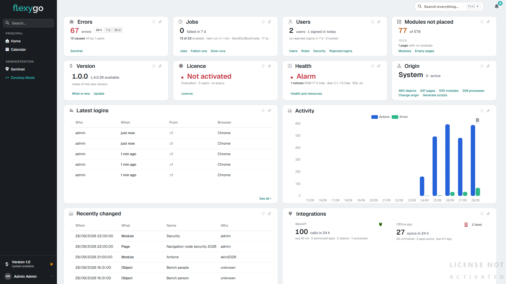
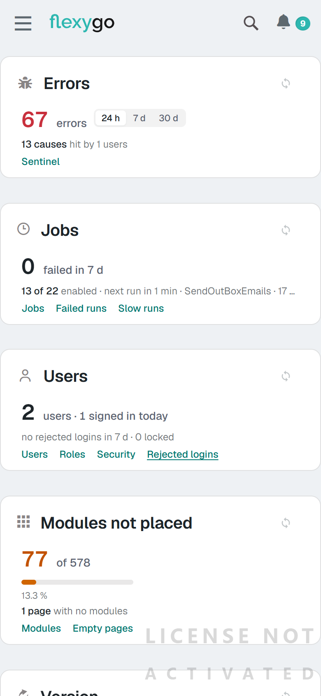

# Pantalla de inicio del administrador (skin2026) 10.0+

En skin2026 el administrador entra a una pantalla de inicio propia: doce tarjetas que dicen de un vistazo cómo está la aplicación —errores, trabajos programados, usuarios, versión, licencia, salud, origen, actividad— y llevan con un clic a donde hay que mirar.

<figure markdown="span">
  
  <figcaption>La pantalla de inicio del administrador en skin2026 claro, a 1920 px</figcaption>
</figure>

---

## 1. Quién la ve

Es la página de inicio del perfil **Administrator 2026** (`2026admin`), y solo la abren los **administradores**: a otro usuario que la pida por nombre se le niega. El perfil **User 2026** (`2026`) arranca en la página que el administrador le ponga.

!!! note "Al actualizar"
    Una instalación que ya tuviera usuarios con el perfil `2026` deja de mandarlos a esta pantalla. Su administrador tiene que pasarse al perfil **Administrator 2026** para tenerla como inicio.

---

## 2. Las tarjetas

Cada tarjeta dice su dato y, al pie, los enlaces a lo que hay detrás.

| Tarjeta | Qué dice | Enlaces |
|---|---|---|
| **Errors** | Errores del período, cuántas causas distintas y a cuántos usuarios alcanzan. El conmutador **24 h / 7 d / 30 d** cambia de período y se recuerda | Sentinel |
| **Jobs** | Trabajos programados fallidos en 7 días, cuántos están encendidos de cuántos, cuál es el próximo y cuándo, y los lentos en 24 h | Jobs, Failed runs, Slow runs |
| **Users** | Usuarios, cuántos han entrado hoy, inicios de sesión rechazados en 7 días y usuarios bloqueados | Users, Roles, Security, Rejected logins |
| **Modules not placed** | Módulos que no están en ninguna página, de cuántos hay, con su barra, y las páginas sin módulos | Modules, Empty pages |
| **Version** | La versión instalada y, si la hay, la nueva disponible | What is new, Update |
| **Licence** | El estado de la licencia, su tipo, los usuarios y la caducidad | Licence |
| **Health** | El peor estado del [panel de salud](HealthPanel.md) (alarma, aviso o correcto), cuántas notas tiene el panel, la memoria libre, el disco más lleno y cómo está SQL Server | Health and resources |
| **Origin** | El origen activo y cuántos objetos, páginas, módulos y procesos tiene, cada cifra con su enlace | Change origin, Generate scripts |
| **Latest logins** | Los cinco últimos inicios de sesión: quién, cuándo, desde dónde y con qué navegador | See all |
| **Activity** | Acciones y errores de cada día de las dos últimas semanas, en una gráfica | |
| **Recently changed** | Los cinco últimos cambios de configuración (objetos, páginas, módulos…): cuándo, de qué tipo, cuál y quién | See all |
| **Integrations** | La WebAPI (llamadas en 24 h, tiempo medio, aplicaciones autorizadas, objetos y procesos expuestos) y la app offline (sincronizaciones en 24 h, fallidas y sin terminar, aplicaciones activas y la última) | Configuration, Logs · Offline app, Synchronizations |

---

## 3. Cada administrador la ordena a su gusto

La página deja que cada usuario **mueva las tarjetas**, sin activar nada:

- **Mover**: se coge una tarjeta por su cabecera y se suelta en otro sitio; las demás se recolocan. Se guarda al soltar, **para ese usuario**: los demás siguen viendo su propio orden.
- **Fijar**: la chincheta de la cabecera (*Pin this module here*) deja una tarjeta quieta; las demás se mueven a su alrededor. Se suelta con la misma chincheta.
- **Volver**: en cuanto se ha movido algo, al pie de la página sale *Put the modules back as the administrator arranged them*, que devuelve la disposición original.

No hay un modo de edición aparte: la pantalla está siempre lista para arrastrar.

---

## 4. En pantallas estrechas y en el móvil

La disposición de escritorio necesita sitio. Por debajo de **1280 px** de ancho las tarjetas se reagrupan para que ninguna quede más estrecha que media pantalla, y en el móvil se apilan una debajo de otra, a todo el ancho. En esos tamaños **no se arrastra** ni salen las chinchetas, pero las tarjetas salen **en el orden que el usuario se guardó**.

El cambio se hace en el momento: al estrechar la ventana la pantalla se reorganiza sin recargar, y al volver a ensancharla se puede arrastrar otra vez.

<figure markdown="span">
  { width="320" }
  <figcaption>La misma pantalla en un móvil (390 px): tarjetas apiladas, sin chinchetas</figcaption>
</figure>
