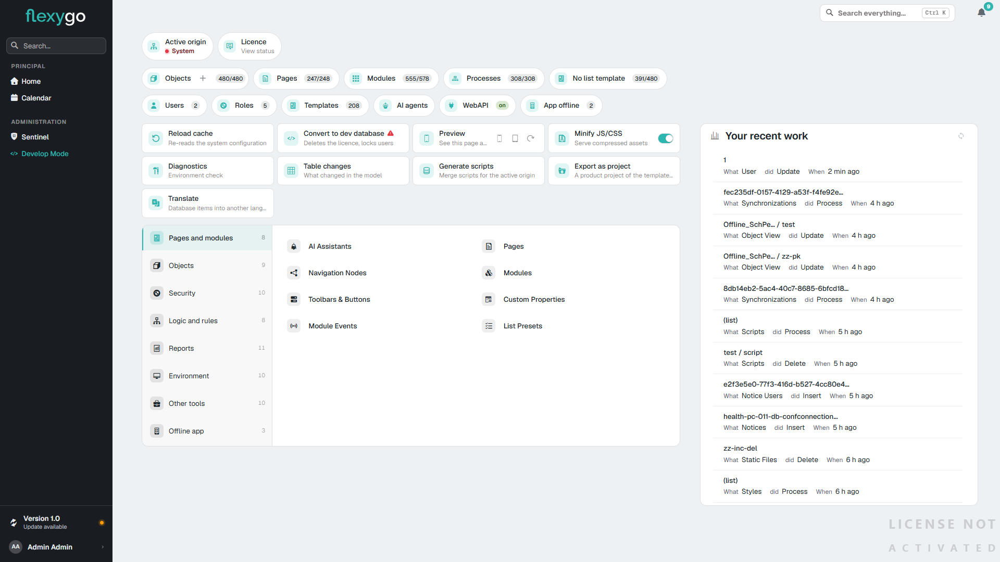
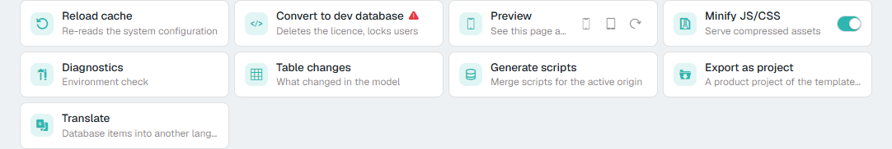

# Panel de control 10.0+

En skin2026 el panel de control es una sola pantalla con todo lo que un administrador necesita para mantener la aplicación: en qué origen trabaja, cuánto hay de cada cosa, las herramientas de configuración por áreas, las acciones de mantenimiento y lo último que ha tocado.

<figure markdown="span">
  
  <figcaption>El panel de control: estado y atajos arriba, acciones, áreas con sus herramientas y, a la derecha, el trabajo reciente</figcaption>
</figure>

---

## 1. Dónde está

En el carril de la izquierda, bajo **Administration** → **Control panel**. La entrada se ve con el **modo desarrollo** encendido (**Develop Mode**, al pie del mismo carril).

---

## 2. Qué se ve

### Estado

- **Active origin**: el origen en el que se está trabajando (lo que se crea nace con él, y es lo que exportan *Generate scripts* y *Export as project*).
- **Licence** → **View status**: abre el estado de la licencia.

### Atajos

Una fila de accesos directos a las listas más usadas, cada uno con su cifra:

| Atajo | Cifra |
|---|---|
| **Objects** (con **+** para crear uno con el asistente), **Pages**, **Modules**, **Processes** | Los del origen activo / el total. `555/578` en Modules: 555 son del origen activo de 578 que hay |
| **No list template** | Objetos del origen activo que no tienen plantilla de lista / objetos del origen activo |
| **Users**, **Roles**, **Templates**, **App offline** | Cuántos hay |
| **AI agents** | Sin cifra: lleva a los agentes de IA configurados |
| **WebAPI** | **on** (en verde) si la WebAPI de la instalación está encendida, **off** (neutro) si no. Lleva a su configuración |

### Acciones

<figure markdown="span">
  
  <figcaption>Las acciones de mantenimiento</figcaption>
</figure>

| Acción | Qué hace |
|---|---|
| **Reload cache** | Vuelve a leer la configuración del sistema |
| **Convert to dev database** | Convierte la base en una de desarrollo: borra la licencia y bloquea usuarios. Lleva el triángulo de aviso |
| **Preview** | Enseña la página como la vería un teléfono o una tableta, y la gira |
| **Minify JS/CSS** | Interruptor: sirve los ficheros comprimidos |
| **Diagnostics** | Comprobación del entorno |
| **Table changes** | Qué ha cambiado en el modelo de datos |
| **Generate scripts** | Los guiones `MERGE` del origen activo |
| **Export as project** | Convierte la aplicación en un proyecto de la plantilla de producto ([Exportar la aplicación como proyecto](../../2ProductDevelopment/8ExportProject/2Reference.md)) |
| **Translate** | Traduce los textos de la base a otro idioma |

### Áreas

A la izquierda, las áreas de configuración —**Pages and modules**, **Objects**, **Security**, **Logic and rules**, **Reports**, **Environment**, **Other tools**, **Offline app**—, cada una con el número de herramientas que tiene. El número cuenta **lo que el usuario puede ver**: con otra seguridad, otro número. Al elegir un área, a su derecha salen sus herramientas; en **Environment** está, por ejemplo, el [panel de salud](HealthPanel.md).

### Tu trabajo reciente (*Your recent work*)

A la derecha, los últimos registros que ha tocado el propio usuario: cuál, de qué tipo (usuario, vista, página…), qué hizo (alta, cambio, baja, proceso) y cuándo.
