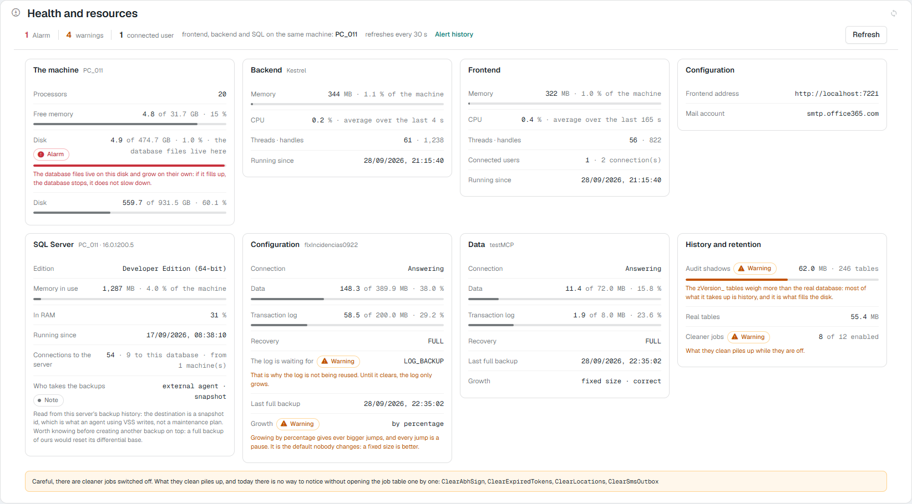
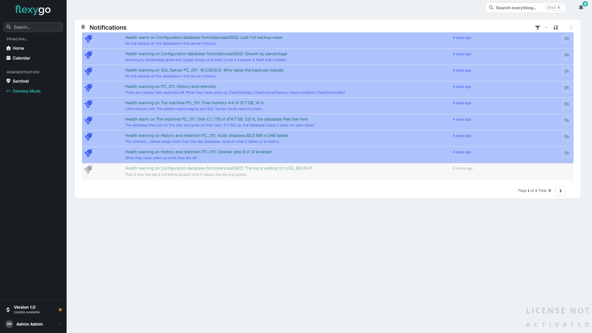

# Panel de salud 10.0+

**Health and resources** reúne en una pantalla el estado de la instalación: la máquina, los procesos del Backend y del Frontend, SQL Server, cada base de datos conectada y lo que el historial ocupa. Dice solo lo que ha podido medir, y cuando algo no está bien, por qué importa.

<figure markdown="span">
  
  <figcaption>El panel con una alarma (el disco de la base casi lleno) y cuatro avisos, cada uno con su explicación debajo</figcaption>
</figure>

---

## 1. Dónde está y quién lo ve

- En el **panel de control**, área **Environment** → **Health and resources**.
- Desde la pantalla de inicio del administrador, la tarjeta **Health** → **Health and resources** ([Pantalla de inicio del administrador](AdminDashboard.md)).

Es una pantalla de **administradores**: los datos solo se sirven a un usuario con rol de administrador. La entrada del panel de control está en skin2026.

---

## 2. Qué se ve

Arriba, el resumen: cuántas **alarmas** y **avisos** hay, cuántos **usuarios conectados**, si Frontend, Backend y SQL Server están en la misma máquina o en varias, y el enlace **Alert history** (4). El panel se refresca solo cada 30 segundos, y **Refresh** lo hace al momento.

Debajo, una tarjeta por pieza. Cada fila dice su dato y, si está mal, lleva la marca **Alarm** o **Warning** y una línea que explica qué pasa si se deja así.

| Tarjeta | Qué dice |
|---|---|
| **The machine** | Procesadores, memoria libre y cada disco, con cuánto queda libre. Si SQL Server está en esa máquina, se señala el disco donde viven los ficheros de la base: si se llena, la base se para |
| **Backend** / **Frontend** | La memoria del proceso y qué parte de la máquina es, la CPU como **media de los últimos segundos** (dice de cuántos), hilos e identificadores, y desde cuándo corre. El Frontend dice además cuántos **usuarios conectados** hay y cuántas conexiones abiertas (un usuario con dos pestañas son dos conexiones) |
| **Configuration** | La dirección del Frontend que usa el Backend y la cuenta de correo, con un aviso si alguna no contesta |
| **SQL Server** | Edición, memoria en uso y qué parte de ella está en RAM (no paginada), desde cuándo corre, conexiones al servidor (a esta base y desde cuántas máquinas) y **quién hace las copias de seguridad**, según el historial del propio servidor |
| **Configuration** / **Data** | Una por cada base conectada: si contesta, lo que ocupan los datos y el registro de transacciones, el modelo de recuperación, a qué espera el registro para reutilizarse, la última copia completa y cómo crece |
| **History and retention** | Lo que ocupan las tablas de historial frente a las tablas reales, y cuántos trabajos de limpieza están encendidos |

Al pie puede salir una nota con lo que conviene saber aunque no sea una alarma, por ejemplo qué trabajos de limpieza están apagados.

!!! note "Si faltan permisos, lo dice"
    Una parte de los datos de SQL Server (memoria, CPU, conexiones y espacio en disco) necesita el permiso de servidor **VIEW SERVER STATE** para el usuario con el que la aplicación entra en SQL Server. Si no lo tiene, el panel no se inventa esas cifras ni las pone a cero: lo dice, con el permiso que falta. Lo de cada base se lee con los permisos normales sobre ella.

En **skin2026** el panel solo marca lo que hay que mirar —alarmas y avisos—: lo correcto no lleva marca, porque cuando no sale nada es que está bien. En flexy2022 cuenta también lo correcto y no tiene el enlace **Alert history**.

---

## 3. Los avisos llegan solos

No hace falta tener el panel abierto. Cada cuarto de hora la instalación revisa lo mismo que enseña el panel, y por cada alarma o aviso nuevo:

- **avisa a los administradores en la campana** de notificaciones, con el título (qué y dónde) y el motivo; al pulsarlo se abre el panel;
- si es una **alarma** y el correo de la aplicación está configurado, **manda además un correo** a cada administrador con dirección de correo.

Cada problema avisa una vez: no se repite cada cuarto de hora mientras siga ahí.

---

## 4. El historial de alertas

**Alert history** abre la lista de notificaciones filtrada a las de salud: cada alarma y aviso que se ha levantado, con su motivo y cuándo.

<figure markdown="span">
  
  <figcaption>Alert history: las alarmas y avisos de salud de la instalación, los pendientes resaltados</figcaption>
</figure>
