# What's new in the skin2026 interface 10.0+

What changes for those who **use** and those who **administer** an application with the **skin2026** skin: lists, search, notifications, mobile, the offline app and the side menu. Except where stated, flexy2022 stays as it was.

The screenshots are taken in light mode; everything works the same in dark mode.

---

## 1. Lists

### 1.1 Sort and group by any column

The default list of any object can be sorted and **grouped by any of its columns**, without configuring anything. This is done from the module menu (the three dots in the header), **Sort and group…**: the *Sort* tab for the order and *Groups* for the groups, with **Add a field** to choose each column. Several levels can be chained.

<figure markdown="span">
  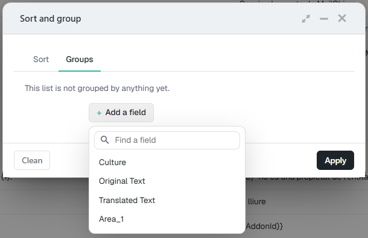{ width="460" }
  <figcaption>Each grouping level is a column of the list</figcaption>
</figure>

Each group starts with a **band** that shows the column and the value. When scrolling, the band of the group being read **sticks below the column header**, and with several levels they stack, one per level; the next one pushes the previous one out. Above the list, a pill reminds you how it is grouped (*Grouped by Culture › Area_1*). Sorting by a group's column reverses the group. Grouping also works in flexy2022, with its colors.

<figure markdown="span">
  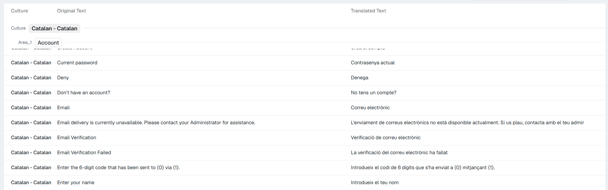
  <figcaption>Scrolled halfway: the column header and the bands of both levels stay in view</figcaption>
</figure>

### 1.2 The column header, always in view

In the default list, the row of column titles stays at the top while the page scrolls. Columns are widened by dragging their border in the header (the first one too), and if the table is wider than its card, the horizontal scrollbar stays at the bottom of the window.

### 1.3 The row opens the record; everything else, in its menu

In lists with the default template, **clicking a row opens the record**. The rest of the actions (view, edit, delete, open in another window, clone, configure the object and the processes) are in the **row menu**: with a **right click** on it or with the **three dots** that appear on hover (on touch devices they are always visible). The selection checkbox goes at the start of the row.

<figure markdown="span">
  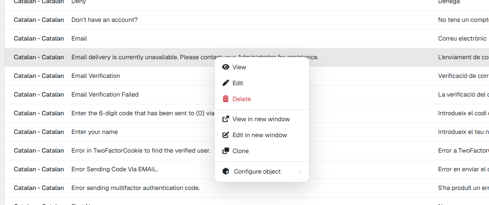
  <figcaption>Right click on the row</figcaption>
</figure>

Cells are rendered according to their content: a checkbox for yes/no values, a swatch for colors, fixed-width digits so that numbers and dates line up, and a dash in empty ones.

### 1.4 Presets as pills, and how many records the filter lets through

An object's **presets** (named saved filters) appear as **pills above the list**, with *Show all* first; the active one is highlighted.

<figure markdown="span">
  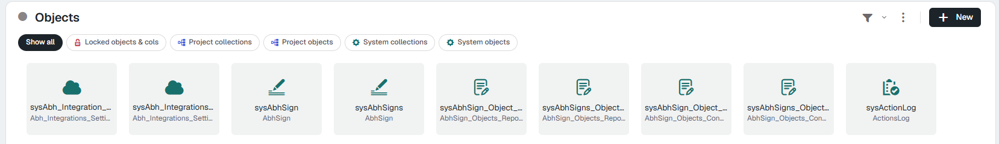
  <figcaption>One tap switches preset</figcaption>
</figure>

With a filter applied, next to the list title it shows **how many records it lets through** (out of the real total, not out of the page).

### 1.5 Filter chips

The list filter is shown as **chips**, one per field. In dropdown fields with several values chosen, the chip shows the ones that fit and **all its values appear on hover**, one per line.

<figure markdown="span">
  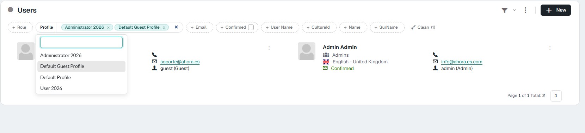
  <figcaption>The "Profile" chip with two values chosen</figcaption>
</figure>

---

## 2. Search: the Ctrl K palette and the search manager

**Ctrl K** (or the search box in the top bar) opens the global **search palette**. When empty, it already tells you **where it searches**: each object with a configured search and by which fields. Those marked *Develop mode* are only visible in development mode; a normal user sees their own.

<figure markdown="span">
  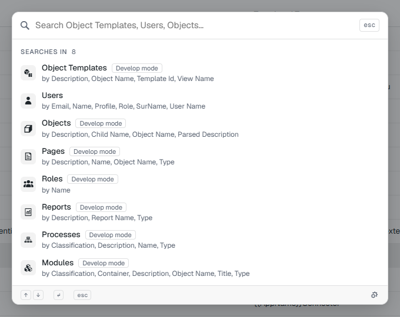{ width="520" }
  <figcaption>Before you type anything, the palette tells you what it can find</figcaption>
</figure>

The gear at the bottom of the palette opens the **search manager** (*Filter Manager*). With no object chosen it shows the **summary of what is already configured**: each search, its object, its fields and whether it is development mode only; clicking one edits it. With an object chosen, its properties are on the left and the search fields on the right.

<figure markdown="span">
  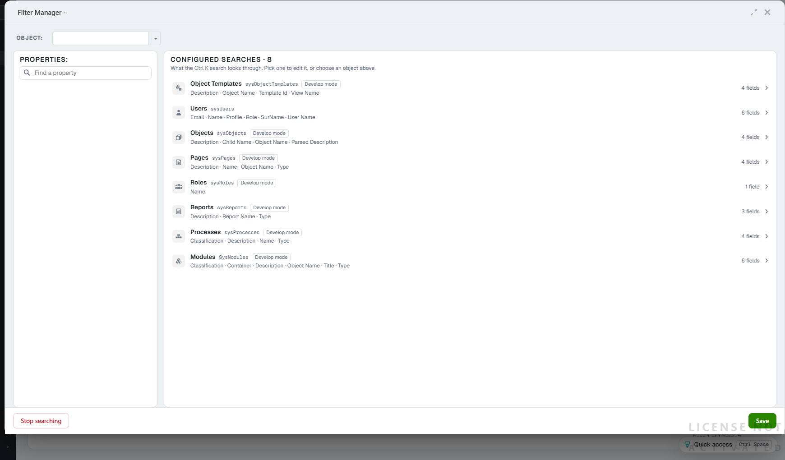
  <figcaption>The summary of the configured searches</figcaption>
</figure>

---

## 3. Notifications: the bell

The bell in the top bar opens in one piece, grouped by source (*Application*, *Mail*…), with the number of unread items in each group, the three latest notifications and **Mark all as read**. Opening an unread notification marks it as read, and after *Mark all as read* the three latest stay in view. It closes by clicking the bell again. It has **its own sound** when a notification arrives; pop-up messages no longer make a sound.

<figure markdown="span">
  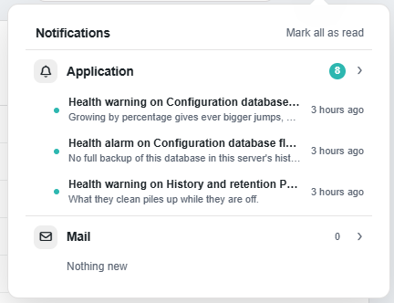{ width="420" }
  <figcaption>On mobile it appears as a sheet from the bottom and closes by swiping it</figcaption>
</figure>

---

## 4. Mobile and tablet

On a phone, skin2026 has **its own bar**: the menu (hamburger), the logo, search and the bell. The **side menu slides in as a sheet** over the page, with the desktop bar links inside; the profile menu opens upwards from the user. Controls are finger-sized.

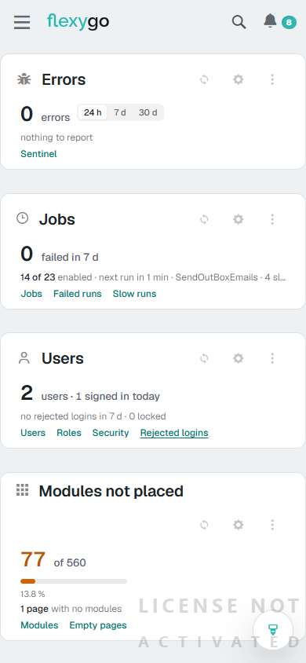{ width="200" } 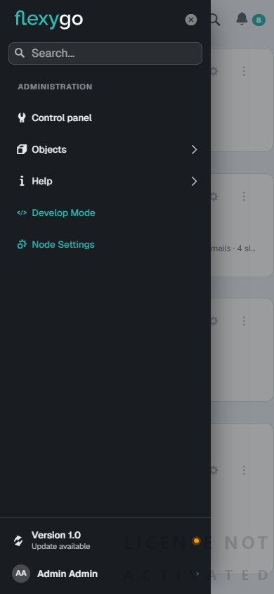{ width="200" } 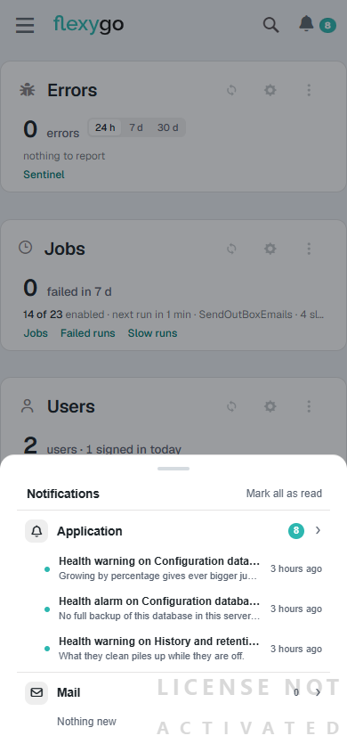{ width="200" }

*The phone bar · The menu, as a sheet · The bell, as a sheet*

Lists switch to **card rows** when they do not fit (in administration lists, below 1100 px): each row is a card with its title at the top and the rest as "label value". Module tabs are the desktop ones, with an arrow and a fade at the edge when there are more than fit. A calendar opens in its list view on the phone.

Dropdowns open their **mobile panel**: the strip at the top with what is chosen, the ✕ to clear and the ✓ to close, and finger-sized options. The search manager **stacks its two panels**, each with its own scrolling.

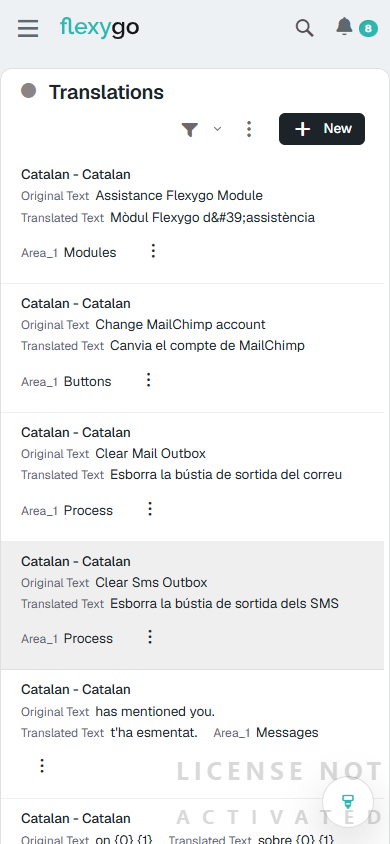{ width="200" } 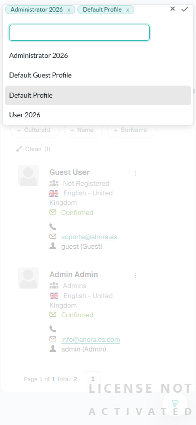{ width="200" } 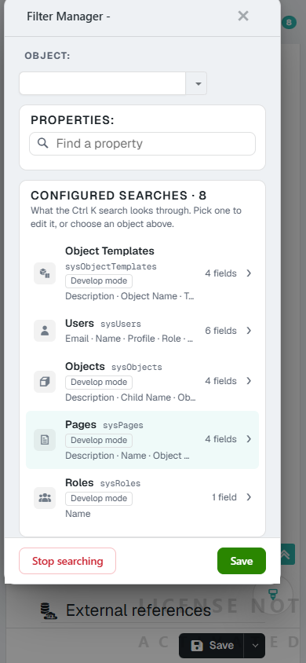{ width="200" }

*Card rows · A dropdown's panel · The search manager, stacked*

---

## 5. Offline app: synchronizations, retrying and correcting what was sent

On each offline app's screen, the **Synchronisation** tab lists what the devices have sent and received:

- **Chips** *All*, *Errors*, *Sent* and *Received* with their count, and a search by type, user, error, id or date.
- **Retry** on each failed submission, and **Retry failed · n** for all of them, one after another.
- Each row expands with its detail, and **Open data** opens what the device sent.
- The app header tells you if it **sends data without a return process** (*no return process*): those submissions cannot be applied.

<figure markdown="span">
  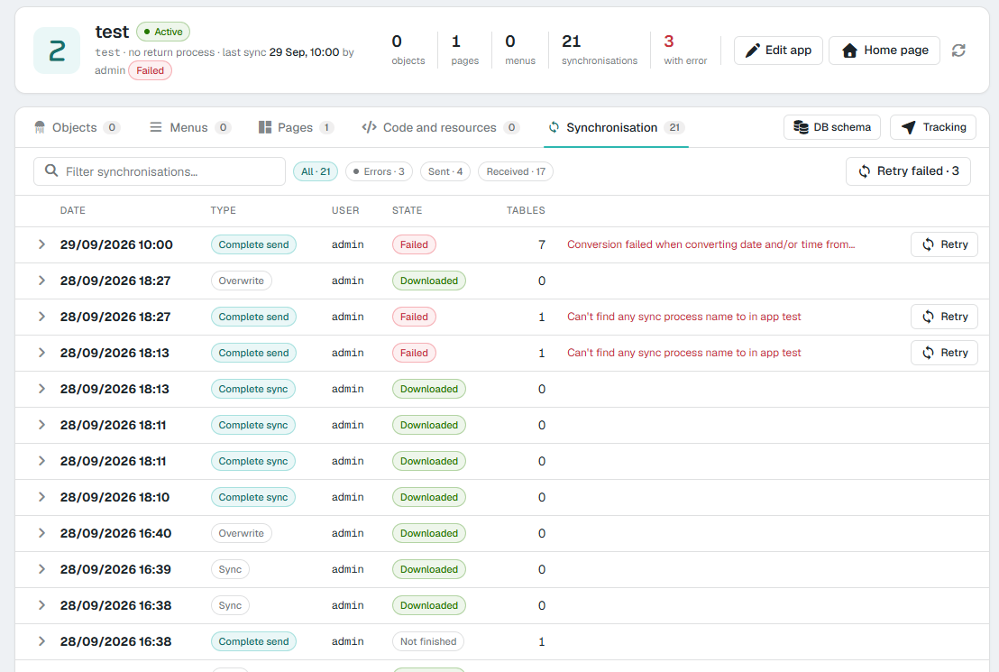
  <figcaption>Three failed submissions, each with its Retry</figcaption>
</figure>

The **editor of what was sent** shows the device's JSON as a table, table by table and paged, with the status of each row (*Inserted*, *Updated*, *Deleted*). At the top, the full **error** and where it has been located: the column it names, the rows that carry the value, *Go to row N* and *1 of N* to jump from one to another. Values can be corrected and **rows removed from the submission**; nothing is saved until you press **Save**, and **Retry** runs it through the return process again. **Raw JSON** shows the submission as is.

<figure markdown="span">
  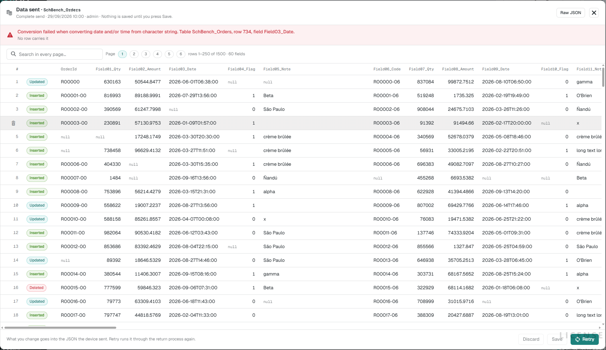
  <figcaption>The date conversion error, with the table, the row and the field it names</figcaption>
</figure>

---

## 6. The side menu

**Out of the box** it comes with *Default Objects*, *Control panel*, *Help* and *Develop Mode*; the rest is added by each application. A **Group Node** node is a section with its nodes, and it can be **collapsed** if the node says so: the node's **Collapsible** column.

### 6.1 Objects and master tables, in development mode

In development mode, the **Objects** node gives quick access to any object: **System** with the product's ones (when working on origin 0) and **Solution** with the project's ones (origin 1 or higher). Each object opens its list. Inside each one, **Master Tables**: in *System* by groups, in *Solution* the project's ones; a master table with an object opens that object's list and the rest, the table editor. Unregistered users see neither *Objects* nor *Control panel*.

### 6.2 The menu search box

The search box at the top of the menu finds any node, including those in *Objects*:

- **Accent-insensitive and in any order**: "sécurity" finds *Security*; "users object" finds titles containing both words.
- **With the keyboard**: ↑ ↓ move the highlight between results and **Enter** opens the highlighted one.
- If there is nothing, it says so: *Nothing matches that*.
- Matches are highlighted with a tint of the accent color, and long titles end in an ellipsis.

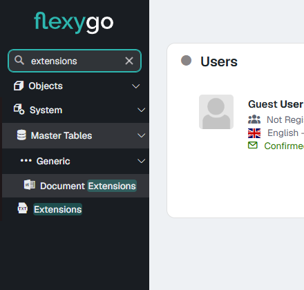{ width="200" } 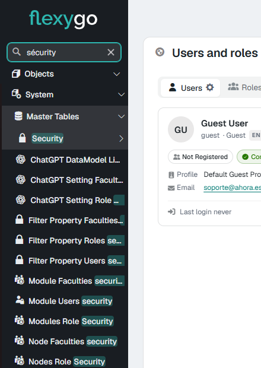{ width="200" } 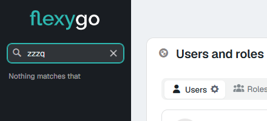{ width="200" }

*A master table found from the search box · Accent-insensitive, with the match highlighted · No results, it says so*

---

## 7. For product developers

- **New columns in configuration tables**: they go at the end of the table's own columns and **before** the reserved ones (`flxInsertedBy`, `flxUpdatedBy`, `flxInsertedDate`, `flxUpdatedDate`, `OriginAddonId`, `OriginId`). Version 10 rearranges `Pages`, `Pages_Modules`, `Modules`, `Navigation_Nodes` and `Charts_Settings` this way; when upgrading an existing database, those five tables are rebuilt once.
- **Easy info**: the misspelled column warning is now an icon next to the title; see [Easy info](../Modules/EasyInfo.md#16-the-misspelled-column-warning-development-mode).
