# Charts with ECharts: `flx-echart` versus `flx-chart` <span class="fh-version-tag" title="Available since version 10">10.0+</span>

From **version 10** on, Flexygo has **two** chart module types:

| Module type | Library | Settings | |
|---|---|---|---|
| `flx-chart` | Chart.js 2.9.4 (`~/js/plugins/Chart/Chart.js`) | `Charts_Settings` (`ChartSettingName`) | the usual one; **unchanged** |
| `flx-echart` | Apache ECharts 6.1 (`~/js/plugins/echarts/echarts.min.js`) | `Charts_Themes` (`ChartThemeName`) + `JsonOptions` | **new**, "Chart (ECharts)" in the type combo |

Both read **the same SQL** (series, labels and values) and offer **the same ten chart types** (`bar`, `horizontalBar`, `line`, `mixed`, `pie`, `doughnut`, `semidoughnut`, `polarArea`, `radar`, `bubble`), so a `flx-chart` module becomes a `flx-echart` by changing the module type and choosing a theme. Nothing forces you to migrate: `flx-chart` keeps working the same and both libraries are loaded through `Plugins` as always.

This page is the `flx-echart` reference: **what arrives when you update**, **how to migrate a module** and what is left behind, **what is configured and where** (theme, `JsonOptions`, the `flx` block, the SQL), which behaviours are new, how to check it, and a **gallery** with each theme, each type and the most useful recipes of the `flx` block, as images and with the `JsonOptions` that produces them (5).

---

## 0. When updating a product

### 0.1 What arrives with the packages alone

| Package | What it brings |
|---|---|
| `{Product}.Frontend` | The `flx-echart` component and the library in `js/plugins/echarts/`. `flx-chart` and Chart.js stay where they were |
| `{Product}.Backend` / `.Library` | `Chart.GetHTML` serves both types; it also forwards `Modules.Empty` (the empty text) and, if a `flx-echart` names no theme, gives it `syscth-shadcn` |
| `{Product}.Conf.Database` | The `Modules_Types` row (`flx-echart`, visible in the Module Manager of any database), the **`Charts_Themes`** table with four themes (`syscth-default`, `syscth-flexygo`, `syscth-mono`, `syscth-shadcn`), the `sysChartThemes` object (Reporting → Chart Themes menu), the rules of the module fields by type (in a `flx-echart` the theme is required and is filled in with `syscth-shadcn`; `Empty` and `JsonOptions` are shown in the form, the latter with a JSON editor), the `Modules.JsonOptions` column changed to `nvarchar(max)` (previously 500), the ECharts `Plugins` row and the translations. In the module form, **Chart Settings** (`ChartSettingName`) is also shown with `flx-echart`, optional (with `flx-chart` it is still required). `Charts_Settings` gains four columns that only `flx-echart` reads (3.1 bis): `Stack` ("Stack series"), `DataView` ("Data view menu"), `NumberFormat` ("Number format", combo `plain`/`locale`/`compact`) and `NumberDecimals` ("Decimals"); and its **Legend Position** and **Title Position** combos now list their options (Top, Bottom, Left, Right). New or rewritten help tips (ⓘ): Chart Theme, Chart Settings, Json Options, Series, Labels, Values, and SQL Sentence with a block for "Chart (ECharts)". All with origin 0, through the usual `MERGE` scripts |

### 0.2 What changes in an existing `flx-echart`

A product that already used `flx-echart` (from an intermediate skin2026 version) sees these changes, in **both skins**:

1. **The "view the data" menu (`dataView`) is on by default**: every chart has the ECharts icon that opens the table of its data, with translated captions. It is turned off per module with `{"flx":{"dataView":false}}` in `JsonOptions`.
2. **The module toolbar is rendered.** The buttons configured in a chart module were not shown (neither in `flx-chart` nor in `flx-echart`); in `flx-echart` they now are. `flx-chart` is not touched.
3. **The empty text is the module's** (`Modules.Empty`); if blank, the usual generic one appears.
4. **Without a theme it is rendered with `syscth-shadcn`.** With an empty `ChartThemeName` the chart came out with the ECharts factory palette, repeated the module title inside and put the legend over the axis; now the server gives it the default theme.
5. **It reads its settings.** If the module has a `ChartSettingName`, the legend and its position, the value labels and the title come from the settings, overriding the theme (3.1 bis). Previously `flx-echart` ignored it: a module with settings may gain or lose the legend or the labels.
6. **`syscth-default` has a palette**: shadcn's. Previously whoever chose it saw the ECharts factory palette.
7. **`syscth-mono` loses the grey background bar** behind the bars.
8. **Pie charts with outside labels and no legend are centred**: the factory centre goes from 58 % to 50 %, and `syscth-shadcn` and `syscth-mono` no longer set their own `doughnutRadius`. The bottom label no longer overflows the drawing.
9. **A single-slice pie is drawn whole**, without the gap that the separation between slices left.

And only in skin2026: the chart is dressed with the skin tokens (backgrounds, ink, axes, tooltip, the `dataView` panel) in light and dark mode, and it can have a footer strip (3.4).

`flx-chart` **does not change at all** in this version.

---

## 1. Migrating a module from `flx-chart` to `flx-echart`

1. In the module form, change **Type** to "Chart (ECharts)" (`flx-echart`). The form then shows the fields this type reads and hides those of the other one.
2. Check the **theme** in `ChartThemeName` (`Charts_Themes`): it is required in this type and the form fills it in with `syscth-shadcn` when you choose it. A module that arrives without a theme (created by SQL, for example) is also rendered with `syscth-shadcn`.
3. Check the SQL against table 2.1: the contract is the same; the only change is which optional columns are read.
4. Test the chart in both skins and, in skin2026, in light and dark mode.

| Module field | `flx-chart` | `flx-echart` |
|---|---|---|
| `SQlSentence`, `ConnStringID`, `Cache` | yes | yes |
| `Series`, `Labels`, `Value` (aliases of the three SQL columns) | yes | yes |
| `ChartTypeId` | the chart type | the chart type; in `mixed`, each series brings its own from the SQL |
| `MixedChartTypes`, `MixedChartLabels` | yes | yes (the server tags each row with its type) |
| `ChartLineFill`, `ChartLineBorderDash` | yes | yes (`ChartLineFill` = area at 18 %, which `flx.series.areaOpacity` can change) |
| `JsonOptions` | Chart.js options | ECharts options + the `flx` block (3.2) |
| `ChartSettingName` (`Charts_Settings`) | **yes**, required | **yes**, optional: legend, its position, labels and title overriding the theme, plus the four fields of the settings' "ECharts" block (3.1 bis). The rest of the settings (colours, fonts, axes, animation) is for Chart.js and is not read |
| `ChartThemeName` (`Charts_Themes`) | no | **yes**, required (default `syscth-shadcn`) |
| `ChartBackground`, `ChartBorder` | do nothing (the server looks for the `backgroundColor` and `borderColor` columns by their literal name) | same: not read |
| `Empty` | no | yes (visible in the form) |
| `Params` | attributes added to the `<flx-chart>` tag, as in any module | attributes added to the `<flx-echart>` tag (3.3) |

A module that only uses a factory setting (`syscs-default`, `syscs-default-legendandlabels`, `syscs-default-legendnolabels`, `syscs-default-nolegendandlabels`, which are legend yes/no × labels yes/no) **is migrated by changing only the type**: it keeps its setting, and the default theme gives it the palette.


What is lost when migrating: the colours, fonts, axes and animation of a `Charts_Settings` setting (that is decided by the `Charts_Themes` theme), and a `JsonOptions` written for Chart.js, which is not valid for ECharts (they are two different option trees).

---

## 2. The SQL

### 2.1 The contract

The query returns flat rows with three columns whose aliases are declared in the module (`Series`, `Labels`, `Value`): the component pivots them into a series × label matrix. The circular types (`pie`, `doughnut`, `semidoughnut`, `polarArea`) aggregate by series.

Column names are **case-insensitive**: both the three declared by the module (`value`, `Value` or `VALUE` match "Value") and the fixed ones in the table (`backgroundColor`, `borderColor`, `unit`, `goal`, `goalLabel`).

| Column | What it does | |
|---|---|---|
| the `Series` one | Series name | |
| the `Labels` one | Category (X axis, sector, spoke) | |
| the `Value` one | Numeric value (comma or point as decimal separator) | |
| `backgroundColor`, `borderColor` | Row colour: of the series in cartesian charts, of the sector in circular ones. **Fixed** names (case-insensitive) | optional |
| `chartType` | Only in `mixed`: `bar` or `line` for that series (set by the server from `MixedChartTypes`) | |
| `unit` | Unit written after each number (labels, tooltip, axis). For the whole chart: the first row that brings it wins | optional, `flx-echart` only |
| `goal` | Value of a goal line over the first series. A value that is not a number draws nothing | optional, `flx-echart` only |
| `goalLabel` | Caption of that line | optional, `flx-echart` only |

The last three are specific to each chart, and they go in the SQL because there they are translated like any other caption (`dbo.fTranslateArea(...)`); a text written in `JsonOptions` stays in one language. If the module also sets them in `JsonOptions.flx`, `JsonOptions` wins.

A cell the SQL does not return is **0** by default, as always. With `flx.series.emptyAs = "gap"` it arrives as a gap (`null`): in a monthly line, a month without rows breaks the line instead of dropping to zero, which is a different statement.

An example, the activity chart of the home screen (actions and errors per day, two series, fourteen labels):

```sql
SELECT ISNULL(a.cnt, 0) AS value, s.serie AS series, d.etiqueta AS label
  FROM (SELECT CAST(DATEADD(day, -n, CAST(GETDATE() AS date)) AS date) AS dia,
               CONVERT(varchar(5), DATEADD(day, -n, CAST(GETDATE() AS date)), 103) AS etiqueta
          FROM (VALUES(13),(12),(11),(10),(9),(8),(7),(6),(5),(4),(3),(2),(1),(0)) v(n)) d
 CROSS JOIN (VALUES (dbo.fTranslateArea('{{currentUserCultureId}}', N'Actions', 'Templates')),
                    (dbo.fTranslateArea('{{currentUserCultureId}}', N'Errors',  'Templates'))) s(serie)
  LEFT JOIN (SELECT CAST(TimeStamp AS date) AS dt, dbo.fTranslateArea('{{currentUserCultureId}}', N'Actions', 'Templates') AS serie, COUNT(*) AS cnt FROM ActionsLog GROUP BY CAST(TimeStamp AS date)
             UNION ALL
             SELECT CAST(TimeStamp AS date), dbo.fTranslateArea('{{currentUserCultureId}}', N'Errors', 'Templates'), COUNT(*) FROM Error_Log GROUP BY CAST(TimeStamp AS date)) a
    ON a.dt = d.dia AND a.serie = s.serie
 ORDER BY d.dia, s.serie
```

---

## 3. What is configured and where

Four levels, from the most general to the most specific: the **theme** (shared by all the modules that choose it: how it looks), the **setting** from `Charts_Settings` if the module has one (what is shown: legend and its position, labels, title; it overrides the theme in those four things), the **module's `JsonOptions`** (that module only) and the **SQL** (per row).

### 3.1 The theme: `Charts_Themes`

Themes are edited from **Reporting → Chart Themes**. One row per theme:

| Column | What it does |
|---|---|
| `ChartThemeName`, `Descrip` | Identifier and name |
| `Colors` | Series palette, comma-separated |
| `FollowSkin` | With yes (the default), the text, axis and background colours come from the active skin tokens (and from light/dark mode in skin2026). With no, the theme's are used and, failing those, the factory ones |
| `ShowLegend`, `LegendPos` | Legend and its position (`top`, `bottom`, `left`, `right`) |
| `ShowTitle` | Chart title (the module's) |
| `ShowLabels` | Value labels over the data. Rule: **legend or labels, never both** in circular charts with outside labels; and labels switch off by themselves if they don't fit (`flx.labelMaxPoints`) |
| `AnimationDuration`, `AnimationStyle` | Entry animation (ms and ECharts easing) |
| `ThemeJson` | Any ECharts theme node (`textStyle`, `categoryAxis`, `valueAxis`, `legend`, `bar`, `line`…), plus a `dark` block with what changes in dark mode and a `flx` block with the 3.2 defaults for all the modules of the theme |

The four factory themes: `syscth-default` (follows the skin, no JSON; the palette is shadcn's, with ten colours: the five from shadcn and five more, so that a chart with many series or slices does not repeat a colour), `syscth-flexygo` (brand palette), `syscth-mono` (monochrome, monospaced font) and `syscth-shadcn` (rounded corners, symbols on lines, separated slices: the visual reference of skin2026 and **the default theme**). No factory theme sets `doughnutRadius` or `pieCenter`: they are the geometry of circular charts with outside labels and no legend, and the factory one is the one that leaves room for those labels.

### 3.1 bis The setting: `Charts_Settings`

It is edited from the setting itself (the field link in the module form). What a `flx-echart` reads from it:

| Field | What it does | Empty / default |
|---|---|---|
| `ShowLegend`, `LegendPos` | Legend and its position | — |
| `ShowLabels` | Value labels (with the theme rules: they switch off if they don't fit; in circular charts, legend or labels) | — |
| `ShowTitle` | Title inside the chart | — |
| `Stack` (Stack series) | Stacks the series of each category | no |
| `DataView` (Data view menu) | The icon that opens the data table | yes |
| `NumberFormat` (Number format) | `plain`, `locale` or `compact` | empty: the theme decides |
| `NumberDecimals` (Decimals) | Digits after the decimal point | empty: the theme decides |

Order of precedence, from lowest to highest: **theme < setting < SQL columns (`unit`, `goal`, `goalLabel`) < `JsonOptions`**.

### 3.2 The module's `JsonOptions`, and the `flx` block

`JsonOptions` is a JSON that is **deep-merged** over the ECharts `option` the component builds. It reaches `title`, `legend`, `grid`, `tooltip`, `xAxis`/`yAxis`, `graphic`, `visualMap`, `dataZoom`, `toolbox`… **but not `series[]`**: series are dynamic (they come from the SQL) and the merge replaces whole arrays. Everything that affects a series is requested through the **`flx`** block, with closed names, which the component applies series by series.

In the module form it is written in a JSON editor (Monaco in skin2026, CodeMirror in flexy2022) and the column has no size limit: up to this version it was 500 characters, which a `flx` block with a footer strip and an average line already exceeds. **A malformed JSON is saved anyway**: the chart is rendered without its options, a floating warning appears and, in development mode, a red line above the drawing ("JsonOptions is not valid JSON in …") until it is fixed.

```json
{
  "flx": {
    "numberFormat": "locale", "numberUnit": " €",
    "series": { "stack": true, "barMaxWidth": 32 },
    "markLine": { "show": true, "type": "average", "label": "average" },
    "footer": { "show": true, "delta": "lastPrev", "label": "vs. previous month", "context": "last 12 months" }
  },
  "grid": { "left": 48 }
}
```

The keys of the `flx` block (the theme can set them for everyone; the module changes them for itself):

| Group | Keys | What they do |
|---|---|---|
| Bars | `barGap`, `barBorderRadiusVertical`, `barBorderRadiusHorizontal`, `cartesianLabelPosition` (`outside`/`inside`) | spacing, corners and where the label goes |
| Lines | `lineSmooth`, `lineShowSymbol`, `lineSymbolSize`, `lineSymbolBorderWidth` | curve and points |
| Per series: `series.*` | `stack`, `stackNormalize`, `step` (`start`/`middle`/`end`), `connectNulls`, `emptyAs` (`gap`), `barMaxWidth`, `areaOpacity`, `areaGradient`, `sampling`, `endLabel`, `markPoint` (`["max","min"]`) | what ECharts keeps inside each series: stacking, steps, gaps, width, area, sampling, value at the end of the line, marked extremes |
| Circular | `pieRadius`, `doughnutRadius`, `semidoughnutRadius`, `pieCenter`, `semidoughnutCenter`, `legendBandTop/Bottom/Side`, `pieMargin`, `doughnutRingGap`, `semidoughnutRingRatio`, `piePadAngle`, `pieLabelFormatter`, `pieLabelPosition` (`outside`/`inside`), `pieLabelFormatterInside`, `pieLabelMinPercent`, `pieLabelLine`, `activeIndex` (index, `max` or `min`) | geometry, labels and active sector |
| Doughnut | `centerText` (`show`, `value`, `label`, `note`, sizes and spacing, `valueFormat`) | text in the hole |
| Radar | `radarSymbolSize` | point size |
| Numbers | `numberFormat` (`plain`/`locale`/`compact`), `numberDecimals`, `numberUnit` | how each number is written (labels, tooltip, axis) |
| Reference | `markLine` (`show`, `type` `average`/`value`, `value`, `label`) | average or goal line over the first series |
| Footer strip | `footer` (`show`, `delta` `firstLast`/`lastPrev`, `label`, `context`) | variation calculated over the drawn data and context text; skin2026 only (3.4) |
| General | `showTooltip`, `showLabels` (overrides the theme's `ShowLabels` for this module), `labelMaxPoints`, `dataView` | tooltip, labels, maximum number of labelled points, data menu |

Nothing in the `flx` block accepts code: the names are closed because an administrator writes it in the database and evaluating text would be arbitrary execution through configuration.

### 3.3 The module's `Params`

Whatever is written in `Modules.Params` is added as attributes to the `<flx-echart>` tag, as in any other component.

### 3.4 What only happens in skin2026

With the skin2026 skin, the chart reads the application theme tokens (background, ink, semantic inks for the strip) in light and dark mode, the `dataView` panel is dressed with them, and the footer strip (`flx.footer`) is rendered as a row of the component below the drawing, outside the chart area. In flexy2022 the strip is not rendered and the rest is shown with the theme as is.

---

## 4. How to check it

1. Open the module page in skin2026 (light and dark) and in flexy2022, actually switching the profile.
2. The data are drawn with the expected series and labels; the `dataView` icon opens the table with translated captions; the module buttons, if any, appear in its toolbar.
3. A module with Chart.js `JsonOptions` migrated to `flx-echart` does not break the chart, but its options are not applied: they have to be rewritten.
4. A `flx-chart` left as is looks exactly the same as before.
5. A `flx-echart` without a theme looks the same as one with `syscth-shadcn`.

---

## 5. Gallery

Each image is the activity chart of the administrator home screen (actions and errors per day, two series and fourteen days: the SQL from 2.1) in **skin2026 light**, with the default theme `syscth-shadcn` and **no** `Charts_Settings` **setting**, except for what is stated below each one. From one to the next only what is mentioned changes.

Circular types aggregate by series, and two series of fourteen days would be two slices; that is why their examples use another query on the same database, the actions of those fourteen days by type:

```sql
SELECT t.Descrip AS series, 'Actions' AS label, COUNT(*) AS value
  FROM ActionsLog a JOIN ActionsLog_Types t ON t.TypeId = a.TypeId
 WHERE a.TimeStamp >= DATEADD(day, -13, CAST(GETDATE() AS date))
 GROUP BY t.Descrip
```

### 5.1 The four themes

The same chart as bars, lines and doughnut with each factory theme (**Chart Theme** in the form). A module **without a theme** is rendered the same as with `syscth-shadcn` (0.2).

<figure markdown="span">
  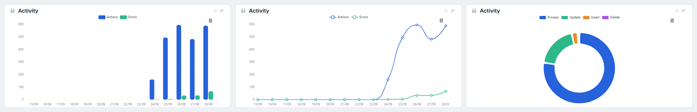
  <figcaption><code>syscth-shadcn</code>, the default theme: bars with rounded corners, points on the lines and separated slices</figcaption>
</figure>

<figure markdown="span">
  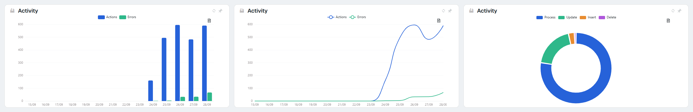
  <figcaption><code>syscth-default</code>: the shadcn palette without the rest of the theme (lines without points)</figcaption>
</figure>

<figure markdown="span">
  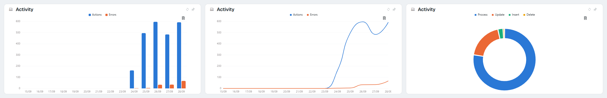
  <figcaption><code>syscth-flexygo</code>: the brand palette</figcaption>
</figure>

<figure markdown="span">
  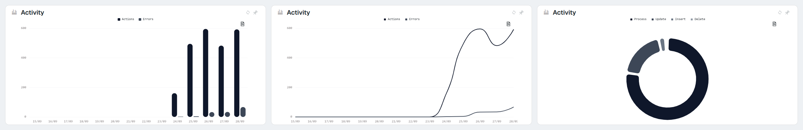
  <figcaption><code>syscth-mono</code>: monochrome, with a monospaced font and no background bar</figcaption>
</figure>

### 5.2 The ten types

The type is chosen in **Chart Type** in the form. `pie`, `doughnut` and `semidoughnut` with the actions-by-type query; `polarArea` with the actions of each day that had any, one slice per day.

| | |
|---|---|
| 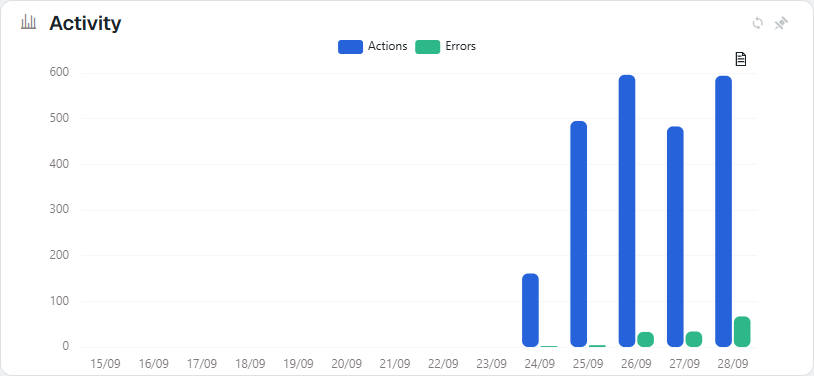 `bar` | 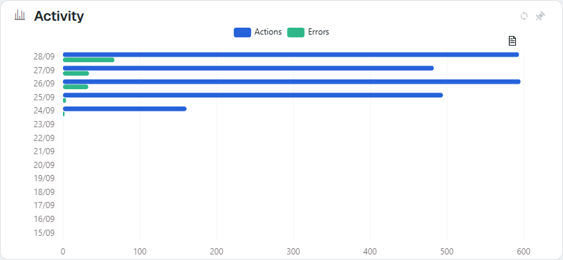 `horizontalBar` |
| 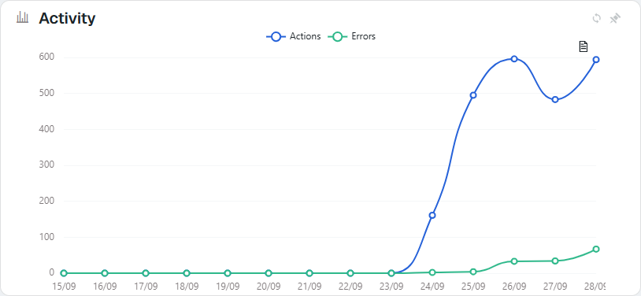 `line` | 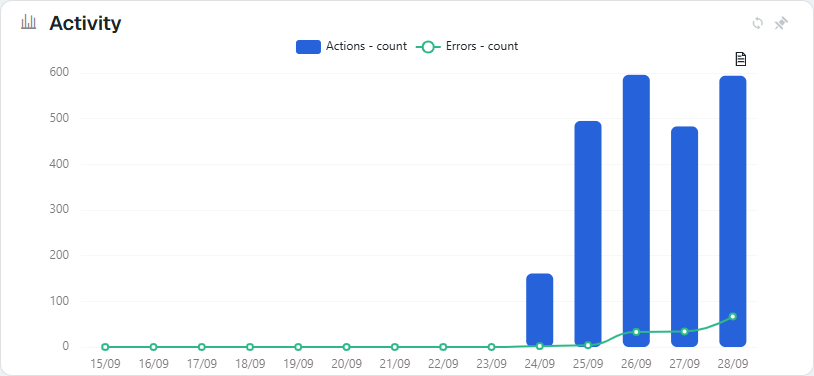 `mixed` |
| 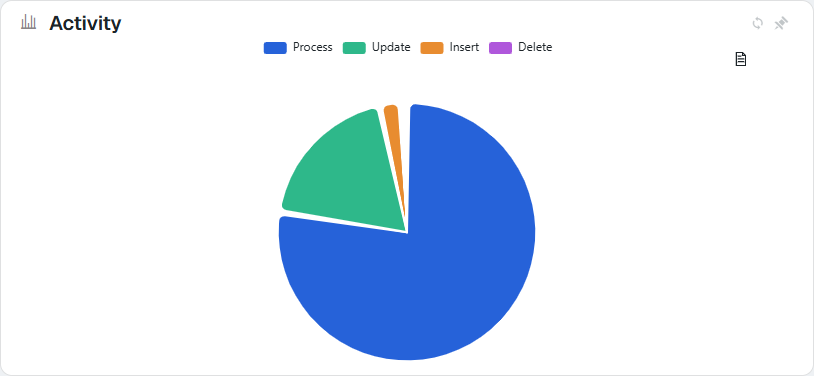 `pie` | 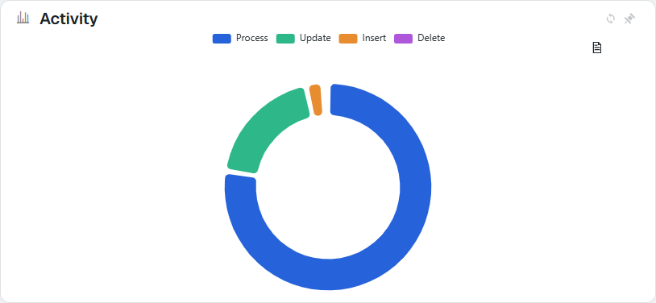 `doughnut` |
| 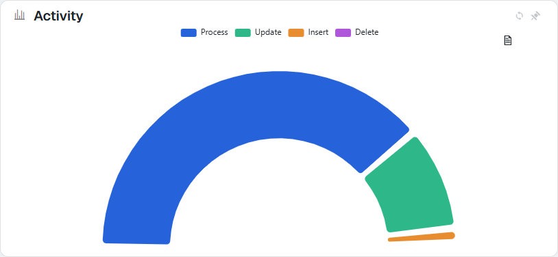 `semidoughnut` | 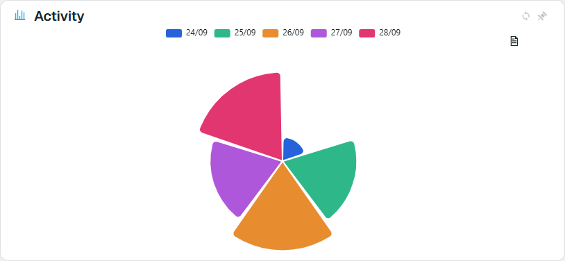 `polarArea` |
| 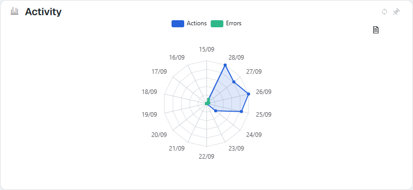 `radar` | 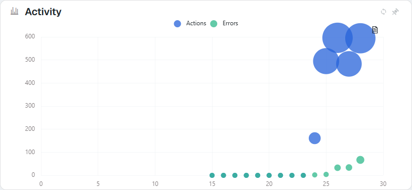 `bubble` |

`mixed` needs one SQL per series separated by `;` (actions; errors) and, in the form, **Mixed Chart Types** `bar|line` and **Mixed Chart Labels** `count|count`: each query takes its type and caption by position, and the legend joins series and caption ("Actions - count"). In `bubble` the X axis is the number in the label (`15/09` → 15) and the size of each bubble comes from its value.

### 5.3 `flx` block recipes

Each one is the `JsonOptions` shown below the image, written in **Json Options** in the form (3.2).

**Stacked series.** The same as turning on **Stack series** in the setting.

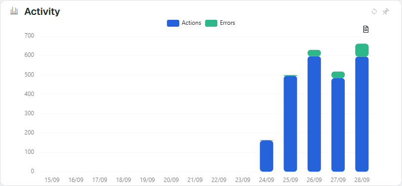

```json
{ "flx": { "series": { "stack": true } } }
```

**Average line.** ECharts calculates it over the drawn data, so it follows the filters; it goes over the first series.

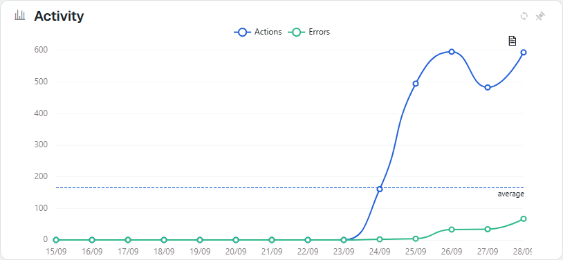

```json
{ "flx": { "markLine": { "show": true, "type": "average", "label": "average" } } }
```

**Footer strip** (skin2026 only, 3.4). The variation is calculated over what is drawn: here, the last day against the previous one.

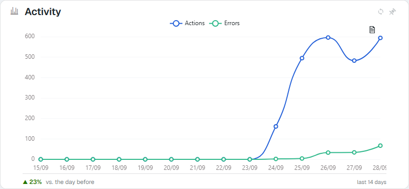

```json
{ "flx": { "footer": { "show": true, "delta": "lastPrev", "label": "vs. the day before", "context": "last 14 days" } } }
```

**Text in the doughnut hole.** `value` chooses which number is written (`sum`, `avg`, `max`, `count`) and `valueFormat` `locale` groups it by thousands.

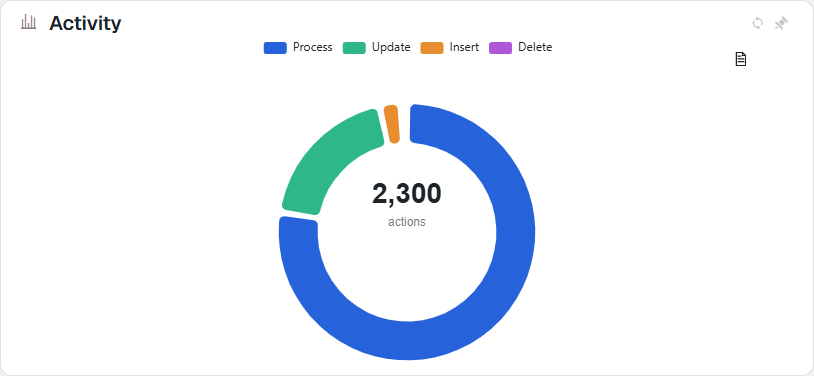

```json
{ "flx": { "centerText": { "show": true, "value": "sum", "label": "actions", "valueFormat": "locale" } } }
```

**Gaps instead of zeros.** Here the SQL does not return the *Actions* row for 26/09: with `emptyAs` `gap` the line breaks that day instead of dropping to zero.

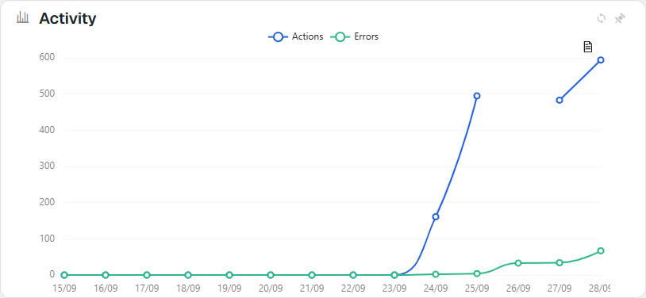

```json
{ "flx": { "series": { "emptyAs": "gap" } } }
```

**Gradient area.** It needs the area turned on (**Line Fill** in the form); `areaOpacity` changes its intensity.

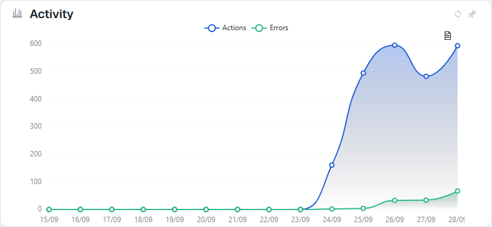

```json
{ "flx": { "series": { "areaGradient": true, "areaOpacity": 0.35 } } }
```

**Steps.** `step` accepts `start`, `middle` and `end`; a stepped line is no longer a curve.

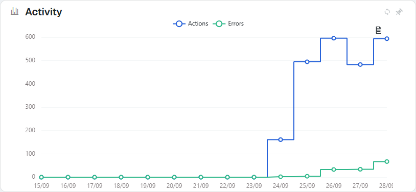

```json
{ "flx": { "series": { "step": "middle" } } }
```

**Value at the end of the line and marked maximum.** `markPoint` goes over the first series and accepts `max`, `min` or both.

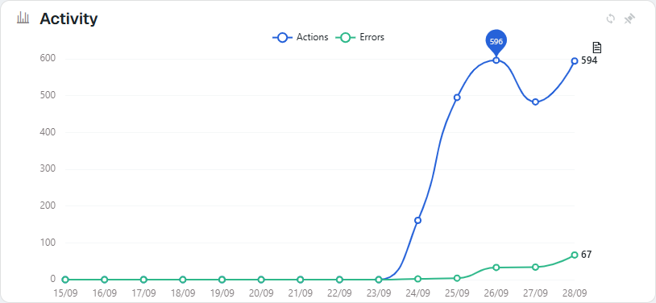

```json
{ "flx": { "series": { "endLabel": true, "markPoint": ["max"] } } }
```

**Abbreviated numbers.** With another query, the processing time of each day in milliseconds: `compact` writes `38k` in the labels, the tooltip and the axis. The same as **Number format** `compact` in the setting.

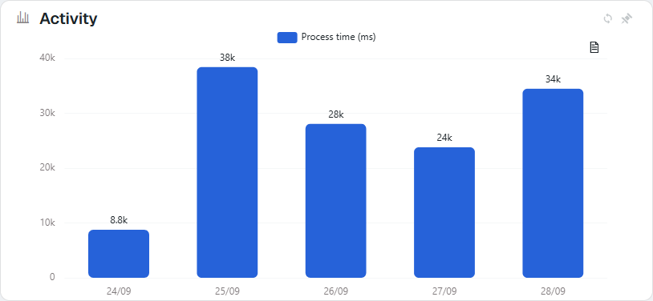

```sql
SELECT 'Process time (ms)' AS series, CONVERT(varchar(5), CAST(TimeStamp AS date), 103) AS label, SUM(Milliseconds) AS value
  FROM ActionsLog WHERE TimeStamp >= DATEADD(day, -6, CAST(GETDATE() AS date))
 GROUP BY CAST(TimeStamp AS date) ORDER BY CAST(TimeStamp AS date)
```

```json
{ "flx": { "numberFormat": "compact", "showLabels": true } }
```

**Labels inside the pie.** With `inside`, legend and labels coexist; `pieLabelMinPercent` removes the label from slices that are too thin (here, those under 5 %).


```json
{ "flx": { "pieLabelPosition": "inside", "pieLabelMinPercent": 5, "showLabels": true } }
```

### 5.4 The data view

The icon at the top right opens the chart's data table, with translated captions and the skin colours; **Close** goes back to the drawing. It is turned off with **Data view menu** in the setting or with `{"flx":{"dataView":false}}`.

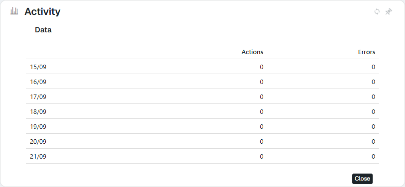

### 5.5 `JsonOptions` that is not JSON

Here a closing brace is missing. The chart is rendered anyway, without those options; a floating warning appears and, with **development mode** on, the red line stays above the drawing until it is fixed.

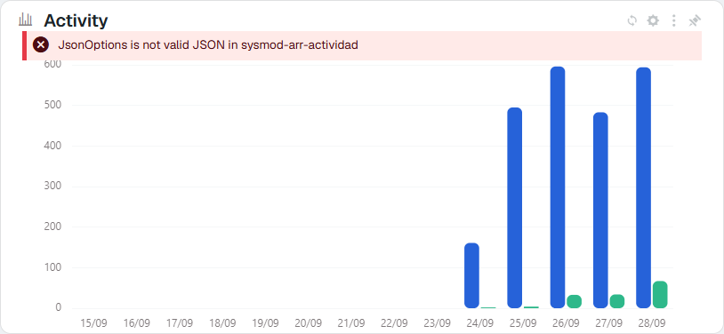

### 5.6 No data

With **Empty** written in the form ("No activity in the last 14 days"), and with **Empty** blank, the generic text:

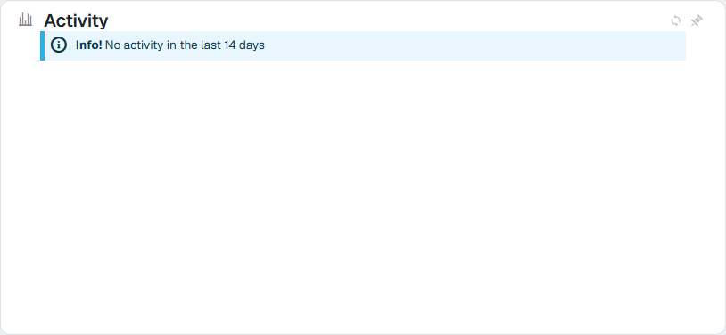

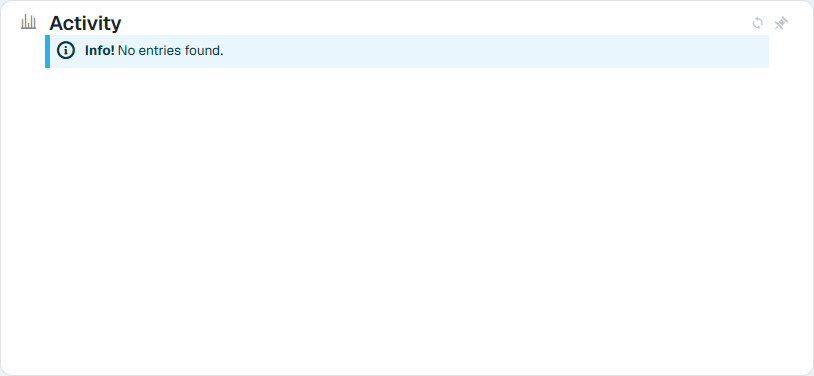
