# Easy info: tarjetas, enlaces y períodos <span class="fh-version-tag" title="Disponible desde la versión 10">10.0+</span>

A partir de la **versión 10** el módulo `flx-easyinfo` dice más cosas con el mismo contrato de siempre: **cada columna que devuelve el SQL llega al componente con su nombre**, y las capacidades nuevas se encienden **devolviendo una columna más**. No hay ningún ajuste que aprender ni JSON que escribir: todo lo propio de una baldosa va en su fila del SQL, que es además donde se traducen sus textos.

Esta página es la referencia completa del easy info en esta versión: **qué llega al actualizar**, **el contrato del SQL entero** (lo de siempre y lo nuevo en una sola tabla), **la tarjeta de una baldosa**, **el conmutador de período**, **qué campos de la ficha del módulo lee y cuáles no**, **el modo por atributos**, **cada modo en imagen con el SQL que lo produce** y cómo comprobarlo. Todo funciona igual en **skin2026 y flexy2022**: la estructura es común y cada piel pone sus colores. La pantalla de inicio del administrador está construida entera con esto y sirve de ejemplo.

<figure markdown="span">
  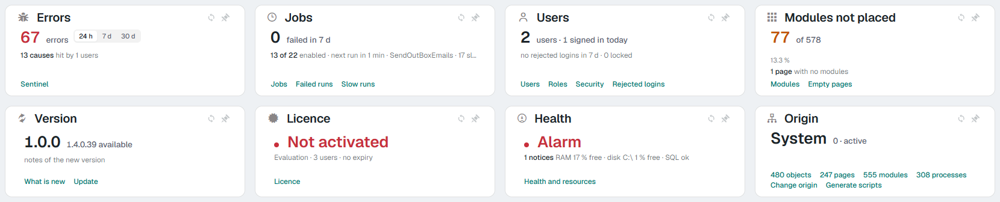
  <figcaption>Ocho easy info de una fila cada uno, en la pantalla de inicio de skin2026. Errores lleva el conmutador de período; Origen, seis enlaces al pie; Módulos sin colocar, la barra de <code>target</code></figcaption>
</figure>

---

## 0. Al actualizar un producto

### 0.1 Qué llega solo con los paquetes

| Paquete | Qué trae |
|---|---|
| `{Producto}.Frontend` | El componente `flx-easyinfo` con la tarjeta, las columnas nuevas, el conmutador y el aviso de columnas desconocidas en modo desarrollo (1.6), más sus textos en los siete idiomas |
| `{Producto}.Backend` / `.Library` | `EasyPie.GetHTML` reenvía `Modules.Empty` (el texto de vacío) y resuelve las variables de contexto (`{{currentUserId}}`, `{{currentUserCultureId}}`…) también en un módulo **sin objeto**; antes, sin objeto, quedaban como texto y la consulta no casaba nada |
| `{Producto}.Conf.Database` | La fila de `Modules_Types` del tipo **«EasyInfo Rows»** (`flx-easyinfo mode="rows"`, 1.3) y las reglas de la ficha del módulo para los dos tipos: **`Empty` se ve** y **Toolbar se oculta** (2.1), y la **ayuda del campo SQL Sentence** con las columnas de cada tipo. Las cinco tarjetas de la pantalla de inicio del administrador que salen de un SQL (Errores, Jobs, Usuarios, Módulos sin colocar y Origen) llevan ya `mode="card"` en **Params**. Todo con origen 0, por los `MERGE` de siempre |

### 0.2 Qué cambia sin tocar nada

| Piel | Qué ve el usuario |
|---|---|
| **Las dos** | Un easy info sigue siendo una baldosa, o una tira de baldosas, como siempre. La **tarjeta** (1.2) es nueva y se pide con `mode="card"` en **Params** del módulo: sin el rótulo pequeño de la baldosa —el título es el del módulo—, el badge al principio de la sublínea y el número con el color del tono. Los números se agrupan por miles con la cultura del usuario, `color` acepta los seis nombres semánticos (1.1), un módulo sin filas dice siempre algo (1.5), los nombres de columna **no distinguen mayúsculas** y, **en modo desarrollo**, una columna que el componente no lee se avisa en el propio módulo (1.6). |
| **flexy2022** | Es la piel donde más se nota: hasta esta versión flexy2022 ignoraba `actions`, `scope`, `series` y `target`, no tenía tarjeta ni lista, y un módulo sin filas quedaba en blanco. Ahora pinta lo mismo que skin2026, con sus colores. Las tiras de contadores por atributos de las plantillas (la del área de administración, por ejemplo) se ven como antes. |
| **skin2026** | Tres arreglos: el sparkline ya no pisa los enlaces del pie, la lista con columnas nuevas se queda en icono · rótulo · badge · valor, y el color de una baldosa sin icono va al número. |

Ningún módulo cambia a tarjeta solo por actualizar: la tarjeta hay que pedirla. Tampoco depende de cuántas filas devuelva la consulta, así que un módulo no cambia de aspecto el día que su SQL devuelve una fila más.

<figure markdown="span">
  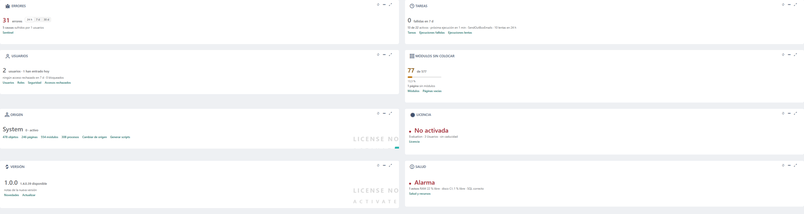
  <figcaption>Los mismos módulos abiertos con el perfil flexy2022: la misma estructura con los colores de esa piel</figcaption>
</figure>

### 0.3 Qué hay que hacer

Nada obligatorio. Lo nuevo se adopta módulo a módulo, añadiendo columnas al SQL (1.1) o eligiendo el tipo «EasyInfo Rows» del combo de tipo del módulo (1.3). Si un módulo tenía botones en **Toolbar**, no se pintaban nunca y la ficha ya no enseña el campo: lo que hacían esos botones se pone en `click` o en `actions` (1.1).

---

## 1. Referencia del contrato del SQL

Un easy info es una consulta cuyas filas son baldosas. El componente lee **el alias de cada columna**, **sin distinguir mayúsculas** (`value`, `Value` y `VALUE` son la misma; si una fila trae dos grafías de la misma columna, gana la escrita en minúsculas). **El orden de las baldosas es el del `ORDER BY`** de la consulta.

La ayuda (ⓘ) del campo **SQL Sentence** de la ficha resume esta tabla.

### 1.1 Columnas, una fila = una baldosa

| Columna | Qué hace | Desde | |
|---|---|---|---|
| `value` | El número grande. Se agrupa por miles con la cultura del usuario (`2.696`); un valor que el SQL ya formatea (`10,6 min`, `92,4 %`) se respeta tal cual. Vacío pinta `—` en tinta atenuada (un `0` es un dato y se pinta) | siempre | la única necesaria |
| `label` | El rótulo pequeño encima del número | siempre | en la tarjeta (1.2) no se pinta: el título es el del módulo |
| `iconclass` | Clase del icono (`flx-icon icon-bug`) | siempre | en la tarjeta no se pinta: el icono es el del módulo |
| `color` | Un literal (`#ff9a02`) **o uno de los seis nombres**: `danger`, `warning`, `ok`, `info`, `accent`, `muted`. Con nombre, la piel elige la tinta según el modo (claro/oscuro) y con contraste medido; con literal se pinta tal cual. Tiñe el icono; en una baldosa sin icono, y en la tarjeta, el número | nombres: **v10** | |
| `symbol` | Texto junto al número: la unidad (`%`, `€`) o, en la tarjeta, un calificativo (`in 24 h`) | siempre | |
| `click` | Script al pulsar la baldosa entera (`flexygo.nav.openPage(…)`) | siempre | |
| `variation` | Badge de variación (`+12 %`, `2 causes`). En la tarjeta se pinta al principio de la sublínea, en tinta | v10 | |
| `trend` | Línea de tendencia con el icono delante | v10 | |
| `trendlabel` | La sublínea atenuada bajo el número | v10 | |
| `target` | El total contra el que se mide `value`: enciende «de N» junto al número, la barra de progreso y el porcentaje | v10 | |
| `series` | Números separados por comas, el más viejo primero: dibuja un sparkline al pie, en el color del tono | v10 | |
| `actions` | **Enlaces al pie de la baldosa**, uno por línea: `Texto\|script`. Cada uno lleva su propio `onclick` y no dispara el `click` de la baldosa. Se separan con salto de línea (`CHAR(10)`) y no con `;`, porque un script lleva puntos y coma | v10 | |
| `scope` | **Rótulo del período** (`24 h`, `7 d`, `30 d`, o cualquier otro texto). Si **todas** las filas la traen, la tarjeta pinta una y un conmutador para cambiar de fila (1.4) | v10 | en tarjeta |
| `size` | Tamaño de la baldosa en la tira (`s`, `m`, `l`) | siempre | en la tarjeta se ignora: la baldosa rellena el módulo |

Cualquier otra columna **no se lee**, y en modo desarrollo el módulo lo dice (1.6). Con una excepción: **`OrderTiles`**. Muchos módulos la devuelven porque se tenía por la columna que ordena las baldosas, pero no la lee nadie y no ordena nada (ordena el `ORDER BY` que suele acompañarla); se tolera sin aviso.

Todo texto que el usuario lea se traduce en el propio SQL, como en cualquier módulo: `dbo.fTranslateArea('{{currentUserCultureId}}', N'texto', 'Templates')`, con su fila en `Translate` para cada cultura.

### 1.2 La tarjeta de una baldosa

Se pide escribiendo `mode="card"` en **Params** de la ficha del módulo (Params se pega tal cual a la etiqueta del componente). Pinta una fila: la primera, o la elegida en el conmutador si todas traen `scope` (1.4). Si la consulta devuelve varias filas sin `scope`, se pintan como tira aunque el módulo pida la tarjeta. Sin `mode="card"`, el easy info es siempre una baldosa o una tira, devuelva una fila o veinte.

Lo que cambia respecto a la baldosa de la tira: la baldosa rellena el módulo y pierde su borde propio (la tarjeta es el módulo); no pinta `label` ni `iconclass` (título e icono son los del módulo: **Title** e **Icon** de la ficha); `variation` abre la sublínea en negrita; el número toma la tinta del tono (`color`); un `value` que no es un número («Not activated», «Warning») lleva delante un punto del color del tono; `symbol` se pinta como calificativo junto al número; y `actions` va al pie, en la tinta de enlace, saltando de línea si no cabe.

La cabecera del módulo es lo que permite que el usuario **arrastre y fije** la tarjeta en una página con «Users can reorder», como cualquier otro módulo.

### 1.3 La disposición en filas es un tipo de módulo

En el combo **Type** del módulo, «EasyInfo Rows» (`flx-easyinfo mode="rows"`) pinta las baldosas como una lista compacta: icono y rótulo a la izquierda; badge (`variation`) o sublínea (`trendlabel`) y valor a la derecha. Lo demás de la tarjeta (`trend`, `target`, `series`, `actions`) no cabe en una fila y no se dibuja. Es el mismo componente con un atributo, igual que `flx-objectlist` y `flx-editlist` son un `flx-list` con distinto `mode`.

La misma disposición se pedía antes escribiendo `easyinfo-compact` en **ModuleClass**, y sigue funcionando. También vale `mode="compact"` en **Params**: es lo mismo que `mode="rows"`.

### 1.4 El conmutador de período

Si el SQL devuelve varias filas y **todas** llevan `scope`, la tarjeta pinta **una** (la que el usuario eligió la última vez para ese módulo, o la primera) y un control segmentado arriba a la derecha con un botón por fila. Al pulsar, cambia de fila **sin volver al servidor** —las filas ya están— y guarda la elección por usuario y módulo (`flexygo.storage.local`). Cada fila lleva sus propios `value`, `variation`, `trendlabel`, `click` y `actions`, así que el enlace también puede seguir al período.

<figure markdown="span">
  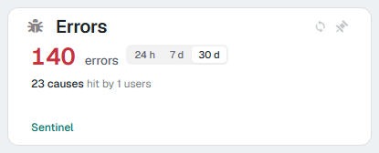
  <figcaption>Errores con el conmutador en «30 d»: valor, causas, usuarios y el enlace a Sentinel cambian con el período</figcaption>
</figure>

El rótulo es libre: sirve para períodos, y también para «Mías / Todas», «Este año / Anterior» o «Pendientes / Cerradas». Solo se pinta en la tarjeta (`mode="card"`); sin ella las filas salen como baldosas, una por período.

Este es el SQL de la tarjeta de errores de la pantalla de inicio, que devuelve tres filas con la misma consulta:

```sql
SELECT s.scope, v.n AS value,
       dbo.fTranslateArea('{{currentUserCultureId}}', N'errors', 'Templates') AS symbol,
       CASE WHEN v.n = 0 THEN 'muted' ELSE 'danger' END AS color,
       CASE WHEN v.c > 0
            THEN REPLACE(dbo.fTranslateArea('{{currentUserCultureId}}', N'{0} causes', 'Templates'), '{0}', CAST(v.c AS varchar(12)))
            ELSE '' END AS variation,
       CASE WHEN v.u > 0
            THEN REPLACE(dbo.fTranslateArea('{{currentUserCultureId}}', N'hit by {0} users', 'Templates'), '{0}', CAST(v.u AS varchar(12)))
            ELSE dbo.fTranslateArea('{{currentUserCultureId}}', N'nothing to report', 'Templates') END AS trendlabel,
       CAST(REPLACE(REPLACE(N'flexygo.nav.openPageName(^syspage-sentinel-2026^,null,null,^{"since":"#"}^,^current^,false,null)', '^', CHAR(39)), '#', s.code) AS nvarchar(400)) AS click,
       dbo.fTranslateArea('{{currentUserCultureId}}', N'Sentinel', 'Templates') + '|'
         + REPLACE(N'flexygo.nav.openPageName(^syspage-sentinel-2026^,null,null,null,^current^,false,null)', '^', CHAR(39)) AS actions,
       s.ord AS OrderTiles
  FROM (VALUES (1, dbo.fTranslateArea('{{currentUserCultureId}}', N'24 h', 'Templates'), DATEADD(hour, -24, GETDATE()), '24h'),
               (2, dbo.fTranslateArea('{{currentUserCultureId}}', N'7 d',  'Templates'), DATEADD(day,  -7, GETDATE()), '7d'),
               (3, dbo.fTranslateArea('{{currentUserCultureId}}', N'30 d', 'Templates'), DATEADD(day, -30, GETDATE()), '30d')) s(ord, scope, since, code)
 CROSS APPLY (SELECT COUNT(1) AS n,
                     COUNT(DISTINCT LEFT(ErrorMessage, 120)) AS c,
                     COUNT(DISTINCT UserId) AS u
                FROM Error_Log WHERE TimeStamp >= s.since) v
 ORDER BY s.ord
```

Tres detalles de escritura: los `^` son apóstrofes (`REPLACE(…, '^', CHAR(39))` evita las comillas dobladas dentro del literal), el `#` es donde entra el código del período en el enlace, y el orden de los botones lo da el `ORDER BY s.ord` (la columna `OrderTiles` del ejemplo es de los módulos de antes y no hace nada, 1.1).

Y este es el pie de enlaces de la tarjeta de Origen, seis en dos líneas:

```sql
REPLACE(dbo.fTranslateArea('{{currentUserCultureId}}', N'{0} objects', 'Templates'), '{0}', CAST((SELECT COUNT(1) FROM Objects WHERE OriginId = o.OriginId) AS varchar(12)))
  + '|' + REPLACE(N'flexygo.nav.openPage(^list^,^sysObjects^,^(Objects.OriginId = dbo.funNet_GetOrigin())^,null,^current^,false,null)', '^', CHAR(39))
  + CHAR(10) + … /* pages, modules, processes */
  + CHAR(10) + dbo.fTranslateArea('{{currentUserCultureId}}', N'Change origin', 'Templates')
  + '|' + REPLACE(N'flexygo.nav.openProcessParams(^SetNewOrigin^,^^,^^,null,^modal^,false,null)', '^', CHAR(39)) AS actions
```

### 1.5 El texto de vacío

Si el SQL no devuelve filas, el módulo dice lo que ponga su campo **Empty** (en la ficha, bajo Connection String) y, si está en blanco, el texto genérico («Nothing to report», traducido), con la forma de un hueco punteado del tamaño de una tarjeta.

`Empty` se escribe como **texto**, no como HTML: una etiqueta sale literal.

### 1.6 El aviso de columnas mal escritas (modo desarrollo)

Con el **modo desarrollo** encendido, si el SQL devuelve una columna que **parece un error**, el módulo pone un **icono rojo junto a su título**; el aviso completo sale al pasar el ratón por encima. Solo avisa de dos cosas:

- **Una columna escrita casi como una que el componente lee**: `vaule`, `lable`, `Colour`… (una letra de diferencia en los nombres cortos, dos en los largos; dos letras cambiadas de sitio cuentan como una). El aviso dice cuál parece.
- **Una columna sin nombre**: una expresión del `SELECT` sin alias, que SQL Server devuelve como `Column1`.

> sysmod-arr-usuarios cannot use these columns of its SQL:<br>
> vaule: did you mean value?<br>
> Column1: a column with no alias

Las columnas de trabajo que el componente no usa (`cssclass`, `OrderBy`, `class`, cualquier otra que no se parezca a una suya) **no avisan**: se ignoran, como siempre. Tampoco avisa `OrderTiles` (1.1). Quien no está en modo desarrollo no ve nada, y el icono no cambia el alto del módulo ni tapa las baldosas.

---

## 2. Qué se configura y dónde

### 2.1 Los campos de la ficha del módulo

Con el tipo EasyInfo o EasyInfo Rows, la ficha enseña solo lo que el componente usa:

| Campo | Qué hace en un easy info |
|---|---|
| **SQL Sentence** y **Connection String** | La consulta (1) y la base contra la que corre. Obligatorios. La ⓘ del campo resume el contrato |
| **Object Name** y **Object Filter** | Con objeto, la consulta ve los campos del registro (`{{Id}}`…) y `Object Filter` se le añade como `WHERE`. Sin objeto, la consulta ve igualmente las variables de contexto |
| **Empty** | El texto de vacío (1.5) |
| **Title** e **Icon** | La cabecera del módulo, que en la tarjeta (1.2) es su título y su icono |
| **ModuleClass** | Clases del módulo que cambian el easy info: `noheader` (sin cabecera), `easyinfo-tall` (las baldosas de una tira rellenan el alto del módulo, con los enlaces al fondo) y `easyinfo-compact` (la disposición en filas; mejor el tipo «EasyInfo Rows», 1.3) |
| **Header Class**, **Full Screen / Collapsible / Refresh Button**, **Container** | Los del módulo, como en cualquier tipo. «Refresh» vuelve a pedir el SQL |
| **Params** | Atributos que se pegan a la etiqueta del componente, como en cualquier módulo. `mode="card"` pide la tarjeta (1.2); `mode="rows"` (o `mode="compact"`, que es lo mismo) da la lista, igual que el tipo «EasyInfo Rows» |
| **Manual Init**, **JSAfterLoad**, **Skeleton** | Los de cualquier módulo |

**No están, a propósito:**

- **Toolbar**: el easy info nunca ha pintado botones de barra de herramientas, y la ficha ya no enseña el campo con estos dos tipos. Lo que abre una baldosa va en `click` y en `actions`.
- **Search Button**: la ficha lo enseña con cualquier tipo de módulo, pero el easy info no lo lee: marcado o no, no sale ningún botón de búsqueda.
- **Json Options**: no hay nada que configurar por JSON. Lo que en otras visualizaciones sería una opción del módulo, aquí es una columna de la fila, porque cada baldosa de un mismo módulo puede querer la suya (color, tamaño, enlaces) y porque en el SQL sus textos se traducen.

### 2.2 Cada piel, sus colores

La estructura (tarjeta, tira, lista, conmutador, barra, sparkline, enlaces, vacío) está en la hoja común del componente, `skins/default/wc/flx-easyinfo.less`, y todo lo que es color sale de variables. Cada piel las resuelve con su paleta: skin2026 con sus tintas medidas para claro y oscuro, flexy2022 con sus colores base (`--danger-color`, `--warning-color`, `--success-color`, `--info-color`, `--outstanding-color`, `--txt-module-color`), oscurecidos en claro para que el número del tono pase el contraste de texto (medido: 6,7 a 7,2 en claro y 5,1 a 7,6 en oscuro). Una piel de producto que quiera otros tonos solo tiene que redefinir `--flx-tone-ink` y `--flx-tone-solid` en `.flx-statcard.flx-tone-<nombre>`.

---

## 3. El modo por atributos

Un `<flx-easyinfo>` suelto en cualquier HTML —una plantilla, un módulo `flx-html`— se pinta desde sus atributos, con el **mismo juego de columnas**: `value`, `symbol`, `label`, `iconclass`, `color`, `click`, `variation`, `trend`, `trendlabel`, `series`, `target`, `actions`.

```html
<flx-easyinfo value="37" target="424" color="warning" trendlabel="with no modules"></flx-easyinfo>
```

La tarjeta (1.2) **no se deduce**: por atributos se pide con `mode="card"`, porque una baldosa colgada de una plantilla de lista tiene que seguir siendo baldosa. Es lo que usan las tarjetas de Versión, Licencia y Salud de la pantalla de inicio, que no tienen SQL: un módulo `flx-html` con `<flx-easyinfo mode="card" manualInit="true" value="">`, y su `ScriptText` pide el dato a la API, rellena los atributos, asigna `value` y llama a `init()`.

```javascript
(function () {
  var el = document.getElementById('arr-version');
  flexygo.ajax.get('~/api/Versions', 'latest', null, function (r) {
    el.setAttribute('symbol', r.UpdateAvailable ? r.LatestVersion + ' available' : 'up to date');
    el.setAttribute('actions', 'Update|flexygo.nav.openURL(\'./version-info\',\'\',\'current\',false,null)');
    el.value = r.CurrentVersion; el.init();
  });
})();
```

Los textos de un módulo así se traducen con `{{translate|…}}` en atributos `data-*` del propio elemento, que la plantilla compila al pintar el HTML, y el script los lee de ahí.

Por atributos no hay texto de vacío ni aviso de columnas: los atributos son los que son.

---

## 4. Los modos, en imagen

Cada imagen es un módulo configurado solo desde su ficha: el tipo, el título, a veces **ModuleClass** o **Empty**, y la consulta de **SQL Sentence** que se muestra debajo. Todas en skin2026 claro a 1920 px; en flexy2022 se ven igual con sus colores (hay alguna al lado para comparar).

### 4.1 Cómo se elige el modo

| Modo | Cuándo sale | Se elige con | Pieles |
|---|---|---|---|
| Tarjeta | Se pide | `mode="card"` en **Params** | las dos |
| Tarjeta con conmutador | Tarjeta y varias filas, todas con `scope` | `mode="card"` + el SQL | las dos |
| Baldosa o tira de baldosas | Siempre que no se pida otra cosa: una fila, una baldosa; varias, una tira | por defecto | las dos |
| Tira alta | `easyinfo-tall` en ModuleClass | ModuleClass | las dos |
| Sin cabecera | `noheader` en ModuleClass | ModuleClass | las dos |
| Lista | Tipo «EasyInfo Rows» (o `easyinfo-compact` en ModuleClass) | combo **Type** | las dos |
| Vacío | La consulta no devuelve filas | campo **Empty** | las dos |
| Por atributos | `<flx-easyinfo …>` en el HTML de un módulo HTML | el HTML del módulo | las dos |
| Aviso de columnas | Modo desarrollo y una columna que no se lee | automático | las dos |

### 4.2 Tarjeta

Todas las de esta sección llevan `mode="card"` en **Params**. Sin él, la misma consulta de una fila es una baldosa:

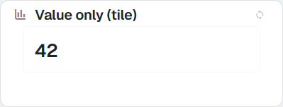

```sql
SELECT 42 AS value
```

La tarjeta típica, con unidad, badge, sublínea, clic en la tarjeta y dos enlaces al pie:

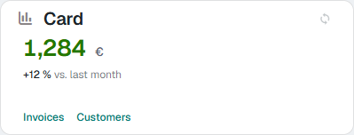

```sql
SELECT 1284 AS value, '€' AS symbol, 'ok' AS color, '+12 %' AS variation, 'vs. last month' AS trendlabel,
       'flexygo.nav.openPage(''list'',''sysJobs'',null,null,''current'',false,null)' AS click,
       'Invoices|flexygo.nav.openPage(''list'',''sysJobs'',null,null,''current'',false,null)' + CHAR(10)
     + 'Customers|flexygo.nav.openPage(''list'',''sysUsers'',null,null,''current'',false,null)' AS actions
```

Un valor que es una palabra lleva delante el punto del tono:

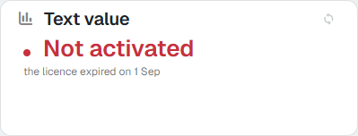

```sql
SELECT 'Not activated' AS value, 'danger' AS color, 'the licence expired on 1 Sep' AS trendlabel
```

Con `target` (barra y porcentaje) y con `series` (sparkline):

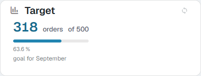

```sql
SELECT 318 AS value, 500 AS target, 'orders' AS symbol, 'info' AS color, 'goal for September' AS trendlabel
```

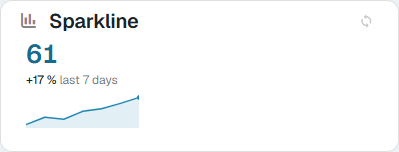

```sql
SELECT 61 AS value, 'info' AS color, '+17 %' AS variation, 'last 7 days' AS trendlabel, '20,31,28,40,44,52,61' AS series
```

La tarjeta con todas las columnas a la vez (`label` e `iconclass` no se pintan en la tarjeta: son los del módulo). Necesita un módulo algo más alto que el resto:

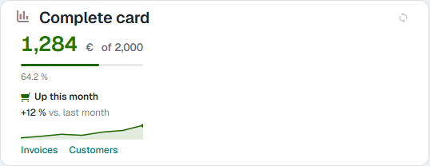

```sql
SELECT 1284 AS value, '€' AS symbol, 'ok' AS color, '+12 %' AS variation, 'Up this month' AS trend, 'vs. last month' AS trendlabel,
       2000 AS target, '620,700,810,760,920,1010,1284' AS series,
       'flexygo.nav.openPage(''list'',''sysJobs'',null,null,''current'',false,null)' AS click,
       'Invoices|…' + CHAR(10) + 'Customers|…' AS actions
```

La misma tarjeta en flexy2022:

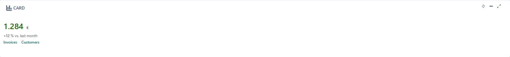

### 4.3 Tarjeta con conmutador

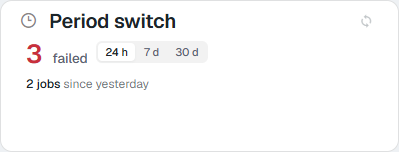

En flexy2022:

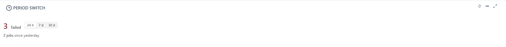

```sql
SELECT scope, value, 'failed' AS symbol, color, variation, trendlabel
FROM (VALUES (1, '24 h', 3, 'danger', '2 jobs', 'since yesterday'),
             (2, '7 d', 11, 'warning', '4 jobs', 'this week'),
             (3, '30 d', 27, 'warning', '6 jobs', 'this month')) t(ord, scope, value, color, variation, trendlabel)
ORDER BY ord
```

### 4.4 Tira de baldosas

Rótulo, icono, badge, tendencia con el icono delante, sublínea y `size`:

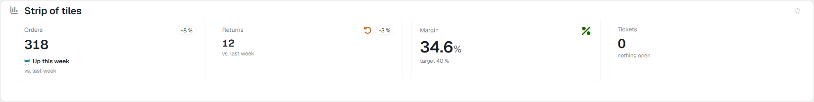

```sql
SELECT label, iconclass, value, symbol, color, variation, trend, trendlabel, size
FROM (VALUES (1, 'Orders', 'flx-icon icon-cart', '318', NULL, 'info', '+8 %', 'Up this week', 'vs. last week', 'm'),
             (2, 'Returns', 'fa-solid fa-undo', '12', NULL, 'warning', '-3 %', NULL, 'vs. last week', 's'),
             (3, 'Margin', 'fa-solid fa-percent', '34.6', '%', 'ok', NULL, NULL, 'target 40 %', 'l'),
             (4, 'Tickets', NULL, '0', NULL, 'muted', NULL, NULL, 'nothing open', 'm'))
     t(ord, label, iconclass, value, symbol, color, variation, trend, trendlabel, size)
ORDER BY ord
```

La tira en flexy2022:

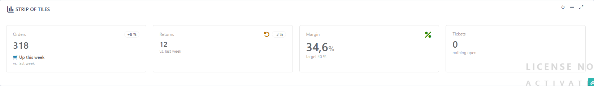

Los seis nombres de color y un literal. Sin icono, el color va al número:

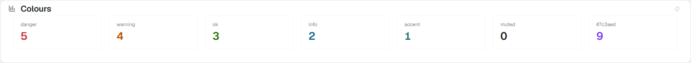

Una tira con todas las columnas:

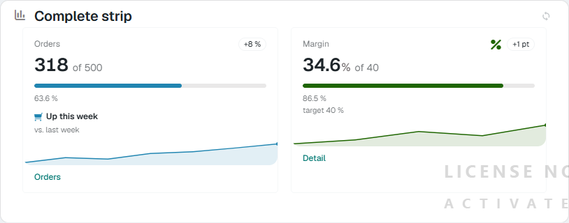

Una sola fila en un módulo con `noheader` en ModuleClass: la baldosa sin la cabecera del módulo:

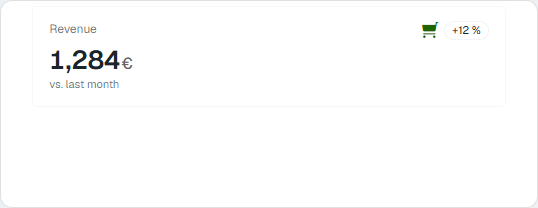

Con `easyinfo-tall` en ModuleClass, las baldosas llenan el alto del módulo y los enlaces bajan al fondo:

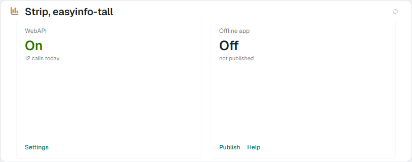

```sql
SELECT label, value, color, trendlabel, actions
FROM (VALUES (1, 'WebAPI', 'On', 'ok', '12 calls today', 'Settings|flexygo.nav.openPage(''list'',''sysJobs'',null,null,''current'',false,null)'),
             (2, 'Offline app', 'Off', 'muted', 'not published', 'Publish|…' + CHAR(10) + 'Help|…'))
     t(ord, label, value, color, trendlabel, actions)
ORDER BY ord
```

### 4.5 Lista («EasyInfo Rows»)

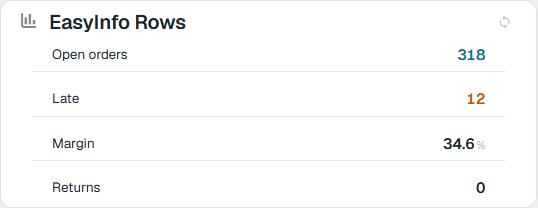

```sql
SELECT label, value, symbol, color
FROM (VALUES (1, 'Open orders', '318', NULL, 'info'), (2, 'Late', '12', NULL, 'warning'),
             (3, 'Margin', '34.6', '%', NULL), (4, 'Returns', '0', NULL, 'muted')) t(ord, label, value, symbol, color)
ORDER BY ord
```

El mismo módulo en flexy2022:

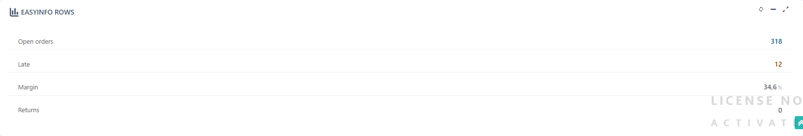

Con todas las columnas, la lista se queda en icono, rótulo, badge o sublínea y valor:

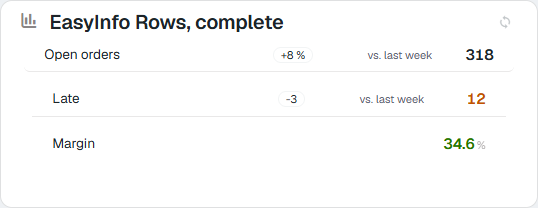

### 4.6 Sin filas

Con **Empty** escrito («No orders waiting today») y con **Empty** en blanco:

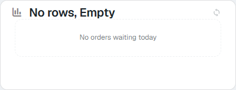

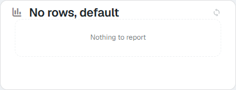

### 4.7 Por atributos, en un módulo HTML

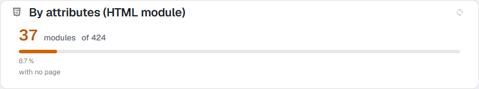

```html
<flx-easyinfo mode="card" value="37" target="424" color="warning" symbol="modules" trendlabel="with no page"></flx-easyinfo>
```

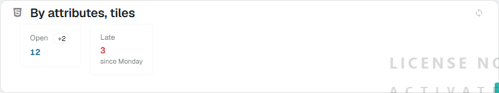

```html
<flx-easyinfo value="12" label="Open" color="info" variation="+2"></flx-easyinfo>
<flx-easyinfo value="3" label="Late" color="danger" trendlabel="since Monday"></flx-easyinfo>
```

### 4.8 Columna mal escrita (modo desarrollo)

<figure markdown="span">
  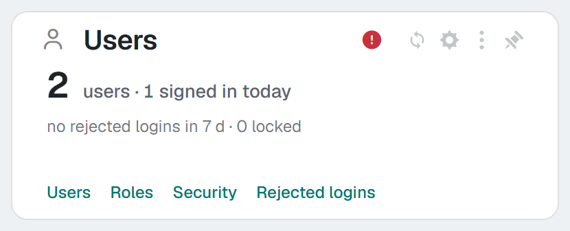{ width="420" }
  <figcaption>El aviso es un icono junto al título; el texto sale al pasar el ratón</figcaption>
</figure>

```sql
SELECT 2 AS vaule, 'users' AS label, COUNT(*)   -- vaule: did you mean value?  ·  la tercera, sin alias
```

---

## 5. Cómo comprobarlo

1. Abrir la página con el perfil skin2026 y con flexy2022 (cambiando el perfil de verdad, no con el «Change profile» del menú).
2. En skin2026: un módulo con `mode="card"` en Params se ve como tarjeta y uno sin él como baldosa, los enlaces del pie abren lo suyo, el conmutador cambia de fila y recuerda la elección al recargar; en oscuro, el número toma el tono.
3. En flexy2022: lo mismo que en skin2026, con los colores de flexy2022, en claro y en oscuro.
4. Un easy info sin filas dice su `Empty` y, con `Empty` en blanco, el texto genérico.
5. Con el modo desarrollo encendido, un alias mal escrito en el SQL sale nombrado en el módulo; con el modo apagado, no.
6. En la ficha de un módulo de tipo EasyInfo: se ve **Empty**, no se ve **Toolbar**, y la ⓘ de **SQL Sentence** abre la ayuda con las columnas.
