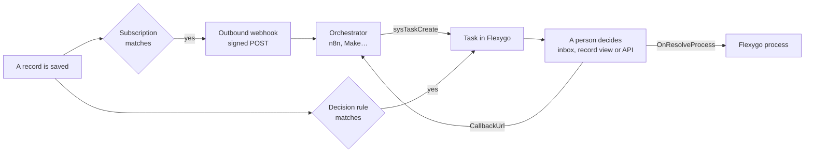

# Approvals, human tasks and outbound webhooks

Flexygo does not orchestrate automations: that is what n8n, Make, Zapier or any other orchestrator is for. What it does do is **what an orchestrator cannot do on its own**: open a **decision** to a person or a role inside the application, with its inbox, its deadline and its escalation, and **notify the outside world** when a record changes (**outbound webhooks**). The two pieces combine into a circuit:



The orchestrator and the callback are optional: a **decision rule** opens tasks on save without leaving Flexygo, and an outbound webhook serves any HTTP receiver even if there is no task behind it.

---

## 1. Human tasks (decisions)

A **task** is a question with options —*Approve* / *Reject* by default— addressed to a role, to a person, or to a person within a role, about a record or without one. It lives in the `Tasks` table (`sysTask` object), with its history in `Tasks_Log`.

| Where it is decided | What is there |
|---|---|
| **Decisions** (menu node, with a counter) | The inbox: *Mine* · *My roles* · *All open* · *Resolved*, with the options on the row and the link to the record. |
| **The task record view** (`sysTask`) | The *Resolve*, *Reassign* and *Cancel* processes in the process menu (only while it is pending). |
| **The record's record view** | The `sysmod-task-decision-2026` module (can be placed on any record view page) shows the pending tasks of that record with their buttons, the comment and the history. |
| **The bell** | Each pending task leaves a notice (`Notices`) for the user or the role members; it expires when the task is decided, cancelled, reassigned or expires. |
| **The web API** | The same processes, see §3. |

### Statuses and priorities

| `Status` | When |
|---|---|
| `pending` | Open, waiting for someone. |
| `resolved` | Someone chose an option (`Outcome`), with or without a `Comment`. |
| `cancelled` | It was cancelled without a decision. |
| `expired` | The deadline passed and there was no one to escalate to. |

`Priority`: `0` normal, `1` high, `2` urgent.

### Deadline and escalation

The **`flxTaskEscalation`** job (every 5 minutes, `sysTaskEscalation` process) looks at overdue pending tasks:

- At `DueDate + EscalateAfter` minutes, if the task names a target (`EscalateToRoleId` or `EscalateToUserId`), it **escalates only once**: the target becomes the assignee, `escalated` is recorded in the log and the new assignee is notified.
- If it names no target, it **expires** (`expired`, `expired` action in the log).
- Without `EscalateAfter`, the task only shows as overdue: nobody moves it.

### What happens on decision

1. It checks that the person deciding is allowed —the assigned user, anyone with the assigned role, an administrator, or anyone if the task is not assigned; role membership is read from the database at that moment— and that there is a comment if the task or the option requires one (`RequireComment`, or `requireComment` on the option).
2. `resolved` is written with `Outcome`, `Comment`, `ResolvedBy` and `ResolvedDate`, along with the log.
3. If the task has an **`OnResolveProcess`**, that Flexygo process is run with `TaskId`, `Outcome`, `Comment`, `ObjectName`, `ObjectWhere` and `CorrelationId`, bound to the task's record if it has one. **The decision stands even if the process fails**: the failure comes back as a warning (`WarningMessage`) and in `Data` (`OnResolveProcessSuccess: false`).
4. If the task has a **`CallbackUrl`**, a webhook with the result is queued (§5). The same happens on cancel and on expiry.

---

## 2. Decision rules

A **rule** (`Tasks_Rules`, `sysTaskRule` object, *Decision rules* node under *Logic and Rules*, and the *Decisions* section of the object's workbench) opens a task when a record of the object is saved, with no code. It is evaluated after the save is committed, whether it comes from a screen or from the web API; whoever saves does not need permission on the task processes.

| Field | What for |
|---|---|
| **Object** | The object being watched. |
| **After insert / After update** | On which saves it is evaluated. |
| **Only if** (`Condition`) | A `WHERE` on the object's table; the rule fires if the saved record meets it. Empty: always. |
| **Title / Description** | Templates with `{{Field}}` from the record (and `{{currentUserLogin}}` and the rest of Flexygo's placeholders). |
| **Options** | JSON `[{"id":"approve","label":"Approve"},{"id":"reject","label":"Reject","requireComment":true}]`. Empty: *Approve* / *Reject*. |
| **Require a comment** | Makes a comment mandatory for any option. |
| **Assigned role / user** | Who it is opened to. Role and user together: the person within the role. |
| **Priority** and **Urgent if** | A fixed priority, and a `WHERE` that raises it to urgent when the record meets it. |
| **Due in (minutes)** | Deadline from the moment it is opened. |
| **Escalate after / to role / to user** | The escalation from §1. |
| **On resolve process** | Process that receives the result (§1). |
| **Callback URL / secret ref** | To notify an orchestrator on decision (§5). |
| **Enabled** | A disabled rule does not fire. |

!!! tip "Test with a record"
    In the rule's record view, the **Test with a record** process asks for a `WHERE` that names a record (`Id = 'admins'`) and shows the task it would open —rendered title, assignee, priority, due date, escalation and events— **without creating it**. If the record does not meet the condition, or the rule is disabled, it says so.

An object's rules are read once along with its configuration and are reloaded when a rule is saved or deleted from its record view: no restart is needed. An object without rules pays nothing on save.

---

## 3. Tasks API

Everything goes through the Flexygo **web API**: `POST /token` (`grant_type=password`, `username`, `password`) and `Authorization: Bearer …`. The user needs API access (`WebAPI_Users`), and the processes and the `sysTask` object must be published in it (`WebAPI_Processes`, `WebAPI_Objects`), like any other.

| Call | What it does |
|---|---|
| `POST /webapi/exec/sysTaskCreate` | Opens a task. Parameters in the body (JSON), below. |
| `POST /webapi/exec/sysTaskResolve/sysTask/{TaskId}` | Decides: `Outcome` (mandatory, the `id` of an option) and `Comment`. |
| `POST /webapi/exec/sysTaskCancel/sysTask/{TaskId}` | Cancels: `Comment`. |
| `POST /webapi/exec/sysTaskReassign/sysTask/{TaskId}` | Reassigns: `AssignedRoleId`, `AssignedUserId`, `Comment`. |
| `GET /webapi/object/sysTask` · `GET /webapi/object/sysTask/{TaskId}` | Reads tasks like any object. |

### `sysTaskCreate` parameters

| Parameter | Type | Notes |
|---|---|---|
| `Title` | text | **Mandatory.** Accepts `{{Field}}` from the record if `ObjectName`/`ObjectWhere` is given. |
| `Descrip` | long text | Context for whoever decides; also with `{{Field}}`. |
| `ObjectName`, `ObjectWhere` | text | The record being decided on. `ObjectWhere` can be plain (`Id = 'x'`) or encrypted as Flexygo delivers it (the `objectWhere` of a webhook, for example); it is always stored in canonical form. No record is also fine. |
| `AssignedRoleId`, `AssignedUserId` | text | To whom. Both: the person within the role. Neither: the task stays open to anyone. |
| `Priority` | 0 · 1 · 2 | normal · high · urgent. |
| `DueDate` | date-time | Deadline. |
| `EscalateAfter`, `EscalateToRoleId`, `EscalateToUserId` | | The escalation from §1. |
| `Options` | JSON | The options; empty: *Approve* / *Reject*. |
| `RequireComment` | boolean | |
| `OnResolveProcess` | text | Flexygo process that receives `TaskId`, `Outcome`, `Comment`, `ObjectName`, `ObjectWhere` and `CorrelationId`. |
| `CallbackUrl` | URL | `POST` with the result on decision, cancellation or expiry (§5). |
| `CallbackSecretRef` | text | `appsettings.json` key holding the secret that signs the callback. The secret **never** goes in the call or in the database. |
| `CorrelationId` | text | Whatever the caller wants to get back (its execution id, for example). |

The response is that of any process: `Success`, `SuccessMessage`, `WarningMessage`, `LastException` and `Data` (`TaskId` and `Status`; on resolve, also `Outcome` and the result of the `OnResolveProcess`).

```json
POST /webapi/exec/sysTaskCreate
{
  "Title": "Approve the new role {{Name}}",
  "ObjectName": "sysRole",
  "ObjectWhere": "Id = 'sales'",
  "AssignedRoleId": "admins",
  "Priority": 1,
  "DueDate": "2026-09-17T18:00:00",
  "EscalateAfter": 1440,
  "EscalateToRoleId": "admins",
  "CallbackUrl": "https://n8n.example.com/webhook-waiting/1234",
  "CorrelationId": "1234"
}
```

---

## 4. Outbound webhooks

A **subscription** (`WebHooks_Subscriptions`, `sysWebhookSubscription` object, *Outgoing webhooks* node and *Webhooks* section of the object's workbench) sends a `POST` to a URL when a record of the object is saved or deleted. The save **never waits for the receiver**: the delivery is queued (`WebHooks_Deliveries`) and the **`flxWebhookDispatcher`** job (every minute, `SendPendingWebhooks` process) sends it.

| Field | What for |
|---|---|
| **Object** | The object being watched. |
| **After insert / update / delete** | The events it listens to. |
| **Only if** (`Condition`) | A `WHERE` on the table; on delete it is evaluated **before** deleting. |
| **URL**, **Method** | Where and how (`POST` by default). |
| **Headers** | Fixed headers, in JSON: `{"X-Api-Key": "…"}`. |
| **Secret ref** | `appsettings.json` key holding the signature secret (below). Empty: `Webhooks:{SubscriptionId}:Secret`. With no secret configured, the delivery goes unsigned. |
| **Payload mode** | `record` (all fields of the record), `keys` (only the keys) or `template` (`PayloadTemplate` rendered with `{{Field}}`, as is). |
| **Timeout (seconds)**, **Max attempts** | 10 s and 6 attempts by default. |
| **Enabled** | A disabled subscription does not queue. |

An object's subscriptions are read once along with its configuration and are reloaded when a subscription is saved from its record view. An object without subscriptions pays nothing on save.

### The body

With `record` and `keys`, the body is a fixed envelope with the record in `data` (binary fields are omitted):

```json
{
  "event": "insert",
  "object": "sysRole",
  "objectWhere": "…",
  "subscriptionId": "2eebc76e-…",
  "firedAt": "2026-09-15T20:03:11.4+02:00",
  "firedBy": "admin",
  "data": { "Id": "sales", "Name": "Sales", "…": "…" }
}
```

`event` is `insert`, `update`, `delete`, `test` (a test delivery) or `task` (a task callback, §5). `objectWhere` is the encrypted identifier of the record: it can be used as is to open it or for `sysTaskCreate`. With `template`, the body is exactly the rendered template.

### Headers and signature

| Header | Value |
|---|---|
| `Content-Type` | `application/json; charset=utf-8` |
| `User-Agent` | `Flexygo-Webhooks` |
| `X-Flexygo-Delivery` | Delivery id (to deduplicate retries). |
| `X-Flexygo-Event` | The event. |
| `X-Flexygo-Object` | The object. |
| `X-Flexygo-Signature` | `sha256=` + HMAC-SHA256 of the body (UTF-8 bytes) with the secret, in lowercase hexadecimal. Only when there is a secret. |

To verify it, the receiver recomputes the HMAC over the **raw** body and compares:

```js
const crypto = require('crypto');
const expected = 'sha256=' + crypto.createHmac('sha256', secret).update(rawBody).digest('hex');
const ok = crypto.timingSafeEqual(Buffer.from(expected), Buffer.from(req.headers['x-flexygo-signature'] || ''));
```

!!! warning "The secret lives in the application configuration"
    ```json
    "Webhooks": {
      "2eebc76e-eff9-4699-bb1c-be2369d77392": { "Secret": "…" }
    }
    ```
    Or any other key, named in the subscription's **Secret ref** (or in the task's `CallbackSecretRef`).

### Retries and statuses

A `2xx` response marks the delivery `sent`. Any other —or no response within the timeout— leaves it `failed` and schedules the next attempt: **1 · 5 · 15 · 60 · 240 · 720 minutes** after the 1st, 2nd, 3rd, 4th, 5th and subsequent failures. Once the attempts (`MaxAttempts`) are used up, it becomes `dead`. The last code, the response (up to 4,000 characters) and the error are stored.

| `Status` | What it is |
|---|---|
| `pending` | Queued, waiting for the dispatcher. |
| `sent` | Delivered (`2xx`). |
| `failed` | It failed and will be retried at `NextAttempt`. |
| `dead` | It used up its attempts. |

In the record view of a `failed` or `dead` delivery, the **Retry** process queues it again right away (a failure leaves it `dead` again).

!!! tip "Send a test"
    In the subscription's record view, **Send a test** asks for a `WHERE` that names a record and queues a **real delivery** with `event: test`, even if the subscription is disabled or the record does not meet the condition —the message says whether a save would have fired it—. It goes out within a minute and stays on the deliveries screen.

---

## 5. A task's callback

When a task with a `CallbackUrl` is **decided, cancelled or expires**, a `task` delivery to that URL is queued, through the same queue and with the same headers and retries (`POST` method, 10 s, 6 attempts); signed if the task has a `CallbackSecretRef`. The task log records `callback_sent` or `callback_failed`.

```json
{
  "event": "task",
  "object": "sysTask",
  "objectWhere": "(TaskId='0F12D8AC-…')",
  "taskId": "0F12D8AC-…",
  "firedAt": "2026-09-15T20:05:40.1+02:00",
  "firedBy": "admin",
  "data": {
    "taskId": "0F12D8AC-…",
    "title": "Approve the new role Sales",
    "status": "resolved",
    "outcome": "approve",
    "comment": null,
    "correlationId": "1234",
    "objectName": "sysRole",
    "objectWhere": "…",
    "resolvedBy": "admin",
    "resolvedDate": "2026-09-15T20:05:38",
    "sourceProcess": "rule New role needs a look"
  }
}
```

An expired task arrives with `"status": "expired"` and `"outcome": null`; a cancelled one, with `"status": "cancelled"`.

---

## 6. Example: n8n orchestrates, Flexygo decides

1. A subscription on `sysRole` (*After insert*) points to the n8n **Webhook** node.
2. n8n requests a token (`POST /token`), calls `sysTaskCreate` with the payload's `objectWhere`, `CallbackUrl = {{ $execution.resumeUrl }}` and `CorrelationId = {{ $execution.id }}`, and waits in a **Wait** node (*resume on webhook*).
3. A person decides in the Flexygo inbox.
4. The callback reaches the resume URL; n8n continues along the `approve` or `reject` branch by reading `body.data.outcome`.

Without n8n, the same circuit is built with a **decision rule** on `sysRole` and, if a reaction is needed, an `OnResolveProcess`.
