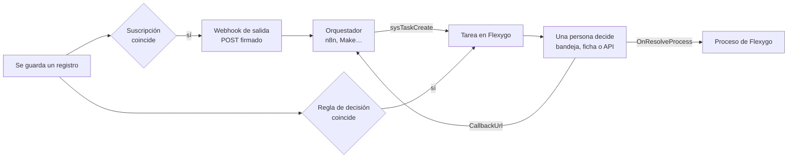

# Aprobaciones, tareas humanas y webhooks de salida

Flexygo no orquesta automatismos: para eso están n8n, Make, Zapier o cualquier otro orquestador. Lo que sí hace es **lo que un orquestador no puede hacer solo**: abrir una **decisión** a una persona o a un rol dentro de la aplicación, con su bandeja, su plazo y su escalado, y **avisar hacia fuera** cuando un registro cambia (**webhooks de salida**). Las dos piezas se combinan en un circuito:



El orquestador y el callback son opcionales: una **regla de decisión** abre tareas al guardar sin salir de Flexygo, y un webhook de salida sirve a cualquier receptor HTTP aunque no haya tarea detrás.

---

## 1. Tareas humanas (decisiones)

Una **tarea** es una pregunta con opciones —por defecto *Approve* / *Reject*— dirigida a un rol, a una persona, o a una persona dentro de un rol, sobre un registro o sin él. Vive en la tabla `Tasks` (objeto `sysTask`), con su historial en `Tasks_Log`.

| Dónde se decide | Qué hay |
|---|---|
| **Decisiones** (nodo del menú, con contador) | La bandeja: *Mine* · *My roles* · *All open* · *Resolved*, con las opciones en la fila y el enlace al registro. |
| **La ficha de la tarea** (`sysTask`) | Los procesos *Resolve*, *Reassign* y *Cancel* en el menú de procesos (solo mientras está pendiente). |
| **La ficha del registro** | El módulo `sysmod-task-decision-2026` (colocable en cualquier página de ficha) enseña las tareas pendientes de ese registro con sus botones, el comentario y el historial. |
| **La campana** | Cada tarea pendiente deja un aviso (`Notices`) al usuario o a los miembros del rol; se caduca al decidir, cancelar, reasignar o expirar. |
| **La web API** | Los mismos procesos, ver §3. |

### Estados y prioridades

| `Status` | Cuándo |
|---|---|
| `pending` | Abierta, esperando a alguien. |
| `resolved` | Alguien eligió una opción (`Outcome`), con o sin `Comment`. |
| `cancelled` | Se canceló sin decidir. |
| `expired` | Venció el plazo y no había a quién escalar. |

`Priority`: `0` normal, `1` alta, `2` urgente.

### Plazo y escalado

El job **`flxTaskEscalation`** (cada 5 minutos, proceso `sysTaskEscalation`) mira las tareas pendientes vencidas:

- A `DueDate + EscalateAfter` minutos, si la tarea nombra un destino (`EscalateToRoleId` o `EscalateToUserId`), **escala una sola vez**: el destino pasa a ser el asignado, se anota `escalated` en el log y se avisa al nuevo asignado.
- Si no nombra destino, **expira** (`expired`, acción `expired` en el log).
- Sin `EscalateAfter`, la tarea solo aparece como vencida: nadie la mueve.

### Qué pasa al decidir

1. Se comprueba que quien decide puede —el usuario asignado, cualquiera con el rol asignado, un administrador, o cualquiera si la tarea no está asignada; la pertenencia al rol se lee de la base en ese momento— y que hay comentario si la tarea o la opción lo exigen (`RequireComment`, o `requireComment` en la opción).
2. Se escribe `resolved` con `Outcome`, `Comment`, `ResolvedBy` y `ResolvedDate`, y el log.
3. Si la tarea tiene **`OnResolveProcess`**, se ejecuta ese proceso de Flexygo con `TaskId`, `Outcome`, `Comment`, `ObjectName`, `ObjectWhere` y `CorrelationId`, atado al registro de la tarea si lo tiene. **La decisión se mantiene aunque el proceso falle**: el fallo vuelve como aviso (`WarningMessage`) y en `Data` (`OnResolveProcessSuccess: false`).
4. Si la tarea tiene **`CallbackUrl`**, se encola un webhook con el resultado (§5). Lo mismo al cancelar y al expirar.

---

## 2. Reglas de decisión

Una **regla** (`Tasks_Rules`, objeto `sysTaskRule`, nodo *Decision rules* bajo *Logic and Rules*, y sección *Decisions* del banco de trabajo del objeto) abre una tarea cuando se guarda un registro del objeto, sin código. Se evalúa después de confirmar el guardado, venga de una pantalla o de la web API; quien guarda no necesita permiso sobre los procesos de tareas.

| Campo | Para qué |
|---|---|
| **Object** | El objeto que se vigila. |
| **After insert / After update** | En qué guardados se evalúa. |
| **Only if** (`Condition`) | Un `WHERE` sobre la tabla del objeto; la regla dispara si el registro guardado lo cumple. Vacío: siempre. |
| **Title / Description** | Plantillas con `{{Campo}}` del registro (y `{{currentUserLogin}}` y el resto de marcadores de Flexygo). |
| **Options** | JSON `[{"id":"approve","label":"Approve"},{"id":"reject","label":"Reject","requireComment":true}]`. Vacío: *Approve* / *Reject*. |
| **Require a comment** | Obliga a comentar cualquier opción. |
| **Assigned role / user** | A quién se abre. Rol y usuario juntos: la persona dentro del rol. |
| **Priority** y **Urgent if** | Prioridad fija, y un `WHERE` que la sube a urgente cuando el registro lo cumple. |
| **Due in (minutes)** | Plazo desde que se abre. |
| **Escalate after / to role / to user** | El escalado de §1. |
| **On resolve process** | Proceso que recibe el resultado (§1). |
| **Callback URL / secret ref** | Para avisar a un orquestador al decidir (§5). |
| **Enabled** | Una regla apagada no dispara. |

!!! tip "Probar con un registro"
    En la ficha de la regla, el proceso **Test with a record** pide un `WHERE` que nombre un registro (`Id = 'admins'`) y enseña la tarea que abriría —título rendido, asignado, prioridad, vencimiento, escalado y eventos— **sin crearla**. Si el registro no cumple la condición, o la regla está apagada, lo dice.

Las reglas de un objeto se leen una vez con su configuración y se recargan al guardar o borrar una regla desde la ficha: no hace falta reiniciar. Un objeto sin reglas no paga nada al guardar.

---

## 3. API de tareas

Todo pasa por la **web API** de Flexygo: `POST /token` (`grant_type=password`, `username`, `password`) y `Authorization: Bearer …`. El usuario necesita acceso a la API (`WebAPI_Users`), y los procesos y el objeto `sysTask` tienen que estar publicados en ella (`WebAPI_Processes`, `WebAPI_Objects`), como cualquier otro.

| Llamada | Qué hace |
|---|---|
| `POST /webapi/exec/sysTaskCreate` | Abre una tarea. Parámetros en el cuerpo (JSON), abajo. |
| `POST /webapi/exec/sysTaskResolve/sysTask/{TaskId}` | Decide: `Outcome` (obligatorio, el `id` de una opción) y `Comment`. |
| `POST /webapi/exec/sysTaskCancel/sysTask/{TaskId}` | Cancela: `Comment`. |
| `POST /webapi/exec/sysTaskReassign/sysTask/{TaskId}` | Reasigna: `AssignedRoleId`, `AssignedUserId`, `Comment`. |
| `GET /webapi/object/sysTask` · `GET /webapi/object/sysTask/{TaskId}` | Lee las tareas como cualquier objeto. |

### Parámetros de `sysTaskCreate`

| Parámetro | Tipo | Notas |
|---|---|---|
| `Title` | texto | **Obligatorio.** Admite `{{Campo}}` del registro si se da `ObjectName`/`ObjectWhere`. |
| `Descrip` | texto largo | Contexto para quien decide; también con `{{Campo}}`. |
| `ObjectName`, `ObjectWhere` | texto | El registro sobre el que se decide. `ObjectWhere` puede ir en claro (`Id = 'x'`) o cifrado como lo entrega Flexygo (el `objectWhere` de un webhook, por ejemplo); se guarda siempre canónico. Sin registro también vale. |
| `AssignedRoleId`, `AssignedUserId` | texto | A quién. Los dos: la persona dentro del rol. Ninguno: la tarea queda abierta a cualquiera. |
| `Priority` | 0 · 1 · 2 | normal · alta · urgente. |
| `DueDate` | fecha-hora | Plazo. |
| `EscalateAfter`, `EscalateToRoleId`, `EscalateToUserId` | | El escalado de §1. |
| `Options` | JSON | Las opciones; vacío: *Approve* / *Reject*. |
| `RequireComment` | booleano | |
| `OnResolveProcess` | texto | Proceso de Flexygo que recibe `TaskId`, `Outcome`, `Comment`, `ObjectName`, `ObjectWhere` y `CorrelationId`. |
| `CallbackUrl` | URL | `POST` con el resultado al decidir, cancelar o expirar (§5). |
| `CallbackSecretRef` | texto | Clave de `appsettings.json` con el secreto que firma el callback. El secreto **nunca** va en la llamada ni en la base. |
| `CorrelationId` | texto | Lo que el llamante quiera recibir de vuelta (el id de su ejecución, por ejemplo). |

La respuesta es la de cualquier proceso: `Success`, `SuccessMessage`, `WarningMessage`, `LastException` y `Data` (`TaskId` y `Status`; al resolver, también `Outcome` y el resultado del `OnResolveProcess`).

```json
POST /webapi/exec/sysTaskCreate
{
  "Title": "Approve the new role {{Name}}",
  "ObjectName": "sysRole",
  "ObjectWhere": "Id = 'sales'",
  "AssignedRoleId": "admins",
  "Priority": 1,
  "DueDate": "2026-09-17T18:00:00",
  "EscalateAfter": 1440,
  "EscalateToRoleId": "admins",
  "CallbackUrl": "https://n8n.example.com/webhook-waiting/1234",
  "CorrelationId": "1234"
}
```

---

## 4. Webhooks de salida

Una **suscripción** (`WebHooks_Subscriptions`, objeto `sysWebhookSubscription`, nodo *Outgoing webhooks* y sección *Webhooks* del banco del objeto) manda un `POST` a una URL cuando se guarda o borra un registro del objeto. El guardado **nunca espera al receptor**: la entrega se encola (`WebHooks_Deliveries`) y el job **`flxWebhookDispatcher`** (cada minuto, proceso `SendPendingWebhooks`) la envía.

| Campo | Para qué |
|---|---|
| **Object** | El objeto que se vigila. |
| **After insert / update / delete** | Los eventos que escucha. |
| **Only if** (`Condition`) | Un `WHERE` sobre la tabla; en el borrado se evalúa **antes** de borrar. |
| **URL**, **Method** | Adónde y cómo (`POST` por defecto). |
| **Headers** | Cabeceras fijas, en JSON: `{"X-Api-Key": "…"}`. |
| **Secret ref** | Clave de `appsettings.json` con el secreto de la firma (abajo). Vacío: `Webhooks:{SubscriptionId}:Secret`. Sin secreto configurado, la entrega va sin firmar. |
| **Payload mode** | `record` (todos los campos del registro), `keys` (solo las claves) o `template` (`PayloadTemplate` rendido con `{{Campo}}`, tal cual). |
| **Timeout (seconds)**, **Max attempts** | Por defecto 10 s y 6 intentos. |
| **Enabled** | Una suscripción apagada no encola. |

Las suscripciones de un objeto se leen una vez con su configuración y se recargan al guardar una suscripción desde la ficha. Un objeto sin suscripciones no paga nada al guardar.

### El cuerpo

Con `record` y `keys`, el cuerpo es un sobre fijo con el registro en `data` (los campos binarios se omiten):

```json
{
  "event": "insert",
  "object": "sysRole",
  "objectWhere": "…",
  "subscriptionId": "2eebc76e-…",
  "firedAt": "2026-09-15T20:03:11.4+02:00",
  "firedBy": "admin",
  "data": { "Id": "sales", "Name": "Sales", "…": "…" }
}
```

`event` es `insert`, `update`, `delete`, `test` (una entrega de prueba) o `task` (el callback de una tarea, §5). `objectWhere` es el identificador cifrado del registro: sirve tal cual para abrirlo o para `sysTaskCreate`. Con `template`, el cuerpo es exactamente la plantilla rendida.

### Cabeceras y firma

| Cabecera | Valor |
|---|---|
| `Content-Type` | `application/json; charset=utf-8` |
| `User-Agent` | `Flexygo-Webhooks` |
| `X-Flexygo-Delivery` | Id de la entrega (para deduplicar reintentos). |
| `X-Flexygo-Event` | El evento. |
| `X-Flexygo-Object` | El objeto. |
| `X-Flexygo-Signature` | `sha256=` + HMAC-SHA256 del cuerpo (bytes UTF-8) con el secreto, en hexadecimal minúsculas. Solo cuando hay secreto. |

Para verificarla, el receptor recalcula el HMAC sobre el cuerpo **crudo** y compara:

```js
const crypto = require('crypto');
const expected = 'sha256=' + crypto.createHmac('sha256', secret).update(rawBody).digest('hex');
const ok = crypto.timingSafeEqual(Buffer.from(expected), Buffer.from(req.headers['x-flexygo-signature'] || ''));
```

!!! warning "El secreto vive en la configuración de la aplicación"
    ```json
    "Webhooks": {
      "2eebc76e-eff9-4699-bb1c-be2369d77392": { "Secret": "…" }
    }
    ```
    O cualquier otra clave, nombrada en **Secret ref** de la suscripción (o en `CallbackSecretRef` de la tarea).

### Reintentos y estados

Una respuesta `2xx` marca la entrega `sent`. Cualquier otra —o no responder dentro del timeout— la deja `failed` y programa el siguiente intento: **1 · 5 · 15 · 60 · 240 · 720 minutos** después del 1.º, 2.º, 3.º, 4.º, 5.º y siguientes fallos. Agotados los intentos (`MaxAttempts`), queda `dead`. Se guardan el último código, la respuesta (hasta 4.000 caracteres) y el error.

| `Status` | Qué es |
|---|---|
| `pending` | Encolada, esperando al despachador. |
| `sent` | Entregada (`2xx`). |
| `failed` | Falló y volverá a intentarse en `NextAttempt`. |
| `dead` | Agotó los intentos. |

En la ficha de una entrega `failed` o `dead`, el proceso **Retry** la vuelve a encolar ahora mismo (un fallo la deja `dead` otra vez).

!!! tip "Send a test"
    En la ficha de la suscripción, **Send a test** pide un `WHERE` que nombre un registro y encola una **entrega real** con `event: test`, aunque la suscripción esté apagada o el registro no cumpla la condición —el mensaje dice si un guardado la habría disparado—. Sale al minuto y queda en la pantalla de entregas.

---

## 5. El callback de una tarea

Cuando una tarea con `CallbackUrl` se **decide, se cancela o expira**, se encola una entrega `task` a esa URL, por la misma cola y con las mismas cabeceras y reintentos (método `POST`, 10 s, 6 intentos); firmada si la tarea tiene `CallbackSecretRef`. El log de la tarea anota `callback_sent` o `callback_failed`.

```json
{
  "event": "task",
  "object": "sysTask",
  "objectWhere": "(TaskId='0F12D8AC-…')",
  "taskId": "0F12D8AC-…",
  "firedAt": "2026-09-15T20:05:40.1+02:00",
  "firedBy": "admin",
  "data": {
    "taskId": "0F12D8AC-…",
    "title": "Approve the new role Sales",
    "status": "resolved",
    "outcome": "approve",
    "comment": null,
    "correlationId": "1234",
    "objectName": "sysRole",
    "objectWhere": "…",
    "resolvedBy": "admin",
    "resolvedDate": "2026-09-15T20:05:38",
    "sourceProcess": "rule New role needs a look"
  }
}
```

Una tarea expirada llega con `"status": "expired"` y `"outcome": null`; una cancelada, con `"status": "cancelled"`.

---

## 6. Ejemplo: n8n orquesta, Flexygo decide

1. Una suscripción en `sysRole` (*After insert*) apunta al nodo **Webhook** de n8n.
2. n8n pide un token (`POST /token`), llama a `sysTaskCreate` con el `objectWhere` del payload, `CallbackUrl = {{ $execution.resumeUrl }}` y `CorrelationId = {{ $execution.id }}`, y espera en un nodo **Wait** (*resume on webhook*).
3. Una persona decide en la bandeja de Flexygo.
4. El callback llega a la URL de reanudación; n8n sigue por la rama `approve` o `reject` leyendo `body.data.outcome`.

Sin n8n, el mismo circuito se monta con una **regla de decisión** sobre `sysRole` y, si hace falta reaccionar, un `OnResolveProcess`.
