# Entidades externas (objetos sobre una API REST)

Un **objeto externo** es un objeto de Flexygo cuyos registros no viven en una tabla de la base de datos sino **detrás de una API REST**. Se define, se lista, se consulta y se edita como cualquier otro objeto —listas, fichas, formularios, relaciones, kanban, calendarios, web API—, y el núcleo lee y escribe a través de la API sin que las pantallas lo sepan.

Lo que **ejecuta SQL** contra la base de datos (una lista SQL, un gráfico, un informe Crystal) no puede leer una API, y lo dice con un mensaje. Al final de esta página está la tabla de qué funciona y qué no.

---

## Cómo funciona

| Pieza | Qué es |
|---|---|
| **Servicio externo** (`External_Services`) | La API: URL base, autenticación, cómo pagina, ordena y filtra, dónde vienen los registros en la respuesta. Un servicio sirve para varios objetos. |
| **Objeto** con origen `rest` (`Objects.SourceType`) + su **configuración de API** (`Objects_External`) | Las rutas y métodos de listar, leer, insertar, actualizar y borrar. |
| **Propiedades** | Los campos. Una API no tiene esquema que leer, así que las propiedades se proponen a partir del JSON que devuelve. Cada una puede llevar un **nombre externo** (`ExternalName`) y una es la **clave** (`IsKey`). |
| **Vistas** | Solo columnas, sin SQL: la API devuelve los registros y Flexygo elige qué columnas enseñar. |

Los filtros de las listas, las búsquedas y las condiciones de seguridad se traducen al lenguaje del servicio (OData, parámetros de consulta) o, si la API no filtra, se aplican en memoria sobre lo que devuelve.

!!! info "Se configura sin SQL ni JSON a mano"
    El asistente de creación de objetos tiene un origen «API externa» que **sonda** el servicio y propone las propiedades a partir de la respuesta. Después, el banco de trabajo del objeto tiene una sección **API** para afinar rutas y métodos. En el resto de la configuración —vistas, plantillas, páginas, módulos, seguridad— un objeto externo se trata igual que cualquier otro.

---

## 1. Dar de alta el servicio

En **External services** se da de alta la API una sola vez: panel de control → área **Objects** → *External services* (en flexy2022, *Admin Work Area → Object Management → External services*), el buscador (**Ctrl K**), o desde el asistente de objetos, con el **+** junto al servicio; el botón del enlace, a su lado, abre el servicio elegido. Cada objeto externo apunta a un servicio.

¿Quieres probarlo de principio a fin con una API pública? [Pruébalo: un objeto que vive en una API REST](ExternalEntitiesTryIt.md).

<figure markdown="span">
  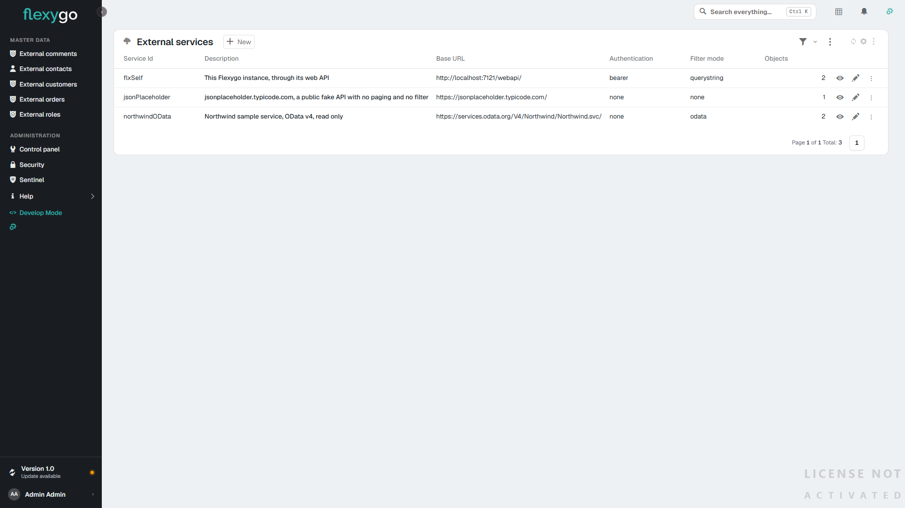
  <figcaption>Los servicios externos: cada uno es una API a la que apuntan uno o varios objetos</figcaption>
</figure>

<figure markdown="span">
  
  <figcaption>Un servicio con autenticación por API key: la cabecera y, al lado, el secreto, cuyo rótulo dice qué guarda</figcaption>
</figure>

| Campo | Para qué |
|---|---|
| **Service Id** | Identificador del servicio. |
| **Base URL** | Raíz de la API. Las rutas del objeto son relativas a ella. |
| **Authentication** | `None`, `API key` (cabecera, por defecto `X-Api-Key`), `Basic` (el secreto es `usuario:contraseña`), `Bearer` (el secreto es el token) u `OAuth2 client credentials` (URL del token, client id y scope; el secreto es el client secret). |
| **Secret** | La clave, el token, `usuario:contraseña` o el client secret, según la autenticación. Su rótulo cambia con ella: **API key**, **Token**, **User:password** o **Client Secret**. Con `None` no aparece. |
| **Filter mode** | Cómo se le piden a la API los filtros, el orden y las páginas: **OData** (`$filter`, `$orderby`, `$top`, `$skip`), **Query string** (plantillas `{field}={value}` y `{field} {dir}` que se definen en el objeto; `{where}` pasa el filtro entero como un `WHERE` de SQL, para APIs que lo entienden, como [otro Flexygo](#7-otro-flexygo-como-api)) o **None** (la API devuelve todo y Flexygo filtra, ordena y pagina en memoria). |
| **Page / Page size / Offset / Sort parameter** | Nombres de los parámetros de paginación y orden de la API, y el número de la primera página. |
| **Max rows in memory** | Tope de filas que se traen cuando la API no filtra (`None`); por defecto 5.000. Si la API devuelve más, se avisa. |
| **Error path** | Ruta JSON del nodo de error, para APIs que contestan errores con un 200. |
| **Default headers** | Cabeceras fijas de todas las llamadas, en JSON. |

!!! warning "El secreto se guarda con el servicio"
    La clave, el token o la contraseña se guardan en el propio servicio (`External_Services.Secret`), en claro, como los demás secretos de integración del producto. Por eso el campo es de contraseña, el web API no lo devuelve y no se carga con la configuración de los objetos: el proveedor lo lee solo cuando se autentica. **Probar** un servicio que aún no se ha guardado usa el secreto escrito en el formulario.

    Sin secreto, la llamada se rechaza con un mensaje que dice qué falta: *Service miServicio: no secret configured. Fill in the Secret of the service.*

---

## 2. Crear el objeto con el asistente

Desde la lista **Objects**, con el botón de la varita (**New object**), en el paso **Origen** se elige **An external API**. Basta el servicio y la ruta de la lista; la ruta del registro (`{key}` se sustituye por la clave) hace la ficha más rápida, y las rutas del array y del total sirven para APIs que envuelven la respuesta.

<figure markdown="span">
  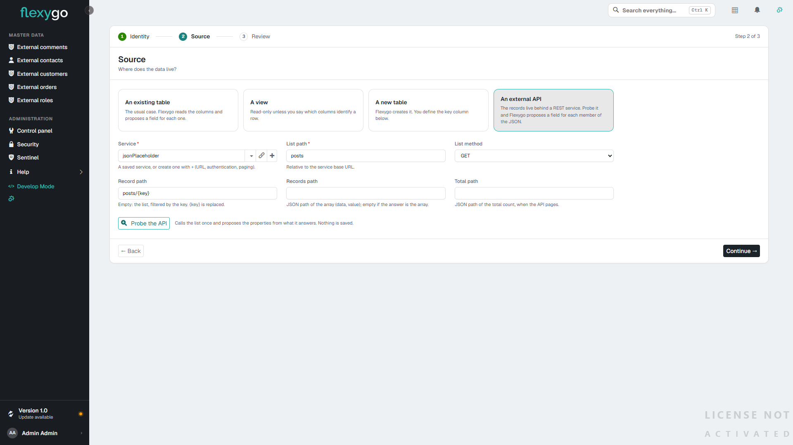
  <figcaption>Paso 2 — el origen «API externa»: servicio, ruta de la lista y del registro</figcaption>
</figure>

**Probe the API** llama a la lista una vez, sin guardar nada, y enseña una muestra de los registros y las **propiedades propuestas**: nombre, etiqueta, tipo deducido, cuál es la clave y si es obligatoria (un texto largo, como una imagen en base64, nunca se propone obligatorio). Las anotaciones del protocolo (`@odata.etag`, `Campo@odata.mediaReadLink`, `@id`) no son datos del registro: se listan aparte como saltadas. Se pueden quitar, renombrar o cambiar de tipo antes de crear.

<figure markdown="span">
  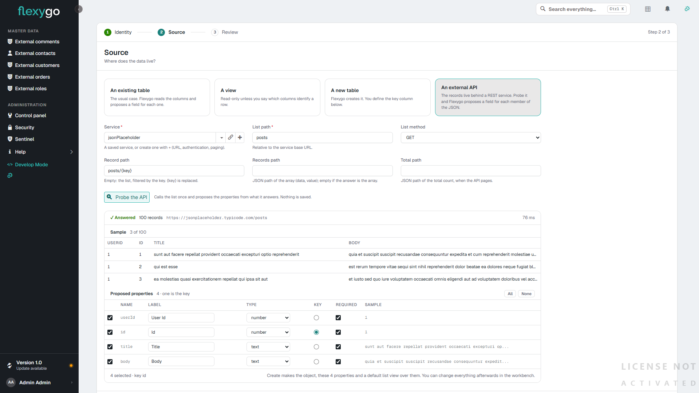
  <figcaption>La sonda: 100 registros, una muestra y cuatro propiedades propuestas con su clave</figcaption>
</figure>

<figure markdown="span">
  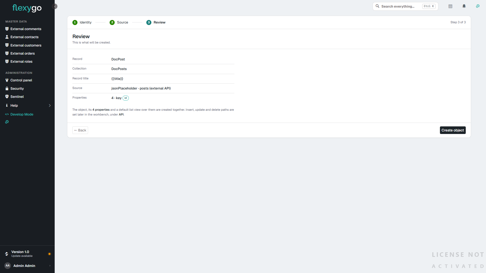
  <figcaption>Paso 3 — lo que se va a crear: el objeto, la colección, las propiedades y una vista de lista por defecto</figcaption>
</figure>

Al crear, el objeto ya lista y abre fichas: no hace falta escribir SQL ni definir las vistas a mano.

!!! tip "Clave generada por la API"
    Si la clave **no** se marca como obligatoria, Flexygo entiende que la genera la API al insertar. Para las APIs que no devuelven el registro creado, el campo **Find inserted record by** de la sección API (por ejemplo `UserName = '{UserName}'`) dice cómo volver a localizarlo.

---

## 3. Afinar en el banco de trabajo

El banco de trabajo del objeto muestra, para un objeto externo, la sección **API**. Ahí están las rutas de **insertar, actualizar y borrar** (vacías, el objeto es de solo lectura: la lista no ofrece *New*, la ficha no ofrece *Edit* ni *Delete*, y cada acción aparece al poner su ruta, o si se escribe con un proceso propio), el método de actualización (`PUT` o `PATCH`), el formato del cuerpo (`JSON`), las rutas del array y del total, y las plantillas de filtro y orden para APIs con convención propia. El botón **Probe** vuelve a sondar la API y ofrece añadir las propiedades que falten.

<figure markdown="span">
  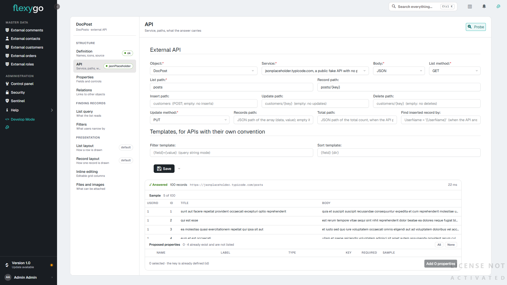
  <figcaption>La sección API del banco de trabajo, con la sonda: las cuatro propiedades ya existen</figcaption>
</figure>

En el formulario de cada **propiedad** hay dos campos que solo tienen sentido en un objeto externo: **Is key** (la clave del registro en la API) y **External name** (la ruta JSON del campo cuando en la API se llama distinto, por ejemplo `address.city`).

<figure markdown="span">
  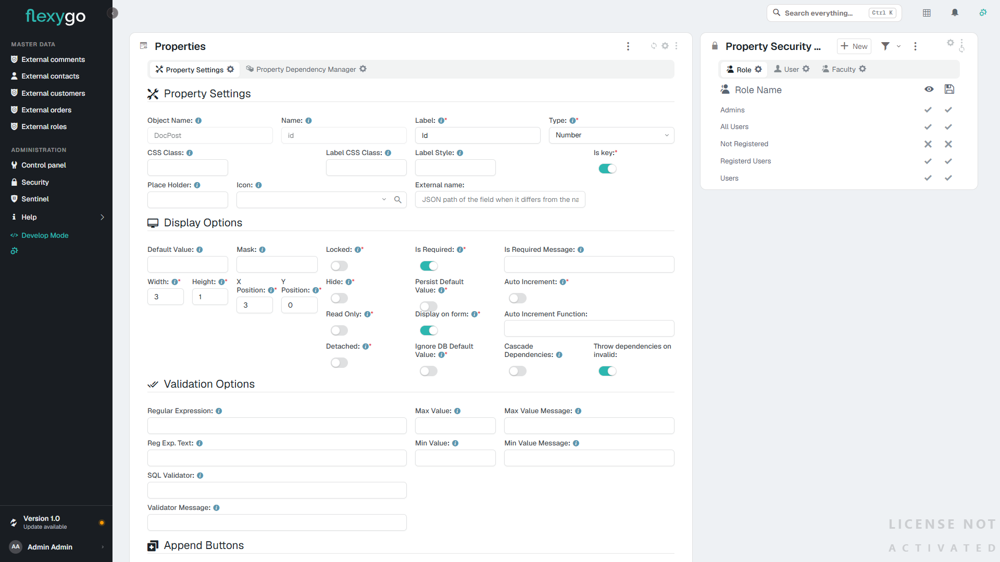
  <figcaption>La propiedad `id`: es la clave y su nombre externo coincide, así que va vacío</figcaption>
</figure>

Las **vistas** de un objeto externo no llevan SQL: se eligen las columnas y el orden, y el resto lo hace la API. El gestor de vistas no ofrece «desde SQL» para estos objetos.

### Desplegables sobre un objeto externo

Cuando un campo guarda el código de algo que también vive en la API (el cliente de un parte, el técnico, el almacén), el desplegable no puede leer de la base de datos: lee de **otro objeto externo**, el maestro.

1. Da de alta el maestro como un objeto externo más, con el mismo servicio. Basta de solo lectura: rutas de alta, edición y borrado vacías.
2. En la propiedad que guarda el código:

| Campo | Valor |
|---|---|
| **Type** | `DbCombo` |
| **Data Source Object** | El objeto del maestro (el registro, no la colección). |
| **Data Source View** | Vacía, para usar la vista por defecto del maestro, o una de sus vistas. |
| **SQL Value Field** | La clave del maestro: el código que se guarda. |
| **SQL Display Field** | El campo del maestro con el texto que se enseña. |
| **SQL Sentence** | **Vacía.** Con un *Data Source Object* externo no se usa: los valores llegan siempre del maestro a través de la API. |
| **SQL Filter** | Opcional. Se aplica como filtro sobre el maestro y viaja a la API como cualquier otro filtro. |
| **Connection String** | El formulario la pide para todo desplegable, pero aquí no se usa: vale cualquiera. |

**Dónde están esos campos.** El **asistente de la propiedad** (la ventana *Properties* que abre el botón de configurar del formulario en modo desarrollo, o el paso de propiedades del banco de trabajo) enseña *Data Source Object* y *Data Source View* en cualquier desplegable. El **formulario completo** de la propiedad solo los enseña cuando la propiedad es offline o su objeto es externo. Para un desplegable sobre un objeto externo en un objeto de la base de datos, usa el asistente.

**Al escribir en el desplegable**, el texto se convierte en un filtro sobre el campo que se enseña. Con un servicio que filtra (*Filter mode* `OData` o `Query string`), la API devuelve solo lo que coincide. Con `None`, Flexygo trae el maestro entero y filtra en memoria: con maestros grandes conviene que el servicio filtre.

**La ficha y la vista** enseñan el texto del valor, que Flexygo pide al maestro por su clave.

!!! tip "Sin maestro publicado"
    Si el maestro no está en la API (estados, tipos con pocos valores fijos), usa un desplegable **estático** (`Combo` con sus valores). Y si la API ya devuelve el texto junto al código, como hace otro Flexygo con `Campo_flxtext` (ver [§7](#7-otro-flexygo-como-api)), basta con añadir esa propiedad a las vistas para ver el texto en las listas.

---

## 4. Usar el objeto

A partir de ahí es un objeto más: se coloca en páginas, se le dan permisos, se relaciona con otros. La lista pagina, ordena y filtra a través de la API; la ficha y el formulario leen y escriben el registro; los procesos antes y después de insertar, actualizar y borrar y la auditoría se ejecutan igual.

<figure markdown="span">
  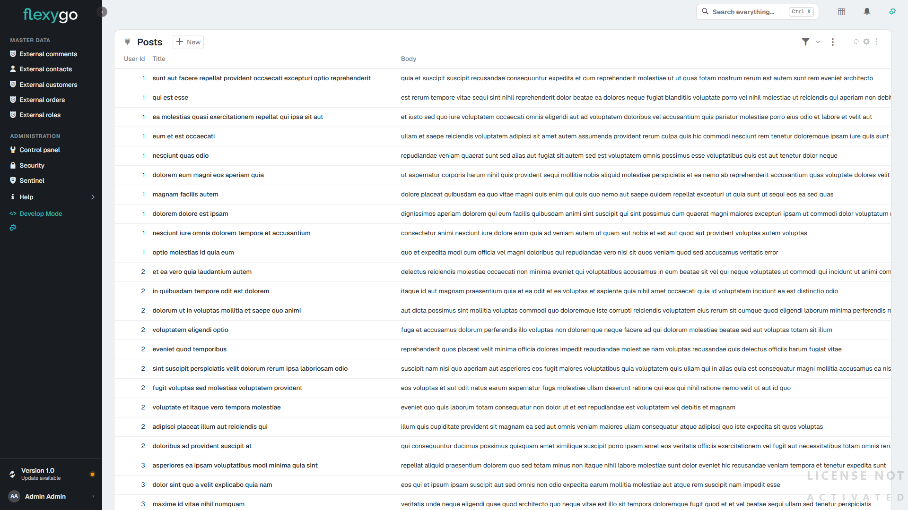
  <figcaption>La lista del objeto recién creado, leída de la API</figcaption>
</figure>

<figure markdown="span">
  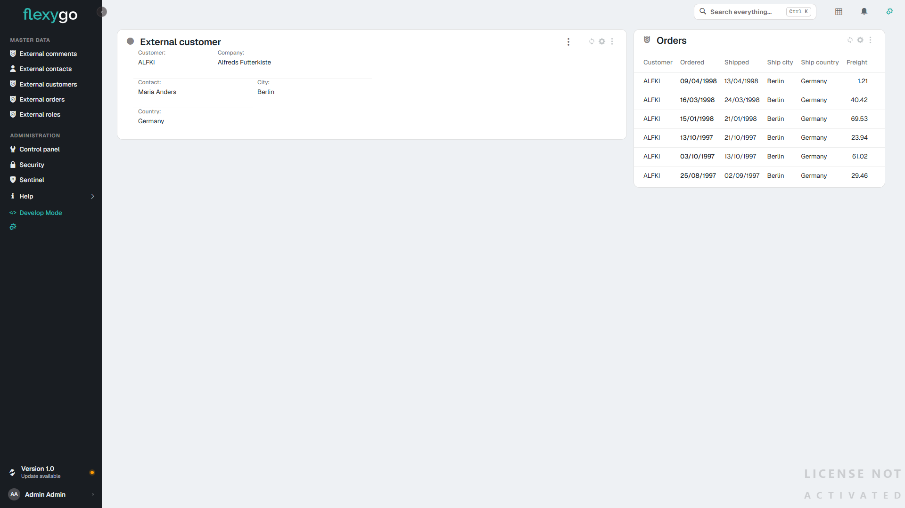
  <figcaption>Una ficha con una lista relacionada: los dos objetos son externos (un cliente y sus pedidos)</figcaption>
</figure>

<figure markdown="span">
  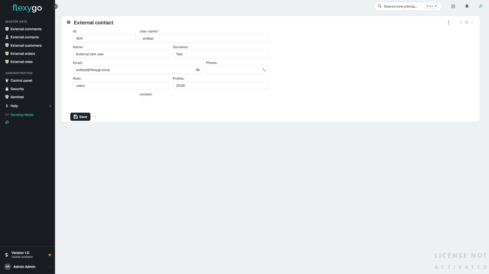
  <figcaption>El formulario de edición: guardar es una llamada a la API, y su error, si lo hay, llega al formulario</figcaption>
</figure>

!!! note "Los desplegables también"
    Una propiedad de cualquier objeto puede ser un desplegable **sobre un objeto externo**: el maestro se da de alta como un objeto externo más. Cómo se configura, en [Desplegables sobre un objeto externo](#desplegables-sobre-un-objeto-externo).

---

## 5. Qué funciona y qué no

### Funciona

| Pieza | Notas |
|---|---|
| Lista de objeto: páginas, orden, filtros (`flx-filter`), búsqueda de texto, presets | Los filtros se traducen a la API. El gestor de filtros no ofrece `multicombo`, `multitag` ni `intersect-*`, que buscan dentro de un campo con varios valores y ninguna API sabe trocear; configurados por otra vía, se rechazan con su mensaje. Tampoco se filtra por campos de un objeto relacionado. Un desplegable se filtra con **Combo**, que admite varios valores. |
| Lista editable | Una fila guardada es una actualización en la API. |
| Ficha, formulario, alta, edición, borrado | Con procesos antes/después y auditoría. |
| Listas relacionadas (por filtro con `{{tokens}}` y por relaciones `Objects_Objects`), también externo → externo | |
| Pestañas y easy info por objeto | El easy info resuelve los tokens del registro; su SQL corre sobre tablas locales. |
| Kanban | El tablero es un objeto de base de datos; las tarjetas pueden ser externas; arrastrar una tarjeta actualiza en la API. |
| Scheduler, calendario mensual y anual, timeline básica | Con propiedades de fecha del objeto. Arrastrar o redimensionar actualiza en la API. |
| Desplegables sobre un objeto externo | Resueltos en el servidor. La ficha y la vista enseñan el texto del valor; una lista en modo lectura enseña la columna tal como la da la vista, igual que en un objeto SQL. |
| Exportación a Excel de la lista e informes Excel **por vista** | |
| Informes **HTML** (plantilla de impresión) | |
| **Gráficas** (`flx-echart`, `flx-chart`) **sin SQL** sobre un objeto externo cuya API devuelve ya las filas de la gráfica | Ver [§6](#6-graficas-desde-un-endpoint). Los filtros de la gráfica van a la API. |
| Búsqueda global y búsqueda de texto del objeto | Un desplegable se busca por el texto que enseña, como en un objeto SQL: Flexygo pregunta antes a su origen (otro objeto externo o el SQL de la propiedad) qué códigos tienen ese texto y se los pide a la API. Si coinciden más de 500, la lista pide un texto más largo; la búsqueda global busca esa propiedad por su código. |
| Seguridad: permisos del objeto, filtros de colección y de registro (visible, editable, borrable) | Los de colección van a la API; los de registro se evalúan en memoria. |
| Web API (`webapi/list`, `webapi/object`, `webapi/schema`) | Los mismos caminos. |
| Asistentes de IA ([MCP](../AIAssistants/2Reference.md)): listar, leer un registro, totales, desgloses y tableros | Las filas se piden a la API como en una lista (filtros y seguridad incluidos) y los totales y agrupaciones se calculan sobre ellas; con un servicio que no filtra, hasta **Max rows in memory**. |
| Descarga a la app **offline** | La subida la hace el proceso de sincronización de cada app, que tiene que ser .NET para alcanzar una API. |

### Se rechaza con un mensaje

| Pieza | Por qué |
|---|---|
| **Lista SQL** y **gráfico** cuyo SQL nombra la «tabla» del objeto | No hay tabla: el módulo lo dice y sugiere una lista de objeto, vista, kanban, scheduler o timeline. Un SQL que solo usa los `{{tokens}}` del objeto sobre tablas locales sí funciona. Una gráfica **sin SQL** lee la API: [§6](#6-graficas-desde-un-endpoint). |
| **Planner** con un objeto externo en la primera columna o entre los arrastrables | La primera columna se construye con SQL. Las tarjetas sí pueden ser externas. |
| Informes **DevExpress** y **Crystal** | Leen la tabla con SQL. Se rechazan antes de abrir la ventana de impresión. Se usa un informe HTML o un Excel por vista. |
| Timeline avanzada con vista de grupos; feeds SQL, mapas, organigramas, easy line/pie, sparklines, embudos | Son módulos SQL, como la lista SQL. |
| Tablas adicionales del objeto | Se rechazan al cargar la configuración. |
| Filtros que no se pueden traducir (`BETWEEN`, funciones, comparación entre campos, `LIKE` con comodines interiores en OData) | Se rechazan nombrando la pieza; nunca se le pide a la API menos de lo que dice el filtro. |

<figure markdown="span">
  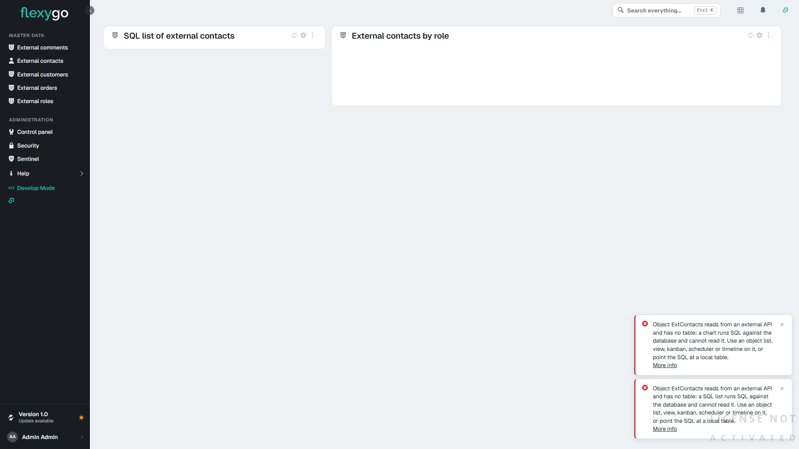
  <figcaption>Una lista SQL y un gráfico apuntados a un objeto externo: el mensaje dice el objeto, el módulo y la alternativa</figcaption>
</figure>

El mensaje llega a la pantalla tal cual, sin envolverlo en un error genérico. Lo mismo cuando **falla la API**: el aviso dice la llamada y su respuesta (por ejemplo *External entity ExtComment: GET https://…/zz-not-found returned 404 Not Found*).

### Límites a tener en cuenta

- **APIs que no filtran** (`Filter mode = None`): Flexygo trae todas las páginas y filtra en memoria, hasta **Max rows in memory** del servicio. Para volúmenes grandes conviene una API que filtre.
- **APIs que topan el tamaño de página**: si la API devuelve menos de lo pedido, Flexygo completa la página con más llamadas.
- Las **fechas** viajan en ISO; el núcleo y los calendarios pueden escribirlas también en la forma compacta `yyyyMMdd`, que se entiende.

---

## 6. Gráficas desde un endpoint

Una gráfica (`flx-echart` o `flx-chart`) **sin SQL** cuyo objeto es una **colección externa** pinta lo que devuelve la API. Flexygo no agrega nada: el endpoint entrega ya las filas con el mismo contrato que tendría el SQL de la gráfica ([Gráficas con ECharts, §2.1](../Modules/ECharts.md)), y Flexygo solo llama y pinta.

### 6.1 Lo que tiene que devolver el endpoint

Una lista de filas planas. Por ejemplo, ventas y compras por mes, con una línea de objetivo:

```json
[
  { "label": "2026-01", "serie": "Ventas",  "value": 1250.5, "unit": "€", "goal": 1300, "goalLabel": "Objetivo" },
  { "label": "2026-01", "serie": "Compras", "value": 830 },
  { "label": "2026-02", "serie": "Ventas",  "value": 1410 },
  { "label": "2026-02", "serie": "Compras", "value": 905.25 }
]
```

| Campo | Qué es | |
|---|---|---|
| el que el módulo llama `Labels` (`label` en el ejemplo) | Categoría: eje X, sector, radio | obligatorio |
| el que el módulo llama `Series` (`serie`) | Nombre de la serie | obligatorio |
| el que el módulo llama `Value` (`value`) | Valor numérico | obligatorio |
| `unit`, `goal`, `goalLabel` | Unidad, línea de objetivo y su rótulo (solo `flx-echart`); vale la primera fila que los traiga | opcional |
| `backgroundColor`, `borderColor` | Color de la fila | opcional |

- Si la API envuelve la lista (`{ "data": [ ... ] }`), se indica en la **Records path** del objeto, como en cualquier lista.
- Los **rótulos** (`label`, `serie`, `goalLabel`) llegan tal cual de la API: si hay que traducirlos, los traduce ella.
- Los **filtros** de la gráfica (el filtro del módulo y los de pantalla) viajan a la API según el **Filter mode** del servicio, igual que en una lista; uno que no se pueda traducir se rechaza con su mensaje.

### 6.2 Montarlo en Flexygo

1. **El servicio**, como en la [sección 1](#1-dar-de-alta-el-servicio).
2. **El objeto externo**, con la ruta del endpoint como ruta de lista y una propiedad por campo (`label`, `serie`, `value` y los opcionales que traiga). La clave puede ser cualquiera de ellas: la gráfica no abre registros. La vista por defecto, con esos campos.
3. **El módulo** `flx-echart`, con:

| Campo del módulo | Valor |
|---|---|
| Objeto | la **colección** del objeto externo |
| SQL | **vacío**: es lo que hace que la gráfica lea la API |
| `Series` / `Labels` / `Value` | los nombres de los campos (`serie`, `label`, `value`) |
| Tipo, tema, `JsonOptions`, `Params` | como en cualquier gráfica |

<figure markdown="span">
  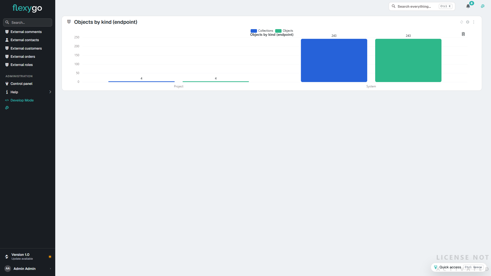
  <figcaption>Un flx-echart sin SQL sobre un objeto externo: dos series y dos categorías, tal como las devuelve la API</figcaption>
</figure>

### 6.3 Qué no hace

- **No agrega**: si la API devuelve los datos en bruto (cada pedido, cada línea), la gráfica pintaría una barra por fila. Hace falta un endpoint que devuelva ya los totales.
- **Una sola fuente**: las gráficas `mixed` con varios SQL separados por `;` siguen siendo solo SQL.
- **Las filas que se piden son todas las que devuelva la API** de una vez; si el servicio no filtra y Flexygo filtra en memoria, rige el **Max rows in memory** del servicio.
- Una gráfica **con** SQL sobre un objeto externo se sigue rechazando como en la [sección 5](#5-que-funciona-y-que-no).

---

## 7. Otro Flexygo como API

Un Flexygo puede leer y escribir los objetos que **otro Flexygo** publica en su [web API](WebAPI.md): por ejemplo, los partes de un SAT desde otra aplicación. Es una API REST más, con unas particularidades que conviene configurar así.

### 7.1 El servicio

| Campo | Valor |
|---|---|
| **Base URL** | La URL del Frontend del otro Flexygo seguida de `/webapi`, por ejemplo `https://servidor/sat/webapi`. |
| **Authentication** | `Bearer`. |
| **Secret** | Un token de la web API del otro Flexygo (ver abajo). |
| **Filter mode** | `Query string`. |
| **Page parameter** | `page`. |
| **First page number** | `0`. |
| **Page size parameter** | `pagesize`. |
| **Sort parameter** | `orderBy`. |

**El token.** La web API de Flexygo solo acepta tokens (`Authorization: Bearer`), y su `/token` solo los concede con usuario y contraseña (`grant_type=password`). Por eso ni `Basic` ni `OAuth2 client credentials` sirven aquí. El token se pide una vez, con el usuario que vaya a usar la integración, y se pega en **Secret**:

```
POST https://servidor/sat/token
Content-Type: application/x-www-form-urlencoded

grant_type=password&username=USUARIO&password=CONTRASEÑA
```

De la respuesta se copia el `access_token`. Dura lo que diga el ajuste `WebAPI_Timeout` del otro Flexygo (por defecto, unos diez años; el `expires_in` de la respuesta lo confirma). Si se revoca, se pide otro y se cambia en el servicio.

### 7.2 El objeto

| Campo | Valor |
|---|---|
| **List path** | `list/sat_Parte` |
| **Record path** | `object/sat_Parte/{key}` |
| **Insert path** | `object/sat_Parte` |
| **Update path** | `object/sat_Parte/{key}`, método `PUT` |
| **Delete path** | `object/sat_Parte/{key}` |
| **Records path** | Vacía: la lista llega como un array. |
| **Filter template** | `filter={where}`: el filtro viaja como el `WHERE` que la web API de Flexygo entiende. |

- **`{key}`** solo vale con una clave de **un solo campo**, que es lo que admite la web API de Flexygo por identificador.
- **Lo que se puede hacer** lo decide el otro Flexygo: el objeto tiene que estar publicado en su web API con permiso de ver, insertar, editar o borrar, y el usuario del token necesita además permiso sobre el objeto ([Seguridad de la WebAPI](WebAPISecurity.md)).
- **El alta** devuelve el registro creado con el formato de la web API de Flexygo (`Properties.Campo.Value`). Flexygo lo reconoce y toma de ahí la clave que ha generado el otro servidor, así que no hace falta **Find inserted record by**.

### 7.3 Los textos de los desplegables (`_flxtext`)

La lista de la web API de Flexygo devuelve, junto a cada campo con desplegable, otro con su texto: `IdCliente` y `IdCliente_flxtext`. La sonda los propone **desmarcados**:

- Para enseñar el nombre del cliente en una lista sin montar un desplegable, marca el `_flxtext` que te interese y añádelo a la vista.
- Para un desplegable de verdad, da de alta el maestro (`sat_Cliente`) como otro objeto externo y configúralo como en [Desplegables sobre un objeto externo](#desplegables-sobre-un-objeto-externo).
- Si no quieres ninguno, pide la lista sin ellos: **List path** `list/sat_Parte?withDescrips=false`.

### 7.4 Si algo no sale

| Lo que ves | Por qué | Qué hacer |
|---|---|---|
| `401 Unauthorized` | Falta el token, ha caducado o se ha revocado | Pide otro token y cámbialo en **Secret** |
| `403 Forbidden` | El objeto no está publicado en la web API del otro Flexygo para esa operación, o el usuario del token no tiene permiso | Publica la operación y revisa los permisos del rol |
| `405 Method Not Allowed` al editar o borrar | El otro Flexygo está en IIS con el módulo **WebDAV**, que se queda los `PUT` y `DELETE` antes de que lleguen a la aplicación | En el `web.config` del Frontend **y** del Backend del otro Flexygo, dentro de `<system.webServer>`, añade `<modules><remove name="WebDAVModule" /></modules>` y, en `<handlers>`, `<remove name="WebDAV" />` antes del `<add name="aspNetCore" … />` |
| La lista va lenta | Sin *Filter mode* ni paginación, cada página trae todos los registros y Flexygo los corta en memoria | Configura el servicio y la **Filter template** como en las tablas de arriba |
