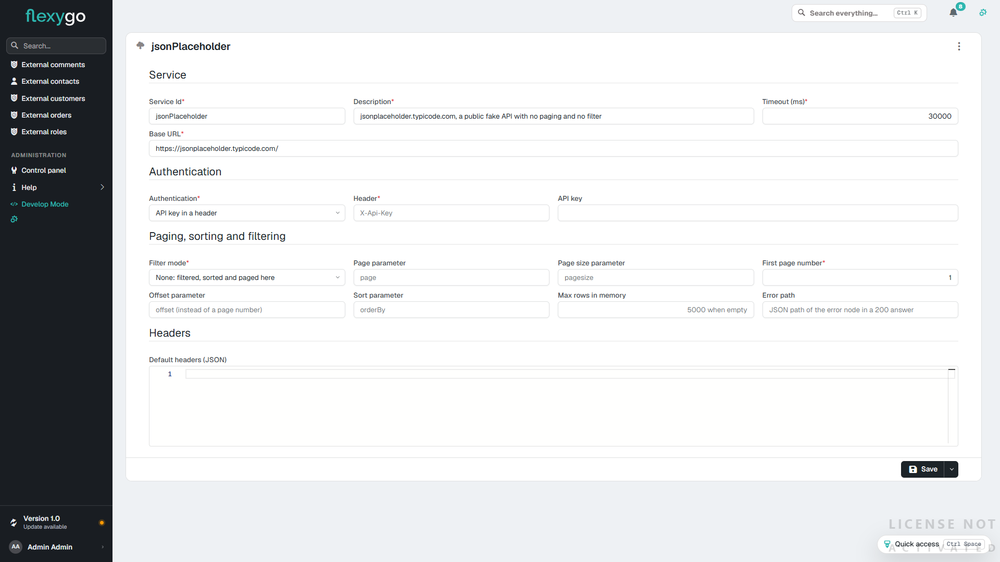
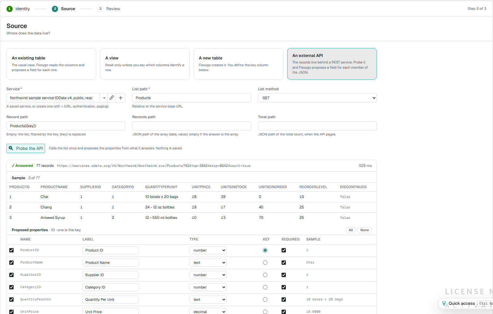
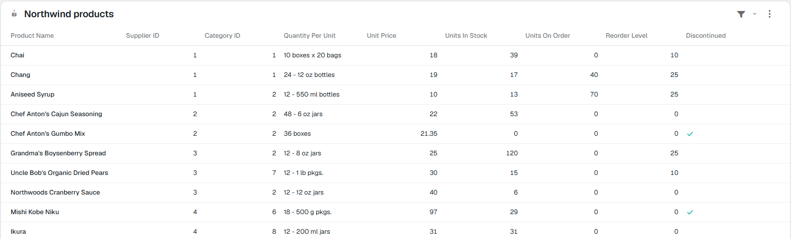
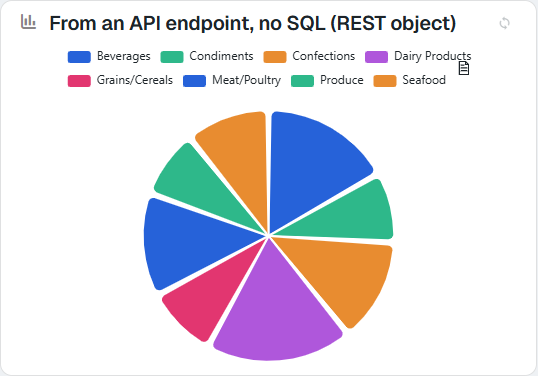

# Try it: an object that lives in a REST API

In about ten minutes you will have in your application an object whose records **are not in your database but in an internet API**: with its list, which pages, sorts and filters by asking the API, its record view, and a chart that draws what an endpoint returns without a single line of SQL. It is all done with screens, without writing SQL or JSON.

The test uses **Northwind**, a public sample service (OData v4, no key and read-only), so you do not need an API of your own. What each piece does, writing (create, edit, delete), authentication and the table of what works and what doesn't are in the reference: [External entities](ExternalEntities.md).

---

## What you need

| | |
|---|---|
| **A version 10 Flexygo application** | Log in with an **administrator** user. A local installation will do. |
| **Internet access from the server** | The one calling the API is the Backend, not your browser. To check it, open `https://services.odata.org/V4/Northwind/Northwind.svc/Products` in the server's browser. |
| **Your active project origin** | What you create here stays in the active origin, like any object. |

---

## 1. Register the service

An **external service** is the API: its address, how it authenticates and how it pages and filters. It is registered once and used by all the objects that read from it.

Open **External services**: control panel → **Objects** area → *External services* (in flexy2022, *Admin Work Area → Object Management → External services*; in both, also with the search box, **Ctrl K**). Click **New** and fill in:

| Field | Value |
|---|---|
| **Service Id** | `northwind` |
| **Description** | Northwind (OData, public) |
| **Base URL** | `https://services.odata.org/V4/Northwind/Northwind.svc/` |
| **Authentication** | `None` |
| **Filter mode** | `OData` |

Save. It can also be created without leaving the wizard, with the **+** next to the *Service* field in step 2, and the link button beside it opens the chosen service to review or change it.

## 2. Create the object with the wizard

Open **Objects** in the administration menu and click the wand button, top right (**New object**).

**Step 1, Identity**: the name of the record and of the collection (`NwProduct` and `NwProducts`), their titles (`{{ProductName}}` for the record, *Northwind products* for the collection) and an icon for each. **Continue**.

**Step 2, Source**: choose **An external API** and fill in:

| Field | Value |
|---|---|
| **Service** | the one you created, *Northwind (OData, public)* |
| **List path** | `Products` |
| **Record path** | `Products({key})` (optional: makes the record view faster) |

Click **Probe the API**. The probe calls the list once, **without saving anything**, and shows what it answered and the properties it proposes.

**Check**: *✓ Answered 77 records*, a sample of three products and **10 properties** with `ProductID` as the key. You can change the label or type of any of them, or remove it. The protocol's control data (such as `@odata.etag`) are not proposed: the probe lists them separately as skipped.

**Step 3, Review**: what is going to be created (the object, the collection, the properties and a list view). **Create object**. When it finishes, the new object's workbench opens.

## 3. Use it like any other object

Open the **NwProducts** list (from the workbench, or by adding it to the menu like any collection).

**Check**:

- **77 products**, paged. Each page is an API call (`$top`/`$skip`), not 77 rows fetched all at once.
- **Sorting** by a column and **filtering** (for example, *Unit Price* greater than 50) returns what you expect: the sort and the filter travel to the API (`$orderby`, `$filter`).
- **Opening a record** reads that product and nothing else (`Products(1)`).

From here on it is just another object: it is placed on pages, given permissions and used in related lists, kanban or calendars. Since the object has no create, edit or delete paths, it is **read-only**: the list does not offer *New* and the record view does not offer *Edit*. With an API that supports it, those paths are set in the **API** section of the workbench and the actions appear.

## 4. Optional: a chart fed by the API

A chart **without SQL** over an external object draws what its endpoint returns. Northwind has one that already gives sales by category:

1. With the wizard (step 2), another object with **List path** `Category_Sales_for_1997`: the probe answers 8 records and proposes `CategoryName` (key) and `CategorySales`.
2. A **Chart (ECharts)** module of type `pie`, with that object's **collection** as the module's object, **empty SQL**, and *Series* and *Labels* = `CategoryName`, *Value* = `CategorySales`.

The endpoint must already return the chart rows: Flexygo does not aggregate. See [§6 of the reference](ExternalEntities.md#6-charts-from-an-endpoint).

---

## If something goes wrong

| What you see | Why | What to do |
|---|---|---|
| The probe says the API could not be reached | The server has no internet access, or the URL is wrong | Open the URL from the **server**'s browser; check the *Base URL* and the path |
| The probe answers but proposes no properties | The list comes wrapped (`{ "data": [...] }`) | Set the **Records path** (`data`) and probe again |
| A SQL list or a report on the object shows a message | Those modules read a table and there is none here | Use an object list, a view or a chart without SQL; the full table is in the [reference](ExternalEntities.md#5-what-works-and-what-doesnt) |
| The API requires a key | Northwind doesn't; yours may | The service's *Authentication* (API key, Basic, Bearer, OAuth2) and its **Secret** |
