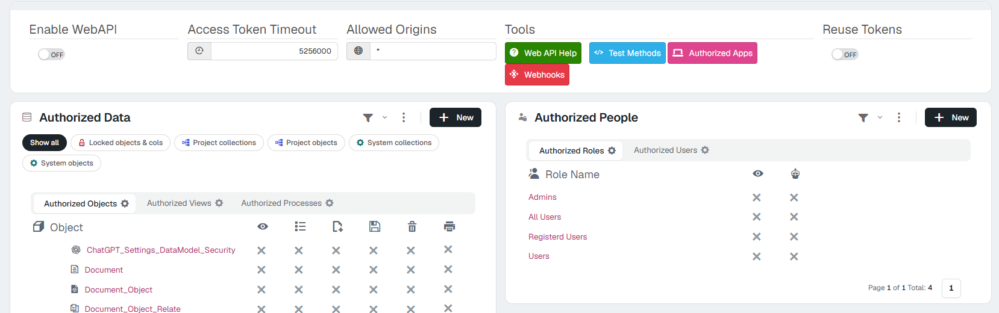

# Seguridad de la WebAPI: lo que el rol no puede, la API tampoco <span class="fh-version-tag" title="Disponible desde la versión 10">10.0+</span>

Desde la versión 10, **la web API aplica la seguridad del rol del token igual que la interfaz**: lo que un rol no puede ver o ejecutar en pantalla, tampoco lo puede pedir por la API, y la respuesta lo dice con un estado HTTP propio y una frase que explica el motivo. El OpenAPI de la aplicación (`GET /webapi`) se recorta también por rol: una integración solo ve anunciado lo que de verdad puede usar.

Esta página es para quien integra con la aplicación (n8n, un ERP, un script) y para quien la administra. Los asistentes de IA usan el mismo mecanismo: ver [Asistentes de IA (MCP)](../AIAssistants/2Reference.md).

---

## 1. Quién entra en la API

Se configura en la herramienta **WebAPI** del área **Security** del [panel de control](../Administration/ControlPanel.md) (en flexy2022, *Admin Work Area › Security › WebAPI*):

<figure markdown="span">
  
  <figcaption>Arriba el interruptor general y los tiempos; a la izquierda lo que se expone, a la derecha quién entra</figcaption>
</figure>

| Dónde | Qué decide |
|---|---|
| **Enable WebAPI** (`WebAPI_Enabled`) | La API entera, encendida o apagada. |
| **Authorized Data** | Qué objetos, vistas y procesos se publican y qué se puede hacer con cada objeto (ver, listar, crear, editar, borrar, imprimir). Lo no publicado no existe para la API. |
| **Authorized People**, columna del ojo | Qué roles o usuarios pueden usar la API (`WebAPI_Roles`, `WebAPI_Users`; el usuario manda sobre su rol). |
| **Authorized People**, columna del robot | El permiso de **asistentes de IA (MCP)**, aparte del de la API: un rol puede tener uno sin el otro. |

Y debajo de todo eso, **la seguridad de siempre del rol**: los permisos de objeto (ver la ficha, ver la lista), los filtros de fila y los permisos de cada proceso. Publicar un objeto en la API no se salta nada de eso.

El token se pide con `POST /token` (`grant_type=password`, `username`, `password`) y viaja en `Authorization: Bearer …`.

---

## 2. Las negativas: un estado por motivo, y la frase

Cada negativa lleva su estado HTTP y una frase en el cuerpo que dice **qué** se negó y **por qué**. Respuestas reales:

**403: el rol no puede ver esa lista.**

```http
GET /webapi/list/sysUser
Authorization: Bearer <token de un usuario con rol users>

HTTP/1.1 403 Forbidden
{"Content":{"Title":"Internal server error","Message":"Unauthorized collection sysUsers for role users","StackTrace":"","InnerMessage":null,"Msgtype":1},"Type":"Ajax"}
```

**400: un proceso de objeto pedido sin su objeto.**

```http
POST /webapi/exec/SyncData

HTTP/1.1 400 Bad Request
{"Content":{"Title":"Bad request","Message":"Process SyncData is defined on sysOfflineSync: send the object and the record (id or filter) to run it on","StackTrace":"","InnerMessage":"","Msgtype":0},"Type":"Ajax"}
```

**404: el registro sobre el que se pide el proceso no existe.**

```http
POST /webapi/exec/SyncData/sysOfflineSync/999999

HTTP/1.1 404 Not Found
{"Content":{"Title":"Not found","Message":"sysOfflineSync record not found: [Offline_Sync].[SyncId]='999999'","StackTrace":"","InnerMessage":"","Msgtype":0},"Type":"Ajax"}
```

La tabla completa:

| Estado | Cuándo | Frase |
|---|---|---|
| **401** | Token que falta, caducado o inválido. | — |
| **403** | El rol no puede ver la lista del objeto. | `Unauthorized collection {Colección} for role {Rol}` |
| **403** | El rol no puede ver ese registro (permiso de objeto o filtro de fila). | `Unauthorized object {Objeto} for role {Rol}` |
| **403** | El rol no puede ejecutar el proceso sobre ese objeto. | `Unauthorized process {Proceso} on {Objeto} for role {Rol}` |
| **400** | Proceso definido sobre un objeto, pedido sin el objeto. | `Process {Proceso} is defined on {Objeto}: send the object and the record (id or filter) to run it on` |
| **400** | Proceso de colección sin `filter`: correría sobre **todos** los registros. | `Please send filter to select the {Objeto} records to run {Proceso} on` |
| **404** | El registro del proceso no existe (o el filtro de fila del rol lo oculta). | `{Objeto} record not found: {where}` |
| **409** | El registro existe, pero su estado no permite el proceso (*EnabledValues*, *DisabledValues*, *SQLEnabled*). | `Process {Proceso} is not available for this {Objeto} record ({where}): its state does not allow it` |

!!! note "El título del 403"
    En el 403 el campo `Title` del sobre todavía dice *Internal server error*. El estado y el `Message` son los que valen.

!!! info "Leer un registro que no existe"
    `GET /webapi/object/{Objeto}/{id}` con un id que no existe responde **200 con la ficha vacía** (los campos sin valor), como hasta ahora. El 404 es de la ejecución de procesos.

---

## 3. Procesos: siempre a través de su objeto

Dos reglas que cierran caminos por los que antes se podía actuar sobre un registro sin pasar por su seguridad:

- **Un proceso definido sobre un objeto solo se ejecuta a través de ese objeto**: `POST /webapi/exec/{Proceso}/{Objeto}/{id}` o, para la colección, `POST /webapi/exec/{Proceso}/{Colección}?filter=…`. Sin objeto, 400. Un proceso que no está ligado a ningún objeto sigue corriendo como siempre, sin objeto.
- **Un parámetro que es un campo del registro no se puede pisar desde el cuerpo.** Si el valor por defecto de un parámetro es exactamente `{{Campo}}` y ese campo es del objeto, se toma del registro de la ruta y lo que llegue en el cuerpo se ignora. Así, la comprobación de estado y el proceso miran **el mismo** registro. Los demás parámetros (`{{currentDate}}`, los que el usuario rellena…) se siguen mandando.

---

## 4. El OpenAPI, recortado por rol

`GET /webapi` devuelve el OpenAPI de la aplicación **para el token que lo pide** (con `Authorization: Bearer …`; sin token, el de todo lo publicado):

| Lo que el rol no puede | Lo que pasa en el OpenAPI |
|---|---|
| Ni ver la ficha ni ver la lista de un objeto | El objeto desaparece: ni rutas ni esquemas. |
| Ejecutar un proceso | La ruta `/exec` de ese proceso no se anuncia. |

Y lo que se anuncia, se describe mejor:

- Cada **vista** lleva su descripción (la de *Data views*), no solo su nombre.
- Cada **proceso** dice cuál es y qué hace («Run *Proceso* (*descripción*) on a *Objeto* record by ID»).
- Los **parámetros ocultos** de un proceso salen como `readOnly`, fuera de los obligatorios y con la nota «Hidden: filled by the process…, do not send it».

!!! warning "Ver la ficha sí, la lista no"
    Si un rol puede ver la ficha de un objeto pero no su lista, el objeto se anuncia entero y la ruta `/list/…` responde 403 al pedirla. Para que una integración no la vea, quita también el permiso de ficha o no publiques el objeto.

---

## 5. Bloqueo por IP, con ámbito

La aplicación tiene una lista de direcciones bloqueadas (**IP Lockouts**, en el área **Security** del panel de control; tabla `Security_IP_Lockout`). En la versión 10 **vuelve a bloquear**: una dirección bloqueada recibe `401 Unauthorized` en todo lo que pasa por el Backend, login incluido.

Cada bloqueo tiene un **ámbito** (`Scope`):

| Ámbito | Qué cierra |
|---|---|
| `All` | Toda la aplicación para esa dirección. Es el de los bloqueos que se añaden a mano. |
| `MCP` | Solo las rutas del servidor MCP (`/mcp` y su registro y tokens); el resto de la aplicación sigue abierta para esa dirección. |

Los bloqueos también **se crean solos**: las peticiones sospechosas (lista negra y lista gris de Sentinel, y en el MCP los registros de clientes, los canjes de token fallidos y las llamadas sin sesión) se cuentan por dirección, y al pasar de `SentinelMaxBlackRequests` o `SentinelMaxGreyRequests` en poco tiempo la dirección queda bloqueada con el ámbito de lo que la provocó.

La dirección que se comprueba y que queda en el log es **la del cliente**, no la del Frontend: el Frontend se la pasa al Backend. Detrás de un proxy inverso, configura `ForwardedHeaders` como dice [Proxy inverso](../../1Deployment/6ReverseProxy/index.md), o todas las peticiones parecerán venir del proxy.

---

## 6. Si ya tienes una integración

| Antes | Ahora | Qué revisar |
|---|---|---|
| Lista negada por rol → `200 []` | `403` con la frase | Un cliente que trataba la lista vacía como «no hay datos» ahora recibe un error: es lo correcto. |
| Ficha negada → `500` | `403` | |
| Negativa por rol → `401` | `403` (el 401 queda para el token) | Un cliente que renovaba el token al ver un 401 ya no lo hará en las negativas por rol. |
| Proceso negado, registro inexistente o estado que no lo permite → `500` | `403`, `404`, `409` | |
| Proceso de colección sin `filter` → corría sobre todos | `400` | Manda siempre el `filter`. |
| Proceso de objeto sin objeto → corría | `400` | Usa la ruta con objeto y registro. |
| Parámetro `{{Campo}}` mandado en el cuerpo → se usaba | Se ignora | Elige el registro por la ruta. |
