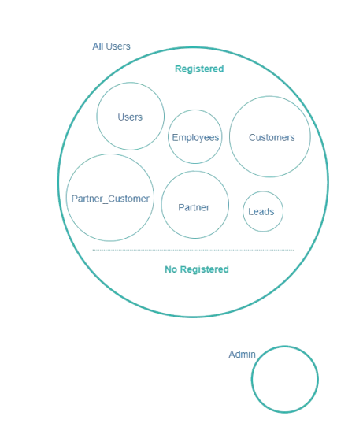

# Security { .flx-title-with-image }

{ .fh-image-of-title }

**Flexygo** includes 3 different security levels:

*   Role security
*   Faculty Security (overrides Role security)
*   User security (overrides Faculty and Role security)

User security allows us to establish security for a given user. We recommend to use role security that allows us to implement security for a group of users. Recently we have incorporated Faculty security. User can have as many faculties as we want, so it is a good complement to role security.

_Example:_  
User John belongs to the sales role. In sales role we establish that each sales man can only see customers from his area. Maybe there are a couple of users that have to see other areas. We can create faculties for those areas and add them to the corresponding users.

## Role Security

**Flexygo** includes five default roles, two main roles: **Admin** and **All Users**. 
The **Admin** Role gives full attributions to any member of the group. 
The **All Users** is a container for the rest of groups that enables us to assign permissions directly to all the child groups. Inside the All Users we will find the second level with the **Registered** and **Not registered** roles. 
**Registered** role will contain any new roles we create, including the default users role. 

Security **always applies upwards** that is if a lower group has security the higher group security is overwritten. The same applies if we set the security on a user level and not on a role level. The **user security will always overwrite his role security**.  
To begin with the examples and more extensive explanations, we will set off dividing in to two parent groups (All Users and Admin).



### Admin

Admin role can access all functions of any existing object, edit, view run processes or create a new one. It has access to all of the framework settings, reason why it is completely excluded from the All Users group.

### Guest Access

In the case of wanting to allow unregistered access to our solution without the need to register and maybe let them be able to view and navigate through a few standard menus and features, we will use the Not Registered role. We must make sure that we have a guest user that belongs to the Not Registered role. We must establish a default Page Id for the guest security and make sure to set at least a view security to the things we want him to see that is:

*   Nodes
*   Pages
*   Modules
*   Objects
*   Processes
*   Reports

If we want to use unregistered access, we must make sure that our **web.config** contains a series of entries:

1\.  Set authentication from Forms to None: 

```xml
<authentication mode="None">
```

2\.  Comment the authorization deny block:

```xml
<authorization> <deny users="?"/> </authorization> 
```

3\.  Set **AllowGuest** setting to **true** in Admin Work Area **\>** Environment **\>** Settings

| To what can we apply security? | On Roles group | On User |
| --- | --- | --- |
| Tables | ✓ |  ✓  |
| Modules | ✓ | ✓ |
| Navigation Nodes | ✓ | ✓ |
| Objets | ✓ | ✓ |
| Processes | ✓ | ✓ |
| Reports | ✓ | ✓ |
| Pages | ✓ | ✓ |
| Pages modules | ✓ | ✓ |

### Example

Imaging the case of having security for the Customers role, they can list the invoices but cannot see the actual invoice. We can set that the Customers role can View Invoice listings but cannot view the invoice.

To guarantee that they cannot see anything else we could remove the Can view security for all the objects in the registered group.

## LDAP Authentication

**flexygo** can authenticate users against Active Directory. Just create a new user on Security **\>** Users using format MyDomain**\\**MyUserName If you want an LDAP autologin with current windows user, open **flexygo** and follow this steps:

1.  Open IIS
2.  Enable **Windows Autentication** option on Autentication menu
3.  Disable **anonymous authentication** option on Autentication menu
4.  Set **EnableLDAPAutoLogin** setting to **true** in Admin Work Area > Environment > Settings
5.  Edit web.config file and set authentication from Forms to Windows

## Password Strength

When you are using login form **flexygo** allows you to define the password strenght by editing the entries in environment setting section:

*   **PasswordRequireDigit**: set to true if you allways demand a digit in your password
*   **PasswordRequiredLength**: Minimum password lenght
*   **PasswordRequireLowercase**: set to true if you allways demand lower case character
*   **PasswordRequireNonLetterOrDigit**: set to true if you allways demand a special character
*   **PasswordRequireUppercase**: set to true if you allways demand upper case character

Check out the following video about **flexygo** security:

<div class="video-wrapper">
    <iframe src="https://www.youtube.com/embed/XEgrAegs0mo" title="YouTube video player" frameborder="0" allow="accelerometer; autoplay; clipboard-write; encrypted-media; gyroscope; picture-in-picture" allowfullscreen=""></iframe>
</div>