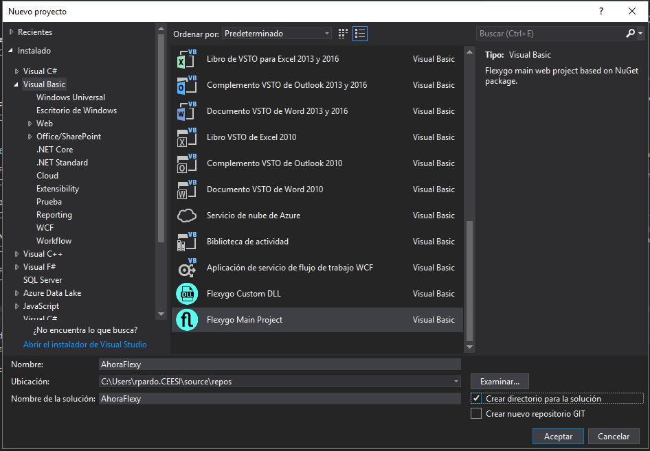
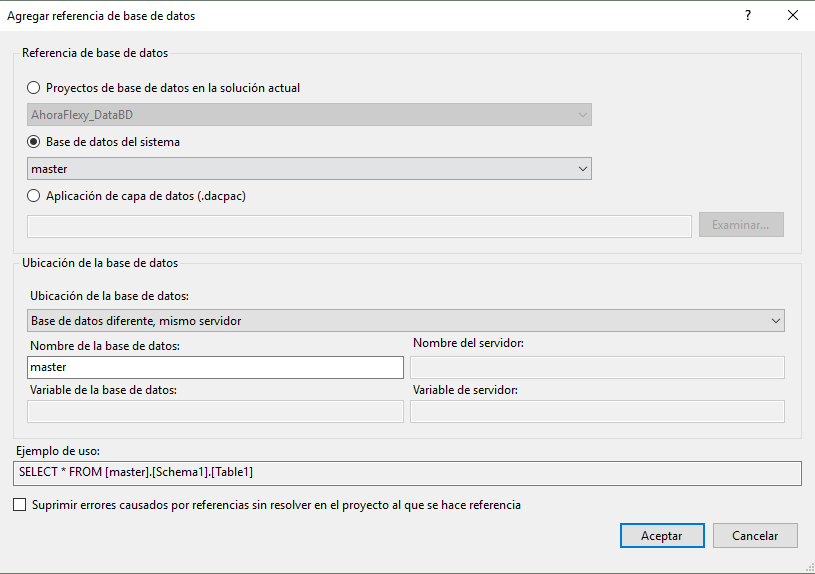

# Crear un producto

Para crear un producto en flexygo tan solo debes seguir los siguientes pasos:

## 1. Definir el nombre del producto

Pon aquí el nombre de producto, para que así los nombres te aparezcan actualizados directamente y tan solo tengas que copiarlos y pegarlos:

<fh-namepropagator selector="propagated-projectname" placeholder="AhoraFlexy"></fh-namepropagator>

## 2. Instalar plantilla

Para descargar la plantilla de flexygo para VisualStudio 2022 dispones de la siguiente URL:  
[https://marketplace.visualstudio.com/items?itemName=Flexygo.FlexygoTemplate](https://marketplace.visualstudio.com/items?itemName=Flexygo.FlexygoTemplate)  
  
O puedes ir a Herramientas → Extensiones y actualizaciones → En línea → y buscar Flexygo


## 3. Crear el proyecto

Creamos un nuevo proyecto de tipo **Flexygo Main Project** utilizando el nombre definido para el producto y solución y marcamos el check **“Crear directorio para la solución”**
  
Si estás en visual studio 2019, dejaremos desmarcada la opción "Colocar la solución y el proyecto en el mismo directorio"  
  


## 4. Agregar proyecto de tipo DLL

Agregaremos un nuevo proyecto de tipo **Flexygo Custom DLL** en la carpeta de la solución y lo llamaremos <fh-copy><span class="propagated-projectname"></span>_Processes</fh-copy>
  


## 5. Agregar proyecto de BBDD Config

Agregaremos un nuevo proyecto de tipo **SQL Server > Flexygo Config Model BBDD** en la carpeta de la solución y lo llamaremos <fh-copy><span class="propagated-projectname"></span>BD</fh-copy>
  


## 6. Agregar proyecto de BBDD Config

Agregaremos un nuevo proyecto de tipo **SQL Server > Flexygo Data Model BBDD** en la carpeta de la solución y lo llamaremos <fh-copy><span class="propagated-projectname"></span>_DataBD</fh-copy>


## 7. Añadir repositorios NuGet de flexygo

Iremos al administrador de paquetes NuGet del proyecto principal (botón derecho sobre el proyecto > Administrar paquetes nuget) y añadiremos los dos repositorios de flexygo haciendo click en la rueda de configuración de orígenes.

*   Flexygo [https://nuget.ahorabh.com/v3/index.json](https://nuget.ahorabh.com/v3/index.json)


## 8. Restaurar paquetes NuGet

Haremos click derecho sobre la solución y pulsaremos en restaurar paquetes nuget.

## 9. Actualizar paquetes NuGet

Actualizaremos el paquete nuget de flexygo a la última versión

Es un proceso que tarda unos minutos, nos daremos cuenta que ha finalizado porque carga el fichero de readme.html en pantalla.

## 10. Instalar CrystalReports para VisualStudio

Para solucionar las dependencias de cristal reports instalaremos la versión para desarrolladores [CRforVS_13_0_22.exe](./readme/utils/CRforVS_13_0_22.zip)

Nota importante: tenga en cuenta, por restricciones del propio entorno SAP, que para poder instalarlo deberá tener en ese preciso momento una versión VS 2017 ó inferior, aunque luego vaya a desarrollar en versiones posteriores

## 11. Agregar referencia a los procesos

En el proyecto principal: quitaremos la referencia a **flxCustomProcesses** y en su lugar agregaremos la referencia a nuestro proyecto de procesos <fh-copy><span class="propagated-projectname"></span>_Processes</fh-copy>

## 12. Corregir referencias BBDDs

En el proyecto <fh-copy><span class="propagated-projectname"></span>BD</fh-copy> quitaremos las dos referencias y las volveremos a agregar:

*   **FlexygoDB** desde el dacpac incluido en la carpeta **db** del proyecto principal con las siguiente configuración:  
    
      
    
*   Y **Master** como referencia a la BBDD del sistema:  
    

## 13. Corregir dependencias

Corregiremos las dependencias fallidas del proyecto por las incluidas en el la carpeta **packages\Flexygo.x.x.xx.xx\lib\net46** de nuestra solución.


## 14. Corregir el script de compilación de BBDD

En las propiedades del proyecto <fh-copy><span class="propagated-projectname"></span>BD</fh-copy>, iremos al apartado **Eventos de compilación** y cambiaremos del comando establecido el nombre flxWeb por el nombre de nuestro producto:  
  
```powershell { .propagated-projectname }
powershell -ExecutionPolicy Unrestricted -Command "& '$(SolutionDir)fhnamepropagator\db\mergeSSDTScripts.ps1' '$(SolutionDir)' '$(ProjectName)' '$(OutputPath)' '$(TargetPath)'
```
  


## 15. Definir nombre de ensamblado y espacio de nombres.

En las propiedades de cada proyecto estableceremos el nombre correcto de ensamblado y de espacio de nombres poniéndole el mismo valor que el nombre del proyecto.  

Sustituir **flxDB_data** por <fh-copy><span class="propagated-projectname"></span>_DataBD</fh-copy>
Sustituir **flxDB_processes** por <fh-copy><span class="propagated-projectname"></span>_processes</fh-copy>
Sustituir **flx** por <fh-copy><span class="propagated-projectname"></span></fh-copy>
Sustituir **flxDB** por <fh-copy><span class="propagated-projectname"></span>BD</fh-copy>


## 16. Typescript

Instalaremos [TypeScript](CreatingWebComponent.md#typescript)

## 17. Publicación

Publicaremos los dos proyectos de BBDD y modificaremos las cadenas de conexión en el **web.config** del proyecto principal para que apunten a estas BBDD.

## 18. Ejecución

Si todo ha funcionado correctamente, pulsaremos el botón en visual studio y se iniciará el proyecto con su depurador.