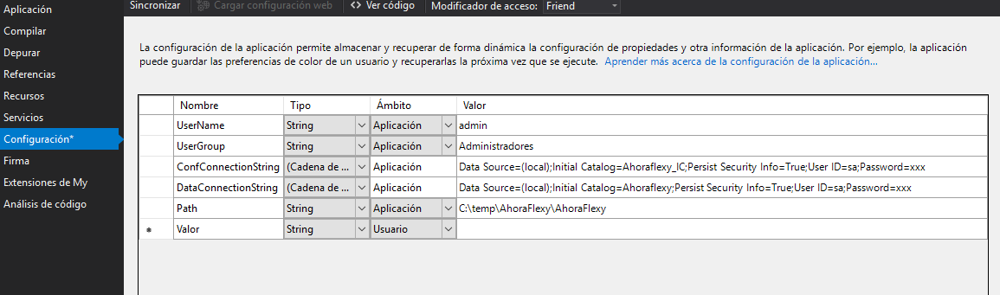

# Agregar un test unitario

## 1. Definir el nombre del producto

Pon aquí el nombre de producto, para que así los nombres te aparezcan actualizados directamente y tan solo tengas que copiarlos y pegarlos:

<fh-namepropagator selector="propagated-projectname" placeholder="AhoraFlexy"></fh-namepropagator>

## 2. Agregar un proyecto de tests

Agregamos un nuevo proyecto llamado <fh-copy><span class="propagated-projectname"></span>UnitTest</fh-copy>


## 3. Agregar referencias

Agregaremos las referencias necesarias

System.web la agregaremos de los ensamblados y el resto del paquete nuget de flexygo


## 4. Configurar

Añadiremos los datos de configuración necesarios



Si Visual Studio nos añade un espacio de nombres en el nombre de la cadena de conexión lo elimiaremos.


## 5. Añadir el código

Añadiremos el código del test a la clase.

```vbnet
Imports FLEXYGO.Configuration.Tokens
Imports FLEXYGO.Objects
Imports FLEXYGO.Objects.Settings
Imports FLEXYGO.Security
Imports FLEXYGO.Data
Imports FLEXYGO.Web
Imports FLEXYGO.Mocks

<TestClass()> Public Class UnitTest1

    ''' <summary>
    ''' The User name
    ''' </summary>
    Friend UserName As String = My.Settings.UserName
    ''' <summary>
    ''' The configuration connection string
    ''' </summary>
    Friend ConfConnString As String = My.Settings.ConfConnectionString
    ''' <summary>
    ''' The data cons string
    ''' </summary>
    Friend DataConsString As String = My.Settings.DataConnectionString
    ''' <summary>
    ''' The user group
    ''' </summary>
    Friend UserGroup As String = My.Settings.UserGroup

    ''' <summary>
    ''' The Settings database connection
    ''' </summary>
    Friend ConfDBConnection As New UserConnection("ConfConnectionString", ConfConnString, 0)
    ''' <summary>
    ''' The data database connection
    ''' </summary>
    Friend DataDBConnection As New UserConnection("DataConnectionString", DataConsString, 0)

    ''' <summary>
    ''' The User Connection Strings
    ''' </summary>
    Friend _ConnectionStrings As New UserConnectionCollection(ConfDBConnection, DataDBConnection)

    ''' <summary>
    ''' The configuration token
    ''' </summary>
    Friend _conftoken As New ConfToken(New UserConnectionCollection("ConfConnectionString", "DataConnectionString"), UserName)
    ''' <summary>
    ''' The User security Configuration
    ''' </summary>
    Friend _ConfUserSecurity As UserSecurityConfig = _conftoken.UserSecurity


    Public Sub New()
        If System.Web.HttpContext.Current Is Nothing Then
            HttpContextManager.SetCurrentContext(MockHelper.GetMockedHttpContext, UserName)
        End If
    End Sub

    Public Sub SetConfToken(lConfToken As ConfToken, Optional HTMLFormat As Boolean = False)
        Me.UserName = lConfToken.UserSecurity.UserName
        Me.ConfConnString = lConfToken.ConfConnString
        Me.DataConsString = lConfToken.UserSecurity.ConnectionStrings.MainDataConnString
        Me.UserGroup = My.Settings.UserGroup
        Me.ConfDBConnection = New UserConnection("ConfConnectionString", ConfConnString, 0)
        Me.DataDBConnection = New UserConnection("DataConnectionString", DataConsString, 0)
        Me._ConnectionStrings = New UserConnectionCollection(ConfDBConnection, DataDBConnection)
        Me._conftoken = lConfToken
        Me._ConfUserSecurity = lConfToken.UserSecurity
    End Sub

    <TestMethod()> Public Sub TestImageController()


        If Not MySession.Contains("ConfToken") Then
            GlobalVars.SetConfToken(_conftoken)
        End If
        Try

            Dim ctl As New AhoraFlexy.Controllers.CarouselController

            Dim res As List(Of FLEXYGO.Utilities.General.BaseCollection) = ctl.ReadImages()

            For Each itm As FLEXYGO.Utilities.General.BaseCollection In res

                Dim File As String = itm("File").ToString.Replace("~", My.Settings.Path).Replace("/", "\")

                If Not System.IO.File.Exists(File) Then
                    Assert.Fail(String.Format("File {0} not found", File))
                End If

            Next


        Catch ex As Exception
            Assert.Fail("Error in TestEntityController:" + vbCrLf + ex.Message)
        End Try
    End Sub

End Class
```

## 6. Comprobación

Abrimos el **explorador de pruebas** y ejecutamos las pruebas para comprobar que todo está OK.

