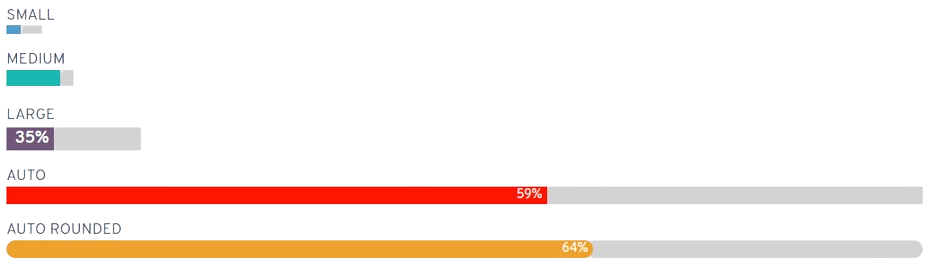
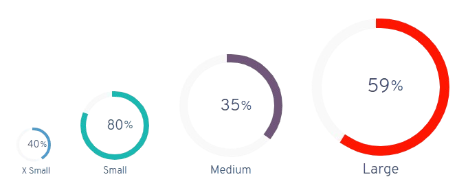
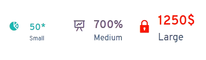
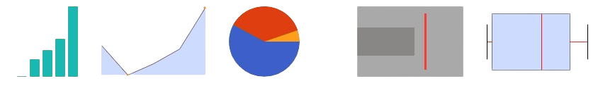

# Chart

**Easy Pie**, **Easy Info**, **Easy Line** y **Sparklines** son algunos de los componentes web que puedes usar para crear gráficos. Combinados en un módulo HTML, puedes obtener resultados similares a los siguientes:


## Easy Line

Puedes añadir un easy line simplemente agregando el componente web **flx-easyline**.

```html
<flx-easyline color="#4f9fcf" size="s" value="40" label="Small" symbol="%" hideValue="true"></flx-easyline>
```

```html
<flx-easyline color="#2db7b0" size="m" value="80" label="Medium" symbol="%" hideValue="true"></flx-easyline>
```

```html
<flx-easyline color="#6e587a" size="l" value="35" label="Large" symbol="%"></flx-easyline>
```

```html
<flx-easyline color="red" value="59" label="Auto" symbol="%"></flx-easyline>
```

```html
<flx-easyline color="#ee9e1f" value="64" label="Auto Rounded" symbol="%" rounded="true"></flx-easyline>
```

Usa cualquiera de los tres tamaños predefinidos: small, medium o large. También puedes dejar el tamaño vacío y el componente se ajustará automáticamente.



### Opciones

1. Añade tu sentencia SQL al módulo
2. Indica tus parámetros básicos de EasyLine
3. Indica tus parámetros básicos de EasyLine con sentencia SQL

Sentencia SQL:

```sql
Select count(id) as value from Table
```

Parámetros:

```js
color="red" size="l" value="59" label="Large" symbol="%" hideValue="true" rounded="true"
```

Sentencia SQL:

```sql
Select label, value, ''#2db7b0'' as color, ''%'' as symbol, '''' AS size, ''true'' AS hideValue, ''true'' AS rounded FROM Table
```

## Timeline Progress Bar

Este componente se usa principalmente en Timeline, pero también puedes añadirlo directamente:

```html
<flx-timeline-progressbar></flx-timeline-progressbar>
```

```html
<flx-timeline-progressbar percentage="54"></flx-timeline-progressbar>
```

```html
<flx-timeline-progressbar color="red" percentage="63"></flx-timeline-progressbar>
```

```html
<flx-timeline-progressbar color="#ee9e1f" percentage="87">Custom template</flx-timeline-progressbar>
```


### Opciones

Indica los parámetros del Timeline Progress Bar:

```js
color="red" percentage="75"
```

## Easy Pie

Puedes añadir gráficos Easy Pie referenciando un módulo Easy Pie:

```html
<flx-easypie modulename="6" />
```

O añadiendo directamente el componente web:

```html
<flx-easypie color="#4f9fcf" size="xs" value="40" label="X Small" symbol="%"></flx-easypie>
```

```html
<flx-easypie color="#2db7b0" size="s" value="80" label="Small" symbol="%"></flx-easypie>
```

```html
<flx-easypie color="#6e587a" size="m" value="35" label="Medium" symbol="%"></flx-easypie>
```

```html
<flx-easypie color="red" size="l" value="59" label="Large" symbol="%"></flx-easypie>
```

Usa cualquiera de los tres tamaños: small, medium o large.



### Opciones

1. Añade tu sentencia SQL al módulo
2. Indica tus parámetros EasyPie básicos
3. Indica tus parámetros EasyPie básicos con sentencia SQL
4. Indica opciones JSON de EasyPie opcionales, las que puedes ver [aquí](https://rendro.github.io/easy-pie-chart/).
5. Indica parámetros básicos y JSON con sentencia SQL

Sentencia SQL:

```sql
Select count(id) as value from Table
```

Parámetros:

```js
size="l" value="59" label="Large" symbol="%"
```

Opciones JSON:

```json
{ "animate": 1000, "scaleColor": false }
```

Sentencia SQL:

```sql
Select count(id) as value,''%'' as symbol, ''blue'' as barColor, ''red'' as color, 2000 as animate from Table
```

## Easy Info

Puedes añadir Easy Info referenciando un módulo:

```html
<flx-easyinfo modulename="14" />
```

O añadiendo directamente el componente:

```html
<flx-easyinfo color="#2db7b0" iconclass="flx-icon icon-pie-chart" size="s" value="50" label="Small" symbol="*"></flx-easyinfo>
```

```html
<flx-easyinfo color="#6e587a" iconclass="flx-icon icon-presentation-2" size="m" value="700" label="Medium" symbol="%"></flx-easyinfo>
```

```html
<flx-easyinfo color="red" iconclass="flx-icon icon-lock" size="l" value="1250" label="Large" symbol="' + convert(nvarchar(max),NCHAR(36)) + N'"></flx-easyinfo>
```

Usa cualquiera de los tres tamaños predefinidos.



### Opciones

1. Añade tu sentencia SQL
2. Indica parámetros básicos
3. Indica parámetros básicos con sentencia SQL

Sentencia SQL:

```sql
Select count(id) as value from Table
```

Parámetros:

```js
color="#2db7b0" iconclass="flx-icon icon-pie-chart" size="l" value="59" label="Large" symbol="%"
```

Sentencia SQL:

```sql
Select count(id) as value,''#2db7b0'' as color,''%'' as symbol,''Large'' as label from Table
```

## SparkLine

Puedes añadir gráficos pequeños referenciando un módulo sparkline:

```html
<flx-sparkline modulename="10" />
```

O añadiendo directamente el componente:

```html
<flx-sparkline color="#2db7b0" type="bar" size="s" values="[1,7,10,14,25]"></flx-sparkline>
```

```html
<flx-sparkline color="#6e587a" type="line" size="m" values="[15,7,10,14,25]"></flx-sparkline>
```

```html
<flx-sparkline color="red" type="discrete" size="l" values="[11,7,-10,-14,25]"></flx-sparkline>
```

```html
<flx-sparkline color="red" type="pie" size="l" values="[11,7,-10,-14,25]"></flx-sparkline>
```

```html
<flx-sparkline color="red" type="bullet" size="l" values="[11,7,-10,-14,25]"></flx-sparkline>
```

```html
<flx-sparkline color="red" type="box" size="l" values="[11,7,-10,-14,25]"></flx-sparkline>
```

Puedes usar cualquiera de los tres tamaños: small, medium o large, en cualquiera de los tipos (bar, line, discrete, pie, bullet o box).

### Small

{ .sparkline-small }

### Medium

{ .sparkline-medium }

### Large

{ .sparkline-large }

### Opciones

1. Añade tu sentencia SQL
2. Indica tus parámetros básicos

Sentencia SQL:

```sql
Select count(id) as value from Table
```

Parámetros:

```
color="#2db7b0" type="bar" size="l"
```