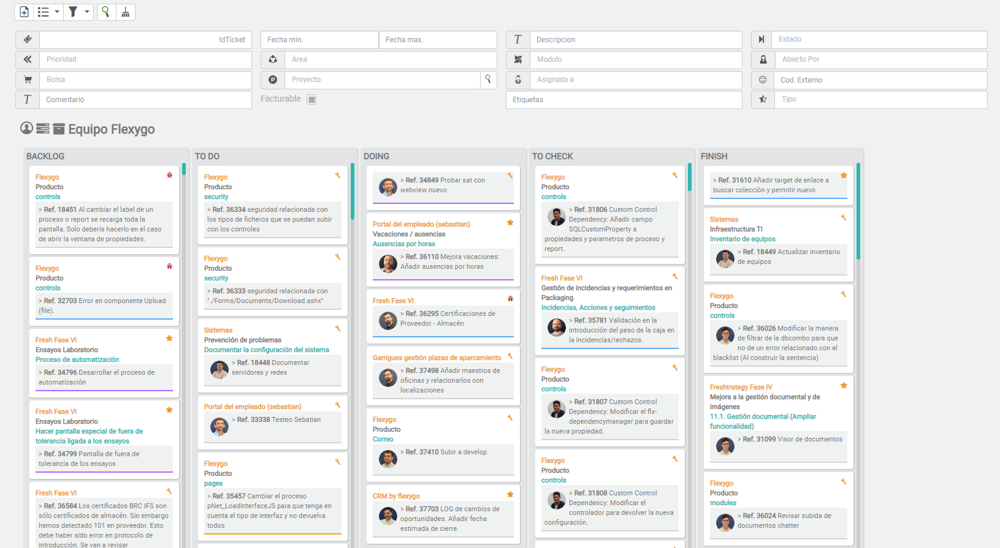
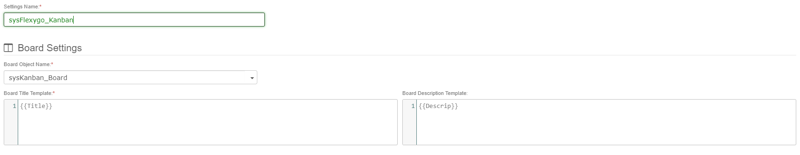
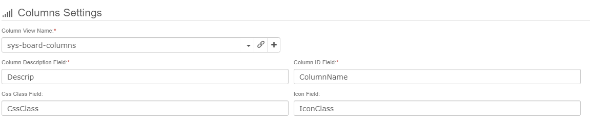
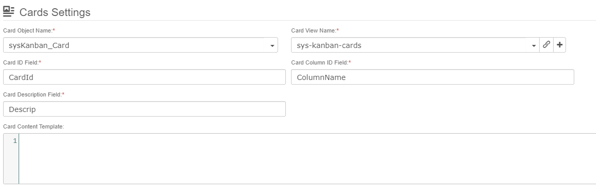
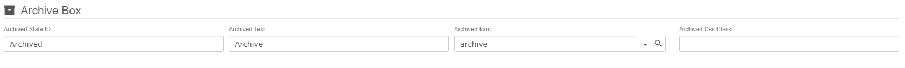
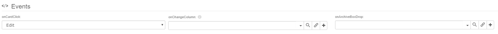
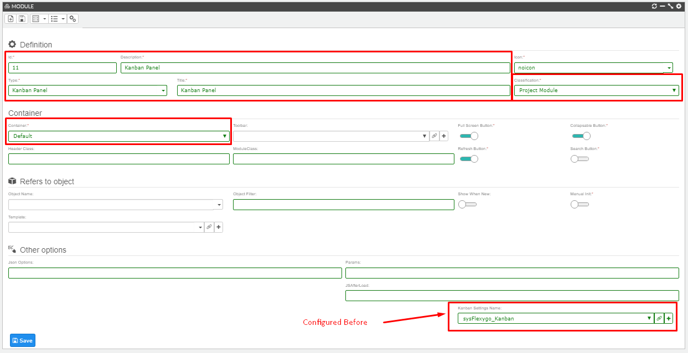

# Kanban

Kanban is a project management method that helps teams visualize workload and workflow. The **Flexygo** Kanban module lets you define a board using any type of object.

There is a Kanban example in Flexygo. <flx-navbutton class="link" type="openPage" pagetypeid="view" objectname="sysKanban_Board" objectwhere="([Kanban_Boards].[BoardName] = 'Flexygo_Task_List')" showprogress="false">Click here</flx-navbutton> to open it, and check its <flx-navbutton class="link" type="openPage" pagetypeid="view" objectname="sysKanban_Setting" objectwhere="KanbanSettingsName='sysFlexygo_Kanban'" showprogress="false">configuration</flx-navbutton>.

## Module Settings

When you select in a module the type **Kanban Panel** you will need to set the **object** and its **object where**. To understand which object you have to choose you need to know how the kanban works.

The kanban is going to need two different objects, the **board object** and the **cards object**. The **board** one is going to be the parent of the **cards** so for example a **delivery driver** (board) has multiple **deliveries** (cards). Here in the module you need to set the **board** one as your object.

!!! warning "Object Where is required"
    **Object Where** is always required, because the Kanban should represent one board record.
    For example one specific driver and that driver's deliveries. If you need a board for a group of drivers, use a parent object such as Team.

## Kanban Settings

After selecting the  **Object** and **Object Where**, create your own **Kanban Settings** from the field shown at the bottom-right of the form. You will configure the following sections:

### Board Settings

Defines the basic board behavior and labels.

| Setting | Description |
|---------|-------------|
| **Settings Name** | Name used to identify this Kanban configuration. |
| **Board Object Name** | Main Kanban object (parent of the cards). You can use its properties in templates below. |
| **Board Title Template** | Title shown at the top of the board, for example `{{DriverName}} Kanban`. |
| **Board Description Template** | Short text shown below the title, for example `All deliveries for {{DriverName}}`. |

### Column Settings

Here you define the view that determines how many columns the Kanban has and how they are named and styled:

| Setting | Description |
|---------|-------------|
| **Column View Name** | View used to load column information. It must contain at least the first two fields listed below. |
| **Column Description Field** | Text shown at the top of the column. |
| **Column ID Field** | Internal identifier for each column. |
| **CSS Class Field** | CSS class applied to the column `.kanban-col` div. |
| **Icon Class** | Icon shown next to the column description. |

!!! info "View Name can be detached"
    In many implementations, this view is logically detached from the **board object**.
    This is common when columns come from a master table that stores state **IDs** and **names**.

### Card Settings

Here you define the **card object**, the **view** used to load card data, and the fields used to render each card:

| Setting | Description |
|---------|-------------|
| **Card Object Name** | Object used as cards. |
| **Card View Name** | View used to render card information. It must contain at least the first three fields listed below. |
| **Card ID Field** | Internal card identifier. |
| **Card Column ID Field** | Field that defines which column each card belongs to when loaded. |
| **Card Description Field** | The description will be the card content if no content template is assigned. |
| **Card Content Template** | Optional HTML template for rich card rendering. If used, it can parse card fields. |

### Archive Settings

Configures the archive area. Archiving means changing the card state to the configured **Archived State ID**. Archived cards are not shown in the Kanban board.

| Setting | Description |
|---------|-------------|
| **Archived State ID** | State ID assigned when a card is dropped into the archive area. |
| **Archived Text** | Short text shown in the archive area. |
| **Archived Icon** | Icon shown in the archive area. |
| **Archived CSS Class** | CSS class applied to the archive area. |

### Event Settings

Defines which processes run when Kanban events are triggered.

| Setting | Description |
|---------|-------------|
| **On Card Click** | Process executed when a card is clicked. |
| **On Change Column** | Process executed when a card changes column. |
| **On Archive Box Drop** | Process executed when a card is dropped into the archive area. |

## Add the kanban on your page

Drag the module to your page from the module manager and complete the following fields:

| Setting | Description |
|---------|-------------|
| **ID** | Module identifier. |
| **Type** | Module type, in this case Kanban Panel. |
| **Description** | Brief module description. |
| **Title** | Title shown on the module. |
| **Classification** | As this is not a default module, use Project Module. |
| **Container** | Module container type. |
| **Object Name** | Select the board object. |
| **Object Where** | Condition used to load one board record. |
| **Kanban Settings Name** | Kanban settings configured in the previous section. |

## Videotutorial

You can also watch this video on how to configure the Kanban module:

    <iframe src="https://www.youtube.com/embed/AidJrIHQHZc" title="YouTube video player" frameborder="0" allow="accelerometer; autoplay; clipboard-write; encrypted-media; gyroscope; picture-in-picture" allowfullscreen=""></iframe>

