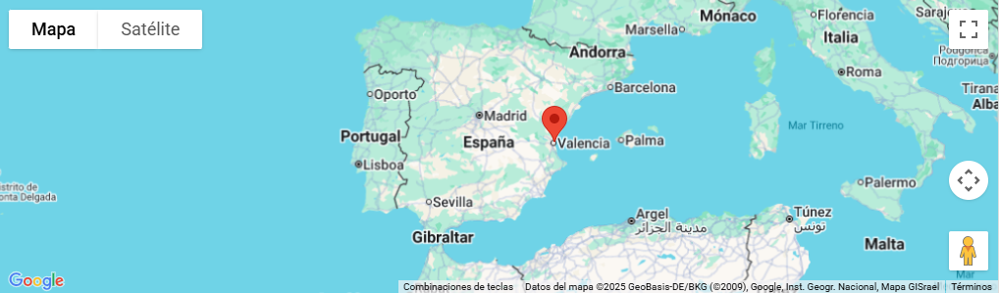
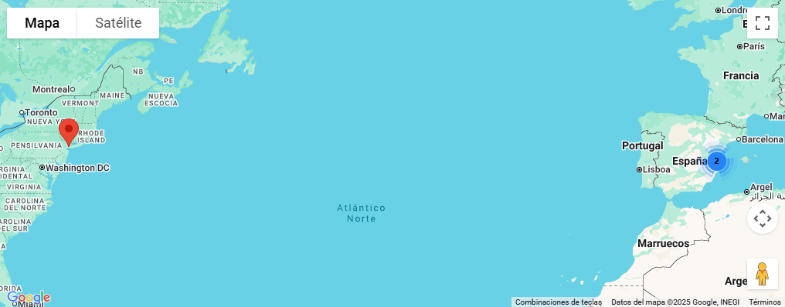
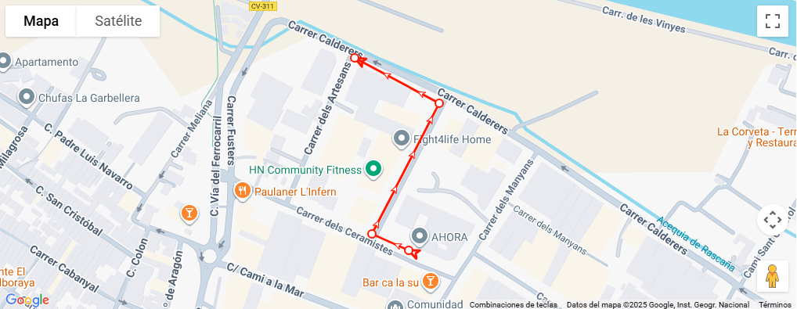
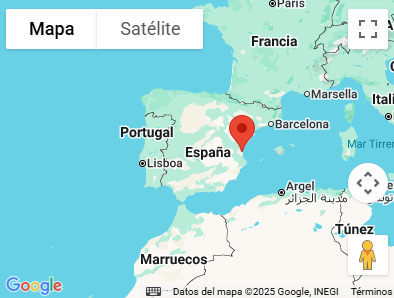
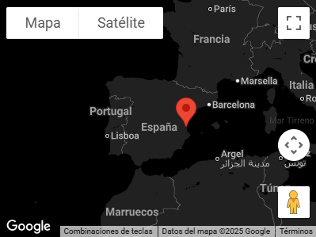
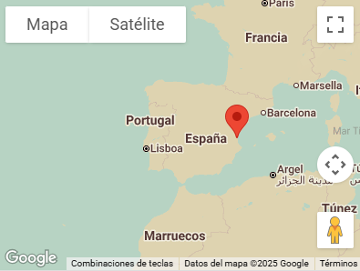
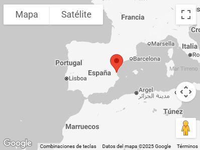
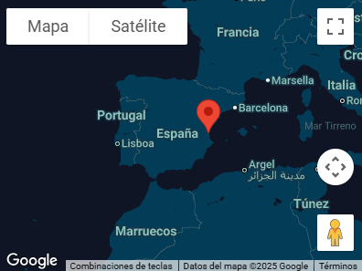

# Google Map

Google Maps is a service developed by Google with which you can find the exact location of cities, businesses or attractions on the Internet. To implement Google Maps in your **flexygo** project, you need to obtain a Google API Key. Once you have the key, you should add it to **flexygo** settings (Image 1).


See how to obtain Google API Key in flexygo [help.](/Connectors/GoogleAPIKey)
{: .flx-warning-card }

Adding a Map from Google is very simple. You’ll need to refer to a map module.
```html
<flx-map modulename="sysmod-map"></flx-map>
```

Or you can add directly the flx-map web component.
```html
<flx-map>         
	<marker address="Polígono Industrial Camí del Mar, C/ Ceramistes, 19, 46120 Alboraia, Valencia" title="Ahora Freeware">Content</marker>
</flx-map> 
```



## Module Options

1.  Add your SQL sentence to the module in order to create markers: 
```sql
SELECT '60' AS lat, '20' AS lng, 'Noruega' AS address, 'Titulo' AS title, 'Content' AS content, 'Icon' AS icon, 'Label' AS label, '1' AS zIndex
```
2.  Set JSON options:
```json
{"Cluster":"true","Color":"retro","Width":"100%","Height":"400"}
```

## Marker Cluster Example



## Routes

With flx-map you can also create routes like this one.

If you want to add information on click to one of the points of the route you need to set an id. That info can be set in title os as part of the marker inner html.
```html
<flx-map cluster="false" width="auto" height="400" route="true" linewidht="3">
    <marker lat="39.501294" lng="-0.343337" id="1" title="Ahora Freeware">Content</marker>
    <marker lat="39.501467" lng="-0.343836" id="2" title="Ahora Freeware">Content</marker>
    <marker lat="39.502849" lng="-0.342913" id="3" title="Ahora Freeware"></marker>
    <marker lat="39.503330" lng="-0.344072" id="4" title="Ahora Freeware"></marker>
</flx-map>
```



### Customizing route styles

Routes can be customized using this propperties:

**Arrow**: Sets an arrow icon at the beggining and end of the route to make direction more visual. (default: true)

**Dotted**: Sets a dot icon on every marker. (default: true)

**lineColor**: Sets the line color, you can use rgb, hex or even colors by name. (default: #FF0000)

**lineWidht**: Sets the line width. (default: 3)
```html
<flx-map cluster="false" width="auto" height="400" route="false" arrow="false" dotted="true" linecolor="red" linewidht="2">
    <marker lat="39.501294" lng="-0.343337" id="1" title="Ahora Freeware">Content</marker>
    <marker lat="39.501467" lng="-0.343836" id="2" title="Ahora Freeware"></marker>
    <marker lat="39.502849" lng="-0.342913" id="3" title="Ahora Freeware">Content</marker>
    <marker lat="39.503330" lng="-0.344072" id="4" title="Ahora Freeware"></marker>
</flx-map>
```


```html
<flx-map cluster="false" width="auto" height="400" route="true" arrow="true" dotted="false" linecolor="rgb(114,137,218)" linewidht="5">
    <marker lat="39.501294" lng="-0.343337" id="1" title="Ahora Freeware">Content</marker>
    <marker lat="39.501467" lng="-0.343836" id="2" title="Ahora Freeware"></marker>
    <marker lat="39.502849" lng="-0.342913" id="3" title="Ahora Freeware">Content</marker>
    <marker lat="39.503330" lng="-0.344072" id="4" title="Ahora Freeware"></marker>
</flx-map>
```


### Multiple routes in one map

With the parameter **group** you will be able to divide markers in different routes, as it can be seen in this example.
```html
<flx-map cluster="false" width="auto" height="400" route="true" arrow="true" dotted="false" linecolor="rgb(114,137,218)" linewidht="5">
    <marker lat="39.501294" lng="-0.343337" id="1" group="Ruta1" title="1:1">Content</marker>
      <marker lat="39.501467" lng="-0.343836" id="2" group="Ruta1" title="1:2"></marker>
      <marker lat="39.502849" lng="-0.342913" id="3" group="Ruta1" title="1:3">Content</marker>
      <marker lat="39.503330" lng="-0.344072" id="4" group="Ruta1" title="1:4"></marker>
      <marker lat="39.501112" lng="-0.345742" id="5" group="Ruta2" title="2:1">Content</marker>
      <marker lat="39.500354" lng="-0.343202" id="6" group="Ruta2" title="2:2"></marker>
      <marker lat="39.499427" lng="-0.343997" id="7" group="Ruta2" title="2:3">Content</marker>
      <marker lat="39.498954" lng="-0.342874" id="8" group="Ruta2" title="2:4"></marker>
      <marker lat="39.502818" lng="-0.350026" id="9" group="Ruta3" title="3:1"></marker>
      <marker lat="39.501361" lng="-0.351193" id="10" group="Ruta3" title="3:2"></marker>
      <marker lat="39.500840" lng="-0.352105" id="11" group="Ruta3" title="3:3"></marker>
</flx-map>
```


## Polygons in google maps

With the parameter **coords** you will be able to add markers with polygons instead a point, if coords, lat and lng parameter is defined, coords has priority.You can see it working in this example.
```html
<flx-map cluster="false" width="auto" height="400">
  <marker lat="39.501317756703116" lng="-0.3431863435308278">Ceesi asesores</marker>
  <marker coords="[{lat:39.50147061967978, lng:-0.34315976635630774},{lat:39.50132574650802, lng:-0.3432321859947825},{lat:39.50126365791343, lng:-0.34299615161753155},{lat:39.501387835047176, lng:-0.3429210497702245}]">Parcela 1</marker>
  <marker coords="[{lat:39.50082489693055, lng:-0.3432134105329557},{lat:39.500783504242015, lng:-0.3430712534648387},{lat:39.50096563188717, lng:-0.342931778605554},{lat:39.501013233352104, lng:-0.34309807555316263}]" lat="39.501317756703116" lng="-0.3431863435308278">Parcela 2</marker>
  <marker color="blue" coords="[{lat:39.501475721696295, lng:-0.3445088082995023},{lat:39.50088741697042, lng:-0.3447212284015442},{lat:39.500629849154926, lng:-0.3437994768873265},{lat:39.501136203158666, lng:-0.34349222638258725}]">Parcela 3</marker>
</flx-map>
```


## Circles in google maps

With the parameter **radius** and **radiuscolor** you will be able to add markers with circles and a marker on the center.You can see it working in this example.
```html
<flx-map cluster="false" width="auto" height="400">
    <marker lat="39.501317756703116" lng="-0.3431863435308278" radius="750" radiuscolor="blue">Ceesi asesores</marker>
    <marker address="Valencia" radius="500" radiuscolor="red"></marker>
</flx-map>
```


## Custom Skins

Map on default will use light or dark skin depending on users mode. But with the color property you can set a theme that will stay the same for everyone.

### Light


### Dark


### Retro


### Silver


### Night


### Aubergine


Watch the following videos on our YouTube channel related to Maps Module.
<div class="video-wrapper">
    <iframe src="https://www.youtube.com/embed/qV9uGvAL_5g" title="YouTube video player" frameborder="0" allow="accelerometer; autoplay; clipboard-write; encrypted-media; gyroscope; picture-in-picture" allowfullscreen=""></iframe>
</div>

<div class="video-wrapper">
    <iframe src="https://www.youtube.com/embed/2CDScKLUVjw" title="YouTube video player" frameborder="0" allow="accelerometer; autoplay; clipboard-write; encrypted-media; gyroscope; picture-in-picture" allowfullscreen=""></iframe>
</div>