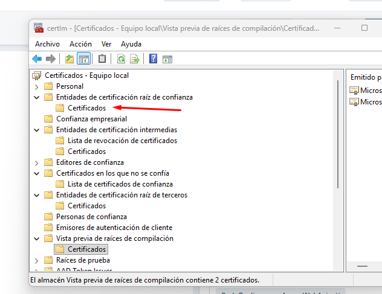
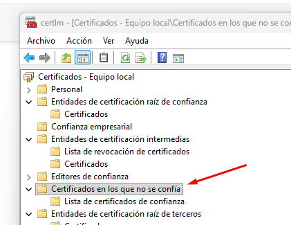
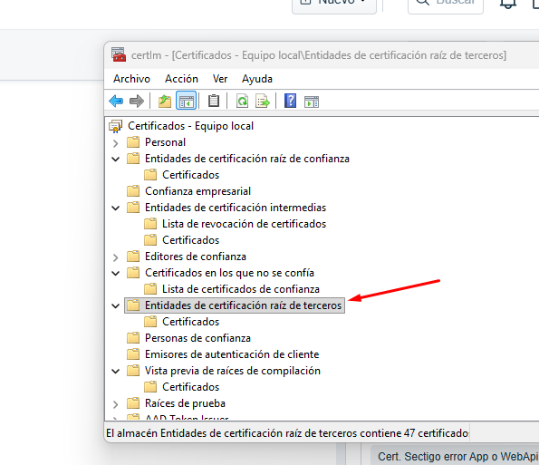

# Error connecting to the WebApi from the Offline App on Android 12/13 devices

After renewing/updating the Sectigo certificate, it becomes impossible to access the Offline App from these devices because the certificate is not recognized on them.

## Steps to follow on the IIS server where the certificate is installed

The solution is to add the R46 certificate to the "Untrusted Certificates" store and install a "cross-signed certificate":

1. Export "Sectigo Public Server Authentication Root R46" from the Trusted Root Certification Authorities store and save the certificate file

    

2. Remove it from the Trusted Root Certification Authorities store

3. Import it into "Untrusted Certificates"

    

In addition, the "cross-signed certificate" must be added to the Third-Party Root Certification Authorities store

Once this is done, verify that access to the Offline App from the older devices works correctly.

## Attachments

Download the [Sectigo-RSA-Domain-Validation-CA-Bundle.pem](./readme/utils/Sectigo-RSA-Domain-Validation-CA-Bundle.pem) file containing the cross-signed certificate mentioned in step 3.
