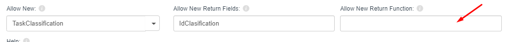

# Ejemplo de función de retorno en combo con botón de permitir nuevo



Al configurar una combo en la que queremos permitir al usuario añadir nuevos elementos, por defecto configuraremos el objeto a crear y el campo de vuelta que se asignará en la combo tras la creación del nuevo elemento.

En algunos casos necesitaremos, por ejemplo, asignar valores por defecto al objeto de forma que al abrir la ventana del nuevo objeto ya tenga esos valores asignados. En estos casos podremos programar una función que realice esas asignaciones y, además, en su retorno añada el valor a la combo.

Esta función conviene guardarla en un fichero con extensión `.js` en la carpeta `custom` y subirla como plugin, de modo que se cargará como una función más de la aplicación y estará disponible en cualquier momento.

Una vez programada y añadida la función, deberemos especificarla en la sección **Allow New Return Function**.

## Ejemplo práctico

Adjuntamos un ejemplo en el que, desde la ficha de un cliente, damos la opción de crear y asignarle una domiciliación; por tanto, al abrir la domiciliación ya heredará el id del cliente.

La llamada a la función sería tal que así (*):

```
newCustomerDirectDebit({{CustomerId}});
```

\* En el caso de que el valor sea un texto, hay que ponerlo entre comillas:

```
newCustomerDirectDebit('{{CustomerId}}');
```

## Código de ejemplo

```javascript
/**función de retorno para crear nuevas domiciliaciones de pagadores
en la customControls dbcombo_CustomersDirectDebits **/
function newCustomerDirectDebit(CustomerId){

    flexygo.events.on(this, "entity", "inserted", (e) => {
        if (e.masterIdentity === "SCH_CustomersDirectDebit") {
            flexygo.events.off(this, "entity", "inserted");

            let entity = e.sender;

            let value;
            if ("DirectDebitId" && "DirectDebitId" != '') {
                value = entity.data["DirectDebitId"].Value;
            }
            else {
                let config = entity.getConfig();
                value = entity.data[config.KeyFields[0]].Value;
            }

            $('flx-dbcombo[property="DirectDebitId"]')[0].loadValues(0, false, true, value);
            $('flx-dbcombo[property="DirectDebitId"]')[0].setValue(value);

            $(document).find('flx-edit[objectname="SCH_CustomersDirectDebit"]').closest(".ui-dialog").remove();
        }
    });

    flexygo.nav.openPage('edit','SCH_CustomersDirectDebit',null,'{"CustomerId":"' + CustomerId + '"}','popup800x600',false,$(this));
}
```
