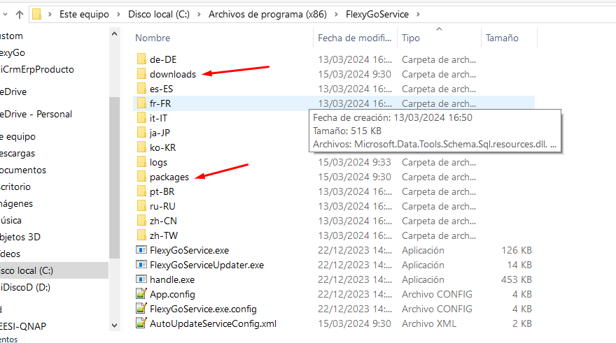

# How to fix the "Damaged central directory" error when updating the application

The problem comes from corrupted NuGet files: an incomplete download leaves the file corrupted, the same way a zip file can't be unzipped when the download didn't finish.

## Solution

Delete the files in the `downloads` and `packages` folders of the `FlexygoService` service on the server, then restart the update process.
