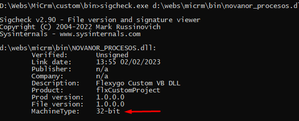
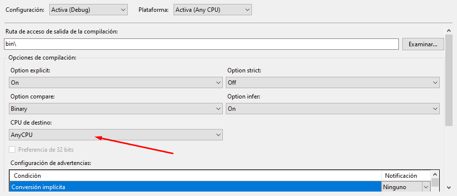

# I've generated a DLL and Flexygo doesn't recognize it

When setting up the parameters for the function whose process we want to add to the Flexygo environment, we get an error saying the DLL can't be loaded because its format isn't recognized.

One possible reason is that it wasn't compiled for all CPUs: it was built as x86 (32-bit), while Flexygo's application pool is configured as incompatible with 32-bit.

There is a tool, `sigcheck.exe`, that gives us that information.

## Solution

The solution is to recompile the DLL in the right format, i.e. `AnyCPU` instead of `x86`:

