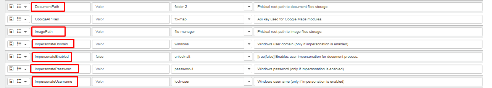
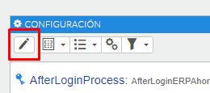
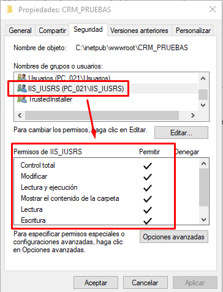
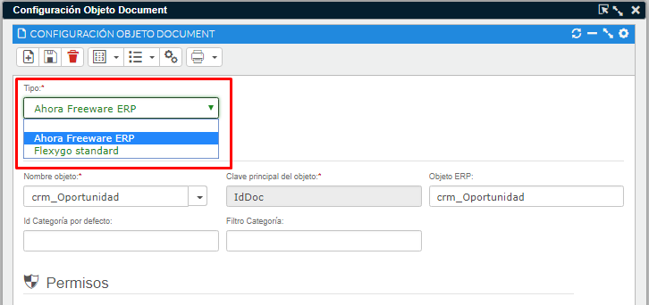

# What should I take into account for document management?

For document management to work correctly, there are several aspects to keep in mind.

## 1. Custom storage paths

If we want images or files to be saved in a `PATH` different from the project's own, we need to configure `DocumentPath`, `ImagePath` and the `Impersonate` parameters:

To modify these values, go to **Design area → Environment → Parameters → Edit**.

## 2. IIS user permissions

The IIS user needs read and write permissions on the folders that document management needs to access.

## 3. Available configuration types

In the document management configuration we can choose between two types of setup:

* If we choose **Ahora Freeware ERP**, our document management will link to the ERP's document management; to do this we'll need to specify the ERP object it links to and that object's key.
* If we choose **Flexygo standard**, our document management will be stored at the project's default path in Flexygo (e.g. `~\Custom\Documentos`).

## 4. Filtering limitations

If two levels of filtering are needed to display it, keep in mind that document management can't filter by the same field twice. To achieve this, you need to create a new field that concatenates both values — this becomes the field that document and image management relate on — or add an `identity` field to the main table.
