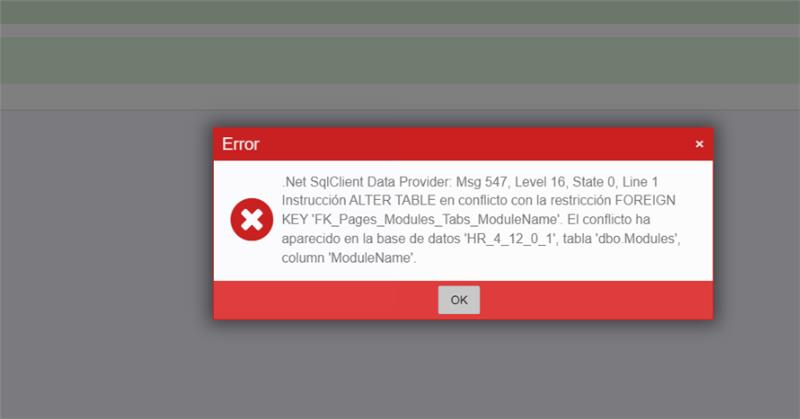

# Estoy actualizando versión, obtengo error de conflicto Foreign Key

Si durante una actualización se muestra un error parecido a este:

El problema reside en que se han añadido registros en objetos nuevos de Flexygo (objetos, vistas, módulos, páginas...) con `OriginId` incorrecto; es decir, ciertas personalizaciones se han marcado como sistema o producto por error (normalmente por copiar y pegar). El efecto es que el sistema, en sus merges, no los va a añadir, y dará errores en otras tablas relacionadas.

El script [CambiarOriginId.sql](./readme/utils/CambiarOriginId.sql), disponible en [Desarrollando: script para cambiar el OriginId de todas nuestras modificaciones](OriginIdChangeScript.md), informa de todos los registros que tienen un origen de sistema o producto y deberían tenerlo de cliente.

## Solución

La solución pasa por modificar esos registros y cambiarles el `OriginId`, cambiando el `0` o el `1` por el `2` habitualmente.

## Véase también

* [Cómo funciona el OriginId en 4 pasos](OriginIdExplained.md)
* [Desarrollando: script para cambiar el OriginId de todas nuestras modificaciones](OriginIdChangeScript.md)
