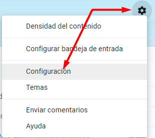
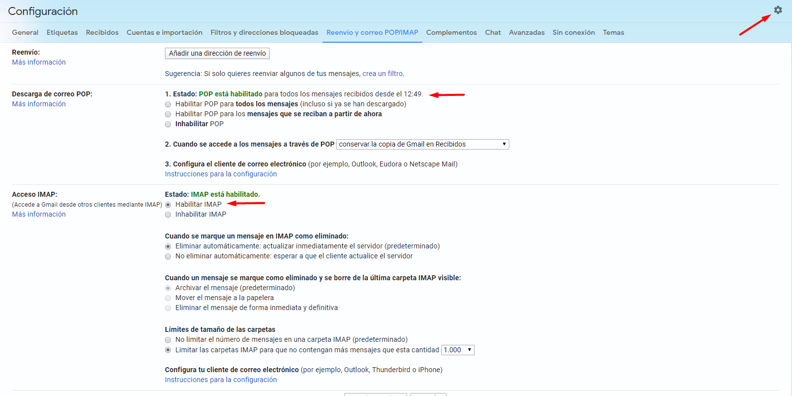
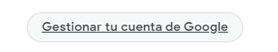
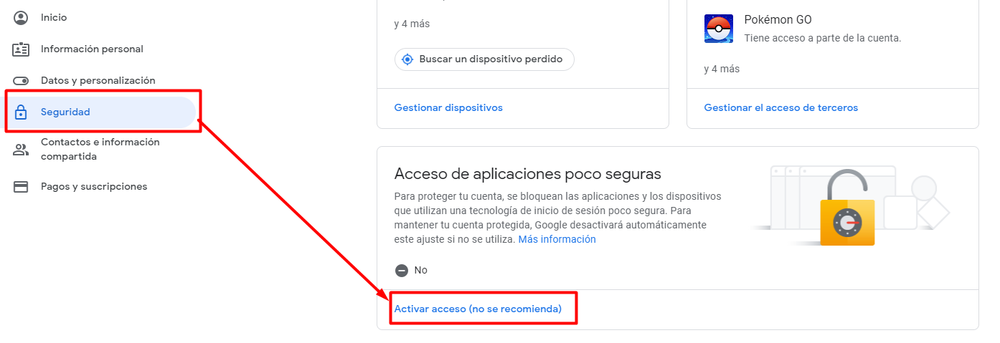
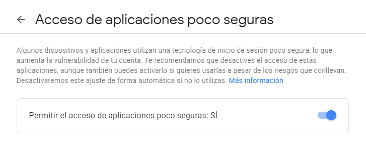
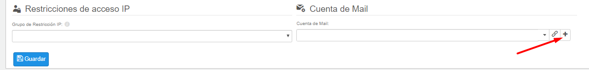
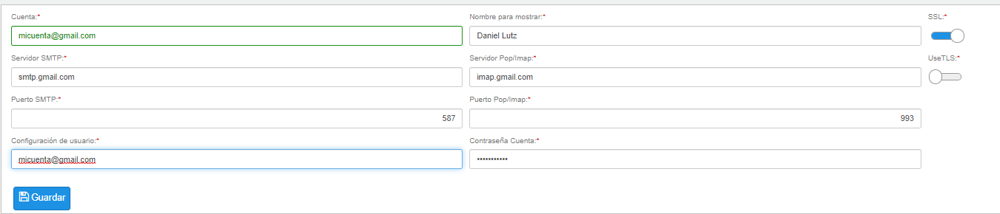
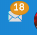

# Cómo configurar el buzón de correos con una cuenta de Gmail

## Paso 1. Habilitar POP e IMAP

Entra en Gmail, en el apartado de configuración, para habilitar POP e IMAP.

## Paso 2. Configura el acceso a aplicaciones poco seguras

* Accede a tu perfil y entra en el apartado de configuración

* Entra en el apartado de seguridad y activa el acceso

## Paso 3. Configura la cuenta de usuario de Flexygo

Entra en la ficha del usuario de Flexygo, en el apartado de cuenta de email, añade una nueva, créala y guarda los cambios del usuario indicando las credenciales de acceso.

## Paso 4. Recarga la caché y la aplicación

Flexygo conectará con tu bandeja de correo y podrás gestionarla desde la plataforma.

## Véase también

* [Sincronización con la agenda de mi cuenta de correo](https://help.flexygo.com/support/solutions/articles/154000130134-sincronizaci%C3%B3n-con-la-agenda-de-mi-cuenta-de-correo)
* [Configuración de notificaciones](https://help.flexygo.com/support/solutions/articles/154000215685-configuraci%C3%B3n-de-notificaciones)
