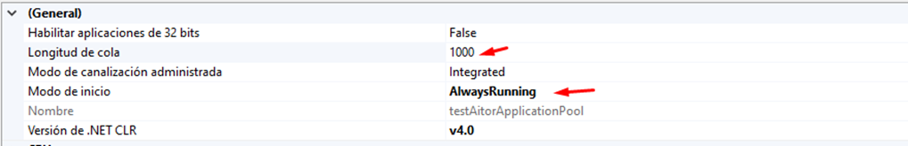
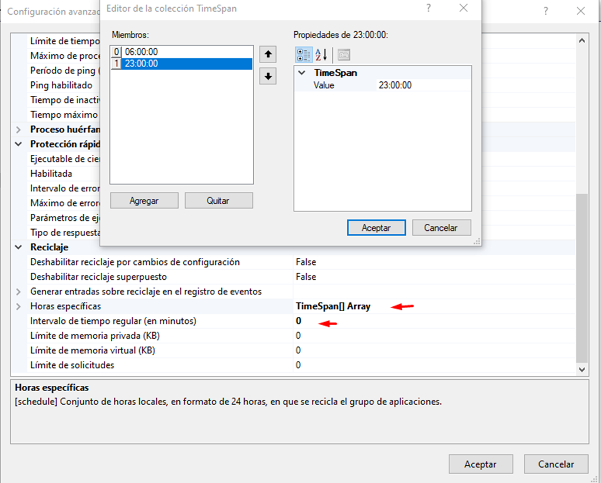
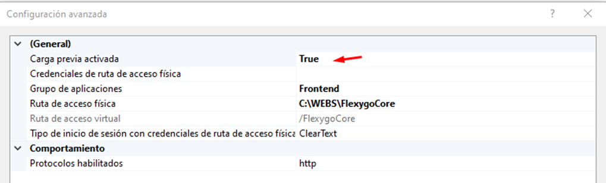
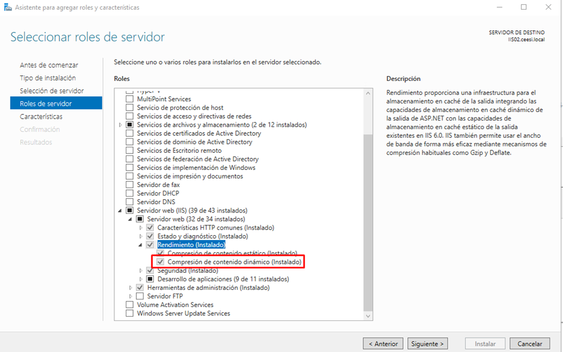
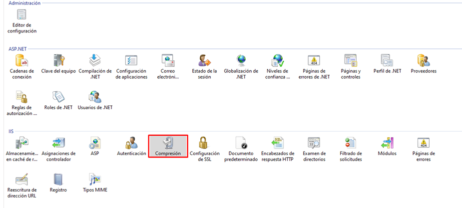
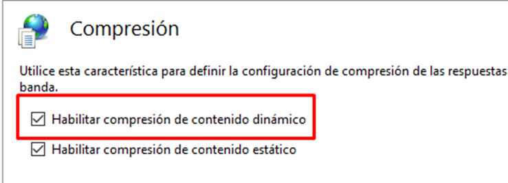

# Sugerencias para optimización del IIS

Recomendaciones para optimizar IIS (versión 10) a nivel de servidor, IIS, grupo de aplicaciones y sitio web.

## Nivel de servidor

* Establecer el plan de energía en **Alto rendimiento** en lugar de **Equilibrado**.
* Desactivar el ahorro de energía en la BIOS para utilizar la velocidad total de los procesadores.

## Grupo de aplicaciones

### General

* Modo de inicio: `AlwaysRunning`
* Ajustar la longitud de cola para aplicaciones con muchos usuarios concurrentes

### CPU

* Configurar la acción ante un consumo ≥80 % durante 5 minutos: finalizar `w3wp`

### Modelo de proceso

* Establecer el **tiempo de inactividad** a `0` para mantener la aplicación siempre disponible

### Reciclaje

* Configurar los reciclajes en horas de bajo uso
* Establecer el **intervalo de tiempo regular** a `0`

## Configuración del sitio web

* Habilitar **Carga previa activada** para reducir el impacto al reciclar

## Compresión dinámica

!!! warning "Atención"
    Solo se recomienda para servidores IIS dedicados, ya que aumenta el consumo de RAM/CPU.

