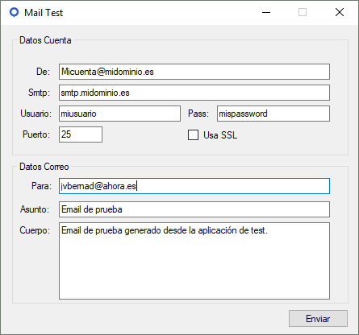
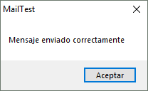
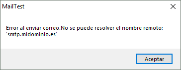

# Comprobar el funcionamiento de una cuenta de correo para utilizarla en cualquiera de nuestras plataformas

En cualquiera de las aplicaciones Flexygo se requieren distintas cuentas de correo. Generalmente se necesita como mínimo una cuenta genérica que sirva para enviar notificaciones y mails de activación.

## Verificación de cuentas

Es fundamental verificar el funcionamiento de estas cuentas teniendo en cuenta que se utilizarán desde el servidor donde está publicada la aplicación, ya que estos servidores pueden tener restricciones particulares.

## Herramienta de prueba: MailTest.exe

Se proporciona una aplicación ejecutable simple llamada `MailTest.exe` que permite realizar pruebas. El proceso consiste en:

1. Rellenar los datos de la cuenta a probar
2. Introducir una dirección de destinatario de prueba
3. Completar el asunto y el cuerpo del mensaje
4. Pulsar el botón de enviar

## Resultados posibles

**Caso exitoso:** la aplicación confirma que el mensaje se envió correctamente, validando que los datos de configuración son válidos.

**Caso de error:** la aplicación devuelve un mensaje de error que debe analizarse para identificar el motivo del fallo.

## Soporte

En ciertos casos será necesaria la colaboración del responsable de sistemas y gestión de cuentas de correo del dominio para resolver problemas de configuración, conexión o autenticación.

## Archivo adjunto

Descarga [MailTest.zip](./readme/utils/MailTest.zip).

## Véase también

* [Sincronización con la agenda de mi cuenta de correo](https://help.flexygo.com/support/solutions/articles/154000130134-sincronizaci%C3%B3n-con-la-agenda-de-mi-cuenta-de-correo)
* [Funcionamiento integración con AHORA ERP](https://help.flexygo.com/support/solutions/articles/154000151255-funcionamiento-integraci%C3%B3n-con-ahora-erp)
* [AHORA SAT - App móvil - Partes](https://help.flexygo.com/support/solutions/articles/154000152016-ahora-sat-app-m%C3%B3vil-partes)
