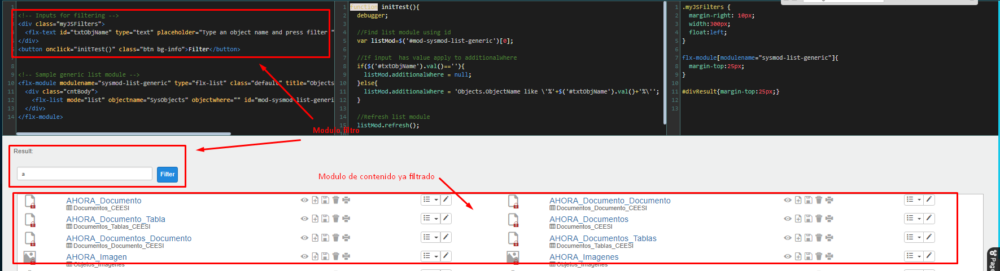

# ¿Cómo utilizar un módulo como filtro de otro?

Para realizar un filtro de un módulo desde otro módulo hay que hacerlo a través de programación con JavaScript.

Si utilizas Flexygo en modo desarrollador, accede al menú izquierdo: **Admin work area → Other tools → HTML editor**.

En la pantalla que se muestra tienes un desplegable con tres ejemplos. El ejemplo llamado **Filtering list module** puede ayudarte a hacerte una idea de cómo realizarlo.

